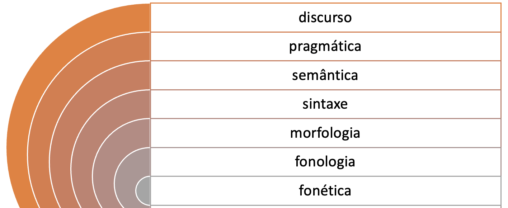

# Processamento de Linguagem Natural: Conceitos, Técnicas e Aplicações em Português
## O que é PLN (NLP)
O Processamento de Linguagem Natural (PLN) é um campo de pesquisa que tem como objetivo investigar e propor métodos e sistemas de processamento computacional da linguagem humana. Na área da Ciência da Computação, PLN está ligado à área de Inteligência Artificial (IA) e também está intrinsecamente relacionada à Linguística Computacional.

O PLN se divide em duas grandes subáreas: 
- Interpretação (ou Compreensão) de Linguagem Natural – NLU (do inglês, Natural Language Understanding): Análise e interpertação, como segmentação e classificação dos componentes linguísticos (p. ex. palavras e suas classes morfológicas e gramaticais, seus traços semânticos ou ontológicos etc.). Já interpretação se refere à tentativa de apreender significados construídos pelo ser humano. Numa interação com um chatbot, por exemplo, a interpretação ocorre quando o sistema processa um texto do usuário para descobrir o que ele – o sistema – deve fazer a seguir: se fornecer uma resposta ou executar uma ação.
- Geração de Linguagem Natural – NLG (do inglês, Natural Language Generation): Um exemplo de NLG é a geração de respostas ao usuário dos chatbots. Para o sistema, isso significa decidir o que responder e como apresentar essa resposta ao usuário.

## A língua
A linguagem humana organiza-se em diferentes dimensões. Na Figura 1.2, a língua é representada por meio de círculos concêntricos, sendo cada um deles objeto de estudo de uma subárea dos estudos linguísticos. No núcleo, os sons e sua organização são estudados pela **fonética** e pela **fonologia**. Envolvendo a estrutura sonora, temos o estudo de como os morfemas se organizam para formar palavras, que é objeto de estudo da **morfologia**. Envolvendo a morfologia, temos o estudo de como as palavras se organizam em estruturas para formar sintagmas e orações, objeto de estudo da **sintaxe**. No círculo envolvendo a sintaxe, temos a **semântica**, que estuda o significado de palavras e frases, enquanto a **pragmática** enfoca como as orações são utilizadas na interação para fins comunicativos específicos. Já **discurso** é uma denominação que abrange os estudos com foco no texto como um todo, podendo se referir à análise das relações entre frases ou partes de um texto, ou das etapas na estrutura de um texto.

Figura 1.2: Representação das subáreas de estudo da linguagem

## Paradigmas
- Paradigma simbólico: é o paradigma segundo o qual todo conhecimento sobre a língua é expresso explicitamente em formalismos como léxicos, regras, linguagens lógicas etc. ou seja, formas compreensíveis ao humano.
- Paradigma estatístico: A é língua representada em modelos probabilísticos aprendidos a partir da frequência de ocorrência utilizando grandes conjuntos de textos (corpus). Regras explícitas ou implícitas (percursos em árvores, por exemplo) são criadas com base em probabilidades calculadas a partir dos exemplos. Esses modelos são usados para classificar, resumir, traduzir ou gerar novos textos.
- Paradigma neural: É o mais adotado para tarefas de PLN. Da mesma forma que o paradigma estatístico, as redes neurais também se baseiam em grandes volumes de dados para aprender um modelo; contudo, a forma como esse aprendizado é realizado é diferente, uma vez que envolve várias camadas de unidades de processamento para reconhecer os padrões recorrentes; É utilizado deep learning. Além disso, diferentemente do paradigma simbólico, no paradigma neural, o conhecimento da língua é dado por valores numéricos, e não por símbolos ou regras. Dessa forma, o conhecimento linguístico ou a parte do código que tenha produzido um determinado comportamento são praticamente irrecuperáveis, tornando o código opaco, e seu efeito, não previsível (não determinístico).
- Paradigmas híbridos: combinam principalmente o simbólico com um dos demais, garantindo, assim, alguma explicitação do conhecimento, consequentemente, alguma explicabilidade dos passos seguidos pelos algoritmos.

# Highlights
- Diferentes abordagens podem ser aplicadas no PLN, desde aquelas associadas ao paradigma mais tradicional (o simbólico) àquelas possibilitadas por paradigmas mais recentes, como o estatístico e o neural.
- Todas as estratégias automáticas para processamento da língua têm limitações. Assim, o que define a escolha da melhor estratégia são diversos fatores como: apoio de especialistas (necessário para o paradigma simbólico), poder computacional (um limitante para o paradigma neural) e a disponibilidade de recursos linguísticos em grande quantidade (necessária para as abordagens baseadas em corpus).
- A maioria das estratégias processa caracteres e não unidades linguísticas. Muitas estratégias geram modelos com base em **coocorrência e contexto de ocorrência** de palavras e frases, ou seja, são abordagens baseadas em padrões de caracteres. Um modelo neural, por exemplo, não sabe que “casa” pode significar o lugar onde “alguém” mora. Desse modo, podemos dizer que as estratégias usadas na maioria das aplicações do PLN **não aprendem a língua, mas apenas aprendem a reproduzir e, às vezes, extrapolar (generalizar) o que aprenderam em um corpus de treinamento**.
- Muita atenção tem sido dada aos algoritmos de aprendizado de máquina e às arquiteturas neurais, mas nem tanta atenção assim tem sido dada aos formalismos de representação semântica. Como vimos, nos diversos anos de pesquisa e desenvolvimento em PLN, as estratégias e abordagens vão e vêm, mas a linguagem natural é muito mais complexa de se aprender e compreender do que uma simples contagem de frequências e coocorrências. Assim, apesar de muito esforço sendo empregado na investigação e evolução de métodos neurais, o conhecimento linguístico e de uso da língua ainda não foi completamente representado/capturado por nenhum dos métodos atuais. Por isso, o processamento completo e adequado da língua só será possível com formalismos de representação híbridos, que incorporam também estruturas semânticas explícitas, e, portanto, mais robustos do que os que são usados hoje por métodos estatísticos e neurais.

## Fala
Para que se alcancem bons resultados no processamento computacional da fala é preciso que haja datasets e corpora de fala3 de alta qualidade. Tem havido um esforço considerável da comunidade de pesquisadores para a compilação de dados dessa natureza. Para o português brasileiro, destaca-se o recente corpus CORAA ASR v. 1.1 (Corpus de Áudios Anotados)4 voltado para tarefas de reconhecimento de fala (Candido Junior et al., 2021), que é apresentado no Capítulo 3.

Os sons da fala podem ser digitalizados e processados usando-se algoritmos tanto para reconhecimento de fala (transcrição de formas de onda em texto) quanto para síntese de fala (conversão de texto em formas de onda). O processo de digitalização da fala envolve a conversão do sinal analógico das ondas sonoras em um formato digital que pode ser armazenado e manipulado por um computador. Isso é normalmente feito usando-se um conversor analógico-digital (CAD), que amostra, isto é, faz uma amostragem da onda sonora em intervalos regulares e converte cada amostra em um número binário. Uma vez que o sinal da fala tenha sido digitalizado, ele pode ser processado usando-se várias técnicas, como filtragem, compressão e análise.

Um sistema computacional para a língua falada necessita de capacidades tanto de reconhecimento quanto de síntese de fala. Entretanto, esses dois componentes não são suficientes para a construção de um sistema útil. Um componente de compreensão e diálogo é necessário para a interação com o usuário; o conhecimento de domínio é necessário para guiar a interpretação da fala pelo sistema e permitir que ele determine a ação apropriada. Para todos esses componentes, há uma série de desafios, que incluem robustez, flexibilidade, facilidade de integração e eficiência de engenharia.

## Recap Deep Learning
**Seq2Seq (Sequência para Sequência):** Seq2Seq é uma arquitetura de rede neural projetada para lidar com dados sequenciais, como texto ou fala. Ela é especialmente útil em tarefas de processamento de linguagem natural, como tradução automática ou resumo de texto. O conceito básico por trás do Seq2Seq é que você alimenta uma sequência de entrada para a rede neural e ela produz uma sequência de saída. Isso é feito por meio de duas partes principais: um codificador e um decodificador. O codificador processa a entrada e captura as informações relevantes, enquanto o decodificador gera a sequência de saída a partir dessas informações. Por exemplo, na tradução automática, o codificador pode receber uma frase em inglês e o decodificador produzirá a mesma frase em outro idioma, como francês.

**Redes Neurais Convolucionais (CNNs):** Redes Neurais Convolucionais são frequentemente usadas em tarefas de visão computacional, como reconhecimento de imagens. A ideia principal por trás das CNNs é a detecção de padrões em dados que têm uma estrutura de grade, como imagens. Elas usam camadas de convolução para percorrer a imagem e identificar recursos relevantes, como bordas, formas ou texturas. Isso permite que a rede aprenda automaticamente a reconhecer características específicas em imagens, como rostos de pessoas ou objetos. As CNNs são amplamente aplicadas em tarefas como classificação de imagens, detecção de objetos e até mesmo em redes neurais generativas para criar novas imagens.

**Redes Neurais Recorrentes (RNNs):** As Redes Neurais Recorrentes são projetadas para lidar com dados sequenciais, como texto, fala ou séries temporais. A principal característica das RNNs é a capacidade de manter estados anteriores ao processar cada elemento da sequência. Isso as torna ideais para tarefas em que o contexto anterior é importante. Por exemplo, na tradução de texto, uma RNN leva em consideração palavras anteriores para prever a próxima palavra de forma coerente. No entanto, as RNNs tradicionais têm uma desvantagem conhecida como "problema do gradiente explosivo/vanishing gradient," que dificulta o treinamento em sequências muito longas. Para resolver esse problema, surgiram variações mais avançadas, como as LSTMs (Long Short-Term Memory) e as GRUs (Gated Recurrent Units), que são projetadas para lidar melhor com dependências de longo prazo em sequências.

Seq2Seq (Sequência para Sequência) e RNNs (Redes Neurais Recorrentes) são relacionados, mas têm propósitos e estruturas diferentes. Vou explicar as principais diferenças entre eles:

1. **Finalidade:**
   - **Seq2Seq:** Seq2Seq é uma arquitetura projetada especificamente para lidar com tarefas de tradução de sequências, como tradução de texto de um idioma para outro ou resumo de texto. Ela se concentra em mapear uma sequência de entrada para uma sequência de saída.
   - **RNNs:** As Redes Neurais Recorrentes são um tipo de arquitetura mais ampla que pode ser usada em tarefas de processamento de sequências, mas não é limitada a tradução. Elas podem ser usadas em uma variedade de tarefas, incluindo previsão de séries temporais, geração de texto, reconhecimento de fala e muito mais.

2. **Estrutura:**
   - **Seq2Seq:** Seq2Seq é composta por duas partes principais: um codificador e um decodificador. O codificador processa a sequência de entrada e gera um vetor de contexto, que é então usado pelo decodificador para gerar a sequência de saída.
   - **RNNs:** As RNNs são redes neurais que têm uma estrutura recorrente em si mesmas. Elas mantêm estados anteriores à medida que processam sequências e usam esses estados anteriores para prever o próximo elemento da sequência.

3. **Tamanho da Sequência:**
   - **Seq2Seq:** Seq2Seq é especialmente adequada para lidar com sequências de entrada e saída de comprimentos variáveis. Por exemplo, pode traduzir frases curtas para frases longas em outro idioma.
   - **RNNs:** RNNs tradicionais podem enfrentar dificuldades no treinamento de sequências muito longas devido ao problema do gradiente explosivo/vanishing gradient. Isso limita sua eficácia em tarefas com sequências muito longas.

4. **Aplicações:**
   - **Seq2Seq:** É amplamente utilizado em tarefas de tradução automática, resumo de texto, chatbots e qualquer tarefa que envolva a conversão de uma sequência de entrada em uma sequência de saída.
   - **RNNs:** RNNs são aplicadas em uma variedade de tarefas, como processamento de linguagem natural, geração de texto, previsão de séries temporais, reconhecimento de fala e até mesmo em algumas tarefas de visão computacional.

Em resumo, Seq2Seq é uma arquitetura especializada para tradução de sequências, enquanto RNNs são um tipo de rede neural que pode ser aplicada em uma ampla gama de tarefas de processamento de sequências. A escolha entre eles depende da natureza específica da tarefa que você está tentando resolver.

## 

# Referência
Caseli, H.M.; Nunes, M.G.V. (org.) Processamento de Linguagem Natural: Conceitos, Técnicas e Aplicações em Português. ISBN 978-65-00-80693-9. BPLN, 2023. Disponível em: https://brasileiraspln.com/livro-pln.
