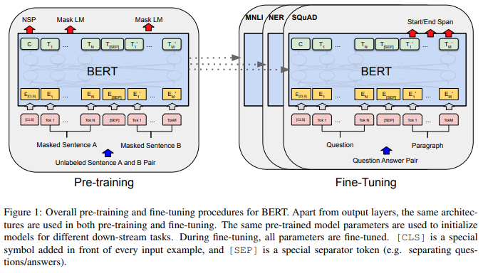

# Natural Language Processing with Attention Models

Notas sobre o curso Natural Language Processing with Attention Models da DeeplearninigAI. O notebook é composto majoritariamente de material original, salvo as figuras, que foram criadas pela **Deep Learning AI** e disponibilizadas em seu curso.

# Summary
1. [**Week 1 - Neural Machine Translation**](#week-1---neural-machine-translation)
   - 1.1. [Seq2seq](#seq2seq)
   - 1.2. [Queries, Keys, Values, and Attention](#queries-keys-values-and-attention)
   - 1.3. [Teacher Forcing](#teacher-forcing)
   - 1.4. [BLEU Score](#bleu-score)
   - 1.5. [ROUGE-N Score](#rouge-n-score)
   - 1.6. [F1 Score](#f1-score)
   - 1.7. [Sampling and Decoding](#sampling-and-decoding)
   - 1.8. [Beam Search](#beam-search)
   - 1.9. [Minimum Bayes Risk](#minimum-bayes-risk)
   
2. [**Week 2 - Text Summarization**](#week-2---text-summarization)
   - 2.1. [Transformers vs RNNs](#transformers-vs-rnns)
   - 2.2. [Transformers overview](#transformers-overview)
   - 2.3. [Scaled and Dot-Product Attention](#scaled-and-dot-product-attention)
   - 2.4. [Encoder-Decoder Attention](#encoder-decoder-attention)
   - 2.5. [Self-Attention](#self-attention)
   - 2.6. [Masked Self Attention](#masked-self-attention)
   - 2.7. [Multi-head Attention](#multi-head-attention)
   - 2.8. [Transformer Decoder](#transformer-decoder)

3. [**Week 3 - Question Answering**](#week-3---question-answering)
   - 3.1. [Transfer Learning in NLP](#transfer-learning-in-nlp)
   - 3.2. [ELMo, GPT, BERT, T5](#elmo-gpt-bert-t5)
   - 3.3. [Bidirectional Encoder Representations from Transformers (BERT)](#bidirectional-encoder-representations-from-transformers-bert)
   - 3.4. [BERT Objective](#bert-objective)
   - 3.5. [Fine tuning BERT](#fine-tuning-bert)
   - 3.6. [Transformer T5](#transformer-t5)
   - 3.7. [Multi-Task Training Strategy](#multi-task-training-strategy)
   - 3.8. [GLUE Benchmark](#glue-benchmark)

# Week 1 - Neural Machine Translation

## Seq2seq

Os modelos Seq2Seq (Sequence-to-Sequence) são amplamente utilizados em tarefas de tradução automática (machine translation) e outras tarefas de NLP que envolvem a conversão de uma sequência de entrada em uma sequência de saída. Eles foram inicialmente propostos para tarefas como tradução automática, onde uma sequência de palavras em uma língua (entrada) é convertida em uma sequência de palavras em outra língua (saída). A arquitetura básica é composta por dois componentes principais:

- **Encoder**: Transforma a sequência de entrada em um vetor de contexto.
- **Decoder**: Utiliza o vetor de contexto para gerar a sequência de saída.


### Arquitetura Seq2Seq

#### Encoder

O encoder é tipicamente uma rede recorrente (RNN, LSTM, GRU) que lê a sequência de entrada token por token e gera um vetor de contexto que representa a informação da sequência inteira.

- **Inputs**: Sequência de entrada $X = (x_1, x_2, ..., x_n)$.
- **Outputs**: Vetor de contexto $C$ e estado oculto $h_t$ em cada passo de tempo.


#### Decoder

O decoder é outra rede recorrente que gera a sequência de saída um token por vez, **usando o vetor de contexto do encoder** e o **estado oculto anterior do decoder**. A sequencia de entrada no decoder inicia com token $\text{<SOS>}$ (Start of Sequence)

- **Inputs**: O vetor de contexto do encoder, o estado oculto anterior e o token de entrada anterior.
- **Outputs**: Token de saída e novo estado oculto.


#### Attention

O mecanismo de atenção foi introduzido para melhorar a performance dos modelos Seq2Seq, permitindo que o modelo foque em diferentes partes da entrada enquanto gera cada token da saída.

- **Atenção Básica**: Calcula um conjunto de pesos de atenção que indicam a importância de cada token da sequência de entrada para a geração do próximo token da saída.
- **Context Vector**: Um vetor de contexto ponderado é calculado como uma combinação linear dos estados ocultos do encoder, ponderado pelos pesos de atenção.

Matematicamente, a atenção pode ser descrita da seguinte maneira:
$$ \alpha_{ij} = \frac{\exp(e_{ij})}{\sum_{k=1}^{T_x} \exp(e_{ik})} $$
onde $e_{ij} = a(s_{i-1}, h_j)$ é a função de alinhamento que pode ser um simples perceptron.


### Aplicação em Machine Translation

Na tradução automática, o processo funciona da seguinte maneira:

1. **Encoding**: O encoder lê a sequência de entrada (frase na língua de origem) e gera um vetor de contexto.
2. **Attention**: Durante a decodificação, o mecanismo de atenção calcula os pesos de atenção que focam nas partes relevantes da sequência de entrada.
3. **Decoding**: O decoder gera a sequência de saída (frase na língua de destino), token por token, utilizando o vetor de contexto ponderado pela atenção.

### Exemplo Simplificado

1. **Entrada**: "I love NLP"
2. **Encoding**: O encoder gera vetores de estado oculto para cada token e um vetor de contexto geral.
3. **Attention**: Para cada token gerado na saída, calcula-se a importância de cada token da entrada.
4. **Decoding**: Gera a saída "Yo amo PLN" utilizando os vetores de contexto e atenção.

### Benefícios do Mecanismo de Atenção

- **Melhora a Tradução**: Permite que o modelo foque nas partes mais relevantes da entrada.
- **Mitiga Problemas de Longas Sequências**: Ajuda a manter a informação relevante mesmo em sequências longas.

Os modelos Seq2Seq com atenção são fundamentais para muitas tarefas de NLP, especialmente a tradução automática. A arquitetura básica de encoder-decoder, aprimorada com o mecanismo de atenção, permite que esses modelos lidem eficazmente com a complexidade das sequências de linguagem natural.

## Queries, Keys, Values, and Attention

No mecanismo de atenção de um Transformer, as matrizes $ Q $ (Queries), $ K $ (Keys) e $ V $ (Values) desempenham papéis cruciais na computação das atenções ponderadas. Vamos explorar o que cada uma dessas matrizes representa:

### Embeddings de Queries (Q)
- **Representação:** Os vetores de Query ($ Q $) são vetores que representam as consultas feitas para determinar a relevância dos tokens da sequência de entrada em relação aos tokens da sequência de saída ou entre si no caso de autoatenção (self-attention).
- **Origem:** No encoder, os vetores $ Q $ são derivados das mesmas embeddings dos tokens de entrada. No decoder, $ Q $ são derivadas das embeddings dos tokens da sequência de saída gerada até o momento.
- **Função:** $ Q $ é usado para calcular a similaridade com os vetores de chave ($ K $) para determinar quais tokens da sequência de entrada (ou saída) devem ser focados.

### Embeddings de Keys (K)
- **Representação:** Os vetores de Key ($ K $) são vetores que representam os tokens da sequência de entrada (ou saída no caso de self-attention) e servem como pontos de referência para calcular a atenção.
- **Origem:** No encoder, $ K $ são derivados das embeddings dos tokens de entrada. No decoder, em self-attention, $ K $ são derivados das embeddings dos tokens da sequência de saída, enquanto em cross-attention, $ K $ são derivados das embeddings dos tokens de entrada.
- **Função:** $ K $ é usado para calcular a similaridade com os vetores de Query ($ Q $). Eles ajudam a determinar a relevância dos tokens em relação aos tokens consultados por $ Q $.

### Embeddings de Valores (V)
- **Representação:** Os vetores de Valor ($ V $) são vetores que também representam os tokens da sequência de entrada (ou saída no caso de self-attention) e carregam a informação contextualizada desses tokens. **Geralmente se usa o mesmo vetor da KEY para criar  o embedding de VALUE**
- **Origem:** No encoder, $ V $ são derivados das embeddings dos tokens de entrada. No decoder, em self-attention, $ V $ são derivados das embeddings dos tokens da sequência de saída, enquanto em cross-attention, $ V $ são derivados das embeddings dos tokens de entrada.
- **Função:** $ V $ fornece a base de informações que será usada para calcular os vetores de contexto após a aplicação dos pesos de atenção.

### Como Q, K e V são Calculados:

Os vetores $ Q $, $ K $ e $ V $ são tipicamente obtidos a partir das mesmas embeddings iniciais por meio de multiplicações por matrizes de peso diferentes:

$$
Q = XW^Q, \quad K = XW^K, \quad V = XW^V
$$

onde $ X $ são as embeddings iniciais dos tokens de entrada ou saída, e $ W^Q $, $ W^K $, e $ W^V $ são matrizes de peso **aprendidas durante o treinamento**.

A camada de atenção calcula um **vetor de atenção que pondera a importância de cada token da sequência de entrada para a geração de cada token da sequência de saída**. 

#### Inputs da Camada de Atenção

A camada de atenção recebe três inputs principais:
- **Queries (Q)**: Vetores de consulta que representam os tokens da **sequência de saída** atual.
- **Keys (K)**: Vetores de chave que representam os tokens da **sequência de entrada**.
- **Values (V)**: Vetores de valor que também representam os tokens da **sequência de entrada**.


Em um modelo Seq2Seq com atenção, **os estados ocultos do decoder são usados como Queries**, enquanto **os estados ocultos do encoder são usados como Keys e Values**.

#### Cálculo das Similaridades (Scores)

Primeiro, calculamos uma pontuação (score) ou alinhamento que mede a **similaridade entre cada par de query e key**. Uma função de similaridade comum é o produto escalar (dot product):

$$ \text{score}(Q, K) = QK^T $$

Outra opção é o produto escalar escalado (scaled dot product), que é comum em Transformers:

$$ \text{score}(Q, K) = \frac{QK^T}{\sqrt{d_k}} $$

onde $ d_k $ é a dimensão dos vetores de chave.

#### Normalização dos scores

As pontuações escaladas são então normalizadas usando a função softmax para obter os pesos de atenção:

$$ \alpha = \text{softmax}\left(\frac{QK^T}{\sqrt{d_k}}\right) $$

Isso transforma as pontuações escaladas em um conjunto de pesos que somam 1, facilitando a interpretação como probabilidades.

#### Cálculo dos Pesos de Atenção

As pontuações são então normalizadas usando uma função softmax para obter os pesos de atenção, que representam a importância relativa de cada token de entrada para cada token de saída:

$$ \alpha_{ij} = \frac{\exp(\text{score}(q_i, k_j))}{\sum_{k=1}^{n} \exp(\text{score}(q_i, k_k))} $$

onde $ \alpha_{ij} $ é o peso de atenção para o $ i $-ésimo token de saída e o $ j $-ésimo token de entrada.

#### Cálculo do Vetor de Contexto

Finalmente, os pesos de atenção são usados para calcular uma combinação ponderada dos vetores de valor:

$$ \text{Attention}(Q, K, V) = \text{softmax}\left(\frac{QK^T}{\sqrt{d_k}}\right)V $$

O resultado é uma matriz que representa a combinação ponderada dos valores, ajustada de acordo com a relevância calculada pelas pontuações de atenção.

Os pesos de atenção são então usados para calcular uma **combinação ponderada dos vetores de valor**, resultando em um vetor de contexto para cada token de saída:

$$ \text{context}_i = \sum_{j=1}^{n} \alpha_{ij} v_j $$

#### Atenção Multi-cabeça (Multi-head Attention)

Em arquiteturas como Transformers, é comum usar várias cabeças de atenção para capturar diferentes tipos de relações entre tokens. Cada cabeça de atenção realiza o processo descrito acima de forma independente, e os resultados são concatenados e transformados:

$$ \text{MultiHead}(Q, K, V) = \text{Concat}(\text{head}_1, \text{head}_2, ..., \text{head}_h)W^O $$

onde cada cabeça de atenção $ \text{head}_i $ é calculada como:

$$ \text{head}_i = \text{Attention}(QW_i^Q, KW_i^K, VW_i^V) $$

### Tipos de Atenção

Existem diferentes variações do mecanismo de atenção, incluindo:

1. **Self-attention**: Quando Queries, Keys e Values vêm da mesma sequência. Utilizado principalmente em Transformers.
2. **Cross-attention**: Quando Queries vêm de uma sequência (ex. saída) e Keys/Values vêm de outra (ex. entrada). Utilizado em modelos Seq2Seq com atenção.

### Implementação Simplificada

Aqui está um exemplo de implementação simplificada de uma camada de atenção em pseudo-código:

```python
def attention(Q, K, V):
    # Cálculo das pontuações
    scores = dot_product(Q, K.T) / sqrt(d_k)
    
    # Normalização das pontuações
    attention_weights = softmax(scores, axis=-1)
    
    # Cálculo do vetor de contexto
    context = dot_product(attention_weights, V)
    
    return context, attention_weights
```

### Benefícios da Camada de Atenção

- **Foco Dinâmico**: Permite que o modelo se concentre nas partes mais relevantes da entrada.
- **Eficiência Computacional**: Self-attention, especialmente em Transformers, é altamente paralelizável.
- **Flexibilidade**: Pode ser adaptada para várias tarefas de NLP, como tradução, resumo e resposta a perguntas.

### Conclusão

A camada de atenção é um componente poderoso que melhora a capacidade dos modelos de NLP em capturar dependências complexas dentro das sequências de entrada. Ao permitir que o modelo foque dinamicamente nas partes mais relevantes da entrada, a atenção desempenha um papel crucial em muitos dos avanços recentes em NLP.

### Material complementar
- [Visualizando a atenção, o coração de um transformador](https://www.youtube.com/watch?v=eMlx5fFNoYc)
- [Atenção para Redes Neurais, Claramente Explicadas!!!](https://www.youtube.com/watch?v=PSs6nxngL6k)
- [The math behind Attention: Keys, Queries, and Values matrices](https://www.youtube.com/watch?v=UPtG_38Oq8o&t=669s)
- [The Transformer neural network architecture EXPLAINED. “Attention is all you need”](https://www.youtube.com/watch?v=FWFA4DGuzSc)

## Teacher Forcing

Teacher forcing é uma técnica utilizada durante o treinamento de modelos de sequência para sequência (Seq2Seq), como aqueles usados em tradução automática, síntese de texto e outras tarefas de processamento de linguagem natural. 

Teacher forcing refere-se ao **uso da sequência de saída real (ground truth) como entrada para o próximo passo do decodificador**, em vez de usar a saída gerada pelo próprio modelo na etapa anterior. Isso ajuda o modelo a aprender mais rapidamente e de maneira mais estável.

1. **Treinamento Sem Teacher Forcing**:
   - No treinamento sem teacher forcing, o modelo gera uma palavra na sequência de saída com base nas palavras anteriores que ele próprio gerou.
   - Esse método pode levar a problemas se o modelo fizer um erro, pois erros podem se propagar ao longo da sequência, causando previsões cada vez menos precisas.

2. **Treinamento Com Teacher Forcing**:
   - No treinamento com teacher forcing, **o modelo usa a palavra correta da sequência de treinamento como entrada para o próximo passo, independentemente de sua própria previsão**.
   - Isso fornece ao modelo informações corretas em cada etapa, ajudando-o a aprender a sequência de forma mais eficiente e evitando a propagação de erros.


### Benefícios do Teacher Forcing

- **Aprendizagem Mais Rápida**: Fornecendo entradas corretas em cada passo, o modelo pode aprender a sequência-alvo de maneira mais eficiente.
- **Estabilidade no Treinamento**: Reduz o impacto de erros na geração de sequência, o que pode ajudar na convergência mais estável do modelo.

### Desvantagens do Teacher Forcing

- **Diferença entre Treinamento e Inferência**: Durante a inferência (teste), o modelo não terá acesso às sequências de saída reais e terá que confiar em suas próprias previsões. Isso pode levar a uma discrepância entre o desempenho de treinamento e de inferência, conhecida como "exposição ao viés".
- **Dependência do Ground Truth**: O modelo pode se tornar excessivamente dependente das sequências de saída corretas fornecidas durante o treinamento, o que pode prejudicar seu desempenho em cenários reais onde tais dados não estão disponíveis.

### Mitigação de Desvantagens

Para mitigar as desvantagens do teacher forcing, técnicas como **scheduled sampling** podem ser utilizadas. No scheduled sampling, o modelo é treinado usando uma mistura de suas próprias previsões e das saídas corretas (ground truth). Com o tempo, a proporção de saídas do modelo aumenta, ajudando-o a aprender a corrigir seus próprios erros e a se tornar mais robusto durante a inferência.

### Exemplo de Teacher Forcing

Vamos considerar um exemplo de tradução automática:

- **Entrada**: "I love NLP"
- **Saída Esperada**: "Eu amo PLN"

Sem teacher forcing, o decodificador geraria a tradução palavra por palavra, usando suas próprias previsões anteriores para prever a próxima palavra.

Com teacher forcing, durante o treinamento, mesmo que o modelo preveja incorretamente "Eu amo" como "Eu gostar", o próximo passo ainda usaria "amo" (a palavra correta) como entrada para prever a próxima palavra ("PLN").

Por fim, o teacher forcing é uma técnica poderosa no treinamento de modelos Seq2Seq que ajuda a melhorar a eficiência e a estabilidade do treinamento ao fornecer a sequência de saída correta em cada passo. No entanto, deve ser usado com cautela devido às possíveis diferenças entre os ambientes de treinamento e de inferência.

## BLEU Score

O Bilingual Evaluation Understudy ou **BLEU score** é uma métrica popular para avaliar a qualidade de traduções automáticas. Ela compara uma frase traduzida por um modelo (tradução automática) com uma ou mais traduções de referência (traduções humanas) e calcula uma pontuação baseada na precisão de n-gramas. O BLEU é **focado na precisão** e não considera a estrutura da sentença ou semântica.

1. **N-gram Precision**:
   - O BLEU calcula a precisão dos n-gramas da tradução gerada pelo modelo em relação às traduções de referência.
   - Um n-gram é uma sequência de n palavras.
   - Por exemplo, para bigramas (n=2), as sequências são pares de palavras consecutivas.

2. **Clipping**:
   - Para evitar a inflação da precisão devido à repetição de n-gramas na tradução gerada, o BLEU aplica um "clipping". Isso limita o número de vezes que um n-gram pode ser contado com base na frequência máxima desse n-gram nas referências.

3. **Brevity Penalty**:
   - O BLEU penaliza traduções que são significativamente mais curtas do que as referências. Isso é feito para evitar que traduções muito curtas (que podem ter alta precisão de n-gramas) recebam pontuações altas.

### Cálculo do BLEU Score

1. **Calcular Precisões de N-gramas**:
   - Para cada n-grama (por exemplo, unigramas, bigramas, trigramas, etc.), a precisão é calculada como a **razão entre o número de n-gramas corretos na tradução gerada e o número total de n-gramas na tradução gerada**.

2. **Aplicar Clipping**:
   - Para cada n-grama, limite a contagem ao máximo que ocorre nas referências.

3. **Combinar Precisões**:
   - Combine as precisões de n-gramas de diferentes tamanhos usando uma média geométrica ponderada.

4. **Aplicar Brevity Penalty**:
   - Quando a tradução gerada for mais curta que a referência, é aplicado uma penalidade para ajustar a pontuação final.

A fórmula do BLEU score é:
$$
\text{BLEU} = BP \cdot \exp \left( \sum_{n=1}^{N} w_n \log p_n \right)
$$
Onde:
- $BP$ é a brevity penalty.
- $p_n$ é a precisão dos n-gramas.
- $w_n$ são os pesos (geralmente iguais) para as precisões de n-gramas.

### Avaliação do Modelo com BLEU Score

Para avaliar um modelo de tradução utilizando o BLEU score, podemos seguir esses passos:

1. **Obter Traduções Geradas pelo Modelo**: Traduzir um conjunto de frases de teste utilizando o modelo treinado.
2. **Obter Traduções de Referência**: Utilizar traduções humanas como referências para cada frase de teste.
3. **Calcular o BLEU Score**: Utilizar uma biblioteca de NLP, como `nltk` ou `sacrebleu`, para calcular o BLEU score comparando as traduções geradas com as referências.

### Exemplo em Python usando NLTK

```python
import nltk
from nltk.translate.bleu_score import sentence_bleu, corpus_bleu

# Traduções de referência (humanas)
references = [
    ["this is a test".split(), "this is a trial".split()],
    ["another test sentence".split()]
]

# Traduções geradas pelo modelo
candidates = [
    "this is a test".split(),
    "another test sentence".split()
]

# BLEU score para cada frase
for i in range(len(candidates)):
    print(f"Sentence {i+1} BLEU score: {sentence_bleu(references[i], candidates[i])}")

# BLEU score para o corpus
print(f"Corpus BLEU score: {corpus_bleu(references, candidates)}")
```

O BLEU score é uma métrica poderosa para avaliar traduções automáticas, fornecendo uma maneira quantitativa de comparar traduções geradas com traduções de referência. No entanto, ele tem limitações, como não capturar bem a fluência ou a adequação semântica das traduções, motivo pelo qual é frequentemente utilizado em conjunto com outras métricas e avaliações qualitativas.

## ROUGE-N Score

O Recall-Oriented Understudy for Gisting Evaluation ou ROUGE é um conjunto de métricas utilizadas para avaliar a qualidade de resumos e traduções automáticas, comparando-os com um ou mais resumos de referência (resumos humanos). Entre as variantes do ROUGE, o **ROUGE-N** é um dos mais comuns, onde **N** representa o tamanho dos n-gramas. O ROUGE é focado no **recall**, a métrica busca identificar o quanto da referencia aparece na tradução candidata, e também não considera a estrutura da sentença ou semântica..

O ROUGE-N **calcula a sobreposição de n-gramas entre um resumo gerado automaticamente e um ou mais resumos de referência**. Especificamente, ROUGE-N considera n-gramas comuns entre a saída do modelo e as referências, medindo tanto a precisão quanto o recall, mas frequentemente focando no recall.

#### Fórmulas do ROUGE-N

- **ROUGE-N (Recall)**:
  $$
  \text{ROUGE-N} = \frac{\sum_{\text{ref} \in \text{References}} \sum_{\text{n-gram} \in \text{ref}} \min(\text{Count}_{\text{n-gram}}^{\text{model}}, \text{Count}_{\text{n-gram}}^{\text{ref}})}{\sum_{\text{ref} \in \text{References}} \sum_{\text{n-gram} \in \text{ref}} \text{Count}_{\text{n-gram}}^{\text{ref}}}
  $$

Onde:
- $\text{Count}_{\text{n-gram}}^{\text{model}}$ é a contagem de um n-gram específico no resumo gerado pelo modelo.
- $\text{Count}_{\text{n-gram}}^{\text{ref}}$ é a contagem do mesmo n-gram em uma das referências.

### Passos para Calcular o ROUGE-N

1. **Tokenização**: Divida tanto a saída do modelo quanto as referências em tokens.
2. **Contagem de N-gramas**: Calcule a frequência de cada n-grama em ambas as saídas.
3. **Sobreposição de N-gramas**: Encontre a sobreposição de n-gramas entre a saída do modelo e as referências.
4. **Cálculo do ROUGE-N**: Use a fórmula do ROUGE-N para calcular a métrica.

### Exemplo de Avaliação usando ROUGE-N com Python

Para calcular o ROUGE-N, você pode usar a biblioteca `rouge-score` do Google ou outras implementações, como `py-rouge`.

#### Usando `rouge-score`

Primeiro, instale a biblioteca:
```bash
pip install rouge-score
```

Em seguida, utilize o seguinte código para calcular o ROUGE-N:

```python
from rouge_score import rouge_scorer

# Traduções de referência (humanas)
references = [
    "this is a test",
    "another test sentence"
]

# Traduções geradas pelo modelo
candidates = [
    "this is a test",
    "a different test sentence"
]

# Inicialize o avaliador ROUGE-N
scorer = rouge_scorer.RougeScorer(['rouge1', 'rouge2'], use_stemmer=True)

# Calcule o ROUGE-N para cada par de resumo gerado e de referência
for ref, cand in zip(references, candidates):
    scores = scorer.score(ref, cand)
    print(f"Reference: {ref}")
    print(f"Candidate: {cand}")
    print(f"ROUGE-1: {scores['rouge1']}")
    print(f"ROUGE-2: {scores['rouge2']}")
    print("---")
```

#### Saída Esperada:
```plaintext
Reference: this is a test
Candidate: this is a test
ROUGE-1: Score(precision=1.0, recall=1.0, fmeasure=1.0)
ROUGE-2: Score(precision=1.0, recall=1.0, fmeasure=1.0)
---
Reference: another test sentence
Candidate: a different test sentence
ROUGE-1: Score(precision=0.6, recall=0.6, fmeasure=0.6)
ROUGE-2: Score(precision=0.5, recall=0.5, fmeasure=0.5)
---
```

O ROUGE-N score é uma métrica eficiente e amplamente utilizada para avaliar a qualidade de resumos e traduções automáticas, medindo a sobreposição de n-gramas entre as saídas geradas pelo modelo e as referências humanas. Ele é particularmente útil para tarefas onde a correspondência exata de n-gramas é importante, como a sumarização e tradução de textos. A implementação do ROUGE-N é direta e pode ser facilmente realizada utilizando bibliotecas disponíveis em Python.

## F1 Score

Como o BLEU é focado em precisão e o ROUGE-N é focado no recall, podemos combinar ambos e ter o F1 Score


## Sampling and Decoding

**Random Sampling** é uma técnica de decodificação em modelos de geração de linguagem onde, em vez de selecionar sempre a palavra com a maior probabilidade, uma palavra é escolhida aleatoriamente a partir da distribuição de probabilidade gerada pelo modelo. Isso permite que a geração de texto seja mais variada e menos determinística, o que pode ser útil para criar saídas mais criativas e diversificadas.

**Greedy Decoding** é uma abordagem de decodificação onde, em cada etapa da geração da sequência, a palavra com a maior probabilidade é escolhida. Esta técnica é simples e eficiente, mas pode levar a resultados subótimos porque decisões locais (em cada etapa) não garantem a melhor sequência global.

A **Temperature** é um hiperparâmetro usado em Random Sampling que controla a "aleatoriedade" da amostra. Ele modifica a distribuição de probabilidades das palavras antes de amostrar uma palavra. A temperatura é geralmente representada por $ T $.

- **Se $ T = 1 $**: A distribuição de probabilidade original é usada sem alteração.
- **Se $ T > 1 $**: A distribuição é suavizada, tornando a probabilidade das palavras mais uniforme. Isso resulta em maior aleatoriedade na escolha das palavras.
- **Se $ 0 < T < 1 $**: A distribuição é tornada mais aguda, amplificando a diferença entre as probabilidades. Isso resulta em uma escolha mais determinística, semelhante ao Greedy Decoding, mas com alguma variabilidade.

A fórmula para ajustar as probabilidades com a temperatura é:

$$ P'(w_i) = \frac{\exp(\log(P(w_i)) / T)}{\sum_{j} \exp(\log(P(w_j)) / T)} $$

Onde:
- $ P(w_i) $ é a probabilidade original da palavra $ w_i $.
- $ T $ é a temperatura.
- $ P'(w_i) $ é a probabilidade ajustada da palavra $ w_i $.

#### Greedy Decoding

```python
def greedy_decoding(model, input_seq, max_length):
    generated_seq = []
    for _ in range(max_length):
        output = model(input_seq)
        next_word = output.argmax(dim=-1).item()  # Escolha da palavra com maior probabilidade
        generated_seq.append(next_word)
        input_seq = torch.cat([input_seq, torch.tensor([next_word]).unsqueeze(0)], dim=-1)
        if next_word == model.eos_token:
            break
    return generated_seq
```

#### Random Sampling com Temperature

```python
import torch
import torch.nn.functional as F

def random_sampling_with_temperature(model, input_seq, max_length, temperature=1.0):
    generated_seq = []
    for _ in range(max_length):
        output = model(input_seq)
        output = output / temperature
        probabilities = F.softmax(output, dim=-1)
        next_word = torch.multinomial(probabilities, 1).item()  # Amostragem aleatória baseada nas probabilidades
        generated_seq.append(next_word)
        input_seq = torch.cat([input_seq, torch.tensor([next_word]).unsqueeze(0)], dim=-1)
        if next_word == model.eos_token:
            break
    return generated_seq
```

## Beam Search

O Beam Search é uma técnica de **busca heurística** utilizada em modelos de tradução automática, sumarização, e outras tarefas de processamento de linguagem natural que envolvem a geração de sequências. Ele é especialmente útil para encontrar a sequência mais provável de palavras (ou tokens) que o modelo pode gerar, dado um estado inicial.

O Beam Search expande a ideia de busca em largura, mantendo um número fixo de caminhos candidatos (ou hipóteses) em cada etapa da geração da sequência. Esse número é chamado de **beam width**. Em vez de explorar todas as possíveis expansões de cada estado, o Beam Search mantém apenas os melhores caminhos, reduzindo a complexidade computacional.

### Etapas do Beam Search

1. **Inicialização**:
   - Começa com o estado inicial (geralmente o token `<sos>` ou um estado oculto inicial).
   - Atribui uma pontuação (log-probabilidade) inicial a este estado.

2. **Expansão**:
   - Para cada estado atual no conjunto de caminhos candidatos, expande todas as possíveis próximas palavras (ou tokens).
   - Calcula as pontuações dessas novas sequências, geralmente somando a log-probabilidade da nova palavra à pontuação do caminho até o momento.

3. **Seleção**:
   - Entre todas as novas sequências geradas, seleciona as `beam width` melhores com base nas suas pontuações.
   - Descartam-se os caminhos com pontuações mais baixas.

4. **Repetição**:
   - Repete os passos de expansão e seleção até que se atinja um critério de parada, como gerar um token de parada (`<eos>`) ou atingir um número máximo de etapas.

5. **Decodificação Final**:
   - Após a última etapa, seleciona o caminho com a maior pontuação entre os caminhos candidatos restantes como a sequência gerada final.

### Exemplo Simples

Imagine um modelo de tradução onde queremos traduzir a frase "I am" para outra língua. Vamos utilizar o Beam Search com `beam width` de 2.

**Passo 1: Inicialização**
- Estado inicial: `<sos>`
- Caminhos candidatos: [(`<sos>`, 0)]

**Passo 2: Expansão e Seleção (Primeira Iteração)**
- Expande `<sos>` para todas as palavras possíveis: "Je", "Tu", "Il", ...
- Calcula as pontuações dessas expansões.
- Seleciona os 2 melhores: [("Je", -1.2), ("Tu", -1.5)]

**Passo 3: Expansão e Seleção (Segunda Iteração)**
- Expande cada um dos melhores candidatos: "Je suis", "Je vais", "Tu es", "Tu vas", ...
- Calcula as pontuações acumuladas dessas expansões.
- Seleciona os 2 melhores: [("Je suis", -2.0), ("Je vais", -2.3)]

**Passo 4: Repetição**
- Continua expandindo e selecionando até atingir o critério de parada (número máximo de tokens ou token de parada).

### Vantagens do Beam Search

1. **Equilíbrio entre Exploration e Exploitation**: Mantém múltiplos caminhos candidatos, evitando prender-se a escolhas subótimas iniciais.
2. **Melhoria da Qualidade da Sequência Gerada**: Aumenta a probabilidade de encontrar sequências mais naturais e coerentes em comparação com a busca gulosa (greedy search).
3. **Controle de Complexidade**: O parâmetro `beam width` controla diretamente a quantidade de memória e tempo de computação necessários.

### Desvantagens do Beam Search

1. **Custo Computacional**: Mesmo com `beam width` moderado, pode ser computacionalmente intensivo.
2. **Hipóteses Subótimas**: Ainda pode manter caminhos que eventualmente se tornam subótimos em comparação com a busca exaustiva.

### Implementação em Python com PyTorch

Aqui está um exemplo simplificado de implementação de Beam Search com um modelo seq2seq com atenção:

```python
import torch

def beam_search(model, src, beam_width=3, max_len=20):
    # Inicialização
    src = src.unsqueeze(0)  # Adicionar dimensão de batch
    encoder_outputs, hidden, cell = model.encoder(src)
    
    # Inicializar o beam com o estado inicial
    beams = [([], hidden, cell, 0)]  # Cada beam é (seq, hidden, cell, score)

    for _ in range(max_len):
        new_beams = []
        for seq, hidden, cell, score in beams:
            # Se o token de parada foi gerado, mantenha o caminho
            if seq and seq[-1] == model.eos_token:
                new_beams.append((seq, hidden, cell, score))
                continue

            # Expansão
            trg_input = torch.LongTensor([model.sos_token] if not seq else [seq[-1]]).unsqueeze(0)
            output, hidden, cell = model.decoder(trg_input, hidden, cell, encoder_outputs)
            topk = output.topk(beam_width)

            # Adicionar novos caminhos ao beam
            for i in range(beam_width):
                next_seq = seq + [topk[1][0][i].item()]
                next_score = score + topk[0][0][i].item()
                new_beams.append((next_seq, hidden, cell, next_score))

        # Selecionar os beam_width melhores caminhos
        beams = sorted(new_beams, key=lambda x: x[-1], reverse=True)[:beam_width]

    # Retornar o melhor caminho
    return beams[0][0]
```

O Beam Search é uma técnica poderosa para a geração de sequências, melhorando a qualidade das saídas de modelos em tarefas de tradução e sumarização ao explorar múltiplos caminhos possíveis. Ele equilibra a eficiência computacional com a qualidade das sequências geradas, tornando-se uma escolha popular em muitos sistemas de NLP.

## Minimum Bayes Risk

O **Minimum Bayes Risk (MBR)** é uma abordagem em estatística e machine learning para fazer decisões ótimas sob incerteza, minimizando o risco esperado de decisões erradas. Em particular, no contexto de modelos de geração de sequência (como tradução automática), o MBR é utilizado para selecionar a melhor sequência gerada pelo modelo de acordo com uma métrica de avaliação específica.

### Conceitos Básicos do Minimum Bayes Risk

- **Risco Bayesiano:** O risco bayesiano é o risco esperado de uma decisão, considerando a incerteza sobre as hipóteses e as consequências de cada decisão. No contexto de geração de sequência, podemos pensar no risco como **a penalidade associada a selecionar uma sequência gerada que não é a ideal**.

- **Risco Esperado:** O risco esperado é calculado usando a distribuição de probabilidade das hipóteses. No caso de modelos de sequência, isso envolve **a probabilidade de diferentes sequências geradas pelo modelo**.

### Aplicação em Modelos de Geração de Sequência

No contexto de geração de sequência, como na tradução automática, o MBR busca a sequência $ \hat{y} $ que minimiza o risco esperado:

$$
\hat{y} = \arg\min_y \mathbb{E}[L(y, \tilde{y}) \mid \mathbf{x}]
$$

Onde:
- $ \mathbf{x} $ é a entrada (por exemplo, a frase a ser traduzida).
- $ \tilde{y} $ são as possíveis sequências geradas.
- $ L(y, \tilde{y}) $ é a perda associada a escolher $ y $ quando $ \tilde{y} $ é a sequência correta.

#### Cálculo Prático do MBR

Para calcular o MBR na prática, podemos usar uma aproximação baseada em amostragem:
1. **Geração de Candidatos**: Gera um conjunto de sequências candidatas usando técnicas como Beam Search ou Sampling.
2. **Cálculo da Perda**: Calcula a perda $ L(y, \tilde{y}) $ para cada par de sequência candidata.
3. **Escolha da Sequência**: Escolhe a sequência que minimiza o risco esperado, que é a média ponderada das perdas.

### Exemplos de Métricas de Perda

No contexto de tradução automática, métricas comuns de perda incluem:
- **BLEU Score**: Mede a precisão dos n-gramas entre a sequência gerada e a referência.
- **ROUGE Score**: Similar ao BLEU, mas também considera recall e é frequentemente usado em sumarização.

### Exemplo de MBR em Tradução Automática

Aqui está um exemplo simplificado em pseudocódigo para ilustrar o processo de MBR em tradução automática:

```python
import numpy as np

def calculate_bleu(reference, candidate):
    # Função simplificada para calcular o BLEU score entre referência e candidato
    return bleu_score(reference, candidate)

def minimum_bayes_risk(model, input_sequence, num_candidates=10):
    # Gera candidatos usando Beam Search ou Sampling
    candidates = generate_candidates(model, input_sequence, num_candidates)
    
    # Inicializa o risco mínimo e a melhor sequência
    min_risk = float('inf')
    best_sequence = None
    
    # Para cada candidato, calcula o risco esperado
    for candidate in candidates:
        risk = 0
        for other_candidate in candidates:
            loss = 1 - calculate_bleu(candidate, other_candidate)  # Perda baseada no BLEU
            risk += loss / len(candidates)
        
        # Atualiza a melhor sequência se o risco atual for menor
        if risk < min_risk:
            min_risk = risk
            best_sequence = candidate
            
    return best_sequence

# Uso do modelo com uma entrada específica
input_sequence = "This is a test."
best_translation = minimum_bayes_risk(model, input_sequence)
print("Best translation:", best_translation)
```

# Week 2 - Text Summarization

## Transformers vs RNNs


Na imagem acima, você pode ver um RNN típico usado para traduzir a frase em inglês “How are you?” ao seu equivalente francês, "Comment allez-vous?". Um dos maiores problemas com esses RNNs é que eles fazem uso de computação sequencial. Isso significa que, para que seu código processe a palavra “você”, ele deve primeiro passar por “Como” e “são”. Dois outros problemas com RNNs são:

- **Perda de informação (Loss of information)**: por exemplo, é mais difícil saber se o assunto é singular ou plural à medida que você se afasta do assunto.
- **Vanishing Gradient**: quando você retropropaga, os gradientes podem se tornar muito pequenos e, como resultado, seu modelo não aprenderá muito.

Em contraste, os transformers são baseados na atenção e **não requerem nenhum cálculo sequencial por camada**, apenas uma única etapa é necessária. Além disso, as etapas de gradiente que precisam ser executadas da última saída até a primeira entrada em um transformador são apenas uma. **Para RNNs, o número de etapas aumenta com sequências mais longas**. Finalmente, os transformers não sofrem de problemas de vanishing gradients relacionados ao comprimento das sequências.

**1. Arquitetura:**

- **RNNs:**
  - **Recurrent Neural Networks (RNNs)** processam sequências de dados iterativamente, mantendo um estado oculto que é atualizado a cada passo de tempo.
  - Estrutura recursiva onde a saída de um passo é passada como entrada para o próximo.
  - Variantes incluem LSTM (Long Short-Term Memory) e GRU (Gated Recurrent Unit) para lidar com o problema de gradientes desaparecendo ou explodindo.

- **Transformers:**
  - **Transformers** utilizam um mecanismo de atenção para processar todos os tokens da sequência de entrada simultaneamente, sem usar a recorrência.
  - Composto por camadas de atenção (self-attention) e feed-forward neural networks.
  - Inclui uma parte de codificação (encoder) e uma de decodificação (decoder) em arquiteturas seq2seq.

**2. Paralelização:**

- **RNNs:**
  - Computação sequencial, onde cada estado depende do estado anterior, dificultando a paralelização.
  - Treinamento e inferência mais lentos devido à dependência temporal.

- **Transformers:**
  - Permitem paralelização completa durante o treinamento e a inferência, pois todos os tokens podem ser processados simultaneamente.
  - Mais eficientes em termos de tempo de treinamento em grandes conjuntos de dados.

**3. Dependência de Longo Prazo:**

- **RNNs:**
  - Problemas em capturar dependências de longo prazo devido ao problema de gradientes desaparecendo.
  - LSTMs e GRUs foram desenvolvidos para mitigar esse problema, mas ainda podem ser limitados.

- **Transformers:**
  - Capturam dependências de longo alcance de forma mais eficaz usando o mecanismo de atenção.
  - A camada de atenção pode considerar todos os tokens da sequência independentemente da distância.

**4. Mecanismo de Atenção:**

- **RNNs:**
  - Tradicionalmente não possuem um mecanismo de atenção integrado.
  - Modelos seq2seq com atenção (como LSTM com atenção) adicionam um componente de atenção explicitamente.

- **Transformers:**
  - Mecanismo de atenção é a parte central da arquitetura.
  - Utilizam self-attention para relacionar cada token da sequência com todos os outros tokens, ponderando a importância relativa de cada um.

**5. Escalabilidade e Desempenho:**

- **RNNs:**
  - Desempenho pode degradar em tarefas com sequências muito longas.
  - Limitados em termos de escalabilidade devido à natureza sequencial do processamento.

- **Transformers:**
  - Escalabilidade melhorada, especialmente em grandes volumes de dados e tarefas complexas.
  - Desempenho superior em muitas tarefas de NLP (Processamento de Linguagem Natural) como tradução automática, sumarização, e resposta a perguntas.

**6. Complexidade Computacional:**

- **RNNs:**
  - Complexidade linear em relação ao comprimento da sequência.
  - Cada passo de tempo depende do anterior, tornando a computação menos eficiente.

- **Transformers:**
  - Complexidade quadrática em relação ao comprimento da sequência devido ao cálculo de atenções (embora métodos como a atenção eficiente busquem mitigar isso).
  - Benefícios computacionais geralmente superam a complexidade adicional em tarefas de grande escala.

**7. Aplicações:**

- **RNNs:**
  - Usados em tarefas onde a ordem e a temporalidade são cruciais, como modelagem de séries temporais, reconhecimento de fala, e análise de sentimentos.

- **Transformers:**
  - Predominantemente usados em tarefas de NLP, incluindo tradução automática, geração de texto, e compreensão de linguagem.
  - Também aplicados em outras áreas como visão computacional (Transformers Vision) e bioinformática.

## Transformers overview


### Arquitetura Transformers

#### Encoder

O encoder em um Transformer é composto por uma pilha de camadas idênticas, cada uma com subcomponentes que trabalham juntos para processar a sequência de entrada.

1. **Inputs:**
   - A sequência de entrada (tokens) é fornecida ao encoder. Cada token é normalmente convertido em um vetor de índices baseado em um vocabulário.

2. **Input Embeddings:**
   - Os tokens de entrada são convertidos em vetores de embeddings. Esta é uma representação densa de baixa dimensionalidade para cada token.

3. **Positional Encoding:**
   - Como o Transformer não possui uma estrutura recorrente ou convolucional, é necessário fornecer informações de posição dos tokens na sequência. Os embeddings de posição são adicionados aos embeddings de entrada para incorporar informações sobre a posição relativa dos tokens.

4. **Multi-head Attention:**
   - **Self-attention**: Para cada token na sequência, a atenção é calculada em relação a todos os outros tokens na sequência. Isso permite que o modelo se concentre em diferentes partes da sequência ao processar cada token.
   - **Cabeças múltiplas**: O multi-head attention consiste em várias (normalmente 8 ou 16) "cabeças" de atenção que permitem ao modelo focar em diferentes partes da sequência de maneira independente. As saídas de todas as cabeças são concatenadas e projetadas novamente para a dimensão original.

5. **Add & Norm:**
   - **Skip Connection (Add)**: A saída do multi-head attention é adicionada de volta ao seu próprio input original (residual connection).
   - **Layer Normalization (Norm)**: Normalização da soma dos dois vetores para estabilizar e acelerar o treinamento.

6. **Feed Forward:**
   - A saída da camada de atenção é passada por uma rede neural feed-forward composta por duas camadas lineares com uma função de ativação (geralmente ReLU) no meio.

7. **Add & Norm:**
   - **Skip Connection (Add)**: A saída da rede feed-forward é adicionada ao seu próprio input original (residual connection).
   - **Layer Normalization (Norm)**: Normalização da soma dos dois vetores para estabilizar e acelerar o treinamento.

#### Decoder

O decoder também é composto por uma pilha de camadas idênticas, mas possui alguns componentes adicionais para garantir que a geração de texto seja feita de forma autoregressiva (token por token).

1. **Output (shifted right):**
   - A sequência de saída (alvo) é deslocada uma posição para a direita. Isso significa que, em cada etapa, o modelo só vê os tokens de saída até a posição atual (prevendo o próximo token).

2. **Positional Encoding:**
   - Assim como no encoder, os embeddings de posição são adicionados aos embeddings de saída para fornecer informações de posição.

3. **Masked Multi-head Attention:**
   - **Self-attention mascarada**: A atenção é calculada de forma que um token na sequência de saída só possa "ver" tokens anteriores a ele (previsão autoregressiva). Isso é feito mascarando as posições futuras na sequência.

4. **Add & Norm:**
   - **Skip Connection (Add)**: A saída do masked multi-head attention é adicionada de volta ao seu próprio input original (residual connection).
   - **Layer Normalization (Norm)**: Normalização da soma dos dois vetores.

5. **Multi-head Attention:**
   - A segunda camada de multi-head attention no decoder calcula a atenção entre a saída da camada anterior e a saída do encoder (cross-attention). Isso permite que o decoder se concentre em partes relevantes da sequência de entrada ao gerar cada token da sequência de saída.

6. **Add & Norm:**
   - **Skip Connection (Add)**: A saída do multi-head attention é adicionada ao input original (residual connection).
   - **Layer Normalization (Norm)**: Normalização da soma dos dois vetores.

7. **Feed Forward:**
   - A saída da camada de atenção é passada por uma rede neural feed-forward composta por duas camadas lineares com uma função de ativação (geralmente ReLU) no meio.

8. **Add & Norm:**
   - **Skip Connection (Add)**: A saída da rede feed-forward é adicionada ao seu próprio input original (residual connection).
   - **Layer Normalization (Norm)**: Normalização da soma dos dois vetores.

9. **Linear:**
   - A saída da última camada do decoder é passada por uma camada linear que projeta para o tamanho do vocabulário. Isso converte cada vetor de saída em um vetor de logits.

10. **Softmax:**
    - Uma função softmax é aplicada aos logits para converter os valores em probabilidades, representando a probabilidade de cada token no vocabulário ser o próximo token na sequência.

11. **Output Probabilities:**
    - As probabilidades de saída são usadas para prever o próximo token na sequência. Durante o treinamento, essas probabilidades são comparadas com os tokens reais da sequência de saída para calcular a perda e ajustar os pesos do modelo.

### Material Complementar
- [Os Transformers Ilustrados](https://brains.dev/2023/os-transformers-ilustrados/)
- [Explicação sobre transformadores: entenda o modelo por trás de GPT, BERT, e T5](https://www.youtube.com/watch?v=SZorAJ4I-sA)
- [Transformers explained | The architecture behind LLMs](https://www.youtube.com/watch?v=ec9IQMiJBhs)
- [But what is a GPT? Visual intro to transformers | Chapter 5, Deep Learning](https://www.youtube.com/watch?v=wjZofJX0v4M)

## Scaled and Dot-Product Attention

O mecanismo de atenção com produto escalar escalado (Scaled Dot-Product Attention) é uma parte fundamental da arquitetura Transformer. Ele permite que o modelo avalie a importância relativa de diferentes partes da sequência de entrada ao processar cada token.

#### Localização no Transformer

1. **Encoder**:
   - A atenção com produto escalar escalado é usada nas camadas de **self-attention**. Cada token da sequência de entrada avalia sua relação com todos os outros tokens da mesma sequência.

2. **Decoder**:
   - É usada na camada de **masked self-attention** para que cada token da sequência de saída só possa "ver" tokens anteriores a ele.
   - Também é usada na camada de **cross-attention** (segunda camada multi head que recebe a saída do encoder) para que cada token da sequência de saída possa avaliar sua relação com tokens da sequência de entrada.

#### Como é Feito

Vamos detalhar o cálculo da atenção com produto escalar escalado. O processo envolve três tipos de vetores: Queries (Q), Keys (K) e Values (V).

**Passos para Calcular a Scaled Dot-Product Attention:**

1. **Cálculo das Pontuações (Scores):**
   - Para calcular a relevância de cada token, calculamos o produto escalar entre os vetores de Query (Q) e Key (K). 
   - O vetor K é transposto na fórmula para o cálculo das pontuações de atenção porque estamos realizando um produto escalar entre as Queries (Q) e as Keys (K)
   - Isso resulta em uma matriz de pontuações, onde cada elemento representa a similaridade entre um par de tokens.
   
   $$
   QK^T = 
    \begin{bmatrix}
    q_1^T \cdot k_1 & q_1^T \cdot k_2 & \ldots & q_1^T \cdot k_{n_{seq}} \\
    q_2^T \cdot k_1 & q_2^T \cdot k_2 & \ldots & q_2^T \cdot k_{n_{seq}} \\
    \vdots & \vdots & \ddots & \vdots \\
    q_{n_{seq}}^T \cdot k_1 & q_{n_{seq}}^T \cdot k_2 & \ldots & q_{n_{seq}}^T \cdot k_{n_{seq}}
    \end{bmatrix}
    $$

   $$
   \text{scores} = QK^T
   $$

2. **Escalonamento das Pontuações:**
   - Para evitar valores muito grandes nas pontuações, que poderiam resultar em gradientes pequenos demais após a aplicação da softmax, dividimos as pontuações pela raiz quadrada da dimensão dos vetores de Key ( $d_k$ ).

   $$
   \text{scaled_scores} = \frac{QK^T}{\sqrt{d_k}}
   $$

3. **Aplicação da Função Softmax:**
   - A função softmax é aplicada às pontuações escalonadas para normalizá-las, transformando-as em pesos de atenção. Ela é aplicada linha a linha na matriz de pontuações escalonadas, e, esses pesos representam a importância relativa de cada token. Se $\text{scaled_scores}_{ij}$ é o elemento $i,j$ da matriz de pontuações escalonadas, a softmax é calculada como:

$$
\alpha_{ij} = \frac{\exp(\text{scaled_scores}_{ij})}{\sum_{k=1}^{n_{seq}} \exp(\text{scaled_scores}_{ik})}
$$

   $$
   \alpha = \text{softmax}\left(\frac{QK^T}{\sqrt{d_k}}\right)
   $$


4. **Cálculo dos Vetores de Contexto:**
   - Os pesos de atenção são usados para calcular uma combinação ponderada dos vetores de Value (V). Isso gera os vetores de contexto que capturam a informação relevante da sequência de entrada (query).

   $$
   \alpha = \text{softmax}\left(\frac{QK^T}{\sqrt{d_k}}\right)V
   $$

   $$
   \text{attention}(Q, K, V) = \alpha V
   $$
   
Se $\alpha$ tem dimensão $(n_{seq}, n_{seq})$ e $V$ tem dimensão $(n_{seq}, d_v)$, então o produto resultante será uma matriz de dimensão $(n_{seq}, d_v)$, onde cada vetor de saída é uma combinação ponderada dos vetores de valor.   


## Encoder-Decoder Attention


**Encoder-Decoder Attention** é um componente crucial na arquitetura dos Transformers, especialmente em tarefas de tradução automática e outras tarefas de seqüência para seqüência. Ele permite que o decoder se concentre em diferentes partes da sequência de entrada ao gerar a sequência de saída. 

### Onde é Feito

**Encoder-Decoder Attention** é aplicado no decoder do Transformer. Ele ocorre após a aplicação do self-attention no decoder e antes da aplicação de uma rede feed-forward. A finalidade é integrar as informações da sequência de entrada processadas pelo encoder com a geração da sequência de saída.

### Como é Feito

Aqui está um passo a passo detalhado de como o Encoder-Decoder Attention é implementado:

#### 1. **Entradas do Encoder e do Decoder:**

- **Sequência de Entrada:** Processada pelo encoder para gerar representações codificadas. Vamos denotar isso como $ E $, onde $ E $ é uma matriz que representa os vetores de saída do encoder (os vetores codificados da sequência de entrada).

- **Sequência de Saída:** Processada pelo decoder até o ponto atual. Denotamos isso como $ D $, onde $ D $ é a matriz que representa os vetores de saída do decoder (os vetores gerados até o momento).

#### 2. **Gerar Queries, Keys e Values:**

Para o Encoder-Decoder Attention, o decoder gera Queries ($ Q_d $) e o encoder fornece Keys ($ K_e $) e Values ($ V_e $).

- **Queries do Decoder:** São gerados a partir dos vetores de saída do decoder usando uma matriz de pesos $ W^Q_d $.

  $$
  Q_d = D W^Q_d
  $$

- **Keys e Values do Encoder:** São gerados a partir dos vetores codificados do encoder usando matrizes de pesos $ W^K_e $ e $ W^V_e $, respectivamente.

  $$
  K_e = E W^K_e
  $$
  $$
  V_e = E W^V_e
  $$

#### 3. **Cálculo das Pontuações de Atenção:**

A matriz de pontuações de atenção é calculada como o produto escalar entre as Queries do decoder ($ Q_d $) e as Keys do encoder ($ K_e $):

$$
\text{scores} = \frac{Q_d K_e^T}{\sqrt{d_k}}
$$

Aqui, $ d_k $ é a dimensão dos vetores de Key, e a divisão por $ \sqrt{d_k} $ é feita para estabilizar os gradientes durante o treinamento.

#### 4. **Aplicação da Máscara (se necessário):**

Na maioria das aplicações de Encoder-Decoder Attention, não é necessário aplicar máscara, pois a atenção é direcionada da saída do decoder para a entrada do encoder. No entanto, em alguns casos específicos ou variantes, podem ser aplicadas máscaras adicionais para garantir que a atenção não seja desviada de maneira indesejada.

#### 5. **Aplicação do Softmax:**

As pontuações de atenção são normalizadas usando a função softmax para obter os pesos de atenção:

$$
\alpha = \text{softmax}(\text{scores})
$$

Esses pesos de atenção refletem a importância de cada token da sequência de entrada para a geração do token atual na sequência de saída.

#### 6. **Cálculo do Vetor de Contexto:**

Os pesos de atenção são usados para calcular uma combinação ponderada dos vetores de Value ($ V_e $):

$$
\text{context} = \alpha V_e
$$

O vetor de contexto representa uma combinação das informações relevantes da sequência de entrada para a geração do próximo token na sequência de saída.

#### 7. **Integração com o Decoder:**

O vetor de contexto calculado é combinado com a saída do self-attention do decoder e passado por uma rede feed-forward e uma camada de normalização antes de ser usado para gerar o próximo token na sequência de saída.

### Resumo

- **Onde:** No decoder, após o self-attention e antes da camada feed-forward.
- **Como:**
  1. **Geração:** Queries do decoder e Keys/Values do encoder são gerados.
  2. **Pontuações:** Calcula-se a matriz de pontuações de atenção usando o produto escalar entre Queries e Keys.
  3. **Softmax:** Normaliza as pontuações para obter pesos de atenção.
  4. **Contexto:** Calcula-se o vetor de contexto como uma combinação ponderada dos Values.
  5. **Integração:** O vetor de contexto é combinado com a saída do self-attention do decoder e processado para gerar a saída final.

O Encoder-Decoder Attention permite que o decoder se concentre nas partes relevantes da sequência de entrada enquanto gera a sequência de saída, facilitando a modelagem de relações complexas entre entrada e saída em tarefas de tradução e outras tarefas de seqüência para seqüência.

## Self-Attention


O **self-attention** é um componente fundamental na arquitetura dos Transformers, utilizado tanto no encoder quanto no decoder. Ele permite que o modelo atribua diferentes pesos a diferentes tokens na sequência de entrada ou saída, capturando as dependências contextuais entre eles.

### Onde o Self-Attention é Feito

1. **Encoder:** 
   - **Self-attention** é aplicado em cada camada do encoder para processar e codificar a sequência de entrada. Isso permite que cada token na entrada possa interagir com todos os outros tokens, capturando dependências contextuais.

2. **Decoder:**
   - **Self-attention** é também aplicado em cada camada do decoder, mas com uma modificação importante chamada **masked self-attention**. Isso garante que, ao gerar um token, o modelo só possa considerar tokens anteriores na sequência de saída.

### Como o Self-Attention é Feito

Aqui está uma explicação detalhada do processo de self-attention:

#### 1. **Entrada:**

Cada token na sequência de entrada ou saída é representado como um vetor de embedding. Vamos denotar esses vetores como $ X $ para o encoder e $ Y $ para o decoder.

#### 2. **Geração de Queries, Keys e Values:**

Para o cálculo de self-attention, o modelo transforma os embeddings de entrada em três conjuntos de vetores: Queries ($ Q $), Keys ($ K $), e Values ($ V $) usando matrizes de pesos aprendíveis:

$$
Q = XW^Q
$$
$$
K = XW^K
$$
$$
V = XW^V
$$

Aqui, $ W^Q $, $ W^K $, e $ W^V $ são as matrizes de pesos aprendidas durante o treinamento.

#### 3. **Cálculo das Pontuações de Atenção:**

As pontuações de atenção são calculadas usando o produto escalar entre os vetores de Query e Key. No caso de self-attention, os vetores de Query e Key vêm da mesma sequência (a sequência de entrada no encoder e a sequência de saída no decoder). A fórmula é:

$$
\text{scores} = \frac{Q K^T}{\sqrt{d_k}}
$$

Aqui, $ d_k $ é a dimensão dos vetores de Key, e a divisão por $ \sqrt{d_k} $ é feita para estabilizar os gradientes durante o treinamento.

#### 4. **Aplicação da Máscara (no Decoder):**

No decoder, aplica-se uma máscara para garantir que cada token só possa se atentar a tokens anteriores e não futuros. A máscara é uma matriz binária onde as posições futuras são preenchidas com valores muito baixos (como -∞) para garantir que não contribuam para a atenção.

$$
\text{masked_scores} = \text{scores} + \text{mask}
$$

#### 5. **Aplicação do Softmax:**

A função softmax é aplicada às pontuações de atenção (ajustadas pela máscara, se aplicável) para obter os pesos de atenção:

$$
\alpha = \text{softmax}(\text{masked_scores})
$$

Os pesos de atenção são distribuídos entre os tokens de entrada ou saída, refletindo a importância de cada token na sequência.

#### 6. **Cálculo do Vetor de Contexto:**

Os pesos de atenção obtidos são usados para calcular uma combinação ponderada dos vetores de Value:

$$
\text{context} = \alpha V
$$

O vetor de contexto é uma representação que combina informações dos tokens de entrada (ou saída) de acordo com a importância calculada pelos pesos de atenção.

#### 7. **Passos Adicionais:**

- **No Encoder:** O resultado da atenção é passado por uma camada de normalização (Layer Normalization) e por uma rede feed-forward antes de ser usado como entrada para a próxima camada do encoder.
- **No Decoder:** Após o self-attention, o vetor de contexto é combinado com a saída de uma segunda camada de atenção (cross-attention) que usa o encoder.

### Resumo

- **Onde:** Self-attention é aplicado em cada camada do encoder e do decoder do Transformer.
- **Como:**
  1. **Transformação:** Gera Queries, Keys e Values.
  2. **Pontuações:** Calcula pontuações de atenção entre Queries e Keys.
  3. **Máscara (Decoder):** Aplica máscara para garantir que tokens futuros não influenciem a atenção.
  4. **Softmax:** Normaliza as pontuações de atenção.
  5. **Contexto:** Calcula a combinação ponderada dos Values para obter o vetor de contexto.

Self-attention permite que o modelo capture dependências contextuais entre tokens de forma eficiente e paralelizável, o que é uma das principais vantagens da arquitetura Transformer sobre arquiteturas baseadas em RNNs.

## Masked Self Attention


O **masked self-attention** é uma variante da atenção que é crucial para garantir que, em tarefas como a geração de texto, o modelo não utilize informações futuras para prever tokens anteriores. Vamos explorar onde e como o masked self-attention é implementado:

Ele é utilizado principalmente em **modelos autoregressivos** durante o treinamento e a geração de texto. O propósito é garantir que a previsão de um token não possa depender de tokens que ainda não foram gerados ou que estão à frente na sequência.

O **Masked self-attention** é aplicado na etapa de atenção dentro do **decoder** do modelo Transformer. Isso é necessário para garantir que o modelo gere a sequência de saída de forma autoregressiva, token por token, sem acesso antecipado aos tokens futuros.

### Como é Feito

#### 1. **Calculando Pontuações de Atenção:**

Durante o cálculo das pontuações de atenção, utilizamos a matriz de atenção, que é obtida pela multiplicação dos vetores de Query $( Q $) e Key $( K $):

$$
\text{scores} = \frac{Q K^T}{\sqrt{d_k}}
$$

#### 2. **Aplicando a Máscara:**

A máscara é aplicada para garantir que, ao calcular a atenção, o modelo só possa "ver" tokens anteriores e não futuros. Isso é feito ajustando a matriz de pontuações para que as posições futuras sejam efetivamente ignoradas. Em prática, isso envolve adicionar uma grande penalidade (como um valor negativo muito alto) para as posições futuras antes de aplicar a função softmax.

- **Máscara de Atenção:** É uma matriz binária (ou uma matriz com valores negativos muito grandes) que tem a mesma forma que a matriz de pontuações de atenção. Ela é aplicada da seguinte forma:

  $$
  \text{masked_scores} = \text{scores} + \text{mask}
  $$

  Onde:
  - \$text{scores}$ é a matriz de pontuações de atenção.
  - \$text{mask}$ é uma matriz onde posições futuras têm valores negativos muito grandes (ou -∞), garantindo que essas posições não contribuam para a atenção após a aplicação da softmax.

#### 3. **Aplicando Softmax:**

A função softmax é aplicada na matriz ajustada para obter os pesos de atenção. O resultado é uma distribuição de probabilidade sobre os tokens anteriores.

$$
\alpha = \text{softmax}(\text{masked_scores})
$$

#### 4. **Calculando o Vetor de Contexto:**

Os pesos de atenção resultantes são então utilizados para calcular uma combinação ponderada dos vetores de Value $( V $):

$$
\text{context} = \alpha V
$$

### Exemplo de Máscara de Atenção

Considere uma sequência com 4 tokens. A máscara para self-attention na posição $i$ deve garantir que apenas os tokens até a posição $i$ são considerados, enquanto as posições $i+1$ e além são mascaradas.

Para uma posição $i = 2$, a máscara seria algo como:

$$
\text{mask} = \begin{bmatrix}
0 & -\infty & -\infty & -\infty \\
0 & 0 & -\infty & -\infty \\
0 & 0 & 0 & -\infty \\
0 & 0 & 0 & 0 \\
\end{bmatrix}
$$

Aqui, a diagonal e os elementos abaixo dela são 0 (ou valores que não afetam a atenção), e os elementos acima da diagonal são -∞, que garantem que o modelo não considere tokens futuros.

### Resumo

- **Onde:** No decoder, para garantir a geração autoregressiva.
- **Como:** A máscara é aplicada à matriz de pontuações de atenção antes da normalização com softmax, ajustando as pontuações para que tokens futuros não sejam considerados durante a geração.

O masked self-attention permite que o modelo autoregressivo gere texto token por token de forma coerente, garantindo que cada token gerado não use informações de tokens futuros.

## Multi-head Attention

O **Multi-Head Attention** é aplicado em várias partes da arquitetura Transformer, tanto no encoder quanto no decoder. Ele é utilizado em três lugares principais:

1. **Self-Attention no Encoder:** Em cada camada do encoder.
2. **Self-Attention no Decoder:** Em cada camada do decoder.
3. **Encoder-Decoder Attention:** Em cada camada do decoder.

O Multi-Head Attention permite que o modelo preste atenção a diferentes partes da entrada de maneira simultânea e independente. Aqui está um passo a passo detalhado de como o Multi-Head Attention é realizado:

#### **Entrada:**

- **Entrada do Encoder:** Sequência de entrada $ X $.
- **Entrada do Decoder:** Sequência de saída $ Y $ até o momento.

#### **Geração de Queries, Keys e Values:**

Para cada cabeça de atenção, o modelo gera Queries ($ Q $), Keys ($ K $) e Values ($ V $) usando matrizes de pesos aprendíveis diferentes para cada cabeça.

$$
Q_i = XW_i^Q
$$
$$
K_i = XW_i^K
$$
$$
V_i = XW_i^V
$$

onde $ i $ indica a $ i $-ésima cabeça de atenção, e $ W_i^Q $, $ W_i^K $, $ W_i^V $ são as matrizes de pesos específicas para aquela cabeça.

#### **Cálculo das Pontuações de Atenção:**

As pontuações de atenção são calculadas usando o produto escalar entre os Queries e os Keys, e são escaladas por $ \sqrt{d_k} $ para estabilizar os gradientes:

$$
\text{score}_i = \frac{Q_i K_i^T}{\sqrt{d_k}}
$$

#### **Aplicação do Softmax:**

As pontuações são normalizadas usando a função softmax para obter os pesos de atenção para cada cabeça:

$$
\alpha_i = \text{softmax}(\text{score}_i)
$$

#### **Cálculo dos Vetores de Contexto:**

Os pesos de atenção são usados para calcular uma combinação ponderada dos Values:

$$
\text{context}_i = \alpha_i V_i
$$

#### **Concatenação e Projeção:**

Os vetores de contexto de todas as cabeças são concatenados:

$$
\text{context} = \text{Concat}(\text{context}_1, \text{context}_2, \ldots, \text{context}_h)
$$

Essa concatenação é então projetada de volta para a dimensão original usando uma matriz de projeção $ W^O $:

$$
\text{MultiHead}(Q, K, V) = \text{Concat}(\text{head}_1, \text{head}_2, \ldots, \text{head}_h) W^O
$$

onde cada $\text{head}_i = \text{Attention}(QW_i^Q, KW_i^K, VW_i^V)$.

### Resumo dos Componentes

#### No Encoder:

1. **Self-Attention:**
   - Aplicado em cada camada do encoder.
   - Permite que cada token da sequência de entrada se relacione com todos os outros tokens.

#### No Decoder:

1. **Self-Attention:**
   - Aplicado em cada camada do decoder.
   - Permite que cada token da sequência de saída se relacione com os tokens anteriores (máscara aplicada para evitar acesso a tokens futuros).

2. **Encoder-Decoder Attention:**
   - Aplicado em cada camada do decoder após o self-attention.
   - Permite que cada token da sequência de saída se relacione com a sequência de entrada.

### Benefícios do Multi-Head Attention

- **Captura de Várias Relações:** Cada cabeça pode focar em diferentes partes da sequência, capturando várias dependências contextuais.
- **Maior Capacidade de Modelagem:** Ao usar múltiplas cabeças, o modelo tem uma capacidade aumentada de aprender padrões complexos na sequência.

O Multi-Head Attention é uma técnica poderosa que melhora significativamente a capacidade dos Transformers de modelar dependências dentro das sequências de entrada e saída.


## Transformer Decoder


O decoder do Transformer é responsável por gerar a sequência de saída baseada na sequência de entrada processada pelo encoder e na sequência de saída gerada até o momento. A arquitetura do decoder é composta por várias camadas idênticas, cada uma com vários subcomponentes. 

### Estrutura do Decoder do Transformer

Cada camada do decoder do Transformer contém os seguintes subcomponentes, dispostos na seguinte ordem:

1. **Input Embeddings e Positional Encoding**
2. **Masked Multi-Head Self-Attention**
3. **Add & Norm**
4. **Encoder-Decoder Attention (Multi-Head Attention)**
5. **Add & Norm**
6. **Feed Forward Network**
7. **Add & Norm**
8. **Camada Linear e Softmax**

Vamos detalhar cada componente:

#### 1. **Input Embeddings e Positional Encoding**
- **Input Embeddings:** A sequência de saída gerada até o momento é transformada em embeddings de alta dimensão usando uma camada de embeddings. 
- **Positional Encoding:** Como os Transformers não possuem uma estrutura sequencial como as RNNs, as informações de posição são adicionadas aos embeddings usando uma codificação posicional que incorpora informações de posição ao vetor de embeddings.

$$
\text{Embeddings} = \text{EmbeddingLayer}(\text{Input}) + \text{PositionalEncoding}
$$

#### 2. **Masked Multi-Head Self-Attention**
- **Masked Multi-Head Self-Attention:** Esta camada permite que cada posição na sequência de saída atenda a todas as posições anteriores na sequência. A máscara é usada para impedir que os tokens vejam os tokens futuros durante o treinamento, mantendo o fluxo de informações unidirecional.

$$
\text{MaskedAttention} = \text{MultiHead}(Q, K, V)
$$

#### 3. **Add & Norm**
- **Add & Norm:** Uma conexão residual é aplicada ao adicionar a entrada desta camada à sua saída, seguida por uma normalização de camada (Layer Normalization).

$$
\text{Output} = \text{LayerNorm}(\text{Input} + \text{MaskedAttention})
$$

#### 4. **Encoder-Decoder Attention (Multi-Head Attention)**
- **Encoder-Decoder Attention:** Esta camada permite que cada posição na sequência de saída atenda a todas as posições na sequência de entrada. As Queries vêm da saída do passo anterior (masked multi-head self-attention), enquanto as Keys e Values vêm da saída do encoder.

$$
\text{Attention} = \text{MultiHead}(Q, \text{EncoderOutput}, \text{EncoderOutput})
$$

#### 5. **Add & Norm**
- **Add & Norm:** Novamente, uma conexão residual é aplicada ao adicionar a entrada desta camada à sua saída, seguida por uma normalização de camada.

$$
\text{Output} = \text{LayerNorm}(\text{Input} + \text{Attention})
$$

#### 6. **Feed Forward Network**
- **Feed Forward Network (FFN):** Esta camada é composta por duas camadas lineares com uma ativação não-linear (geralmente ReLU) entre elas.

$$
\text{FFN}(x) = \text{ReLU}(xW_1 + b_1)W_2 + b_2
$$

#### 7. **Add & Norm**
- **Add & Norm:** Uma conexão residual é novamente aplicada ao adicionar a entrada desta camada à sua saída, seguida por uma normalização de camada.

$$
\text{Output} = \text{LayerNorm}(\text{Input} + \text{FFN}(x))
$$

#### 8. **Camada Linear e Softmax**
- **Camada Linear:** A saída da última camada do decoder é passada por uma camada linear que mapeia a alta dimensão para o tamanho do vocabulário.
- **Softmax:** Os logits resultantes são passados por uma função softmax para obter as probabilidades dos próximos tokens na sequência.

$$
\text{Logits} = \text{Linear}(\text{Output})
$$
$$
\text{Probabilidades} = \text{Softmax}(\text{Logits})
$$

### Resumo do Fluxo de Dados

1. **Entrada do Decoder:** A sequência de saída gerada até o momento.
2. **Input Embeddings e Positional Encoding:** Embeddings são somados com codificações posicionais.
3. **Masked Multi-Head Self-Attention:** Atenção aos tokens anteriores com máscara aplicada.
4. **Add & Norm:** Conexão residual e normalização de camada.
5. **Encoder-Decoder Attention:** Atenção aos tokens da sequência de entrada.
6. **Add & Norm:** Conexão residual e normalização de camada.
7. **Feed Forward Network:** Camada densa com ativação ReLU.
8. **Add & Norm:** Conexão residual e normalização de camada.
9. **Camada Linear e Softmax:** Projeção para logits e conversão para probabilidades.

O decoder do Transformer, portanto, é projetado para gerar tokens da sequência de saída, um por um, atendendo tanto à sequência de entrada quanto à sequência de saída gerada até o momento, usando um sofisticado mecanismo de atenção e normalização em várias camadas.

# Week 3 - Question Answering

## Transfer Learning in NLP

Transfer learning em Processamento de Linguagem Natural (NLP) é uma técnica onde um modelo treinado em uma grande tarefa de base, como a modelagem de linguagem, é adaptado para uma tarefa específica de NLP, como a classificação de texto, tradução automática ou análise de sentimentos. Este método aproveita o conhecimento adquirido pelo modelo em tarefas gerais para melhorar o desempenho em tarefas mais específicas e frequentemente de menor escala.

### Etapas do Transfer Learning em NLP

1. **Pré-treinamento em uma Tarefa de Base:**
   - O modelo é inicialmente treinado em uma tarefa de base com um grande corpus de texto. Esta tarefa geralmente é a modelagem de linguagem, onde o modelo aprende a prever a próxima palavra em uma sequência de texto.
   - Exemplos de modelos pré-treinados incluem BERT, GPT, RoBERTa, e T5.

2. **Ajuste Fino (Fine-tuning) em uma Tarefa Específica:**
   - Após o pré-treinamento, o modelo é ajustado para uma tarefa específica usando um conjunto de dados menor e mais específico.
   - Durante o ajuste fino, os pesos do modelo são atualizados para otimizar o desempenho na tarefa específica.

### Exemplos de Transfer Learning em NLP

#### 1. **Modelos de Linguagem Pré-Treinados:**
- **BERT (Bidirectional Encoder Representations from Transformers):**
  - **Pré-treinamento:** BERT é pré-treinado usando duas tarefas: Masked Language Modeling (MLM) e Next Sentence Prediction (NSP).
  - **Ajuste Fino:** Para tarefas específicas como classificação de texto, BERT é ajustado adicionando uma camada de classificação sobre a saída do token [CLS] e otimizando a perda da tarefa específica.

- **GPT (Generative Pre-trained Transformer):**
  - **Pré-treinamento:** GPT é pré-treinado como um modelo de linguagem unidirecional, aprendendo a prever a próxima palavra em uma sequência.
  - **Ajuste Fino:** Para tarefas de geração de texto ou tradução, GPT é ajustado usando exemplos específicos da tarefa.

- **T5 (Text-to-Text Transfer Transformer):**
  - **Pré-treinamento:** T5 é pré-treinado em uma variedade de tarefas formuladas como problemas de mapeamento de texto para texto.
  - **Ajuste Fino:** Para qualquer tarefa específica, T5 é ajustado formulando a tarefa como um problema de mapeamento de texto para texto (por exemplo, "traduzir Inglês para Francês: [texto]").

### Vantagens do Transfer Learning em NLP

1. **Eficiência de Dados:**
   - O pré-treinamento em grandes corpora de texto permite que o modelo aprenda representações linguísticas gerais, reduzindo a quantidade de dados específicos necessários para tarefas específicas.

2. **Melhoria do Desempenho:**
   - Transfer learning frequentemente resulta em melhor desempenho em tarefas específicas, especialmente quando os dados disponíveis para essas tarefas são limitados.

3. **Redução do Tempo de Treinamento:**
   - Reutilizar modelos pré-treinados reduz o tempo e os recursos necessários para treinar modelos desde o início.

### Implementação Prática

Aqui está um exemplo de como usar transfer learning com BERT para uma tarefa de classificação de texto usando a biblioteca Hugging Face Transformers:

```python
from transformers import BertTokenizer, BertForSequenceClassification, Trainer, TrainingArguments
from datasets import load_dataset

# Carregar o dataset
dataset = load_dataset('imdb')

# Carregar o tokenizer e o modelo pré-treinado BERT
tokenizer = BertTokenizer.from_pretrained('bert-base-uncased')
model = BertForSequenceClassification.from_pretrained('bert-base-uncased')

# Tokenizar o dataset
def tokenize_function(examples):
    return tokenizer(examples['text'], padding="max_length", truncation=True)

tokenized_datasets = dataset.map(tokenize_function, batched=True)

# Definir os argumentos de treinamento
training_args = TrainingArguments(
    output_dir='./results',
    num_train_epochs=3,
    per_device_train_batch_size=8,
    per_device_eval_batch_size=8,
    warmup_steps=500,
    weight_decay=0.01,
    logging_dir='./logs',
)

# Criar o objeto Trainer
trainer = Trainer(
    model=model,
    args=training_args,
    train_dataset=tokenized_datasets['train'],
    eval_dataset=tokenized_datasets['test']
)

# Treinar o modelo
trainer.train()

```

Neste exemplo:
- **Pré-treinamento:** BERT foi previamente treinado em um grande corpus usando a tarefa de Masked Language Modeling.
- **Ajuste Fino:** O modelo pré-treinado é ajustado para a tarefa de classificação de sentimentos usando o conjunto de dados IMDB.

Depois de treinar o modelo com `trainer.train()`, existem várias etapas que podem ser realizadas para avaliar, salvar e usar o modelo ajustado. Aqui estão algumas das principais etapas:

### **Avaliar o Modelo**
Após o treinamento, é essencial avaliar o desempenho do modelo no conjunto de teste ou em um conjunto de validação. O `Trainer` facilita isso com o método `evaluate()`.

```python
# Avaliar o modelo
evaluation_results = trainer.evaluate()
print(evaluation_results)
```

### **Salvar o Modelo**
Salvar o modelo ajustado é uma etapa importante para que ele possa ser reutilizado posteriormente sem precisar treinar novamente.

```python
# Salvar o modelo ajustado
model.save_pretrained('./saved_model')
tokenizer.save_pretrained('./saved_model')
```

### **Carregar o Modelo Salvo**
Para usar o modelo salvo em futuras previsões ou para continuar o treinamento, é possível carregá-lo novamente.

```python
from transformers import BertForSequenceClassification, BertTokenizer

# Carregar o modelo e tokenizer salvos
model = BertForSequenceClassification.from_pretrained('./saved_model')
tokenizer = BertTokenizer.from_pretrained('./saved_model')
```

### **Fazer Previsões**
Usar o modelo ajustado para fazer previsões em novos dados. Aqui está um exemplo de como realizar isso:

```python
# Novo texto para classificação
texts = ["This movie was fantastic!", "I did not like this film."]

# Tokenizar o novo texto
inputs = tokenizer(texts, padding=True, truncation=True, return_tensors="pt")

# Fazer previsões
with torch.no_grad():
    outputs = model(**inputs)
    predictions = torch.argmax(outputs.logits, dim=-1)

print(predictions)
```

### **Analisar Resultados**
Analisar os resultados das previsões e a avaliação pode fornecer insights sobre o desempenho do modelo e possíveis áreas de melhoria.

```python
# Exemplo de análise de resultados
from sklearn.metrics import classification_report

# Supor que 'true_labels' são as etiquetas reais e 'pred_labels' são as previsões
true_labels = [1, 0, 1, 0, 1]
pred_labels = predictions.tolist()

print(classification_report(true_labels, pred_labels))
```

### **Ajustes e Melhorias**
Com base na análise dos resultados, você pode decidir ajustar hiperparâmetros, coletar mais dados, aplicar técnicas de regularização ou experimentar com diferentes arquiteturas de modelo para melhorar o desempenho.

O transfer learning pode ser aplicado de duas formas principais em NLP: **feature-based** e **fine-tuning**. Ambas as abordagens utilizam um modelo pré-treinado, mas de maneiras diferentes.

### Feature-Based Transfer Learning

Na abordagem feature-based, um modelo pré-treinado é usado como extrator de características. As representações geradas pelo modelo pré-treinado (como embeddings) são usadas como entradas para outro modelo, geralmente mais simples, que é treinado para a tarefa específica.

#### Passos:
1. **Pré-treinamento:**
   - Treina-se um modelo grande em uma tarefa de base com um grande corpus de texto (por exemplo, um modelo de linguagem).
   - Exemplo de modelo: BERT, GPT, etc.

2. **Extração de Características:**
   - Usa-se o modelo pré-treinado para gerar representações (embeddings) dos textos de entrada.
   - Essas representações são obtidas a partir das camadas intermediárias ou finais do modelo pré-treinado.

3. **Modelo Específico da Tarefa:**
   - As representações extraídas são usadas como entradas para um modelo separado (por exemplo, uma SVM, uma rede neural simples) que é treinado para a tarefa específica (como classificação de texto, análise de sentimentos, etc.).

#### Vantagens:
- **Economia de Recursos:** Menor necessidade de re-treinar grandes modelos, pois o modelo principal já está pré-treinado.
- **Flexibilidade:** Pode usar diferentes modelos específicos da tarefa, dependendo das necessidades e recursos disponíveis.

### Fine-Tuning Transfer Learning

Na abordagem fine-tuning, o modelo pré-treinado é ajustado (treinado novamente) em uma tarefa específica usando um conjunto de dados menor e específico. Isso permite que o modelo retenha o conhecimento geral adquirido durante o pré-treinamento, enquanto se adapta às peculiaridades da tarefa específica.

#### Passos:
1. **Pré-treinamento:**
   - Treina-se um modelo grande em uma tarefa de base com um grande corpus de texto.
   - Exemplo de modelo: BERT, GPT, etc.

2. **Ajuste Fino:**
   - O modelo pré-treinado é treinado novamente (ajustado) usando um conjunto de dados específico para a tarefa-alvo.
   - Durante o ajuste fino, todos os pesos do modelo podem ser atualizados, ou apenas algumas camadas específicas, dependendo da abordagem.

3. **Modelo Específico da Tarefa:**
   - O modelo ajustado é usado diretamente para a tarefa específica.

#### Vantagens:
- **Desempenho Superior:** Permite que o modelo se adapte melhor à tarefa específica, geralmente resultando em melhor desempenho.
- **Menos Dados Específicos:** Menos necessidade de grandes quantidades de dados específicos, pois o modelo já possui conhecimento geral adquirido durante o pré-treinamento.

### Exemplo Prático: BERT

#### Feature-Based
1. **Pré-treinamento:** BERT é pré-treinado em tarefas de base como Masked Language Modeling (MLM) e Next Sentence Prediction (NSP).
2. **Extração de Características:**
   ```python
   from transformers import BertTokenizer, BertModel
   import torch

   tokenizer = BertTokenizer.from_pretrained('bert-base-uncased')
   model = BertModel.from_pretrained('bert-base-uncased')

   text = "This is an example text."
   inputs = tokenizer(text, return_tensors="pt")
   outputs = model(**inputs)

   embeddings = outputs.last_hidden_state
   ```
3. **Modelo Específico da Tarefa:**
   - As `embeddings` podem ser usadas como entrada para um modelo como SVM, rede neural, etc.

#### Fine-Tuning
1. **Pré-treinamento:** BERT é pré-treinado em MLM e NSP.
2. **Ajuste Fino:**
   ```python
   from transformers import BertTokenizer, BertForSequenceClassification, Trainer, TrainingArguments

   tokenizer = BertTokenizer.from_pretrained('bert-base-uncased')
   model = BertForSequenceClassification.from_pretrained('bert-base-uncased')

   # Preparar dados específicos da tarefa
   def tokenize_function(examples):
       return tokenizer(examples['text'], padding="max_length", truncation=True)

   dataset = ...  # Carregar conjunto de dados específico
   tokenized_datasets = dataset.map(tokenize_function, batched=True)

   training_args = TrainingArguments(output_dir='./results', num_train_epochs=3)
   trainer = Trainer(model=model, args=training_args, train_dataset=tokenized_datasets['train'], eval_dataset=tokenized_datasets['test'])

   trainer.train()
   ```
3. **Modelo Específico da Tarefa:**
   - O modelo ajustado é usado diretamente para a tarefa específica, como classificação de texto.

### Resumo das Diferenças

- **Feature-Based:**
  - Usa o modelo pré-treinado como um extrator de características.
  - As representações extraídas são usadas como entrada para outro modelo.
  - Menor necessidade de re-treinar o modelo principal.

- **Fine-Tuning:**
  - O modelo pré-treinado é ajustado para a tarefa específica.
  - Melhor adaptação às especificidades da tarefa.
  - Geralmente resulta em melhor desempenho na tarefa específica.

Ambas as abordagens têm seus próprios benefícios e são escolhidas com base nos requisitos específicos da tarefa e nos recursos disponíveis.

## ELMo, GPT, BERT, T5


No CBOW, desejamos codificar uma palavra como um vetor. Para fazer isso usamos o contexto antes da palavra e o contexto depois da palavra e usamos esse modelo para **aprender e criar características para a palavra**. O CBOW, entretanto, usa uma janela fixa C (para o contexto).

O que o ElMo faz é usar um **LSTM bidirecional**, que é outra versão de um RNN e você tem as entradas da esquerda e da direita.

Então a Open AI introduziu o GPT, que é um modelo unidirecional que usa transformers. Embora o ElMo fosse bidirecional, ele apresentava alguns problemas, como a captura de dependências de longo prazo, que os transformadores enfrentam muito melhor.

Depois disso, foi introduzida a representação de codificador (encoder) bidirecional de transformadores (BERT), que aproveita os transformers bidirecionais como o nome sugere.

Por último, foi introduzido o T5, que faz uso da aprendizagem por transferência (transfer learning) e usa o mesmo modelo para prever muitas tarefas. Esse treinamento multi tarefas acontece da seguinte forma:


## Bidirectional Encoder Representations from Transformers (BERT)



O treinamento e fine-tuning do modelo BERT (Bidirectional Encoder Representations from Transformers) envolve duas fases principais: o pré-treinamento e o ajuste fino (fine-tuning).

### 1. Pré-Treinamento do BERT

O pré-treinamento do BERT é realizado em duas tarefas principais: Masked Language Modeling (MLM) e Next Sentence Prediction (NSP). Ambas as tarefas são projetadas para ajudar o modelo a entender o contexto bidirecional de uma sequência de palavras.

#### a. Masked Language Modeling (MLM)

Nesta tarefa, algumas palavras (tokens) na sequência de entrada são aleatoriamente mascaradas, e o objetivo do modelo é prever essas palavras mascaradas com base no contexto circundante.

- **Processo:**
  1. Selecionar aleatoriamente 15% dos tokens na sequência de entrada para serem mascarados.
  2. Substituir 80% dos tokens selecionados por `[MASK]`, 10% por um token aleatório e 10% permanecem inalterados.
  3. Alimentar a sequência modificada no modelo.
  4. O modelo tenta prever os tokens originais mascarados.

- **Exemplo:**
  - Entrada original: "O gato está sentado no tapete."
  - Entrada mascarada: "O gato está [MASK] no tapete."

#### b. Next Sentence Prediction (NSP)

Nesta tarefa, o modelo recebe pares de sentenças e deve prever se a segunda sentença é a continuação da primeira (label `IsNext`) ou uma sentença aleatória (label `NotNext`).

- **Processo:**
  1. Criar pares de sentenças onde 50% das vezes a segunda sentença é a continuação da primeira e 50% das vezes é uma sentença aleatória.
  2. Alimentar o par de sentenças no modelo.
  3. O modelo prevê se a segunda sentença segue a primeira.

- **Exemplo:**
  - Sentença A: "O gato está sentado no tapete."
  - Sentença B: "Ele está muito confortável."
  - Label: `IsNext`

### 2. Ajuste Fino (Fine-Tuning) do BERT

Após o pré-treinamento, o modelo BERT é ajustado para tarefas específicas, como classificação de texto, análise de sentimentos, resposta a perguntas, etc. O ajuste fino envolve treinar o modelo em um conjunto de dados específico para a tarefa, adaptando-o melhor às peculiaridades dessa tarefa.

#### Passos para o Ajuste Fino:

1. **Preparação dos Dados:**
   - Coletar e preparar um conjunto de dados rotulado para a tarefa específica.
   - Tokenizar o texto usando o tokenizer do BERT, que divide o texto em subpalavras (tokens).

2. **Configuração do Modelo:**
   - Carregar o modelo BERT pré-treinado.
   - Adicionar uma camada adicional (por exemplo, uma camada de classificação) sobre o BERT para a tarefa específica.

3. **Treinamento:**
   - Definir hiperparâmetros de treinamento, como taxa de aprendizado, número de épocas, tamanho do lote, etc.
   - Treinar o modelo ajustando todos os parâmetros (pesos) usando o conjunto de dados específico.
   - Durante o treinamento, a perda é calculada e os gradientes são retropropagados para atualizar os pesos do modelo.

4. **Avaliação e Ajustes:**
   - Avaliar o desempenho do modelo no conjunto de validação.
   - Ajustar os hiperparâmetros se necessário e treinar novamente até obter um desempenho satisfatório.

#### Exemplo de Ajuste Fino com Hugging Face Transformers

Aqui está um exemplo prático de ajuste fino do BERT para uma tarefa de classificação de texto usando a biblioteca Hugging Face Transformers:

```python
from transformers import BertTokenizer, BertForSequenceClassification, Trainer, TrainingArguments
from datasets import load_dataset

# Carregar o dataset
dataset = load_dataset('imdb')

# Carregar o tokenizer e o modelo pré-treinado BERT
tokenizer = BertTokenizer.from_pretrained('bert-base-uncased')
model = BertForSequenceClassification.from_pretrained('bert-base-uncased', num_labels=2)

# Tokenizar o dataset
def tokenize_function(examples):
    return tokenizer(examples['text'], padding="max_length", truncation=True)

tokenized_datasets = dataset.map(tokenize_function, batched=True)

# Definir os argumentos de treinamento
training_args = TrainingArguments(
    output_dir='./results',
    num_train_epochs=3,
    per_device_train_batch_size=8,
    per_device_eval_batch_size=8,
    warmup_steps=500,
    weight_decay=0.01,
    logging_dir='./logs',
)

# Criar o objeto Trainer
trainer = Trainer(
    model=model,
    args=training_args,
    train_dataset=tokenized_datasets['train'],
    eval_dataset=tokenized_datasets['test']
)

# Treinar o modelo
trainer.train()

# Avaliar o modelo
evaluation_results = trainer.evaluate()
print(evaluation_results)
```

### Resumo

- **Pré-Treinamento:**
  - **MLM:** Prever palavras mascaradas com base no contexto.
  - **NSP:** Prever se uma sentença segue a outra.

- **Ajuste Fino:**
  - Adaptar o modelo pré-treinado para tarefas específicas.
  - Treinar o modelo em um conjunto de dados específico.
  - Avaliar e ajustar o modelo conforme necessário.

O BERT é uma arquitetura poderosa que se beneficia significativamente do transfer learning, permitindo que modelos treinados em grandes corpora de texto sejam adaptados eficientemente para uma ampla variedade de tarefas específicas de NLP.

### Material Complementar
- [BERT: Pre-training of Deep Bidirectional Transformers for Language Understanding](https://arxiv.org/pdf/1810.04805)
- [Understanding BERT Part 2: BERT Specifics](https://medium.com/dissecting-bert/dissecting-bert-part2-335ff2ed9c73)

## BERT Objective

Abaixo podemos visualizar como o modelo BERT trata os inputs. O **input embedding** é a soma do token embedding, a representação numérica de cada palavra, com o segment embedding, que diferencia as frases (A ou B do par), e o positional embedding, que adiciona informação sobre a ordem das palavras.


A representação a seguir trás a entrada de sentenças A e B não classificadas, as sentenças A e B mascaradas tokenizadas, o embedding das sentanças,  os blocos transformers, e os embeddings Tn T'n utilizado para prever as palavras mascaradas, utilizando um softmax simples.


O token C na imagem acima pode ser usado para fins de classificação. O par A/B da frase não rotulada dependerá do que você está tentando prever, podendo variar desde a resposta a perguntas até o sentimento. (nesse caso, a segunda frase pode estar vazia). O objetivo do BERT é definido da seguinte forma:


- Cross Entropy Loss: Utilizado no treinamento para previsão das palavras mascaradas
- Binary Loss: Utilizado no treinamento para previsão de NSP, ou seja, se a frase seguinte é continuação da primeira.

## Fine tuning BERT

Uma vez treinados, os modelos podem ser ajustados para diferentes tarefas.


          
Por exemplo, dada uma hipótese, podemos identificar a premissa. Dada uma pergunta, podemos encontrar a resposta. Podemos também usá-lo para reconhecimento de entidade nomeada (NER), parafraseando frases, marcação de sequência, classificação e muitas outras tarefas.     


## Transformer T5

Uma das principais técnicas que permitiram ao modelo T5 atingir o estado da arte é o conceito de **mascaramento**:


Por exemplo, podemos representar “to invite” com <X> e "last" com <Y> então o modelo prevê qual deve ser o X e o que deve ser o Y. Isso também ocorre na loss function do BERT. Podemos mascarar algumas posições, não apenas uma. A perda está apenas na máscara para o BERT, para o T5 está no target.


    
Então começamos com a representação básica do encoder-decoder. temos uma atenção totalmente visível no encoder e depois uma atenção causal no decoder. Portanto, as linhas cinza claras correspondem ao mascaramento causal. E as linhas cinza escuro correspondem à máscara totalmente visível.

No meio temos o modelo de linguagem que consiste em uma única pilha de camadas de transformadores. E está sendo alimentado a concatenação dos inputs e do target. Portanto, ele usa mascaramento causal (porque são todas linhas cinzas). Temos X1 entrando, obtemos X2, X2 entra no modelo e obtemos X3 e assim por diante.

À direita, temos o modelo de linguagem de prefixo (prefix LM) que corresponde a permitir um mascaramento totalmente visível sobre as entradas, como você pode ver com as setas escuras. E então o mascaramento causal no resto.

## Multi-Task Training Strategy

Este é um lembrete de como funciona o modelo T5:


Você pode ver que basta adicionar um pequeno prefixo à entrada e o modelo resolverá a tarefa para você. Existem muitas tarefas que o modelo t5 pode realizar por você.

É possível formular a maioria das tarefas de PNL em um formato “texto para texto” – isto é, uma tarefa em que o modelo recebe algum texto para contexto ou condicionamento e é então solicitado a produzir algum texto de saída. Esta estrutura fornece um objetivo de treinamento consistente tanto para pré-treinamento quanto para ajuste fino. Especificamente, o modelo é treinado com um objetivo de máxima verossimilhança (usando “teacher forcing”), independentemente da tarefa.

- **Mistura proporcional de exemplos (Examples-proportional mixing:)**: amostra proporcional ao tamanho do conjunto de dados de cada tarefa
- **Mistura em escala de temperatura (Temperature scaled mixing)**: ajuste a “temperatura” das taxas de mistura. Este parâmetro de temperatura permite pesar alguns exemplos mais do que outros. Para implementar a escala de temperatura com temperatura T, aumentamos a taxa de mistura de cada tarefa rm à potência de 1⁄T e renormalizamos as taxas para que somem 1. Quando T = 1, esta abordagem é equivalente à mistura proporcional de exemplos e como T aumenta as proporções tornam-se mais próximas da mistura igual
- **Mistura igual (Equal mixing)**: neste caso, você amostra exemplos de cada tarefa com probabilidade igual. Especificamente, cada exemplo em cada lote é amostrado de maneira uniforme e aleatória de um dos conjuntos de dados em que você treina.

Exemplo de ajuste fino


Você pode ver acima como o ajuste fino em uma tarefa específica pode funcionar, mesmo que você esteja pré-treinando em tarefas diferentes.

## GLUE Benchmark

O GLUE Benchmark (General Language Understanding Evaluation) é um conjunto de tarefas de benchmark projetado para avaliar e comparar a performance de modelos de linguagem natural em diversas tarefas de compreensão de linguagem. Ele serve como um padrão para medir o desempenho de modelos de NLP em uma variedade de tarefas linguísticas. Vamos detalhar o que é o GLUE Benchmark, suas componentes e como ele é utilizado.

O GLUE Benchmark é uma coleção de nove tarefas de NLP que abrangem diferentes aspectos da compreensão de linguagem natural. Foi criado para estimular a pesquisa e o desenvolvimento de modelos mais gerais e robustos de NLP.

### Componentes do GLUE Benchmark

O GLUE Benchmark inclui as seguintes tarefas:

1. **CoLA (Corpus of Linguistic Acceptability):** 
   - **Tarefa:** Determinar se uma sentença é gramaticalmente correta ou não.
   - **Métrica:** Matthew's Correlation Coefficient (MCC).

2. **SST-2 (Stanford Sentiment Treebank):**
   - **Tarefa:** Classificação de sentimento de sentenças (positivo ou negativo).
   - **Métrica:** Acurácia.

3. **MRPC (Microsoft Research Paraphrase Corpus):**
   - **Tarefa:** Determinar se duas sentenças são paráfrases.
   - **Métrica:** Acurácia e F1-score.

4. **STS-B (Semantic Textual Similarity Benchmark):**
   - **Tarefa:** Avaliar a similaridade semântica entre dois textos.
   - **Métrica:** Correlação de Pearson e Spearman.

5. **QQP (Quora Question Pairs):**
   - **Tarefa:** Determinar se dois pares de perguntas da Quora são equivalentes.
   - **Métrica:** Acurácia e F1-score.

6. **MNLI (Multi-Genre Natural Language Inference):**
   - **Tarefa:** Inferência textual com pares de sentenças de múltiplos gêneros (entailment, neutral, contradiction).
   - **Métrica:** Acurácia.

7. **QNLI (Question Natural Language Inference):**
   - **Tarefa:** Inferência textual a partir de pares de perguntas e passagens.
   - **Métrica:** Acurácia.

8. **RTE (Recognizing Textual Entailment):**
   - **Tarefa:** Inferência textual para pares de sentenças.
   - **Métrica:** Acurácia.

9. **WNLI (Winograd Natural Language Inference):**
   - **Tarefa:** Inferência textual usando problemas de co-referência.
   - **Métrica:** Acurácia.

### Avaliação e Métricas

As tarefas no GLUE Benchmark utilizam diversas métricas de avaliação para medir a performance dos modelos. As métricas comuns incluem:

- **Acurácia:** Percentual de previsões corretas.
- **F1-Score:** Média harmônica da precisão e recall.
- **Correlação de Pearson e Spearman:** Medem a correlação entre as previsões do modelo e os valores reais.
- **Matthew's Correlation Coefficient (MCC):** Medida de correlação para problemas de classificação binária.

### Como Utilizar o GLUE Benchmark

1. **Pré-processamento dos Dados:**
   - Obtenha os dados das tarefas incluídas no GLUE Benchmark.
   - Pré-processe os dados conforme necessário para cada tarefa.

2. **Treinamento do Modelo:**
   - Treine o modelo de linguagem (por exemplo, BERT, RoBERTa) nas tarefas do GLUE.
   - Ajuste fino do modelo para maximizar a performance em cada tarefa específica.

3. **Avaliação:**
   - Avalie o modelo nas tarefas do GLUE usando as métricas específicas.
   - Compare a performance do modelo com benchmarks existentes.

### Importância do GLUE Benchmark

O GLUE Benchmark é importante por várias razões:

- **Avaliação Abrangente:** Fornece uma avaliação ampla e diversificada das capacidades de um modelo em diferentes tarefas de NLP.
- **Comparação de Modelos:** Permite a comparação objetiva entre diferentes modelos de linguagem.
- **Desenvolvimento de Modelos:** Incentiva a criação de modelos mais gerais e robustos que podem lidar com várias tarefas de NLP.

### Conclusão

O GLUE Benchmark é uma ferramenta fundamental para a avaliação e desenvolvimento de modelos de NLP, fornecendo uma plataforma padronizada para medir a performance em uma variedade de tarefas de compreensão de linguagem. Ele tem sido crucial para o avanço na pesquisa de NLP, ajudando a identificar pontos fortes e fracos dos modelos e direcionando o desenvolvimento futuro.

# Referência
- Natural Language Processing with Attention Models, disponível em https://www.coursera.org/learn/probabilistic-models-in-nlp

# Licença
- CC BY-SA 2.0 LEGAL CODE. Attribution-ShareAlike 2.0 Generic
- Para detalhes sobre a licença, verifique https://creativecommons.org/licenses/by-sa/2.0/legalcode
