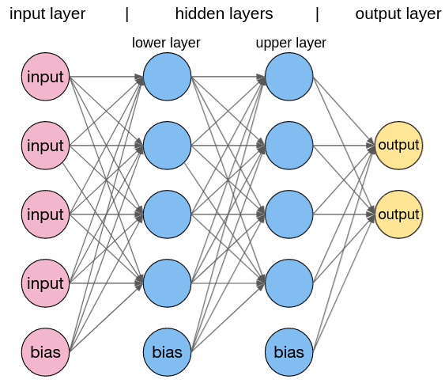
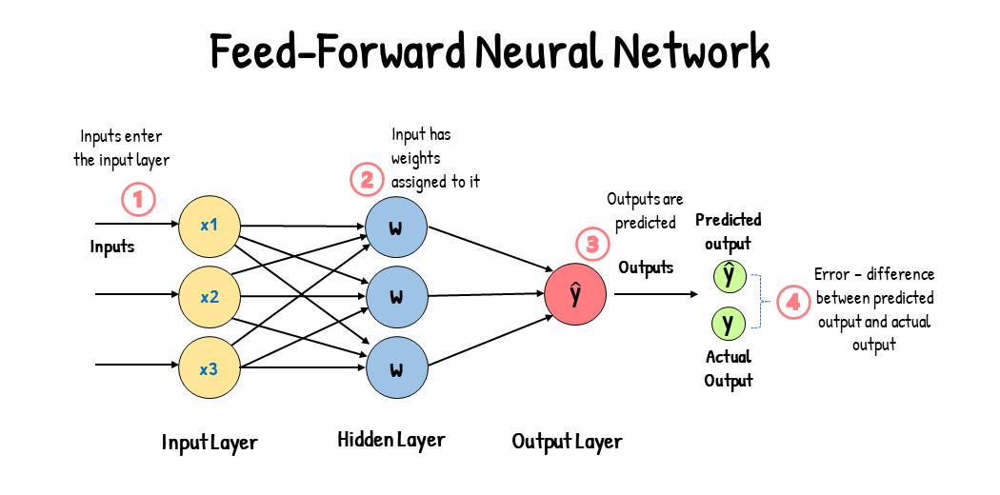

# Processamento Neural de Linguagem Natural em Português
O curso de Processamento Neural de Linguagem Natural em Português I é oferecido pelo Departamento de Ciência da Computação do Instituto de Matemática e Estatistica da USP, com apoio do C4AI – USP-IBM-Fapesp Center for Artificial Intelligence e com apoio da Google no Coursera ([acesse aqui](https://www.coursera.org/learn/processamento-neural-linguagem-natural-em-portugues-i)).

Este repositório contêm anotações pessoais sobre os assuntos abordados no curso. 

# Summary
1. [Semana 1](#semana-1)
   - [Introdução ao Processamento de Linguagem Natural](#introdução-ao-processamento-de-linguagem-natural)
   - [Processamento Baseado em Regras](#processamento-baseado-em-regras)
   - [Modelos Probabilísticos de Linguagem](#modelos-probabilísticos-de-linguagem)
   - [Problemas Típicos em PLN](#problemas-típicos-em-pln)
   - [Lista 01 (Colab)](#lista-01-colab)

2. [Semana 2](#semana-2)
   - [Introdução às Redes Neurais](#introdução-às-redes-neurais)
   - [Perceptron Probabilísticos](#perceptron-probabilísticos)
   - [Redes Multicamadas](#redes-multicamadas)
   - [Treinamento de Redes Neurais](#treinamento-de-redes-neurais)
   - [Lista 02 (Colab)](#lista-02-colab)

3. [Semana 3](#semana-3)
   - [Representação de Palavras](#representação-de-palavras)
   - [Representação Vetorial de Palavras](#representação-vetorial-de-palavras)
   - [Lista 03 (Colab)](#lista-03-colab)

4. [Semana 4](#semana-4)
   - [Modelo Word2vec Básico de Embedding](#modelo-word2vec-básico-de-embedding)
   - [Detalhamento do Modelo Básico](#detalhamento-do-modelo-básico)
   - [O Modelo Completo](#o-modelo-completo)
   - [Avaliação do Modelo word2vec](#avaliação-do-modelo-word2vec)
   - [Lista 04 (Colab)](#lista-04-colab)
   - [Entrega 01 - Implementando word2vec](#entrega-01-implementando-word2vec)

5. [Semana 5](#semana-5)
   - [Recorrencia Neural](#recorrencia-neural)
   - [Treinamento Recorrente](#treinamento-recorrente)
   - [Modelo Sequência para Sequência](#modelo-sequência-para-sequência)
   - [Problemas de Recorrência e Redes Profundas](#problemas-de-recorrência-e-redes-profundas)
   - [Lista 05 (Colab)](#lista-05-colab)

6. [Semana 6](#semana-6)
   - [Redes LSTM](#redes-lstm)
   - [Redes Recorrentes GRU e Redes Recorrentes Bidirecionais](#redes-recorrentes-gru-e-redes-recorrentes-bidirecionais)
   - [Lista 06 (Colab)](#lista-06-colab)
   - [Entrega 02 - RNNs Bidirecionais LSTM e GRU](#entrega-02-rnns-bidirecionais-lstm-e-gru)

## Semana 1
### Introdução ao Processamento de Linguagem Natural
#### Elementos da língua e áreas que as estudam:
1. **Sons (Acústica):**
   - **Descrição:** Esta área lida com os sons produzidos na fala humana e como são percebidos.
   - **Exemplo:** O som "p" em "palavra" é produzido fechando os lábios e liberando o ar.

2. **Ritmos (Prosódia - Fonologia):**
   - **Descrição:** Prosódia refere-se a elementos como entonação, ritmo e padrões de ênfase na fala.
   - **Exemplo:** A entonação ascendente no final de uma pergunta em português.

3. **Fonema (Fonética):**
   - **Descrição:** Fonemas são os sons distintivos que podem distinguir palavras em uma língua.
   - **Exemplo:** Em português, a diferença entre "pato" e "fato" está no fonema inicial.

4. **Palavras (Morfologia):**
   - **Descrição:** Morfologia estuda a estrutura interna das palavras e como elas são formadas.
   - **Exemplo:** Em "infelizmente", "infeliz" é uma raiz morfológica, e "mente" é um sufixo.

5. **Sintagma (Frases - Sintaxe):**
   - **Descrição:** Sintaxe analisa a estrutura gramatical das frases e como as palavras se combinam.
   - **Exemplo:** "O gato preto" é um sintagma nominal, onde "o gato" é o núcleo.

6. **Significados (Semântica):**
   - **Descrição:** Semântica explora o significado das palavras e como as palavras se relacionam umas com as outras.
   - **Exemplo:** A diferença de significado entre "rápido" e "veloz".

7. **Uso (Pragmática):**
   - **Descrição:** Pragmática estuda como o contexto afeta a interpretação do significado.
   - **Exemplo:** O significado de "pode me passar o sal?" pode variar com base no contexto e na entonação.

Essas áreas representam diferentes aspectos do estudo da linguagem, fornecendo uma compreensão abrangente dos elementos que compõem a comunicação linguística.

### Processamento Baseado em Regras
O Processamento de Linguagem Natural (PLN) baseado em regras gramaticais envolve o uso de um conjunto predefinido de regras linguísticas para analisar e compreender a linguagem. Ao contrário de abordagens mais modernas baseadas em aprendizado de máquina, o PLN baseado em regras depende de regras gramaticais explicitamente definidas para realizar tarefas específicas. 

Nesse método, especialistas em linguística ou programadores definem regras gramaticais que descrevem a estrutura e as relações entre as palavras em uma língua. Essas regras são usadas para analisar a sintaxe e a semântica de frases, identificar partes da fala e realizar outras tarefas de processamento de linguagem.

As regras gramaticais geralmente incluem padrões sintáticos, estruturas de frase, relações gramaticais e significados associados a determinadas construções linguísticas. A análise é realizada seguindo rigorosamente essas regras, muitas vezes usando uma abordagem de análise sintática.

**Exemplos:**
   - *Análise Sintática:* Uma regra gramatical pode ser definida para identificar sujeito, verbo e objeto em uma frase. Por exemplo, a regra pode indicar que um sujeito é geralmente seguido por um verbo e um objeto, e isso pode ser usado para analisar a estrutura da frase.
   
   - *Extração de Informações:* Se uma regra gramatical estabelece que certos padrões de palavras indicam a presença de informações específicas (por exemplo, "Nome: [nome]" ou "Data de nascimento: [data]"), o sistema pode seguir essas regras para extrair essas informações de um texto.

   - *Tradução:* Em sistemas de tradução automática baseados em regras, regras gramaticais são usadas para mapear estruturas gramaticais de uma língua para outra, seguindo padrões estabelecidos.

Embora o PLN baseado em regras tenha sido uma abordagem inicial no desenvolvimento de sistemas de processamento de linguagem, ela tem limitações, especialmente em lidar com ambiguidades e variações na linguagem. Muitas abordagens modernas incorporam técnicas de aprendizado de máquina para lidar com essas complexidades.

#### Modelagem Matemática da Linguagem: Modelos Simbólicos, Não-Numéricos ou Qualitativos:

1. **Morfologia e Sintaxe: Linguagens Formais e Autômatos:**
   - **Explicação:** A modelagem matemática de morfologia e sintaxe envolve o uso de linguagens formais para descrever a estrutura das palavras (morfologia) e a composição das frases (sintaxe).
   - **Exemplo:** As gramáticas formais, como as gramáticas livres de contexto, podem ser usadas para descrever a estrutura sintática de uma língua. Autômatos, como autômatos de pilha, podem ser aplicados para reconhecer padrões morfológicos.

2. **Sintaxe: Gramáticas Formais e Lógica Categórica:**
   - **Explicação:** A sintaxe é modelada usando gramáticas formais que definem as regras de formação de frases. A lógica categórica é uma abordagem que utiliza categorias gramaticais para representar a estrutura sintática.
   - **Exemplo:** Uma gramática formal pode descrever as regras para criar uma frase em inglês, enquanto a lógica categórica pode representar a estrutura sintática usando categorias como sujeito, verbo e objeto.

3. **Semântica: Lógica Categórica:**
   - **Explicação:** A semântica é modelada usando lógica categórica para representar o significado das expressões linguísticas. Ela estabelece relações entre as categorias gramaticais e seus significados.
   - **Exemplo:** A lógica categórica pode ser usada para representar como as palavras e frases se relacionam semanticamente, capturando o significado e as relações entre conceitos.

Essas abordagens matemáticas fornecem estruturas formais para entender e representar a linguagem. Elas são fundamentais em disciplinas como a teoria da computação, linguística computacional e processamento de linguagem natural, onde a formalização da linguagem permite a criação de modelos precisos e eficientes para análise e processamento automático.

#### Gramática livre de contexto

As gramáticas livres de contexto são uma classe específica de gramáticas formais utilizadas para descrever a estrutura sintática de linguagens formais. Elas desempenham um papel fundamental na teoria da computação, linguística computacional e no desenvolvimento de compiladores. A definição formal de uma gramática livre de contexto inclui quatro componentes principais:

1. **Conjunto de Símbolos Terminais (T):**
   - São os símbolos que aparecem nas cadeias finais derivadas pela gramática. Em uma gramática para a linguagem de programação, por exemplo, os símbolos terminais podem representar palavras-chave, operadores e identificadores.

2. **Conjunto de Símbolos Não-Terminais (N):**
   - São símbolos que podem ser substituídos por sequências de símbolos terminais e/ou não-terminais. Eles são utilizados como variáveis na definição de regras gramaticais.

3. **Conjunto de Regras de Produção (P):**
   - São regras que especificam como os símbolos não-terminais podem ser substituídos por sequências de símbolos terminais e/ou não-terminais. Cada regra geralmente assume a forma "A -> β", onde "A" é um símbolo não-terminal e "β" é uma sequência de símbolos terminais e/ou não-terminais.

4. **Símbolo Inicial (S):**
   - É o símbolo não-terminal a partir do qual as derivações começam. Geralmente, é um único símbolo não-terminal.

**Exemplo de Gramática Livre de Contexto:**
Considerando uma gramática para representar expressões aritméticas simples:

- Símbolos Terminais (T): {+, -, *, /, números}
- Símbolos Não-Terminais (N): {Expr, Term, Factor}
- Regras de Produção (P):
  1. Expr -> Expr + Term | Expr - Term | Term
  2. Term -> Term * Factor | Term / Factor | Factor
  3. Factor -> (Expr) | números

Neste exemplo, "Expr" representa uma expressão aritmética, "Term" um termo e "Factor" um fator. As regras especificam como esses elementos podem ser combinados para formar expressões aritméticas válidas.

Gramáticas livres de contexto são fundamentais em compiladores para análise sintática, na representação de linguagens de programação e no desenvolvimento de parsers para processamento de linguagem natural. Elas possuem uma estrutura poderosa e são amplamente utilizadas em diversos campos da ciência da computação.

#### Gramática e Estrutura da Frase

A gramática e a estrutura da frase são elementos essenciais na compreensão da linguagem. A **gramática** é o conjunto de regras que governa a estrutura e o uso de uma língua. Ela inclui regras sintáticas (estrutura de frases), regras morfológicas (formação de palavras) e regras semânticas (significado das palavras e frases). Já a **Estrutura da Frase** refere-se à organização gramatical das palavras em uma sentença para expressar uma ideia completa. Envolve a disposição de elementos como sujeito, verbo, objeto, adjetivos e advérbios de maneira coerente.

**Exemplos:**
1. **Frase Simples:**
   - **Exemplo:** "O gato caçou um rato."
   - **Estrutura:**
     - Sujeito: "O gato"
     - Verbo: "caçou"
     - Objeto: "um rato"

2. **Frase com Modificadores:**
   - **Exemplo:** "O rápido e ágil cão perseguia a bola incansavelmente."
   - **Estrutura:**
     - Sujeito: "O rápido e ágil cão"
     - Verbo: "perseguia"
     - Objeto: "a bola"
     - Advérbio: "incansavelmente"

3. **Frase com Cláusulas:**
   - **Exemplo:** "Quando o sol se pôs, as estrelas começaram a aparecer."
   - **Estrutura:**
     - Cláusula Temporal: "Quando o sol se pôs"
     - Sujeito: "as estrelas"
     - Verbo: "começaram a aparecer"

4. **Frase Interrogativa:**
   - **Exemplo:** "Você já almoçou?"
   - **Estrutura:**
     - Pronome Interrogativo: "Você"
     - Verbo: "almoçou"

Estes exemplos ilustram diferentes aspectos da estrutura da frase, incluindo a presença de sujeito, verbo, objeto, modificadores e a formação de frases interrogativas. A compreensão da gramática e da estrutura da frase é fundamental para a comunicação eficaz e a interpretação correta da linguagem.

#### Categorias Morfosintáticas

As categorias morfosintáticas referem-se às classes gramaticais ou categorias sintáticas que as palavras de uma língua podem ocupar em uma frase. Elas combinam elementos morfológicos (relativos à forma ou estrutura da palavra) e elementos sintáticos (relativos à função da palavra em uma sentença). As principais categorias morfosintáticas incluem:

1. **Substantivo (N):**
   - **Exemplo:** "casa," "gato," "felicidade"
   - **Função:** Representa pessoas, lugares, objetos ou ideias.

2. **Verbo (V):**
   - **Exemplo:** "correr," "pular," "cantar"
   - **Função:** Expressa ação, estado ou processo.

3. **Adjetivo (Adj):**
   - **Exemplo:** "bonito," "rápido," "inteligente"
   - **Função:** Modifica substantivos, fornecendo características ou qualidades.

4. **Advérbio (Adv):**
   - **Exemplo:** "rapidamente," "bem," "hoje"
   - **Função:** Modifica verbos, adjetivos ou outros advérbios, indicando circunstâncias.

5. **Pronome (Pron):**
   - **Exemplo:** "eu," "ela," "eles"
   - **Função:** Substitui ou faz referência a um substantivo.

6. **Preposição (Prep):**
   - **Exemplo:** "em," "sobre," "com"
   - **Função:** Estabelece relações espaciais, temporais ou lógicas entre palavras na frase.

7. **Conjunção (Conj):**
   - **Exemplo:** "e," "mas," "ou"
   - **Função:** Conecta palavras, frases ou orações.

8. **Artigo (Art):**
   - **Exemplo:** "o," "uma," "os"
   - **Função:** Indica se um substantivo é específico ou genérico.

Essas categorias são fundamentais para a análise sintática e semântica de uma sentença. Além disso, elas contribuem para a estruturação e compreensão da língua. Em muitas línguas, as palavras podem pertencer a diferentes categorias, dependendo do contexto ou da função que desempenham em uma frase específica. A categorização morfosintática é uma ferramenta crucial para a descrição e análise linguística.

#### Regras Lexicais e Regras Gramaticais
As **regras lexicais** lidam com a estrutura e a formação de palavras, incluindo morfemas (unidades mínimas de significado) e a maneira como as palavras são formadas e modificadas.

1. **Exemplo:**
   - Na língua inglesa, a adição do sufixo "-ly" a um adjetivo forma um advérbio. Exemplo: "quick" (adjetivo) -> "quickly" (advérbio).

2. **Função:**
   - Estabelecem padrões para a construção e derivação de palavras, determinando como radicais, prefixos e sufixos podem ser combinados.

As **regras gramaticais** governam a estrutura e a organização de frases, especificando como as palavras devem ser combinadas para formar unidades significativas.

1. **Exemplo:**
   - Em uma gramática simples, a regra para uma frase pode ser expressa como "Sujeito + Verbo + Objeto". Exemplo: "O gato (Sujeito) caçou (Verbo) um rato (Objeto)."

2. **Função:**
   - Determinam a ordem e a relação entre os constituintes de uma sentença, garantindo que a construção seja gramaticalmente correta.

**Comparação:**

1. **Regras Lexicais vs. Regras Gramaticais:**
   - **Regras Lexicais:** Focam na formação e na estruturação de palavras.
   - **Regras Gramaticais:** Concentram-se na organização e na estrutura de frases.

2. **Exemplo Conjunto:**
   - Considere a frase "O estudante aprendeu rapidamente."
   - **Regra Lexical:** A formação do advérbio "rapidamente" a partir do adjetivo "rápido".
   - **Regra Gramatical:** A estrutura da frase, como "Sujeito + Verbo + Advérbio."

3. **Importância Conjunta:**
   - Ambas as regras são essenciais para a compreensão e a produção linguística. As regras lexicais contribuem para o vocabulário e a expressividade, enquanto as regras gramaticais garantem a coerência e a clareza na comunicação.

Em resumo, as regras lexicais e gramaticais trabalham juntas para formar uma base sólida na compreensão e na produção da linguagem, abrangendo desde a construção de palavras até a organização de frases em contextos gramaticalmente corretos.

#### Gramática Livre de Contexto (GLC)
Uma Gramática Livre de Contexto é um tipo específico de gramática formal que descreve a estrutura sintática de uma linguagem. Ela consiste em um conjunto de regras de produção que especificam como as cadeias de símbolos podem ser formadas.

Considere a regra para uma frase simples em inglês: `S -> SN SV`. Isso significa que uma sentença (S) pode ser formada por um sintagma nominal (SN) seguido por um sintagma verbal (SV).

#### Derivação Sintática

A derivação sintática é o processo de aplicar as regras de produção de uma gramática para gerar uma sequência de símbolos que forma uma sentença na linguagem.

**Exemplo de Derivação:**
   - Dada a regra `S -> SN SV`, poderíamos derivar a sentença "O gato caçou" da seguinte maneira:
     1. `S` (inicial)
     2. `SN SV` (aplicando a regra `S -> SN SV`)
     3. `Det N SV` (selecionando "O" para SN)
     4. `O N SV` (selecionando "gato" para N)
     5. `O gato SV` (aplicando regras adicionais para SV)
     6. `O gato V` (selecionando "caçou" para V)
     7. `O gato caçou` (aplicando regras adicionais se necessário)

#### Árvore de Derivação Sintática
Uma árvore de derivação sintática é uma representação gráfica da derivação sintática, mostrando como as regras de produção são aplicadas para gerar a sentença. Usando o exemplo anterior, a árvore de derivação pode ser representada assim:

```
       S
      / \
     SN  SV
    /  |   \
 Det   N    V
  |    |    |
  O  gato caçou
```

Nesta árvore, cada nó representa um símbolo da gramática e as arestas indicam a aplicação de uma regra de produção. A raiz da árvore é o símbolo inicial (`S`), e as folhas representam os símbolos terminais que formam a sentença final.

Esses conceitos são fundamentais na análise sintática de linguagens formais e são amplamente utilizados em linguística computacional, processamento de linguagem natural e design de compiladores. A Gramática Livre de Contexto, a derivação sintática e as árvores de derivação são ferramentas poderosas para descrever e analisar a estrutura sintática das linguagens.

#### Gramática Ambígua
Uma gramática é considerada ambígua quando uma determinada sentença pode ser analisada de maneiras diferentes, resultando em mais de uma árvore sintática possível para a mesma sequência de palavras. A ambiguidade pode surgir quando as regras gramaticais permitem mais de uma interpretação válida.

**Exemplo: "Eu vi o menino com o telescópio":**
   - Nesta sentença, a ambiguidade surge devido à possível interpretação dupla da preposição "com". A frase pode ser entendida como "Eu vi o menino usando o telescópio" ou "Eu vi o menino que tinha o telescópio".

1. **Primeira Interpretação (usando o telescópio):**
   
   ```
         S
        / \
      SN   SV
      |   / | \
      N  V  Det N
      |   |    |
     Eu  vi  o menino
                  |
                  P
                  |
                 com
                  |
              Det   N
              |     |
              o  telescópio
   ```

2. **Segunda Interpretação (com o telescópio):**
   
   ```
         S
        / \
      SN   SV
      |   / | \
      N  V  Det N
      |   |    |
     Eu  vi  o menino
                  |
                  P
                  |
                 com
                  |
                Det   N
                |     |
                o  telescópio
   ```

Nas duas árvores, a estrutura geral da sentença é a mesma, mas a interpretação do papel da preposição "com" cria ambiguidade. Uma árvore sintática pode representar a interpretação de que o telescópio foi usado pelo observador (primeira árvore), enquanto a outra árvore representa a interpretação de que o telescópio pertence ao menino (segunda árvore).

A ambiguidade em gramáticas pode causar problemas de interpretação e é um desafio para sistemas de processamento de linguagem natural, pois eles precisam ser capazes de escolher a interpretação mais apropriada em contextos específicos.

#### A Hierarquia de Chomsky

A Hierarquia de Chomsky é uma classificação de gramáticas formais proposta pelo linguista Noam Chomsky. Essa hierarquia organiza as gramáticas em quatro níveis, cada um representando um conjunto diferente de linguagens. As quatro classes na Hierarquia de Chomsky, em ordem crescente de complexidade, são:

1. **Tipo 3 - Gramáticas Regulares:**
   - **Descrição:** São gramáticas simples, capazes de gerar linguagens regulares. Elas são menos poderosas em termos de expressividade do que os tipos subsequentes.
   - **Exemplo:** Gramáticas regulares são frequentemente usadas para descrever padrões em expressões regulares, como a linguagem dos números binários.

2. **Tipo 2 - Gramáticas Livres de Contexto (GLC):**
   - **Descrição:** Gramáticas que geram linguagens livres de contexto. São mais expressivas que as gramáticas regulares e são amplamente usadas em linguagens de programação e análise sintática.
   - **Exemplo:** A gramática que gera a linguagem das expressões aritméticas, como `E -> E + E`, pertence a esta categoria.

3. **Tipo 1 - Gramáticas Sensíveis ao Contexto:**
   - **Descrição:** Gramáticas mais poderosas que as gramáticas livres de contexto, permitindo regras que levam em consideração o contexto em que uma produção ocorre.
   - **Exemplo:** Gramáticas sensíveis ao contexto são usadas em linguagens naturais, onde o significado de uma palavra pode depender do contexto da sentença.

4. **Tipo 0 - Gramáticas Irrestritas:**
   - **Descrição:** Gramáticas sem restrições, permitindo regras arbitrárias. São a classe mais poderosa, mas também a mais difícil de analisar e processar.
   - **Exemplo:** Linguagens definidas por máquinas de Turing são um exemplo de linguagens geradas por gramáticas irrestritas.

Essa hierarquia é significativa porque mostra a relação entre diferentes tipos de gramáticas e as classes de linguagens que elas podem gerar. À medida que se move de um tipo para outro, as gramáticas tornam-se mais expressivas, mas também mais difíceis de analisar e processar automaticamente. A Hierarquia de Chomsky é fundamental no estudo da teoria da computação e fornece uma estrutura para entender a complexidade das linguagens formais.

### Modelos Probabilísticos de Linguagem
#### Cadeias de Markov em Processamento de Linguagem Natural (PLN)

Cadeias de Markov são modelos probabilísticos que representam sequências de eventos onde a probabilidade de um evento depende apenas do evento anterior. No contexto do PLN, esses modelos podem ser aplicados para modelar padrões de transição entre estados em uma sequência de palavras ou símbolos em uma sentença.

1. **Cadeias de Markov de Ordem 1:**
   - Nesse modelo, a probabilidade de um determinado estado (palavra) depende apenas do estado imediatamente anterior. Isso é conhecido como uma cadeia de Markov de ordem 1.

2. **Exemplo:**
   - Considere a frase: "O gato caçou o rato." Se estivermos modelando a probabilidade de cada palavra com base na palavra anterior, teríamos transições como:
     - P(caçou | O) = P(caçou | gato)
     - P(rato | caçou) = P(rato | O)

3. **Cadeias de Markov de Ordem n:**
   - Podemos aumentar a ordem da cadeia de Markov para levar em consideração um histórico mais longo de estados anteriores. Isso permite modelar dependências mais complexas.

4. **Exemplo de Ordem 2:**
   - P(rato | O, caçou) = P(rato | gato, caçou)

5. **Treinamento do Modelo:**
   - Os parâmetros do modelo, como as probabilidades de transição, são estimados a partir de dados de treinamento, ou seja, de corpus de texto anotado.

6. **Aplicações em PLN:**
   - Cadeias de Markov são utilizadas em várias tarefas de PLN, como correção ortográfica, reconhecimento de fala, geração de texto e análise de sentimento. Elas são especialmente úteis quando a probabilidade de um evento depende fortemente do contexto imediato.

7. **Limitações:**
   - Um desafio comum é a chamada "maldição da dimensionalidade," onde o número de parâmetros a serem estimados cresce exponencialmente com a ordem da cadeia de Markov, tornando difícil treinar modelos com uma ordem muito alta.

8. **Transições Estado-Observação:**
   - Em alguns casos, cada estado pode estar associado a uma observação (palavra), e a transição não é entre estados, mas entre estados-observação.

**Exemplo de Uso - Geração de Texto:**
   - Dado o início da frase "O tempo está", um modelo de cadeia de Markov pode gerar probabilisticamente as palavras seguintes com base nas transições observadas no conjunto de treinamento, resultando em diferentes continuções, como "O tempo está bom" ou "O tempo está passando."

Os modelos de cadeias de Markov oferecem uma abordagem probabilística eficiente para modelar dependências sequenciais em texto, permitindo a captura de padrões de transição que são úteis em várias tarefas de processamento de linguagem natural.

#### n-grams em Processamento de Linguagem Natural (PLN)
O modelo n-gram é uma abordagem probabilística que representa a probabilidade de ocorrência de uma palavra com base nas n palavras anteriores em uma sequência de texto. Ele é uma simplificação do modelo de Markov de ordem n e é amplamente utilizado em tarefas de processamento de linguagem natural. Um n-gram é uma sequência contígua de n itens em uma amostra de texto ou fala. No contexto do PLN, esses itens geralmente são palavras.

1. **Exemplo de n-gram:**
   - Considere a frase: "O gato caçou o rato."
   - 1-gram (unigrama): {"O", "gato", "caçou", "o", "rato"}
   - 2-gram (bigrama): {"O gato", "gato caçou", "caçou o", "o rato"}
   - 3-gram (trigrama): {"O gato caçou", "gato caçou o", "caçou o rato"}

2. **Probabilidade Condicional:**
   - O modelo n-gram usa a probabilidade condicional para calcular a probabilidade de uma palavra dado um histórico de n-1 palavras. Isso é expresso como P(w | w₁, w₂, ..., wₙ₋₁), onde w representa a palavra atual.

3. **Estimativa de Probabilidades:**
   - As probabilidades condicionais são estimadas a partir de um conjunto de treinamento, contando o número de ocorrências de n-grams. A probabilidade de uma palavra é então calculada dividindo o número de ocorrências pelo número total de ocorrências do histórico.

4. **Exemplo de Estimação de Probabilidades:**
   - Se "O gato" ocorre 10 vezes no conjunto de treinamento e "O gato caçou" ocorre 5 vezes, a probabilidade condicional de "caçou" dado "O gato" seria P("caçou" | "O gato") = 5/10.

5. **Aplicações em PLN:**
   - O modelo n-gram é amplamente utilizado em tarefas como correção ortográfica, previsão de texto, reconhecimento de fala e tradução automática. Ele fornece uma maneira eficiente de modelar a dependência sequencial em dados linguísticos.

6. **Problema da Esparsidade:**
   - Um desafio comum é a esparsidade dos dados, especialmente para grandes valores de n. Em muitos casos, algumas combinações de palavras podem não estar presentes no conjunto de treinamento, resultando em probabilidades estimadas como zero.

7. **Interpolação e Suavização:**
   - Técnicas como interpolação e suavização são frequentemente aplicadas para lidar com a esparsidade, ajustando as probabilidades de n-grams com base em n-grams de ordens inferiores ou introduzindo fatores de suavização.

**Exemplo de Uso - Previsão de Texto:**
   - Dado o histórico "O tempo está", um modelo trigram pode calcular probabilisticamente a próxima palavra, ajudando na previsão, como "O tempo está bom" ou "O tempo está passando."

Os modelos n-grams fornecem uma abordagem eficaz e computacionalmente eficiente para modelar a dependência sequencial em dados linguísticos e são uma ferramenta valiosa em diversas tarefas de processamento de linguagem natural.

#### Aprendizado Supervisionado com Modelos Probabilísticos (Exemplo: Bigrama)

**1. Aprendizado Supervisionado:**
   - No aprendizado supervisionado, um modelo é treinado usando um conjunto de dados rotulado, onde as entradas estão associadas a rótulos conhecidos. O objetivo é que o modelo generalize para fazer previsões precisas em dados não rotulados.

**2. Modelos Probabilísticos:**
   - Modelos probabilísticos atribuem probabilidades a eventos ou resultados. No contexto do processamento de linguagem natural (PLN), um exemplo é o modelo de bigrama, que calcula a probabilidade de uma palavra condicionada à palavra anterior.

**3. Bigramas e Probabilidade Condicional:**
   - Um bigrama é uma sequência de duas palavras consecutivas em um texto. A probabilidade condicional de uma palavra dada a palavra anterior (um bigrama) é usada para estimar a probabilidade de uma sequência de palavras.

**4. Exemplo:**
   - Considere a frase: "O gato caçou o rato." e a tarefa de prever a próxima palavra após "O". Se usarmos bigramas, queremos calcular P(w | "O"), onde w representa a próxima palavra.

**5. Treinamento do Modelo:**
   - Durante o treinamento, contamos o número de ocorrências de cada bigrama no conjunto de treinamento. Por exemplo, contamos quantas vezes a sequência "O gato" ocorre.

**6. Cálculo de Probabilidades:**
   - A probabilidade condicional P(w | "O") para uma palavra específica w é calculada como o número de ocorrências do bigrama "O w" dividido pelo número total de ocorrências da palavra "O".

**7. Exemplo Numérico:**
   - Suponha que em nosso conjunto de treinamento, "O gato" ocorre 5 vezes e "O rato" ocorre 3 vezes. A probabilidade condicional de "caçou" dado "O" seria P("caçou" | "O") = 5 / (5 + 3) = 5/8.

**8. Previsão:**
   - Durante a fase de teste, o modelo pode ser usado para prever a próxima palavra. Dada a entrada "O", o modelo selecionaria a palavra seguinte com base na probabilidade condicional mais alta.

**9. Aplicações:**
   - O modelo de bigrama e abordagens similares são amplamente utilizados em aplicações como correção ortográfica, previsão de texto, reconhecimento de fala e sugestões de palavras em teclados preditivos.

**10. Limitações:**
   - Modelos de bigrama têm limitações, especialmente quando se trata de capturar dependências a longo prazo ou contextos mais amplos. Modelos mais avançados, como trigramas, n-gramas ou modelos de linguagem mais complexos, podem ser usados para lidar com essas limitações.

Em resumo, o aprendizado supervisionado com modelos probabilísticos, como bigramas, é uma abordagem eficaz no processamento de linguagem natural, permitindo a previsão de palavras ou sequências com base em probabilidades condicionais aprendidas a partir de dados rotulados.

#### Aprendizado de Gramáticas Probabilísticas

O aprendizado de gramáticas probabilísticas envolve a estimação de probabilidades associadas a regras gramaticais. Essas gramáticas são frequentemente usadas em processamento de linguagem natural (PLN) para modelar a estrutura e a probabilidade de sequências de palavras em texto. Vamos explorar esse conceito com mais detalhes:

**1. Gramáticas Probabilísticas:**
   - Em vez de lidar apenas com a estrutura gramatical, as gramáticas probabilísticas atribuem probabilidades a diferentes regras de produção. Isso é útil para modelar a variabilidade na ocorrência de diferentes estruturas gramaticais.

**2. Exemplo de Regra Probabilística:**
   - Considere uma regra de produção em uma gramática livre de contexto (GLC): `S -> NP VP`. Podemos atribuir uma probabilidade a essa regra, indicando a chance de ocorrer em comparação com outras regras de produção possíveis.

**3. Estimação de Probabilidades:**
   - Durante o treinamento, as probabilidades associadas a diferentes regras são estimadas a partir de um conjunto de dados rotulado. Isso geralmente envolve contar a frequência de ocorrência de cada regra.

**4. Exemplo Numérico:**
   - Suponha que temos a regra `S -> NP VP` e ela ocorre 50 vezes em nosso conjunto de treinamento, enquanto a regra `S -> VP` ocorre 20 vezes. A probabilidade de `S -> NP VP` seria estimada como 50 / (50 + 20) = 50/70.

**5. Modelos de Linguagem:**
   - As gramáticas probabilísticas podem ser usadas para construir modelos de linguagem probabilísticos mais avançados. Por exemplo, modelos n-gram atribuem probabilidades a sequências de palavras com base em n-1 palavras anteriores.

**6. Aplicações em PLN:**
   - Esses modelos são úteis em tarefas como reconhecimento de fala, correção automática de texto, tradução automática e geração de texto. A probabilidade associada a diferentes estruturas ajuda a escolher a interpretação mais provável em contextos ambíguos.

**7. Limitações:**
   - Gramáticas probabilísticas, especialmente aquelas baseadas em modelos n-gram, podem ter dificuldades em capturar dependências a longo prazo ou contextos mais amplos. Modelos mais complexos, como modelos de linguagem neurais, foram desenvolvidos para lidar com essas limitações.

**Exemplo de Uso - Modelo de Linguagem Probabilístico:**
   - Dado um conjunto de treinamento, podemos estimar a probabilidade de diferentes sequências de palavras. Por exemplo, em uma frase como "O gato caçou o rato", o modelo atribuiria probabilidades a diferentes estruturas sintáticas e escolheria a interpretação mais provável.

O aprendizado de gramáticas probabilísticas é uma abordagem valiosa para modelar a incerteza na linguagem e escolher entre diferentes interpretações em tarefas de PLN. Essa abordagem é uma peça fundamental em muitos sistemas de processamento de linguagem natural que buscam compreender e gerar texto de maneira mais precisa.

#### Alinhamento de Textos Paralelos

O alinhamento de textos paralelos refere-se ao processo de relacionar correspondências entre sentenças ou partes de sentenças em textos que são traduções ou equivalentes em diferentes idiomas. Essa técnica é fundamental em tarefas como tradução automática e comparação de documentos multilíngues. Vamos explorar os conceitos associados ao alinhamento de textos paralelos:

**1. Alinhamento de Sentenças:**
   - O alinhamento de sentenças é uma forma comum de alinhamento de textos paralelos. Envolve relacionar cada sentença em um texto-fonte com sua correspondente no texto de destino.

**2. Exemplo Simples:**
   - Texto-fonte (inglês): "Hello, how are you?"
   - Texto de destino (francês): "Bonjour, comment ça va ?"
   - Alinhamento de sentenças: "Hello" -> "Bonjour", "how are you?" -> "comment ça va ?"

**3. Alinhamento de Fragmentos:**
   - Em vez de alinhar apenas sentenças inteiras, pode-se realizar alinhamento de fragmentos para lidar com diferenças estruturais ou para identificar partes correspondentes de sentenças.

**4. Exemplo de Alinhamento de Fragmentos:**
   - Texto-fonte: "A água é essencial para a vida."
   - Texto de destino: "Water is essential for life."
   - Alinhamento de fragmentos: "água" -> "Water", "essencial para a vida" -> "essential for life."

**5. Modelos de Alinhamento:**
   - Existem diferentes modelos de alinhamento, incluindo modelos baseados em regras, modelos estatísticos e modelos neurais. Cada abordagem tem suas vantagens e desvantagens.

**6. Modelos Estatísticos:**
   - Modelos estatísticos podem ser treinados usando métodos probabilísticos para aprender padrões de alinhamento com base em dados de treinamento que contenham textos alinhados.

**7. Alinhamento de Palavras:**
   - O alinhamento de palavras é uma forma mais granular de alinhamento, onde cada palavra em uma sentença é relacionada à sua equivalente na sentença de destino.

**8. Exemplo de Alinhamento de Palavras:**
   - Texto-fonte: "O gato está dormindo."
   - Texto de destino: "The cat is sleeping."
   - Alinhamento de palavras: "O" -> "The", "gato" -> "cat", "está" -> "is", "dormindo" -> "sleeping."

**9. Alinhamento Bidirecional:**
   - O alinhamento pode ser bidirecional, onde não apenas as sentenças ou palavras no texto-fonte são alinhadas com o texto de destino, mas também vice-versa.

**10. Aplicações:**
   - Além da tradução automática, o alinhamento de textos paralelos é útil em tarefas como extração de terminologia, resumo automático e comparação de documentos multilíngues.

**11. Desafios:**
   - Alinhar textos paralelos pode ser desafiador em casos de diferenças sintáticas, palavras ausentes ou adicionadas, e quando há ambiguidades na correspondência entre idiomas.

Em resumo, o alinhamento de textos paralelos é uma etapa crucial em muitas aplicações de processamento de linguagem natural, proporcionando uma correspondência eficaz entre textos em diferentes idiomas para facilitar a tradução e análise multilíngue.

### Problemas Típicos em PLN
#### Pré-processamento
1. **Tokenização:**
   - **Descrição:** A tokenização envolve dividir um texto em unidades menores, chamadas tokens, que podem ser palavras, subpalavras ou caracteres.
   - **Exemplo:** 
     - Texto: "Processamento de Linguagem Natural."
     - Tokens: ["Processamento", "de", "Linguagem", "Natural", "."]

2. **Filtragem (Exemplo: Etiquetas HTML):**
   - **Descrição:** Filtragem refere-se à remoção de elementos indesejados, como etiquetas HTML, para extrair apenas o texto relevante.
   - **Exemplo:** 
     - Texto: "<p>Texto relevante</p>"
     - Texto filtrado: "Texto relevante"

3. **Identificação de Ponto Final:**
   - **Descrição:** Identificar corretamente os pontos finais em um texto é crucial para segmentar o texto em sentenças.
   - **Exemplo:** 
     - Texto: "Isso é um exemplo. Outra frase."
     - Sentenças identificadas: ["Isso é um exemplo.", "Outra frase."]

4. **Expansão de Abreviações:**
   - **Descrição:** Expansão de abreviações é o processo de substituir abreviações por suas formas completas para melhor compreensão.
   - **Exemplo:** 
     - Texto: "O prof. Smith deu uma palestra."
     - Texto expandido: "O professor Smith deu uma palestra."

5. **Separação de Sentenças:**
   - **Descrição:** Separação de sentenças é a identificação e delimitação correta de sentenças em um texto.
   - **Exemplo:** 
     - Texto: "Primeira frase. Segunda frase."
     - Sentenças separadas: ["Primeira frase.", "Segunda frase."]

6. **Extração de Stop-Words:**
   - **Descrição:** Stop-words são palavras comuns que geralmente são removidas durante o pré-processamento, pois não contribuem significativamente para a análise.
   - **Exemplo:** 
     - Texto: "O processamento de linguagem natural é fascinante."
     - Texto sem stop-words: "Processamento linguagem natural fascinante."

Esses problemas são exemplos comuns enfrentados durante o **pré-processamento** em tarefas de PLN. Soluções eficazes para esses problemas contribuem significativamente para a qualidade do processamento e análise de texto. Cada etapa do pré-processamento tem o objetivo de preparar o texto para análises mais avançadas, como modelagem de tópicos, classificação de sentimentos ou tradução automática.

#### Morfologia
1. **Separação de Junções:**
   - **Descrição:** Em alguns idiomas, as palavras podem ser formadas pela junção de várias unidades. Separar essas junções corretamente é essencial para uma análise morfológica precisa.
   - **Exemplo:** 
     - Palavra: "porta-malas"
     - Separação correta: ["porta", "malas"]

2. **Expressões Multipalavras:**
   - **Descrição:** Algumas expressões consistem em várias palavras que têm um significado específico quando combinadas, e sua identificação é crucial para a compreensão correta.
   - **Exemplo:** 
     - Expressão: "de vez em quando"
     - Identificação: ["de", "vez", "em", "quando"]

3. **Lematização:**
   - **Descrição:** A lematização envolve reduzir uma palavra à sua forma base ou lema, geralmente removendo sufixos e prefixos, para facilitar a análise.
   - **Exemplo:** 
     - Palavra: "correndo"
     - Lematização: "correr"

4. **Stemmatização:**
   - **Descrição:** Similar à lematização, a stemmatização envolve cortar sufixos e prefixos para reduzir uma palavra à sua raiz, mesmo que essa raiz não seja um lema.
   - **Exemplo:** 
     - Palavra: "corrida"
     - Stemmatização: "corr"

5. **Etiquetagem Morfossintática (Classe Gramatical):**
   - **Descrição:** A etiquetagem morfossintática atribui rótulos a cada palavra indicando sua classe gramatical, gênero, número, tempo verbal, entre outros.
   - **Exemplo:** 
     - Palavra: "correndo"
     - Etiqueta: Verbo, Gerúndio

6. **Problemas com Flexões:**
   - **Descrição:** Em línguas com muitas flexões, identificar a forma base da palavra pode ser desafiador devido a variações na conjugação e declinação.
   - **Exemplo:** 
     - Palavra: "falamos"
     - Lematização: "falar"

7. **Problemas com Palavras Irregulares:**
   - **Descrição:** Algumas palavras têm formas irregulares que não seguem padrões regulares de flexão, tornando a análise morfológica mais complexa.
   - **Exemplo:** 
     - Palavra: "ser"
     - Formas conjugadas: ["sou", "é", "somos", ...]

8. **Ambiguidade Morfológica:**
   - **Descrição:** Palavras com formas idênticas podem ter significados diferentes dependendo do contexto, introduzindo ambiguidade.
   - **Exemplo:** 
     - Palavra: "correu"
     - Significados possíveis: [correr, passado do verbo], [correr, adjetivo]

Esses problemas são exemplos de **desafios enfrentados ao lidar com a morfologia** em PLN. Abordagens eficazes para resolver esses problemas são fundamentais para análises mais precisas e compreensivas da estrutura linguística em textos. O uso de técnicas avançadas, como modelos de linguagem neurais, pode ajudar a enfrentar esses desafios de maneira mais robusta e contextual.

#### Sintaxe
1. **Segmentação (Chunking) para Identificar Unidades Sintáticas:**
   - **Descrição:** Segmentação envolve agrupar palavras em unidades sintáticas maiores, como sintagmas verbais (SV) e nominais (SN), para entender a estrutura gramatical de uma sentença.
   - **Exemplo:** 
     - Sentença: "O gato está dormindo."
     - Sintagma verbal (SV): ["está dormindo"]
     - Sintagma nominal (SN): ["O gato"]

2. **Parseamento Raso (Shallow Parsing):**
   - **Descrição:** O parseamento raso foca na identificação de estruturas sintáticas mais superficiais, como grupos nominais e verbais, sem analisar a estrutura interna completa da sentença.
   - **Exemplo:** 
     - Sentença: "O homem que vi ontem é meu amigo."
     - Parseamento raso: ["O homem", "que vi ontem", "é meu amigo"]

3. **Parseamento Profundo (Deep Parsing):**
   - **Descrição:** O parseamento profundo busca uma análise mais aprofundada da estrutura sintática, incluindo relações gramaticais mais complexas e dependências entre as palavras.
   - **Exemplo:** 
     - Sentença: "A casa que João comprou está à venda."
     - Parseamento profundo: Relações específicas entre as palavras, como "casa" sendo o sujeito de "está à venda".

4. **Reconhecimento de Entidades Mencionadas (NER):**
   - **Descrição:** NER envolve identificar e classificar entidades mencionadas em um texto, como nomes de pessoas, locais, organizações, datas, etc.
   - **Exemplo:** 
     - Texto: "Bill Gates fundou a Microsoft em 1975."
     - Entidades reconhecidas: [Bill Gates - Pessoa, Microsoft - Organização, 1975 - Data]

5. **Resolução de Anáforas (Deixis):**
   - **Descrição:** A resolução de anáforas aborda o problema de vincular pronomes ou outras expressões anafóricas de volta aos seus antecedentes para compreender quem ou o que eles representam. Em NLP, é mais comum ser chamado de **coreferencia**. Coreferencia é um tipo de anáfora, em que duas ou mais expressões no texto se referem ao mesmo referente ou entidade.
   - **Exemplo:** 
     - Texto: "João comprou um carro. Ele é vermelho."
     - Resolução de anáfora: "Ele" se refere a "um carro."

Esses **problemas sintáticos** são cruciais para a compreensão semântica e o processamento avançado em PLN. Resolver esses desafios envolve o uso de técnicas e ferramentas específicas, como análise sintática, modelos de dependência, e algoritmos de resolução de anáforas. O avanço em parseamento e análise sintática é vital para aplicações como tradução automática, resumo de texto, e sistemas de pergunta e resposta automáticos.

#### Semântica
1. **Detecção de Relações Semânticas:**
   - **Descrição:** Envolve identificar e categorizar relações semânticas entre palavras ou conceitos, como sinonímia (relação de significado similar), antonímia (relação de significado oposto), e hiperonímia (relação entre termos gerais e específicos).
   - **Exemplo:** 
     - Sinonímia: "comprar" e "adquirir"
     - Antonímia: "feliz" e "triste"
     - Hiperonímia: "fruta" e "maçã"

2. **Embedding/Inserção em Espaço n-dimensional:**
   - **Descrição:** O embedding refere-se à representação de palavras ou frases em um espaço n-dimensional, onde palavras semelhantes estão próximas umas das outras. Essa representação vetorial captura relações semânticas.
   - **Exemplo:** 
     - Palavras semelhantes teriam vetores próximos no espaço n-dimensional. "Rei" e "Rainha" podem estar próximos, indicando uma relação semântica.

3. **Embedding sem Semântica Conhecida para Posições dos Vetores (Word2Vec):**
   - **Descrição:** Métodos como Word2Vec são capazes de criar embeddings semânticos de palavras, mesmo sem conhecimento prévio da semântica. As posições nos vetores são aprendidas com base nas coocorrências em grandes conjuntos de dados.
   - **Exemplo:** 
     - "Vetor(Rei) - Vetor(Homem) + Vetor(Mulher)" pode resultar em um vetor próximo de "Rainha", sugerindo uma compreensão semântica das relações entre essas palavras.

4. **Resolução de Ambiguidade Semântica:**
   - **Descrição:** Trata da ambiguidade que surge quando uma palavra pode ter múltiplos significados em um contexto. O objetivo é determinar qual significado é mais apropriado com base no contexto.
   - **Exemplo:** 
     - "Banco" pode se referir a uma instituição financeira ou a um assento. A resolução de ambiguidade semântica determinaria o significado apropriado em uma frase específica.

5. **Análise de Sentimento:**
   - **Descrição:** Envolvendo a compreensão da polaridade emocional expressa em um texto, a análise de sentimento busca identificar se o texto transmite emoções positivas, negativas ou neutras.
   - **Exemplo:** 
     - "Eu amo esse produto!" indica uma emoção positiva, enquanto "Estou muito insatisfeito com o serviço" indica uma emoção negativa.

6. **Extração de Informação Semântica:**
   - **Descrição:** Consiste em extrair informações específicas ou conhecimento semântico de um texto, como identificar eventos, relações entre entidades e fatos relevantes.
   - **Exemplo:** 
     - "Bill Gates fundou a Microsoft em 1975." A extração de informação semântica identificaria a relação "fundou" entre "Bill Gates" e "Microsoft" e a data "1975".

Esses **problemas semânticos** são fundamentais para compreender o significado subjacente em textos e são cruciais em várias aplicações de PLN, como sistemas de busca semântica, resumo automático de textos, tradução automática avançada e assistentes virtuais. O uso de embeddings e modelos semânticos avançados, como BERT (Bidirectional Encoder Representations from Transformers), tem impulsionado significativamente o progresso na resolução desses desafios semânticos.

#### Pragmática
1. **Desambiguação de Palavras:**
   - **Descrição:** A desambiguação de palavras envolve a identificação do significado correto de uma palavra em um contexto específico, especialmente quando a palavra tem múltiplos significados.
   - **Exemplo:** 
     - A palavra "banco" pode significar uma instituição financeira ou um assento, e a desambiguação dependerá do contexto.

2. **Desambiguação de Sentenças:**
   - **Descrição:** Similar à desambiguação de palavras, a desambiguação de sentenças lida com casos em que uma sentença pode ter interpretações diferentes, e é necessário determinar a interpretação correta.
   - **Exemplo:** 
     - "Vi o homem com o telescópio." A desambiguação depende de saber se o telescópio está associado ao "homem" ou ao ato de ver.

3. **Parseamento Semântico (Semantic Parsing):**
   - **Descrição:** Semantic parsing envolve converter uma sentença ou expressão linguística em uma representação semântica estruturada, como uma consulta SQL ou uma árvore semântica.
   - **Exemplo:** 
     - Sentença: "Encontre restaurantes italianos perto de mim."
     - Parseamento semântico: {ação: "encontrar", entidade: "restaurantes", tipo: "italiano", localização: "perto de mim"}

4. **Tradução:**
   - **Descrição:** A tradução envolve a conversão de texto de uma língua para outra, considerando não apenas a correspondência de palavras, mas também a expressão do significado.
   - **Exemplo:** 
     - "Hello, how are you?" traduzido para "Olá, como você está?"

5. **Reconhecimento e Geração de Entidades:**
   - **Descrição:** Identificar entidades mencionadas em um texto e gerar respostas ou ações adequadas com base nesse reconhecimento.
   - **Exemplo:** 
     - Pergunta: "Quem é o presidente dos Estados Unidos?"
     - Reconhecimento de entidade: "presidente dos Estados Unidos"
     - Resposta gerada: "Joe Biden é o presidente dos Estados Unidos."

6. **Resolução de Discurso (Discurso Coerente):**
   - **Descrição:** Garantir que um texto seja coerente em termos de estrutura e significado, considerando a continuidade do discurso.
   - **Exemplo:** 
     - Transição coerente entre parágrafos em um texto narrativo.

7. **Preservação de Intenção:**
   - **Descrição:** Assegurar que a intenção original do falante seja mantida em situações de processamento automático de linguagem natural.
   - **Exemplo:** 
     - Intenção: "Por favor, não faça isso."
     - Preservação: A tradução ou interpretação mantém o tom de pedido ou solicitação.

Esses **problemas pragmáticos** são complexos e envolvem a compreensão mais profunda do contexto e da intenção do usuário. Solucionar esses desafios é crucial para a criação de sistemas de PLN que possam interagir de forma mais natural e eficaz com os usuários, especialmente em aplicações como assistentes virtuais, sistemas de chatbots avançados e sistemas de resposta automática. O progresso na pragmática requer abordagens avançadas que considerem não apenas a estrutura gramatical e semântica, mas também as nuances do uso da linguagem na comunicação humana.

### Lista 01 (Colab)
- Acesse [aqui](https://github.com/k3ybladewielder/nlp/blob/main/nlp_usp/notebooks/01_Spacy.ipynb)

## Semana 2
### Introdução às Redes Neurais


O perceptron é um tipo simples de neurônio artificial que serve como unidade básica em redes neurais. Foi proposto por Frank Rosenblatt em 1957 e é um dos primeiros modelos de aprendizado de máquina. O perceptron é fundamental para entender o conceito de redes neurais e serviu como ponto de partida para o desenvolvimento de arquiteturas mais complexas.

**Características Principais do Perceptron:**

1. **Estrutura Básica:**
   - Um perceptron consiste em uma única camada de entrada de dados, com pesos associados a cada entrada. Cada entrada é multiplicada pelo peso correspondente, e a soma ponderada é passada por uma função de ativação.

2. **Função de Ativação:**
   - A saída do perceptron é determinada pela aplicação de uma função de ativação ao resultado da soma ponderada das entradas. A função de ativação introduz não linearidades na resposta do perceptron, permitindo que ele aprenda padrões mais complexos.

3. **Treinamento:**
   - O treinamento de um perceptron envolve ajustar os pesos associados às entradas para minimizar a diferença entre a saída do perceptron e o resultado desejado. Isso é feito utilizando um algoritmo de aprendizado, como o Perceptron Learning Algorithm (PLA), que ajusta os pesos com base nos erros de classificação.

4. **Aplicações Iniciais:**
   - O perceptron foi inicialmente proposto para resolver problemas de classificação binária. Ele pode ser usado para criar um classificador linear, onde os dados de entrada são atribuídos a uma de duas classes com base em uma fronteira de decisão linear.

**Limitações do Perceptron:**

1. **Linearidade:**
   - O perceptron é limitado a aprender padrões lineares. Isso significa que, se os dados não puderem ser separados por uma linha ou hiperplano, o perceptron não conseguirá aprender a relação.

2. **Problema do XOR:**
   - O perceptron não pode resolver o problema do XOR, que é um problema não linear. Isso levou a uma percepção inicialmente negativa em relação aos perceptrons, mas as redes neurais mais complexas, como multilayer perceptrons (MLPs), superaram essa limitação.

**Extensões do Perceptron:**

1. **Multilayer Perceptrons (MLPs):**
   - Para superar as limitações do perceptron, foram propostas arquiteturas mais complexas, como MLPs, que consistem em múltiplas camadas de neurônios. Isso permite a modelagem de relações não lineares mais sofisticadas.

2. **Redes Neurais Profundas:**
   - O perceptron é um bloco de construção fundamental para redes neurais profundas. Modelos como redes neurais convolucionais (CNNs) e redes neurais recorrentes (RNNs) incorporam princípios do perceptron em camadas mais profundas, permitindo aprendizado hierárquico e contextual.

Apesar de suas limitações em resolver problemas não lineares, o perceptron teve um papel crucial no desenvolvimento de modelos de aprendizado de máquina e redes neurais mais avançados. Ele representa um marco histórico e conceitual no campo da inteligência artificial e aprendizado de máquina.

As redes neurais desempenham um papel fundamental no avanço das aplicações de Processamento de Linguagem Natural (PLN). Elas são uma classe de algoritmos de aprendizado de máquina inspirados no funcionamento do cérebro humano, projetados para extrair padrões complexos e representações significativas a partir de dados. Quando aplicadas em PLN, essas redes são conhecidas como Redes Neurais para Processamento de Linguagem Natural (NNPLN) ou Redes Neurais para NLP. As redes neurais proporcionaram um avanço significativo nas capacidades de PLN devido à sua capacidade de aprender representações distribuídas e hierárquicas de dados textuais. Abaixo estão alguns dos principais tópicos associados à aplicação de redes neurais em PLN:

1. **Embeddings de Palavras:**
   - Redes neurais são frequentemente usadas para aprender embeddings de palavras, representações vetoriais que capturam semântica e relações entre palavras. Exemplos incluem Word2Vec, GloVe e embeddings contextuais como BERT.

2. **Modelos de Linguagem Recorrentes (RNNs):**
   - RNNs são adequadas para processar sequências de dados, tornando-as úteis para tarefas que envolvem texto, como previsão de palavras seguintes, tradução automática e análise de sentimento.

3. **LSTM (Long Short-Term Memory) e GRU (Gated Recurrent Unit):**
   - São variantes de RNNs projetadas para superar o problema do desaparecimento do gradiente. Elas permitem que a rede capture dependências a longo prazo em sequências de texto.

4. **Redes Neurais Convolucionais (CNNs) em NLP:**
   - CNNs, inicialmente projetadas para processamento de imagem, também mostraram eficácia em tarefas de PLN, como classificação de texto, extração de características e análise de sentimento.

5. **Modelos de Ativação Transformer:**
   - A arquitetura Transformer, introduzida pelo modelo BERT, revolucionou a PLN. Esses modelos baseados em autoatentção permitem uma compreensão contextual rica e têm sido amplamente adotados em tarefas como tradução automática, sumarização e questionamento e resposta.

6. **Transferência de Aprendizado:**
   - Redes neurais facilitam a transferência de aprendizado em PLN. Modelos pré-treinados, como GPT (Generative Pre-trained Transformer) e BERT, podem ser ajustados para tarefas específicas, economizando recursos computacionais e melhorando o desempenho.

7. **Geração de Texto:**
   - Redes neurais são empregadas na geração de texto, permitindo a criação de conteúdo novo e coerente. Modelos como GPT-3 são notáveis por suas habilidades de geração de linguagem natural.

8. **Análise de Sentimento, Named Entity Recognition (NER) e Tarefas Específicas:**
   - Redes neurais são usadas com sucesso em tarefas específicas de PLN, incluindo análise de sentimentos, identificação de entidades nomeadas, classificação de texto e muitas outras.

A aplicação de redes neurais em PLN permitiu avanços significativos em uma variedade de domínios, desde assistentes virtuais e chatbots até tradução automática e análise avançada de texto. O campo continua a evoluir, impulsionado pelo desenvolvimento de arquiteturas mais avançadas, grandes conjuntos de dados e inovações em técnicas de treinamento.

### Perceptron Probabilísticos
O perceptron tradicional é um modelo de aprendizado de máquina que produz uma saída binária (0 ou 1) com base em uma combinação linear de entradas ponderadas. Ele não fornece uma probabilidade associada à sua decisão e é mais frequentemente utilizado para problemas de classificação binária.

Se quisermos adicionar uma interpretação probabilística ao perceptron, poderíamos considerar a introdução de uma função de ativação que gera uma saída no intervalo de 0 a 1. Uma escolha comum para isso é a função logística (também conhecida como sigmoid), que transforma a soma ponderada das entradas em uma probabilidade:

$\ P(y=1) = \frac{1}{1 + e^{-z}} \$

Onde $\ z \$ é a soma ponderada das entradas.

Nesse contexto, o perceptron probabilístico poderia ser interpretado como um perceptron modificado para gerar probabilidades de pertencimento a uma classe, sendo comumente usado em problemas de classificação binária.

**Características do Perceptron Probabilístico:**

1. **Função de Ativação Sigmóide:**
   - A função de ativação logística (sigmóide) é frequentemente usada para transformar a soma ponderada em uma probabilidade.

2. **Interpretação Probabilística:**
   - A saída do perceptron probabilístico pode ser interpretada como a probabilidade de pertencimento à classe positiva. Por exemplo, se a saída for 0.8, poderíamos interpretar isso como uma probabilidade de 80% de pertencer à classe positiva.

3. **Limiar de Decisão:**
   - O perceptron probabilístico ainda toma decisões com base em um limiar, mas a saída está no intervalo [0, 1], permitindo uma interpretação probabilística.

4. **Treinamento:**
   - O treinamento do perceptron probabilístico geralmente envolve a minimização de uma função de perda que penaliza as previsões incorretas em termos de probabilidades estimadas.

Em resumo, um perceptron probabilístico seria um perceptron tradicional com a introdução de uma função de ativação que permite interpretar sua saída como uma probabilidade. Essa modificação é frequentemente útil em cenários onde se deseja obter uma medida de confiança associada à decisão do modelo.

### Redes Multicamadas



As Redes Multicamadas (Multilayer Perceptron - MLP) são uma extensão dos perceptrons simples, projetadas para superar as limitações associadas à resolução de problemas não lineares e para permitir o aprendizado de representações mais complexas. Elas constituem uma forma fundamental de arquitetura de redes neurais artificiais e são usadas em uma variedade de tarefas de aprendizado de máquina, incluindo classificação, regressão, e reconhecimento de padrões.

**Principais Características das MLPs:**

1. **Arquitetura de Múltiplas Camadas:**
   - MLPs consistem em várias camadas de neurônios, organizadas em uma camada de entrada, uma ou mais camadas ocultas e uma camada de saída. Cada camada oculta contém neurônios (também chamados de unidades) que processam informações intermediárias.

2. **Conceito de Neurônio ou Unidade:**
   - Cada neurônio em uma MLP opera de maneira semelhante a um perceptron, recebendo entradas ponderadas, aplicando uma função de ativação e gerando uma saída. No entanto, em MLPs, são comuns funções de ativação não lineares, como a função sigmóide, tangente hiperbólica (tanh) ou funções de ativação ReLU (Rectified Linear Unit).

3. **Feedforward (Propagação Direta):**
   - O processamento de informações em uma MLP ocorre no sentido direto (feedforward), passando da camada de entrada, através das camadas ocultas, até a camada de saída. Cada camada oculta realiza transformações não lineares nas informações.

4. **Treinamento com Retropropagação (Backpropagation):**
   - A técnica de treinamento mais comum para MLPs é a retropropagação (backpropagation). Durante o treinamento, os pesos da rede são ajustados iterativamente para minimizar uma função de perda, que mede a diferença entre as previsões da rede e os rótulos reais.

5. **Funções de Ativação Não Lineares:**
   - As funções de ativação não lineares nas camadas ocultas permitem que a MLP aprenda relações não lineares nos dados, tornando-a capaz de modelar tarefas mais complexas do que perceptrons ou modelos lineares.

6. **Universalidade Aproximada:**
   - MLPs, com uma quantidade suficientemente grande de neurônios e camadas ocultas, são universalmente aproximadores de funções. Isso significa que, teoricamente, podem representar qualquer função, tornando-os modelos poderosos.

7. **Regularização e Prevenção de Overfitting:**
   - MLPs podem ser suscetíveis ao overfitting, especialmente em conjuntos de dados pequenos. Técnicas de regularização, como dropout, weight decay e early stopping, são frequentemente empregadas para mitigar esse problema.

8. **Aplicações:**
   - MLPs são aplicadas em uma ampla variedade de tarefas, incluindo reconhecimento de padrões, classificação de imagens, processamento de linguagem natural, previsão de séries temporais, entre outras.

As Redes Multicamadas são uma arquitetura versátil e formam a base para muitas das redes neurais mais avançadas usadas atualmente, como redes neurais convolucionais (CNNs) e redes neurais recorrentes (RNNs). Seu design modular e capacidade de aprender representações hierárquicas fazem delas uma escolha poderosa em uma variedade de domínios de aplicação.

### Treinamento de Redes Neurais




O treinamento de redes neurais é um processo crucial no desenvolvimento de modelos de aprendizado profundo. Ele envolve ajustar os pesos e os bias (viés) da rede para minimizar uma função de perda em relação aos dados de treinamento. O objetivo é capacitar a rede a fazer previsões precisas em dados não vistos. Aqui estão os principais aspectos do treinamento de redes neurais:

1. **Inicialização de Pesos:**
   - Os pesos e bias da rede precisam ser inicializados antes do treinamento. Estratégias comuns incluem inicialização aleatória ou métodos mais avançados, como a inicialização de He ou a inicialização de Xavier, que buscam evitar problemas como o desaparecimento ou explosão do gradiente.

2. **Propagação Direta (Forward Propagation):**
   - Durante a propagação direta, os dados de entrada passam pelas camadas da rede, com os pesos e bias aplicados em cada camada. A saída é calculada e comparada com as etiquetas reais para calcular a perda.

3. **Função de Perda ou Custo (Loss Function):**
   - A função de perda mede a discrepância entre as previsões do modelo e os rótulos reais. Ela fornece uma medida de quão bem o modelo está realizando a tarefa desejada.

4. **Retropropagação (Backpropagation):**
   - A retropropagação é o algoritmo fundamental para otimizar os pesos da rede. Ela calcula os gradientes da função de perda em relação aos pesos, usando a regra da cadeia, e ajusta esses pesos para minimizar a perda.

5. **Otimização de Pesos (Weight Optimization):**
   - Algoritmos de otimização, como o Gradiente Descendente, são usados para ajustar os pesos da rede com base nos gradientes calculados durante a retropropagação. Variações, como Gradiente Descendente Estocástico (SGD), Adam, RMSprop, são frequentemente usadas para acelerar a convergência.

6. **Taxa de Aprendizado (Learning Rate):**
   - A taxa de aprendizado controla o tamanho do passo que a otimização dá em direção à minimização da função de perda. A escolha adequada da taxa de aprendizado é crítica e pode afetar a convergência do modelo.

7. **Validação Cruzada e Conjunto de Validação:**
   - Conjuntos de validação são usados para monitorar o desempenho do modelo em dados não vistos durante o treinamento. Isso ajuda a evitar overfitting. Técnicas como validação cruzada ou divisão em conjunto de treinamento, validação e teste são comuns.

8. **Regularização:**
   - Técnicas de regularização, como dropout, normalização de lote (batch normalization) e regularização L1/L2, são empregadas para evitar overfitting, melhorar a generalização e estabilizar o treinamento.

9. **Épocas e Lotes:**
   - O treinamento ocorre ao longo de épocas, onde uma época é uma passagem completa pelos dados de treinamento. Os dados são frequentemente divididos em lotes (batches) para processamento mais eficiente.

10. **Monitoramento do Desempenho:**
    - Métricas de desempenho, como precisão, acurácia ou erro, são monitoradas ao longo do treinamento para avaliar o quão bem o modelo está se saindo nas tarefas.

11. **Convergência:**
    - O treinamento é considerado completo quando o modelo converge para um estado onde a função de perda é minimizada, ou quando um critério de parada, como número máximo de épocas ou desempenho suficientemente bom, é atingido.

12. **Transferência de Aprendizado:**
    - Em alguns casos, é possível utilizar o conhecimento prévio de modelos treinados em conjuntos de dados grandes (pré-treinamento) e ajustar esses modelos para tarefas específicas (afinamento ou fine-tuning) com conjuntos de dados menores.

O treinamento de redes neurais é um processo iterativo e intensivo em computação. O avanço contínuo na área inclui o desenvolvimento de técnicas mais eficientes de otimização, arquiteturas de redes neurais mais avançadas e estratégias de regularização para melhorar o desempenho e a generalização dos modelos.

### Lista 02 (Colab)
- Acesse [aqui](https://github.com/k3ybladewielder/nlp/blob/main/nlp_usp/notebooks/02_NN_&_Backpropagation.ipynb)

## Semana 3
### Representação de Palavras
As representações numéricas de palavras são uma parte fundamental do processamento de linguagem natural (PLN) e são utilizadas para converter palavras ou tokens de um texto em vetores numéricos. Esses vetores são usados como entrada para algoritmos de aprendizado de máquina, permitindo que os modelos compreendam e processem o significado semântico das palavras. Aqui estão alguns tipos comuns de representação numérica de palavras:

1. **One-Hot Encoding:**
   - Cada palavra é representada por um vetor binário, onde apenas uma posição corresponde à palavra e é marcada como 1, enquanto as outras posições são 0. Esse método cria vetores esparsos e não captura relações semânticas entre palavras.

2. **Word Embeddings (Incorporação de Palavras):**
   - Word embeddings são representações densas e vetoriais de palavras. Cada palavra é mapeada para um vetor de números reais, onde a proximidade no espaço vetorial reflete a semelhança semântica. Modelos populares de word embeddings incluem Word2Vec, GloVe e FastText.

3. **Embeddings Contextuais:**
   - Modelos de embeddings contextuais, como ELMo (Embeddings from Language Models) e BERT (Bidirectional Encoder Representations from Transformers), geram representações que levam em consideração o contexto das palavras em uma sentença. Isso permite que as representações variem com base no contexto específico de uso.

4. **TF-IDF (Term Frequency-Inverse Document Frequency):**
   - Embora mais comumente usado em modelos de recuperação de informações, o TF-IDF pode ser considerado uma forma de representação numérica de palavras. Ele calcula um peso para cada palavra com base em sua frequência em um documento específico em comparação com sua frequência em todo o corpus.

5. **N-grams:**
   - Representação que considera sequências contíguas de n palavras. N-grams capturam relações de ordem superior entre palavras e são usados para criar características mais complexas.

6. **Doc2Vec (Paragraph Vector):**
   - Expansão do conceito de word embeddings para documentos inteiros. Doc2Vec atribui vetores a documentos, considerando o contexto em que as palavras aparecem.

7. **Subword Embeddings:**
   - Representações que consideram partes menores de palavras, como caracteres ou subpalavras. Esse método é útil para lidar com palavras desconhecidas ou variações linguísticas.

A escolha da representação numérica depende do contexto do problema, do tamanho do conjunto de dados e dos requisitos computacionais. Modelos mais recentes, como BERT, geralmente superam métodos mais tradicionais, mas a escolha também pode depender dos recursos disponíveis e do domínio específico de aplicação.


### Representação de palavras com Tensorflow e Pytorch
TensorFlow e PyTorch, dois dos principais frameworks de aprendizado profundo, utilizam diferentes abordagens para **representar numericamente** as palavras em tarefas de processamento de linguagem natural (PLN). Vou abordar brevemente como cada um desses frameworks lida com essa representação:

#### TensorFlow:

1. **Embeddings no TensorFlow:**
   - No TensorFlow, as representações numéricas de palavras geralmente são realizadas por meio de camadas de embeddings. A camada `Embedding` é usada para mapear palavras para vetores densos. Esses embeddings podem ser treinados juntamente com o restante do modelo ou inicializados com embeddings preexistentes, como os do Word2Vec, GloVe ou FastText.

   Exemplo de uso da camada `Embedding` no TensorFlow:

   ```python
   import tensorflow as tf

   # Tamanho do vocabulário e dimensão dos embeddings
   vocab_size = 10000
   embedding_dim = 100

   # Criar camada de embedding
   embedding_layer = tf.keras.layers.Embedding(input_dim=vocab_size, output_dim=embedding_dim)
   ```

2. **Uso de Modelos Pré-Treinados:**
   - TensorFlow permite o uso de modelos pré-treinados específicos para PLN, como BERT, GPT, e outros. Esses modelos geralmente já incluem camadas de embeddings que foram treinadas em grandes quantidades de dados textuais.

   Exemplo de uso de BERT no TensorFlow:

   ```python
   from transformers import TFBertModel, BertTokenizer

   # Carregar modelo e tokenizador BERT
   model = TFBertModel.from_pretrained("bert-base-uncased")
   tokenizer = BertTokenizer.from_pretrained("bert-base-uncased")

   # Tokenizar e obter embeddings
   inputs = tokenizer("Hello, how are you?", return_tensors="tf")
   outputs = model(**inputs)
   embeddings = outputs.last_hidden_state
   ```

#### PyTorch:

1. **Embeddings no PyTorch:**
   - Da mesma forma que no TensorFlow, o PyTorch usa camadas de embeddings para representar numericamente palavras. A classe `nn.Embedding` é usada para criar essas camadas.

   Exemplo de uso da camada `nn.Embedding` no PyTorch:

   ```python
   import torch
   import torch.nn as nn

   # Tamanho do vocabulário e dimensão dos embeddings
   vocab_size = 10000
   embedding_dim = 100

   # Criar camada de embedding
   embedding_layer = nn.Embedding(num_embeddings=vocab_size, embedding_dim=embedding_dim)
   ```

2. **Uso de Modelos Pré-Treinados:**
   - Assim como no TensorFlow, o PyTorch suporta modelos pré-treinados para PLN. Modelos como BERT, GPT e outros podem ser facilmente integrados ao PyTorch para realizar tarefas específicas.

   Exemplo de uso de BERT no PyTorch:

   ```python
   from transformers import BertModel, BertTokenizer

   # Carregar modelo e tokenizador BERT
   model = BertModel.from_pretrained("bert-base-uncased")
   tokenizer = BertTokenizer.from_pretrained("bert-base-uncased")

   # Tokenizar e obter embeddings
   inputs = tokenizer("Hello, how are you?", return_tensors="pt")
   outputs = model(**inputs)
   embeddings = outputs.last_hidden_state
   ```

Ambos os frameworks oferecem flexibilidade na escolha da abordagem de representação numérica de palavras, seja por meio de embeddings treinados junto com o modelo ou utilizando modelos pré-treinados que já incorporam representações contextuais e semânticas avançadas. A escolha depende do contexto da aplicação, dos recursos disponíveis e da quantidade de dados disponíveis para treinamento.

O `TextVectorization` é uma camada fornecida no TensorFlow que facilita a tokenização e vetorização de textos em modelos de aprendizado de máquina. Essa camada é frequentemente usada para converter sequências de texto em representações numéricas, que podem ser usadas como entrada para modelos de aprendizado profundo.

A camada `TextVectorization` tem um parâmetro crucial chamado `output_mode`, que determina a forma como as palavras ou tokens são representados numericamente. Vou explicar as opções de `output_mode` e como elas afetam a escolha da representação de palavras:

#### Opções de representações no Tensorflow:

1. **'int' (OHE):**
   - Neste modo, cada token é representado por um número inteiro único. Cada palavra recebe um índice único inteiro com base na ordem em que aparece no vocabulário construído.

   ```python
   from tensorflow.keras.layers import TextVectorization

   # Exemplo de uso com output_mode='int'
   vectorizer = TextVectorization(output_mode='int')
   ```

2. **'binary' (bag of words):**
   - Neste modo, cada token é representado por um vetor binário, indicando se o token está presente ou ausente no texto.

   ```python
   from tensorflow.keras.layers import TextVectorization

   # Exemplo de uso com output_mode='binary'
   vectorizer = TextVectorization(output_mode='binary')
   ```

3. **'count':**
   - Neste modo, cada token é representado pelo número de vezes que ocorre no texto.

   ```python
   from tensorflow.keras.layers import TextVectorization

   # Exemplo de uso com output_mode='count'
   vectorizer = TextVectorization(output_mode='count')
   ```

4. **'tf-idf':**
   - Neste modo, cada token é representado pelo peso TF-IDF, que leva em consideração a frequência do token no documento e sua frequência inversa no conjunto de dados.

   ```python
   from tensorflow.keras.layers import TextVectorization

   # Exemplo de uso com output_mode='tf-idf'
   vectorizer = TextVectorization(output_mode='tf-idf')
   ```
#### Opções de representações no Pytorch:
No PyTorch, a representação numérica de palavras ou tokens é geralmente realizada usando uma camada de incorporação (`Embedding`). Ao contrário do TensorFlow, o PyTorch não possui uma configuração direta equivalente ao `output_mode` do `TextVectorization` no TensorFlow. Em vez disso, você tem mais controle direto sobre a criação e uso das camadas de embedding.

Aqui está um exemplo simples de como criar uma camada de embedding no PyTorch:

```python
import torch
import torch.nn as nn

# Tamanho do vocabulário e dimensão dos embeddings
vocab_size = 10000
embedding_dim = 100

# Criar camada de embedding
embedding_layer = nn.Embedding(num_embeddings=vocab_size, embedding_dim=embedding_dim)
```

Neste exemplo, `num_embeddings` é o tamanho do vocabulário (o número total de palavras únicas) e `embedding_dim` é a dimensão dos embeddings.

Ao utilizar a camada de embedding no PyTorch, você tem flexibilidade para decidir como deseja representar as palavras. Aqui estão algumas opções comuns:

Se você possui **embeddings pré-treinados** (por exemplo, Word2Vec, GloVe), você pode inicializar a camada de embedding com esses embeddings. Isso é especialmente útil quando você deseja aproveitar as representações aprendidas em grandes corpora de texto.

```python
# Carregar embeddings pré-treinados (substitua 'embedding_matrix' pelo seu próprio)
embedding_matrix = ...

# Criar camada de embedding com embeddings pré-treinados
embedding_layer = nn.Embedding.from_pretrained(torch.FloatTensor(embedding_matrix), freeze=True)
```

Se deseja **treinar os embeddings** juntamente com o restante do modelo, você pode simplesmente criar uma camada de embedding sem inicialização de pesos pré-treinados.

```python
# Criar camada de embedding para treinamento
embedding_layer = nn.Embedding(num_embeddings=vocab_size, embedding_dim=embedding_dim)
```

Você também pode ajustar manualmente os vetores de embedding se desejar um controle mais granular sobre a representação das palavras.

```python
# Criar camada de embedding com inicialização personalizada
embedding_layer = nn.Embedding(num_embeddings=vocab_size, embedding_dim=embedding_dim)

# Inicializar manualmente embeddings para palavras específicas (substitua 'word_index' e 'custom_embedding' pelos seus próprios)
embedding_layer.weight.data[word_index] = torch.FloatTensor(custom_embedding)
```

Em resumo, no PyTorch, a escolha sobre como representar palavras usando embeddings é mais explicitamente controlada durante a criação da camada de embedding. Você pode optar por embeddings pré-treinados, treinar embeddings junto com o modelo ou ajustar manualmente os embeddings para atender às suas necessidades específicas.

#### Use case

```python
import tensorflow as tf
from tensorflow.keras.layers import TextVectorization
from sklearn.model_selection import train_test_split
import numpy as np

# Dados de exemplo
texts = ["Isso é um exemplo de texto.", "Vetorizando sequências de texto é útil.", "Aprendizado de máquina com TensorFlow."]

labels = np.array([0, 1, 1])  # Rótulos fictícios (0 ou 1)

# Dividir os dados em conjuntos de treinamento e teste
texts_train, texts_test, labels_train, labels_test = train_test_split(texts, labels, test_size=0.2, random_state=42)

# Criar a camada TextVectorization
vectorizer = TextVectorization(output_mode='int', output_sequence_length=5)  # Limitando o comprimento da sequência para 5 tokens

# Adaptar o vetorizador aos dados de treinamento
vectorizer.adapt(texts_train)

# Verificar o vocabulário criado pelo vetorizador
vocab = vectorizer.get_vocabulary()
print("Vocabulário:", vocab)

# Vetorizar os dados de treinamento
vectorized_train_data = vectorizer(texts_train).numpy()

# Criar um modelo simples
model = tf.keras.Sequential([
    tf.keras.layers.Embedding(input_dim=len(vocab), output_dim=16, input_length=5),
    tf.keras.layers.Flatten(),
    tf.keras.layers.Dense(1, activation='sigmoid')
])

# Compilar o modelo
model.compile(optimizer='adam', loss='binary_crossentropy', metrics=['accuracy'])

# Treinar o modelo
model.fit(vectorized_train_data, labels_train, epochs=5)

# Avaliar o modelo
vectorized_test_data = vectorizer(texts_test).numpy()
accuracy = model.evaluate(vectorized_test_data, labels_test)[1]
print(f"Acurácia do modelo nos dados de teste: {accuracy}")
```
Este exemplo cria um modelo simples que usa a camada TextVectorization para vetorizar sequências de texto. Note que neste exemplo estamos limitando o comprimento da sequência para 5 tokens e utilizando um modelo básico com uma camada de embedding e uma camada densa com ativação sigmoid para tarefas de classificação binária. Em uma aplicação prática, você ajustaria o modelo e a configuração do vetorizador conforme necessário para o seu problema específico.

#### Como o `output_mode` afeta a escolha da representação:

- **'int':**
  - Útil quando a ordem das palavras é importante, mas não captura informações semânticas.

- **'binary':**
  - Pode ser útil para representar a presença ou ausência de palavras em um texto. É útil em modelos que não lidam bem com valores contínuos.

- **'count':**
  - Captura a frequência absoluta das palavras. Pode ser útil quando a quantidade absoluta de ocorrências é importante.

- **'tf-idf':**
  - Leva em consideração a importância relativa das palavras no contexto de todo o conjunto de dados. É útil quando se deseja ponderar a importância de palavras específicas.

A escolha do `output_mode` depende do contexto da aplicação e do tipo de informações que você deseja capturar. Experimentar diferentes modos pode ajudar a determinar qual é o mais apropriado para o seu caso específico.

#### Representação Vetorial de Palavras


A semântica vetorial refere-se à representação de palavras, frases ou documentos em um espaço vetorial, onde palavras ou conceitos semelhantes são mapeados para pontos próximos nesse espaço. Isso é comumente usado em processamento de linguagem natural (PLN) para capturar relações semânticas entre palavras e construir modelos que podem entender significados e contextos.

A atribuição de significado a uma árvore sintática usando vetores geralmente envolve técnicas de incorporação (embedding) de palavras, que são métodos para representar palavras como vetores densos em um espaço contínuo. Aqui estão algumas abordagens comuns:

##### Word Embeddings:

1. **Word2Vec:**
   - O Word2Vec é um modelo que aprende representações vetoriais de palavras. Ele captura a semântica distribucional, ou seja, palavras com significados semelhantes terão representações vetoriais próximas.
   - Ao treinar modelos Word2Vec em grandes conjuntos de texto, você pode atribuir vetores a palavras, e esses vetores podem ser usados para representar palavras em uma árvore sintática.

2. **GloVe (Global Vectors for Word Representation):**
   - O GloVe é outro método para aprender representações vetoriais de palavras. Ele utiliza estatísticas globais sobre a co-ocorrência de palavras em um corpus para gerar os vetores.
   - Assim como o Word2Vec, os vetores do GloVe podem ser usados para atribuir significado às palavras em uma árvore sintática.

##### Representação de Frases ou Árvores:

1. **Inferência de Sentenças:**
   - Ao ter representações vetoriais para palavras, você pode inferir vetores para frases ou árvores sintáticas. Isso pode ser feito agregando ou combinando os vetores de palavras.
   - Uma abordagem simples é calcular a média ou soma dos vetores de palavras em uma frase ou árvore.

2. **Redes Neurais para Representação de Sentenças:**
   - Redes neurais podem ser usadas para aprender representações vetoriais de sentenças ou árvores sintáticas diretamente. Modelos como o Universal Sentence Encoder ou InferSent são exemplos de arquiteturas que aprendem representações de sentenças.

##### Aplicações:

1. **Similaridade Semântica:**
   - Com representações vetoriais, é possível medir a similaridade semântica entre palavras (ex similaridade de cosseno), frases ou até mesmo árvores sintáticas. Isso é útil em tarefas como busca semântica ou recuperação de informações.

2. **Tarefas de PLN:**
   - Essas representações vetoriais são amplamente utilizadas em tarefas de PLN, como classificação de sentimentos, tradução automática, resumo de texto, entre outras, onde a compreensão do significado é essencial.

Ao aplicar a semântica vetorial a uma árvore sintática, o objetivo é capturar as relações semânticas entre as palavras na árvore, permitindo que o modelo entenda o significado da estrutura sintática. Esse tipo de abordagem é valioso para a construção de sistemas de PLN mais avançados e contextualmente ricos.

### Lista 03 (Colab)
- Acesse [aqui](https://github.com/k3ybladewielder/nlp/blob/main/nlp_usp/notebooks/03_Embeddings.ipynb)

## Semana 4
### Modelo Word2vec Básico de Embedding
O Word2Vec é um modelo popular no campo de processamento de linguagem natural (PLN) usado para aprender representações vetoriais de palavras a partir de grandes conjuntos de dados de texto não rotulado. Ele foi proposto por Mikolov et al. em 2013 e introduziu uma abordagem eficiente para representar palavras como vetores densos em um espaço vetorial contínuo.

Existem dois principais arquiteturas do Word2Vec: Skip-Gram e Continuous Bag of Words (CBOW).

#### Skip-Gram:

No modelo Skip-Gram, o objetivo é prever as palavras de contexto (palavras vizinhas) dadas uma palavra de destino. O processo é o seguinte:

1. **Entrada: Palavra de Destino (Centro):**
   - A palavra de destino é fornecida como entrada para a rede neural.

2. **Camada de Projeção (Embedding):**
   - A palavra de destino é mapeada para um vetor denso no espaço vetorial (embedding).

3. **Previsão das Palavras de Contexto:**
   - O modelo tenta prever as palavras de contexto (vizinhas) usando a palavra de destino como entrada.

4. **Treinamento: Otimização dos Parâmetros:**
   - Os parâmetros da rede neural são ajustados durante o treinamento para maximizar a probabilidade de prever as palavras de contexto corretas.

#### Continuous Bag of Words (CBOW):

No modelo CBOW, o objetivo é prever a palavra de destino a partir de palavras de contexto. O processo é inverso ao do Skip-Gram:

1. **Entrada: Palavras de Contexto (Vizinhas):**
   - Um conjunto de palavras de contexto (palavras vizinhas) é fornecido como entrada para a rede neural.

2. **Camada de Projeção (Embedding):**
   - Cada palavra de contexto é mapeada para um vetor denso no espaço vetorial.

3. **Previsão da Palavra de Destino (Centro):**
   - O modelo tenta prever a palavra de destino usando as palavras de contexto como entrada.

4. **Treinamento: Otimização dos Parâmetros:**
   - Os parâmetros da rede neural são ajustados durante o treinamento para maximizar a probabilidade de prever a palavra de destino correta.

#### Funcionamento Geral:

- **Vetores de Palavras:**
  - As palavras são representadas por vetores densos no espaço vetorial, onde palavras semanticamente similares estão próximas umas das outras.

- **Treinamento com Amostragem Negativa:**
  - O Word2Vec usa uma técnica chamada amostragem negativa para treinar de maneira eficiente, onde, durante o treinamento, amostras são retiradas para palavras que não aparecem no contexto da palavra de destino.

- **Similaridade de Palavras:**
  - Após o treinamento, a similaridade entre palavras pode ser calculada como o cosseno do ângulo entre seus vetores.

O Word2Vec tem sido amplamente utilizado em várias aplicações de PLN, incluindo tarefas como tradução automática, sumarização de texto, agrupamento semântico e muito mais, devido à sua capacidade de capturar relações semânticas entre palavras.


### Detalhamento do Modelo Básico
#### Funcionamento Geral do Skip-Gram:
O modelo Skip-Gram é uma arquitetura do Word2Vec que tem como objetivo prever as palavras de contexto (palavras vizinhas) dadas uma palavra de destino. Vamos detalhar o funcionamento do Skip-Gram com exemplos:

1. **Entrada: Palavra de Destino (Centro):**
   - Selecione uma palavra de destino no texto.

   Exemplo:
   - Palavra de Destino: "banana"

2. **Mapeamento para Vetor Denso (Embedding):**
   - Mapeie a palavra de destino para um vetor denso no espaço vetorial (embedding).

   Exemplo:
   - "banana" pode ser mapeada para um vetor \(\mathbf{v}_{\text{banana}}\).

3. **Geração de Exemplos de Treinamento:**
   - Crie pares de palavra de destino e palavras de contexto (vizinhas) a partir do texto.

   Exemplo:
   - Se a palavra "banana" aparecer em uma frase com as palavras "gosto", "de", "comer", "uma", "deliciosa", podemos ter pares como \("banana", "gosto"\), \("banana", "de"\), \("banana", "comer"\), etc.

4. **Treinamento: Previsão das Palavras de Contexto:**
   - O modelo tenta prever as palavras de contexto usando a palavra de destino como entrada.

   Exemplo:
   - Dada a palavra de destino "banana" e seu vetor $\mathbf{v}_{\text{banana}}$, o modelo tenta prever as palavras de contexto como "gosto", "de", "comer", etc.

5. **Otimização dos Parâmetros:**
   - Durante o treinamento, os parâmetros da rede neural são ajustados para maximizar a probabilidade de prever as palavras de contexto corretas.

#### Exemplo Ilustrativo:

Considere a seguinte frase:

```
"Eu gosto de comer uma banana deliciosa."
```

- **Palavra de Destino Escolhida:**
  - Suponha que escolhemos a palavra "banana" como nossa palavra de destino.

- **Geração de Pares de Treinamento:**
  - Os pares de treinamento podem ser gerados com base nas palavras de contexto na mesma frase.

  Exemplos de Pares:
  - \("banana", "gosto"\)
  - \("banana", "de"\)
  - \("banana", "comer"\)
  - \("banana", "uma"\)
  - \("banana", "deliciosa"\)

- **Treinamento do Modelo:**
  - O modelo Skip-Gram tentará ajustar seus parâmetros para que, dado o vetor \(\mathbf{v}_{\text{banana}}\), seja capaz de prever corretamente as palavras de contexto em cada par.

Esse processo é repetido para várias palavras de destino em todo o corpus de texto durante o treinamento. Após o treinamento, os vetores resultantes representam semanticamente as palavras no espaço vetorial, onde palavras com contextos semelhantes têm vetores próximos uns aos outros. Essa propriedade é útil para tarefas de PLN, onde a similaridade semântica entre palavras é importante.

#### Funcionamento Geral do CBOW:
O Continuous Bag of Words (CBOW) é outra arquitetura do modelo Word2Vec que visa prever a palavra de destino (centro) a partir de palavras de contexto (vizinhas). Vamos detalhar o funcionamento do CBOW com exemplos:

1. **Entrada: Palavras de Contexto (Vizinhas):**
   - Selecione um conjunto de palavras de contexto no texto.

   Exemplo:
   - Palavras de Contexto: "gosto", "de", "comer", "uma", "deliciosa"

2. **Mapeamento para Vetores Densos (Embedding):**
   - Mapeie cada palavra de contexto para um vetor denso no espaço vetorial (embedding).

   Exemplo:
   - "gosto" pode ser mapeada para \(\mathbf{v}_{\text{gosto}}\), "de" para \(\mathbf{v}_{\text{de}}\), e assim por diante.

3. **Soma dos Vetores de Contexto:**
   - Some os vetores de contexto para obter uma representação agregada.

   Exemplo:
   - \(\mathbf{v}_{\text{contexto}} = \mathbf{v}_{\text{gosto}} + \mathbf{v}_{\text{de}} + \mathbf{v}_{\text{comer}} + \mathbf{v}_{\text{uma}} + \mathbf{v}_{\text{deliciosa}}\)

4. **Previsão da Palavra de Destino (Centro):**
   - O modelo tenta prever a palavra de destino usando a representação agregada dos vetores de contexto.

   Exemplo:
   - Dada a representação \(\mathbf{v}_{\text{contexto}}\), o modelo tenta prever a palavra de destino "banana".

5. **Treinamento: Otimização dos Parâmetros:**
   - Durante o treinamento, os parâmetros da rede neural são ajustados para maximizar a probabilidade de prever corretamente a palavra de destino.

#### Exemplo Ilustrativo:

Considere a seguinte frase:

```
"Eu gosto de comer uma banana deliciosa."
```

- **Palavra de Destino Escolhida:**
  - Suponha que escolhemos a palavra "banana" como nossa palavra de destino.

- **Palavras de Contexto Escolhidas:**
  - As palavras de contexto podem ser escolhidas com base na janela em torno da palavra de destino. Suponha que a janela seja de duas palavras de cada lado.

  Exemplo:
  - Palavras de Contexto: "gosto", "de", "comer", "uma", "deliciosa"

- **Mapeamento para Vetores Densos:**
  - Cada palavra de contexto é mapeada para seu vetor denso correspondente.

  Exemplos de Mapeamento:
  - \(\mathbf{v}_{\text{gosto}}, \mathbf{v}_{\text{de}}, \mathbf{v}_{\text{comer}}, \mathbf{v}_{\text{uma}}, \mathbf{v}_{\text{deliciosa}}\)

- **Soma dos Vetores de Contexto:**
  - Os vetores de contexto são somados para obter uma representação agregada.

  Exemplo:
  - \(\mathbf{v}_{\text{contexto}} = \mathbf{v}_{\text{gosto}} + \mathbf{v}_{\text{de}} + \mathbf{v}_{\text{comer}} + \mathbf{v}_{\text{uma}} + \mathbf{v}_{\text{deliciosa}}\)

- **Previsão da Palavra de Destino:**
  - O modelo tenta prever a palavra de destino "banana" usando \(\mathbf{v}_{\text{contexto}}\).

Esse processo é repetido para várias palavras de destino em todo o corpus de texto durante o treinamento. Após o treinamento, os vetores resultantes representam semanticamente as palavras no espaço vetorial, onde palavras com contextos semelhantes têm vetores próximos uns aos outros.

### O Modelo Completo
### Avaliação do Modelo word2vec
### Lista 04 (Colab)
- Acesse [aqui](https://github.com/k3ybladewielder/nlp/blob/main/nlp_usp/notebooks/nome.ipynb)

### Entrega 01 - Implementando word2vec

## Semana 5
### Recorrencia Neural
### Treinamento Recorrente
### Modelo Sequência para Sequência
### Problemas de Recorrência e Redes Profundas
### Lista 05 (Colab)
- Acesse [aqui](https://github.com/k3ybladewielder/nlp/blob/main/nlp_usp/notebooks/nome.ipynb)

## Semana 6
### Redes LSTM
### Redes Recorrentes GRU e Redes Recorrentes Bidirecionais
### Lista 06 (Colab)
- Acesse [aqui](https://github.com/k3ybladewielder/nlp/blob/main/nlp_usp/notebooks/nome.ipynb)

### Entrega 02 - RNNs Bidirecionais LSTM e GRU
