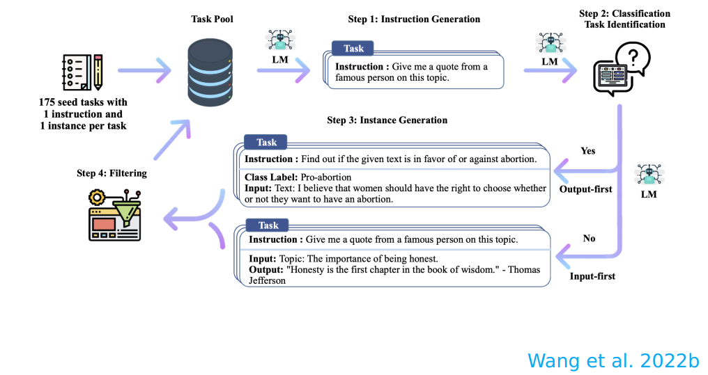
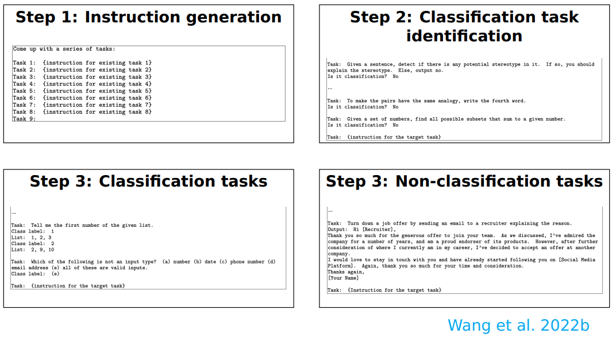
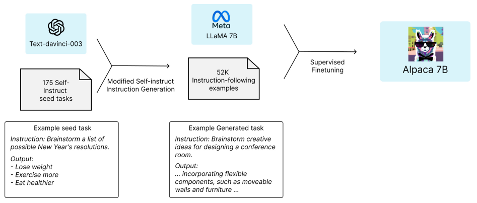
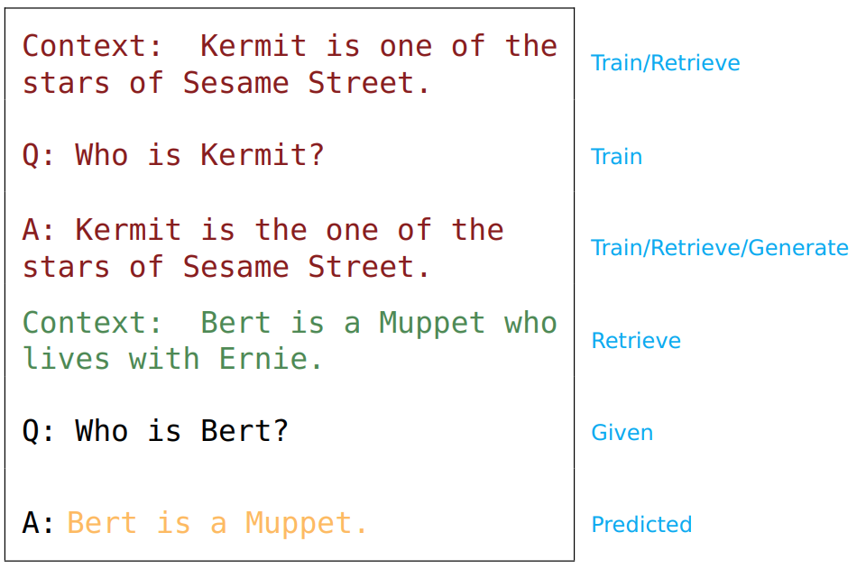
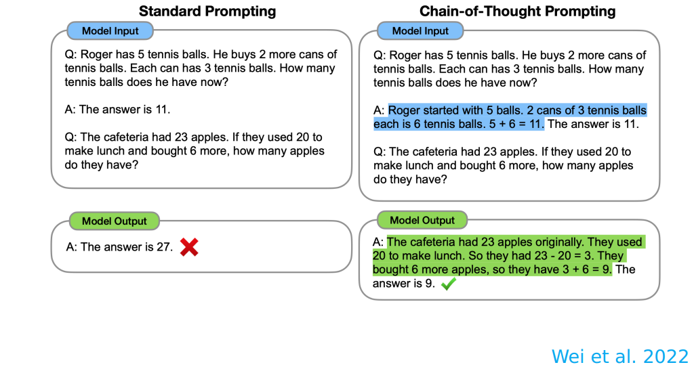
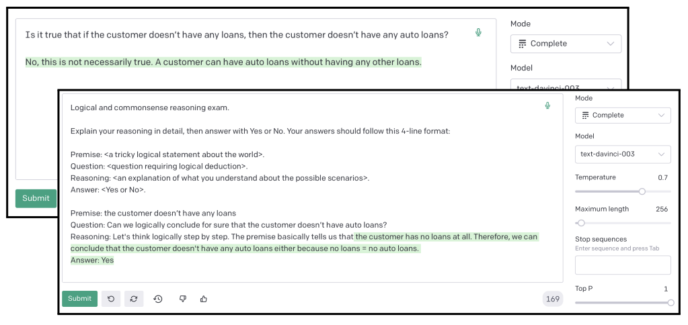
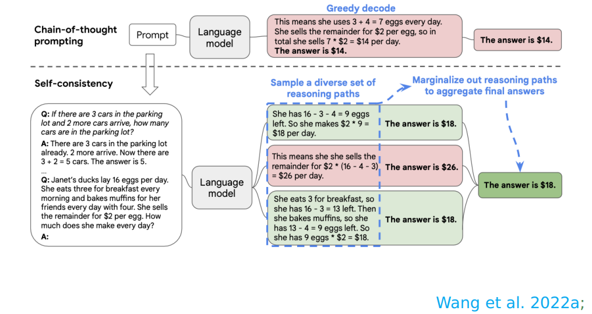
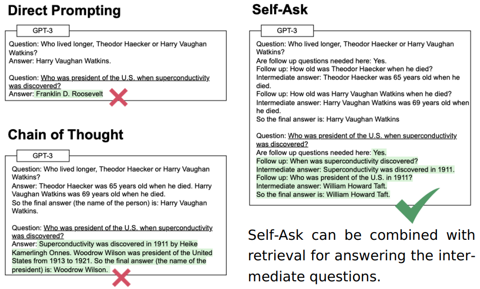

# Stanford XCS224U: Natural Language Understanding
O processamento de linguagem natural (NLP) ou linguística computacional é uma das tecnologias mais importantes da era da informação. As aplicações da NLP estão por toda parte porque as pessoas comunicam quase tudo por meio de uma linguagem: pesquisa na web, publicidade, e-mails, atendimento ao cliente, tradução de idiomas, agentes virtuais, relatórios médicos, política, etc. Na última década, as abordagens de aprendizagem profunda (ou redes neurais) obtiveram desempenho muito alto em muitas tarefas diferentes de NLP, usando modelos neurais únicos de ponta a ponta que não exigem engenharia tradicional de recursos específicos para tarefas. Neste curso, os alunos obterão uma introdução completa às pesquisas de ponta em Deep Learning para NLP. Através de palestras, trabalhos e um projeto final, os alunos aprenderão as habilidades necessárias para projetar, implementar e compreender seus próprios modelos de redes neurais, utilizando o framework [Pytorch](https://pytorch.org/).

O XCS224u tem o curso CS224n como prerequisito. [Background Materials](https://web.stanford.edu/class/cs224u/background.html)

Acesse o cronograma, materiais, recuros e programa do curso [aqui](https://web.stanford.edu/class/cs224u/index.html), e [aqui](https://web.stanford.edu/class/cs224u/background.html)

Playlist com as aulas no [youtube](https://www.youtube.com/playlist?list=PLoROMvodv4rOwvldxftJTmoR3kRcWkJBp)

# Summary
1. [**Intro and Evolution of NLP**](#1-intro-and-evolution-of-nlp)
2. [**Natural Language Understanding**](#2-natural-language-understanding)
   - 2.1. [Contextual Word Representation](#21-contextual-word-representation)
   - 2.2. [Transformer](#22-transformer)
   - 2.3. [Positional Encoding](#23-positional-encoding)
   - 2.4. [GPT (Generative Pre-trained Transformer)](#24-gpt-generative-pre-trained-transformer)
   - 2.5. [BERT (Bidirectional Encoder Representations from Transformers)](#25-bert-bidirectional-encoder-representations-from-transformers)
   - 2.6. [RoBERTa](#26-roberta)
   - 2.7. [ELECTRA](#27-electra)
   - 2.8. [Seq2seq Architectures](#28-seq2seq-architectures)
   - 2.9. [Distillation](#29-distillation)
3. [**Information Retrieval**](#3-information-retrieval)
   - 3.1. [Classical Information Retrieval](#31-classical-information-retrieval)
   - 3.2. [IR Metrics](#32-ir-metrics)
   - 3.3. [Neural IR](#33-neural-ir)
4. [**In-context Learning**](#4-in-context-learning)
   - 4.1. [Core Concepts](#41-core-concepts)
   - 4.2. [Current Movement](#42-current-movement)
   - 4.3. [Techniques and Suggested Methods](#43-techniques-and-suggested-methods)
5. [**Behavioral Evaluation of NLU Models**](#5-behavioral-evaluation-of-nlu-models)
   - 5.1. [Analytical Considerations](#51-analytical-considerations)
   - 5.2. [Compositionality](#52-compositionality)
   - 5.3. [COGS and ReCOGS](#53-cogs-and-recogs)
   - 5.4. [Adversarial Testing](#54-adversarial-testing)
   - 5.5. [Adversarial NLI](#55-adversarial-nli)
   - 5.6. [Dynasent](#56-dynasent)
6. [**Analysis Methods**](#6-analysis-methods)
   - 6.1. [Probing](#61-probing)
   - 6.2. [Feature Attribution](#62-feature-attribution)
   - 6.3. [Causal Abstraction & Interchange Intervention Training (IIT)](#63-causal-abstraction--interchange-intervention-training-iit)
   - 6.4. [Distributed Alignment Search (DAS)](#64-distributed-alignment-search-das)
7. [**Methods and Metrics**](#7-methods-and-metrics)
   - 7.1. [Classifier Metrics](#71-classifier-metrics)
   - 7.2. [Generation Metrics](#72-generation-metrics)
   - 7.3. [Datasets](#73-datasets)
   - 7.4. [Data Organization](#74-data-organization)
   - 7.5. [Model Evaluation](#75-model-evaluation)
8. [**Fantastic Language Models and How to Build Them**](#8-fantastic-language-models-and-how-to-build-them)

## 1. Intro and Evolution of NLP
## 2. Natural Language Understanding
### 2.1. Contextual Word Representation
### 2.2. Transformer
### 2.3. Positional Encoding
### 2.4. GPT (Generative Pre-trained Transformer)
### 2.5. BERT (Bidirectional Encoder Representations from Transformers)
### 2.6. RoBERTa
### 2.7. ELECTRA
### 2.8. Seq2seq Architectures
### 2.9. Distillation

## 3. Information Retrieval
Em Information Retrieval (Recuperação de Informações), "knowledge-intensive tasks" (tarefas intensivas em conhecimento) referem-se a atividades que requerem um entendimento mais profundo e contextual das informações do que simples processamento de texto bruto. Essas tarefas frequentemente envolvem a aplicação de conhecimento prévio, semântica e compreensão mais avançada das relações entre conceitos. 

1. **Question Answering (QA - Resposta a Perguntas):**
   - *Descrição:* Esta tarefa envolve o desenvolvimento de modelos capazes de responder a perguntas formuladas em linguagem natural. O objetivo é compreender a pergunta e fornecer uma resposta precisa.
   - *Exemplo:* Pergunta: "Quem foi o primeiro presidente dos Estados Unidos?" Resposta: "George Washington."

2. **Claim Verification (Verificação de Afirmativas):**
   - *Descrição:* Nesta tarefa, o objetivo é verificar a veracidade de alegações ou afirmações feitas em documentos. Os modelos devem avaliar se uma afirmação é verdadeira, falsa ou não verificável.
   - *Exemplo:* Afirmativa: "O aquecimento global é causado principalmente pela atividade humana." Verificação: verdadeiro.

3. **Commonsense Reasoning (Raciocínio de Senso Comum):**
   - *Descrição:* Envolve a capacidade de raciocinar sobre situações cotidianas usando conhecimento de senso comum. Os modelos precisam inferir conclusões lógicas a partir de informações implícitas.
   - *Exemplo:* Pergunta: "O que acontece quando alguém joga um objeto para cima?" Resposta: "Ele eventualmente cai de volta devido à gravidade."

4. **Long-form Reading Comprehension (Compreensão de Leitura em Longo Formato):**
   - *Descrição:* Similar à leitura de curto formato, mas com documentos mais extensos. Os modelos precisam extrair informações relevantes de textos mais longos.
   - *Exemplo:* Compreender um artigo acadêmico extenso sobre um tópico específico.

5. **Information-Seeking Dialogue (Diálogo em Busca de Informações):**
   - *Descrição:* Esta tarefa envolve a interação em linguagem natural para buscar informações específicas. Os modelos devem entender as consultas do usuário e fornecer respostas relevantes.
   - *Exemplo:* Um usuário pergunta: "Quais são os benefícios para a saúde do consumo de chá verde?" O modelo fornece informações sobre os benefícios do chá verde.

6. **Summarization (Sumarização):**
   - *Descrição:* Envolve condensar informações extensas em um formato mais conciso, mantendo as ideias principais. Pode ser abstrativo (gerando novas frases) ou extrativo (selecionando frases existentes).
   - *Exemplo:* Resumir um artigo de notícias em alguns parágrafos.

7. **Natural Language Inference (Inferência de Linguagem Natural):**
   - *Descrição:* Nesta tarefa, os modelos precisam inferir relações lógicas entre pares de sentenças, determinando se uma sentença é uma implicação, contradição ou neutral em relação à outra.
   - *Exemplo:* Dadas duas sentenças - "O céu é azul" e "Está chovendo" - determinar a relação (por exemplo, contraditório).

Essas tarefas representam desafios significativos em processamento de linguagem natural, e avanços nelas contribuem para a melhoria de sistemas de recuperação de informação.

### 3.1. Classical Information Retrieval
A Recuperação Clássica de Informações (IR) refere-se aos métodos tradicionais e abordagens utilizados para encontrar informações relevantes a partir de grandes conjuntos de dados, geralmente textuais. Essa disciplina é fundamental em sistemas que buscam organizar, armazenar e recuperar informações de maneira eficiente. Aqui estão alguns dos principais conceitos e componentes da Recuperação Clássica de Informações:

1. **Modelo Booleano:**
   - *Descrição:* Baseado na lógica booleana, este modelo trata a informação como sendo representada por conjuntos de termos e utiliza operadores lógicos (AND, OR, NOT) para expressar relações entre esses termos.
   - *Exemplo:* Busca por "informação AND retrieval" para encontrar documentos que contenham ambas as palavras.

2. **Modelo Vetorial:**
   - *Descrição:* Representa documentos e consultas como vetores em espaços multidimensionais. A similaridade entre vetores é usada para classificar a relevância dos documentos em relação à consulta.
   - *Exemplo:* O algoritmo de similaridade cosseno mede a similaridade entre a consulta e um documento.

3. **TF-IDF (Term Frequency-Inverse Document Frequency):**
   - *Descrição:* Uma técnica que avalia a importância de uma palavra em um documento em relação ao seu uso em toda a coleção de documentos. Termos raros e específicos geralmente recebem maior peso.
   - *Exemplo:* Palavras frequentes em um documento, mas raras na coleção, têm pontuações TF-IDF mais altas.

4. **Modelo Probabilístico:**
   - *Descrição:* Utiliza conceitos probabilísticos para calcular a relevância de um documento em relação a uma consulta. O modelo considera a probabilidade de um documento ser relevante ou não dada a consulta.
   - *Exemplo:* O modelo BM25 é um exemplo de modelo probabilístico comumente utilizado.

5. **Recuperação Booleana:**
   - *Descrição:* Método que lida com consultas expressas usando operadores booleanos, onde os resultados são conjuntos de documentos que satisfaçam as condições da consulta.
   - *Exemplo:* Consulta booleana "information AND retrieval" retorna documentos que contenham ambas as palavras.

6. **Índice Invertido:**
   - *Descrição:* Uma estrutura de dados que armazena informações sobre a ocorrência de termos em documentos. Facilita a rápida identificação de documentos relevantes para uma consulta.
   - *Exemplo:* Um índice invertido pode indicar quais documentos contêm a palavra-chave "informação".

7. **Medidas de Avaliação:**
   - *Descrição:* Métodos para avaliar o desempenho dos sistemas de recuperação, incluindo métricas como precisão, revocação e F1-score.
   - *Exemplo:* A precisão mede a proporção de documentos recuperados que são relevantes.

A Recuperação Clássica de Informações estabeleceu os fundamentos para muitos dos desenvolvimentos modernos em motores de busca e sistemas de processamento de linguagem natural, oferecendo uma base sólida para a organização e busca eficiente de informações.

### 3.2. IR Metrics
### 3.3. Neural IR
A Recuperação de Informações Neural refere-se à aplicação de técnicas de redes neurais no contexto da recuperação de informações. Essa abordagem tem ganhado destaque devido à capacidade das redes neurais de aprender representações complexas e contextuais a partir de dados brutos. Aqui estão alguns conceitos e componentes-chave da Recuperação de Informações Neural:

1. **Embedding de Consulta e Documento:**
   - *Descrição:* Representação vetorial densa de consultas e documentos usando técnicas de embedding. Essas representações aprendidas capturam semântica e relações semânticas entre termos.
   - *Exemplo:* Utilização de embeddings de palavras ou subpalavras para representar consultas e documentos.

2. **Modelos de Atenção:**
   - *Descrição:* Modelos que atribuem pesos diferentes a partes específicas da entrada, permitindo que a rede preste mais atenção a certos elementos. São valiosos para lidar com partes importantes de documentos longos.
   - *Exemplo:* O Transformer, um tipo de arquitetura que utiliza mecanismos de atenção, é frequentemente empregado em Recuperação de Informações Neural.

3. **Redes Siamesas:**
   - *Descrição:* Arquiteturas que compartilham parâmetros entre duas redes idênticas. Podem ser usadas para aprender a similaridade entre pares de consultas e documentos.
   - *Exemplo:* Uma rede siamesa pode aprender a medir a similaridade entre a consulta e o documento.

4. **Aprendizado por Transferência:**
   - *Descrição:* Utilização de modelos pré-treinados em grandes conjuntos de dados para tarefas específicas, seguido por ajustes finos em conjuntos de dados menores e mais específicos.
   - *Exemplo:* Um modelo pré-treinado em grandes corpora pode ser ajustado para tarefas específicas de recuperação de informações.

5. **Recuperação de Passagens (Passage Retrieval):**
   - *Descrição:* Em vez de recuperar documentos inteiros, esse enfoque visa identificar passagens relevantes dentro de documentos. Reduz o espaço de busca e foca na informação mais pertinente.
   - *Exemplo:* Recuperação de passagens relevantes em artigos científicos para uma determinada consulta.

6. **Redes Recorrentes e LSTM (Long Short-Term Memory):**
   - *Descrição:* Arquiteturas que mantêm uma memória de longo prazo, permitindo a captura de dependências temporais em dados sequenciais, como texto.
   - *Exemplo:* Uma LSTM pode ser usada para modelar a dependência de palavras em uma sequência de consulta.

7. **Avaliação por Embeddings:**
   - *Descrição:* Medidas de avaliação específicas para avaliar a qualidade dos embeddings gerados pelos modelos, como MAP (Mean Average Precision) e NDCG (Normalized Discounted Cumulative Gain).
   - *Exemplo:* Medir a precisão média da ordem de documentos recuperados pela relevância.
8. **Dense Passage Retriever (DPR):**
   - Descrição: O DPR é uma técnica específica de recuperação de passagens que utiliza uma abordagem densa para representar e recuperar passagens relevantes. Em vez de depender apenas de embeddings de palavras ou subpalavras, o DPR emprega embeddings densos para representar
   passagens inteiras, tornando-o eficiente para a recuperação de informações em grandes conjuntos de dados. É escalável mas limitado nas interações entre consulta (query) e documentos
   - Exemplo: Utilizando embeddings densos para representar passagens em artigos científicos, facilitando a recuperação eficiente de passagens relevantes para uma consulta.

9. **Cross-Encoders:**
   - Descrição: Os Cross-Encoders são arquiteturas que processam simultaneamente a consulta e o documento em uma única etapa, permitindo que a rede capture interações complexas entre ambos. Isso é diferente dos modelos que primeiro geram embeddings separados para a consulta e o documento e, em seguida, calculam a similaridade. Isso pode ser feito a partir do fine tuning do BERT, que acaba causando falta de escalabildiade.
   - Exemplo: Um Cross-Encoder processa simultaneamente uma consulta e um documento, gerando uma pontuação de similaridade diretamente.   

10. ColBERT (Contextualized Late Interaction over BERT):
   - Descrição: ColBERT é um modelo projetado para a recuperação eficiente de documentos em grandes coleções, aproveitando a eficácia do BERT (Bidirectional Encoder Representations from Transformers) para representações contextuais. Ele introduz uma estratégia de interação tardia, onde a interação entre a consulta e o documento é realizada em um estágio posterior, permitindo uma recuperação mais rápida. A inclusão do ColBERT destaca outra inovação notável na Recuperação de Informações Neurais, mostrando como as estratégias de interação e a utilização eficiente de modelos pré-treinados como o BERT podem contribuir para sistemas mais eficazes em ambientes de recuperação de informações.   
   - Representações Contextuais: Utiliza embeddings contextuais do BERT para capturar melhor o significado em contexto de consultas e documentos.
   - Interação Tardia: Diferentemente de outros modelos, adia a interação entre consulta e documento, economizando recursos computacionais durante a fase de recuperação inicial.
   - Estrutura Eficiente: Projetado para escalabilidade, permitindo uma recuperação eficaz em grandes conjuntos de dados.
   - Exemplo: ColBERT pode ser aplicado em motores de busca para recuperar rapidamente documentos relevantes em grandes coleções, utilizando embeddings contextuais para melhorar a compreensão do significado em contexto.

A Recuperação de Informações Neural busca superar as limitações dos métodos clássicos, permitindo uma representação mais rica e adaptativa das informações, especialmente em ambientes de grande escala e complexidade. Essas abordagens têm sido aplicadas com sucesso em sistemas modernos de motores de busca e recomendação.

## 4. In-context Learning
"Retrieval-augmented in-context learning" (Aprendizado em Contexto com Recuperação Aprimorada) refere-se a uma abordagem em aprendizado de máquina onde o processo de aprendizado é enriquecido ao incorporar mecanismos de recuperação de informações durante a fase de treinamento do modelo. Essa técnica visa melhorar a capacidade do modelo de compreender e utilizar informações relevantes do contexto, muitas vezes provenientes de grandes conjuntos de dados externos.

1. **Aprendizado em Contexto:**
   - *Descrição:* Refere-se ao treinamento de modelos em ambientes nos quais o contexto é crucial para a compreensão e geração de respostas. Esses modelos geralmente são projetados para tarefas que exigem compreensão de linguagem natural em contextos específicos.

2. **Recuperação Aprimorada:**
   - *Descrição:* Envolve a incorporação de mecanismos de recuperação de informações durante o treinamento do modelo. Isso pode incluir o acesso a grandes bases de dados externas para recuperar informações relevantes durante o processo de aprendizado.

3. **Retrieval-augmented Embeddings:**
   - *Descrição:* Os embeddings (representações vetoriais) usados pelo modelo são aprimorados por meio de informações recuperadas durante o treinamento. Isso permite que o modelo tenha acesso a conhecimentos externos e contextos mais amplos.

4. **Interação com Dados Externos:**
   - *Descrição:* Durante o treinamento, o modelo é capaz de interagir com conjuntos de dados externos, recuperando informações relevantes para aprimorar seu entendimento do contexto em que está operando.

5. **Melhoria da Generalização:**
   - *Descrição:* Espera-se que a incorporação de informações recuperadas durante o treinamento melhore a capacidade do modelo de generalizar para diferentes contextos e condições não vistas durante o treinamento.

6. **Aplicações em Processamento de Linguagem Natural (NLP) e Diálogo:**
   - *Descrição:* Essa abordagem é frequentemente aplicada em tarefas de NLP e diálogo, onde a compreensão do contexto é crucial. Modelos treinados dessa maneira podem ter um desempenho aprimorado em entender e gerar respostas relevantes.

Em resumo, o "retrieval-augmented in-context learning" é uma estratégia que visa fortalecer modelos de aprendizado de máquina, permitindo que eles incorporem informações relevantes de contextos mais amplos durante o processo de treinamento. Isso é particularmente útil em tarefas que exigem uma compreensão profunda do contexto para fornecer respostas precisas e relevantes.

**Origens:***
- **ChomskyBot:** O termo "ChomskyBot" refere-se à influência da teoria linguística de Noam Chomsky nas origens do aprendizado "in context". Chomsky introduziu a ideia de que a compreensão da linguagem envolve uma gramática inata, e isso influenciou pesquisas na criação de modelos que consideram o contexto linguístico ao aprender e compreender informações.

- **n-gram LMs (Modelos de Linguagem n-gram):** Modelos de linguagem n-gram são fundamentais para o entendimento de sequências de palavras. A origem do aprendizado "in context" inclui o desenvolvimento e aprimoramento de modelos n-gram, que consideram a probabilidade de uma palavra dada a sequência anterior de n-1 palavras. Embora simples, esses modelos introduziram a ideia de levar em conta o contexto local para a compreensão da linguagem.

- **decaNLP:**  O decaNLP é um benchmark multitarfa em processamento de linguagem natural que inclui uma variedade de tarefas, como tradução automática, resolução de coreferência, e muitas outras. O desenvolvimento do decaNLP influenciou a pesquisa em modelos que podem realizar várias tarefas em contextos diversos, promovendo a ideia de aprendizado "in context" para lidar com a complexidade do processamento de linguagem natural.

- **Tentativas de Prompt-based Experiments com GPT (Radford et al. 2019):**  O trabalho de Radford et al. em 2019, referenciado aqui, faz parte das origens do aprendizado "in context". As tentativas de experimentos baseados em prompt com o GPT (Generative Pre-trained Transformer) envolvem o uso de modelos de linguagem pré-treinados, como GPT, para responder a perguntas ou completar prompts. Isso destaca a busca por modelos que possam entender e responder a consultas específicas em contextos variados.

O aprendizado "in context" tem raízes em teorias linguísticas, modelos de linguagem tradicionais, benchmarks multitarfa e experimentos com modelos pré-treinados. Essas origens refletem a evolução contínua da pesquisa em processamento de linguagem natural em direção à compreensão mais profunda e contextual da linguagem.

### 4.1. Core Concepts
- **In-context learning**: É um método de "prompt engineering" em que a task é demonstrada e inputada junto do prompt. Um modelo de linguagem congelado (frozen) que performa uma tarefa apenas condicionando um __prompt__. Sendo congelado, não existem atualização dos gradientes, e o unico aprendizado se dá pelo input textual, que põe o modelo em um estado temporário. Refere-se a abordagens de aprendizado de máquina que consideram e utilizam informações contextuais ao realizar tarefas específicas. Em contextos de processamento de linguagem natural, isso implica compreender o significado das palavras ou frases em relação ao contexto mais amplo em que estão inseridas. Contexto é a informação circundante que afeta a interpretação de uma palavra, frase ou documento. O contexto pode ser local (próximo imediatamente) ou global (abrangendo um conjunto maior de informações).

- **Few-shot in-context learning**: O prompt inclui exemplos do comportamento esperado, e nenhum exemplo do comportamento esperado visto no treinamento.

- **Zero-shot in-context learning**: O prompt não inclui exemplos do comportamento esperado, e nenhum exemplo do comportamento esperado visto no treinamento

- **Autoregressive Training with Teacher Forcing**: O treinamento autoregressivo com forçamento de professor (autoregressive training with teacher forcing) é uma técnica usada no treinamento de modelos de sequência, especialmente em modelos gerativos de linguagem, como os baseados em arquiteturas de Transformers.

1. **Treinamento Autoregressivo:**
   - No contexto de modelos de linguagem, **um modelo é considerado autoregressivo quando a previsão de cada elemento em uma sequência depende dos elementos anteriores da sequência**. Em outras palavras, o modelo gera um elemento por vez, levando em consideração os elementos já gerados.

2. **Forçamento de Professor (Teacher Forcing):**
   - O forçamento de professor é uma técnica durante o treinamento em que, ao ensinar um modelo a gerar sequências, você força o modelo a usar como entrada os elementos verdadeiros (ou seja, corretos) da sequência durante o treinamento, em vez de usar as previsões geradas pelo próprio modelo. Isso é frequentemente utilizado em modelos autoregressivos para acelerar o treinamento e melhorar a estabilidade inicial do modelo.

Portanto, no "treinamento autoregressivo com forçamento de professor", o modelo é treinado para gerar sequências elemento por elemento, onde cada elemento é condicional aos elementos anteriores, e durante o treinamento, a sequência verdadeira (fornecida pelo "professor") é usada como entrada para o modelo. Essa abordagem ajuda a acelerar a convergência do modelo durante o treinamento, permitindo que ele aprenda mais rapidamente a estrutura e a distribuição dos dados sequenciais. No entanto, durante a geração real (quando o modelo é usado para criar sequências), o forçamento de professor não é utilizado, e o modelo gera cada elemento com base nas previsões anteriores.

- **Generation**: Os modelos de linguagem congelados (frozen language models) são modelos pré-treinados que tiveram seus parâmetros fixados e não estão mais sendo atualizados durante o treinamento adicional. Quando se fala em "gerar novos dados" com esses modelos, geralmente está se referindo à capacidade desses modelos de gerar sequências de texto com base no conhecimento que adquiriram durante o treinamento prévio.

A geração de novos dados por modelos de linguagem congelados ocorre por meio de amostragem ou feixe de busca (beam search):

1. **Amostragem (Sampling):**
   - Nesse método, o modelo gera cada palavra ou token da sequência de forma estocástica, ou seja, de maneira probabilística. Cada token é amostrado de acordo com as probabilidades preditas pelo modelo. Isso permite uma certa dose de aleatoriedade na geração, resultando em diferentes possíveis continuations para uma dada entrada.

2. **Feixe de Busca (Beam Search):**
   - No método de feixe de busca, o modelo gera várias sequências simultaneamente e mantém um conjunto de "feixes" (beams) das sequências mais prováveis. Em cada passo, o modelo avalia as probabilidades das palavras seguintes para cada feixe, selecionando as melhores opções. Isso ajuda a produzir sequências mais coerentes e fluentes, uma vez que considera uma busca mais ampla no espaço de possíveis continuations.

É importante notar que, embora os modelos de linguagem congelados possam gerar novas sequências de texto, a qualidade e a relevância dessas sequências dependerão da qualidade do treinamento prévio do modelo. Além disso, a aleatoriedade introduzida pela amostragem ou as escolhas determinísticas do feixe de busca podem resultar em variações nas sequências geradas a cada vez que o modelo é usado para geração.

### 4.2. Current Movement
#### Dataset used for self-supervision
1. OpenBookCorpus (Bandy and Vincent 2021): https://huggingface.co/datasets/bookcorpusopen
2. The Pile (Gao et al. 2020): https://pile.eleuther.ai
3. Big Science Data (Laurençon et al. 2022): https://huggingface.co/bigscience-data
4. Wikipedia processing: https://github.com/attardi/wikiextractor
5. Pushshift Reddit Data (Baumgartner et al. 2020): https://files.pushshift.io/reddit/
6. Colossal Clean Crawled Corpus (C4; Dodge et al. 2021): https://github.com/allenai/allennlp/discussions/5056

#### Dataset used for instruction fine-tuning
- Não sabemos muito sobre o que os laboratórios industriais
estão fazendo aqui.
- Podemos inferir que eles estão pagando muitas pessoas para
gerar dados de instrução.
- Também podemos inferir que eles estão usando seus próprios
modelos para gerar exemplos e julgar
entre exemplos.
- O Stanford Human Preferences Dataset (SHP) (SHP) é um
recurso para ajuste de instrução naturalista (naturalistic fine-tuning): https://huggingface.co/datasets/stanfordnlp/SHP

#### Self-instruct

Self-istruct (learning) é uma técnica para melhorar a performace do modelo utilizando modelos. Nesse caso, criando mais tasks para fazer o instruct fine tuning. Nesse pipeline exemplo, um conjunto de tasks escrita por humanos é armazenada num pool, em que no primeiro passo, o modelo de linguagem cria novas instruções via in-context learning, no passo seguinte a nova instrução é inputada novamente no modelo de linguagem, com um novo prompt, para decidir se a instrução é uma tarefa de classificação ou não. Esse novo par de input/output é usado para o aprendizado supervisionado seguinte. 

Essa abordagem foi utilizada no modelo Alpaca, possibilitando a especialização do modelo, num tamanho consideravelmente menor e mantendo a performace comparando com os modelos anteriores.

### 4.3. Techniques and Suggested Methods
#### Demonstrations
Demonstration é uma técnica de in-context learning em que se cria recursivamente contexto, pergunta e resposta para se ter respostas corretas.

#### Choosing demonstrations
- Podem ser escolhidos aleatoriamente a partir dos dados disponíveis.
- Escolhidos com base no relacionamento com o exemplo alvo.
  - Geração: Recuperada com base na similaridade com a entrada alvo.
  - Classificação: Escolhido para ajudar o modelo a determinar implicitamente o tipo de entrada de destino.
- Filtrando para aqueles que atendem a critérios específicos:
  - Geração: A evidência contém a saída.
  - Geração: O LM prevê a saída correta.
  - Classificação: Todos os rótulos representados.
- Amostrado e reescrito pelo LM:
  - Sintetize múltiplas demonstrações iniciais em demonstrações individuais.
  - Altere o estilo ou a formatação para corresponder ao alvo.

**Seu prompt pode deve conter substrings que foram geradas por um prompt diferente do seu LM.**

#### Chain of Thought
Chain of Thought é uma técnica que explica explicitamente o passo a passo do **raciocínio** para responder coisas complexas.

#### Generic step-by-step with instruction
É parecido com Chain of Thought, mas aqui, o modelo é instruído a seguir um passo a passo para chegar a uma resposta.

### Self-Consistency
Self-Consistency lembra random forest, no sentido de que são gerados um conjunto de respostas seguindo um raciocínio (ex. chain of tought), e em seguida os caminhos de raciocínio (reasoning paths) são "marginalizados", agregando e selecionando a resposta mais frequente.

 

#### Self-Ask
Através de demonstrações, direcionar o modelo decompor o raciocínio em partes menores em um conjunto de diferentes perguntas para buscar a resposta. Assim, chegando iterativamente na resposta.

 

## 5. Behavioral Evaluation of NLU Models
### 5.1. Analytical Considerations
### 5.2. Compositionality
### 5.3. COGS and ReCOGS
### 5.4. Adversarial Testing
### 5.5. Adversarial NLI
### 5.6. Dynasent

## 6. Analysis Methods
### 6.1. Probing
### 6.2. Feature Attribution
### 6.3. Causal Abstraction & Interchange Intervention Training (IIT)
### 6.4. Distributed Alignment Search (DAS)

## 7. Methods and Metrics
### 7.1. Classifier Metrics
### 7.2. Generation Metrics
### 7.3. Datasets
### 7.4. Data Organization
### 7.5. Model Evaluation

## 8. Fantastic Language Models and How to Build Them
