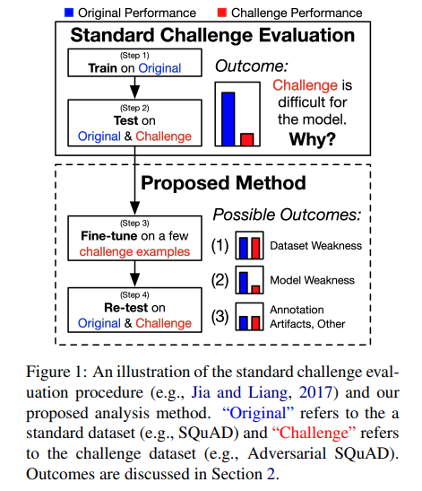
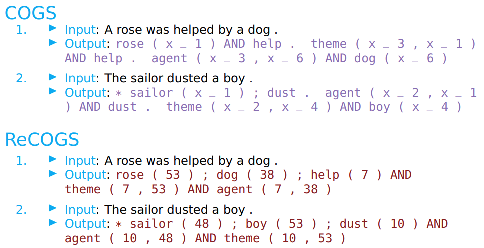
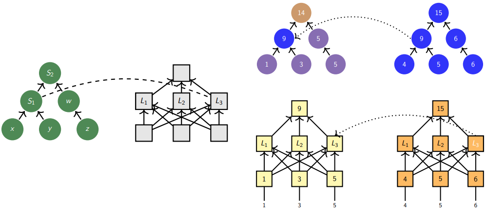
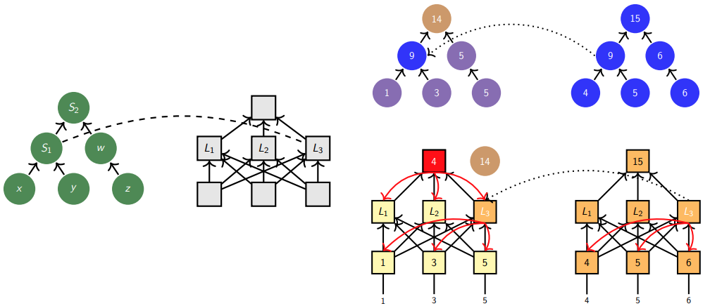

# Stanford XCS224U: Natural Language Understanding
O processamento de linguagem natural (NLP) ou linguística computacional é uma das tecnologias mais importantes da era da informação. As aplicações da NLP estão por toda parte porque as pessoas comunicam quase tudo por meio de uma linguagem: pesquisa na web, publicidade, e-mails, atendimento ao cliente, tradução de idiomas, agentes virtuais, relatórios médicos, política, etc. Na última década, as abordagens de aprendizagem profunda (ou redes neurais) obtiveram desempenho muito alto em muitas tarefas diferentes de NLP, usando modelos neurais únicos de ponta a ponta que não exigem engenharia tradicional de recursos específicos para tarefas. Neste curso, os alunos obterão uma introdução completa às pesquisas de ponta em Deep Learning para NLP. Através de palestras, trabalhos e um projeto final, os alunos aprenderão as habilidades necessárias para projetar, implementar e compreender seus próprios modelos de redes neurais, utilizando o framework [Pytorch](https://pytorch.org/).

O XCS224u tem o curso CS224n como prerequisito. [Background Materials](https://web.stanford.edu/class/cs224u/background.html)

Acesse o cronograma, materiais, recuros e programa do curso [aqui](https://web.stanford.edu/class/cs224u/index.html), e [aqui](https://web.stanford.edu/class/cs224u/background.html)

Playlist com as aulas no [youtube](https://www.youtube.com/playlist?list=PLoROMvodv4rOwvldxftJTmoR3kRcWkJBp)

# Summary
1. [**Intro and Evolution of NLP**](#1-intro-and-evolution-of-nlp)
2. [**Natural Language Understanding**](#2-natural-language-understanding)
   - 2.1. [Contextual Word Representation](#21-contextual-word-representation)
   - 2.2. [Transformer](#22-transformer)
   - 2.3. [Positional Encoding](#23-positional-encoding)
   - 2.4. [GPT (Generative Pre-trained Transformer)](#24-gpt-generative-pre-trained-transformer)
   - 2.5. [BERT (Bidirectional Encoder Representations from Transformers)](#25-bert-bidirectional-encoder-representations-from-transformers)
   - 2.6. [RoBERTa](#26-roberta)
   - 2.7. [ELECTRA](#27-electra)
   - 2.8. [Seq2seq Architectures](#28-seq2seq-architectures)
   - 2.9. [Distillation](#29-distillation)
3. [**Information Retrieval**](#3-information-retrieval)
   - 3.1. [Classical Information Retrieval](#31-classical-information-retrieval)
   - 3.2. [IR Metrics](#32-ir-metrics)
   - 3.3. [Neural IR](#33-neural-ir)
4. [**In-context Learning**](#4-in-context-learning)
   - 4.1. [Core Concepts](#41-core-concepts)
   - 4.2. [Current Movement](#42-current-movement)
   - 4.3. [Techniques and Suggested Methods](#43-techniques-and-suggested-methods)
5. [**Behavioral Evaluation of NLU Models**](#5-behavioral-evaluation-of-nlu-models)
   - 5.1. [Analytical Considerations](#51-analytical-considerations)
   - 5.2. [Compositionality](#52-compositionality)
   - 5.3. [COGS and ReCOGS](#53-cogs-and-recogs)
   - 5.4. [Adversarial Testing](#54-adversarial-testing)
   - 5.5. [Adversarial NLI](#55-adversarial-nli)
   - 5.6. [Dynasent](#56-dynasent)
6. [**Analysis Methods**](#6-analysis-methods)
   - 6.1. [Probing](#61-probing)
   - 6.2. [Feature Attribution](#62-feature-attribution)
   - 6.3. [Causal Abstraction & Interchange Intervention Training (IIT)](#63-causal-abstraction--interchange-intervention-training-iit)
   - 6.4. [Distributed Alignment Search (DAS)](#64-distributed-alignment-search-das)
7. [**Methods and Metrics**](#7-methods-and-metrics)
   - 7.1. [Classifier Metrics](#71-classifier-metrics)
   - 7.2. [Generation Metrics](#72-generation-metrics)
   - 7.3. [Datasets](#73-datasets)
   - 7.4. [Data Organization](#74-data-organization)
   - 7.5. [Model Evaluation](#75-model-evaluation)
8. [**Fantastic Language Models and How to Build Them**](#8-fantastic-language-models-and-how-to-build-them)

## 1. Intro and Evolution of NLP
## 2. Natural Language Understanding
### 2.1. Contextual Word Representation
### 2.2. Transformer
### 2.3. Positional Encoding
### 2.4. GPT (Generative Pre-trained Transformer)
### 2.5. BERT (Bidirectional Encoder Representations from Transformers)
### 2.6. RoBERTa
### 2.7. ELECTRA
### 2.8. Seq2seq Architectures
### 2.9. Distillation

## 3. Information Retrieval
Em Information Retrieval (Recuperação de Informações), "knowledge-intensive tasks" (tarefas intensivas em conhecimento) referem-se a atividades que requerem um entendimento mais profundo e contextual das informações do que simples processamento de texto bruto. Essas tarefas frequentemente envolvem a aplicação de conhecimento prévio, semântica e compreensão mais avançada das relações entre conceitos. 

1. **Question Answering (QA - Resposta a Perguntas):**
   - *Descrição:* Esta tarefa envolve o desenvolvimento de modelos capazes de responder a perguntas formuladas em linguagem natural. O objetivo é compreender a pergunta e fornecer uma resposta precisa.
   - *Exemplo:* Pergunta: "Quem foi o primeiro presidente dos Estados Unidos?" Resposta: "George Washington."

2. **Claim Verification (Verificação de Afirmativas):**
   - *Descrição:* Nesta tarefa, o objetivo é verificar a veracidade de alegações ou afirmações feitas em documentos. Os modelos devem avaliar se uma afirmação é verdadeira, falsa ou não verificável.
   - *Exemplo:* Afirmativa: "O aquecimento global é causado principalmente pela atividade humana." Verificação: verdadeiro.

3. **Commonsense Reasoning (Raciocínio de Senso Comum):**
   - *Descrição:* Envolve a capacidade de raciocinar sobre situações cotidianas usando conhecimento de senso comum. Os modelos precisam inferir conclusões lógicas a partir de informações implícitas.
   - *Exemplo:* Pergunta: "O que acontece quando alguém joga um objeto para cima?" Resposta: "Ele eventualmente cai de volta devido à gravidade."

4. **Long-form Reading Comprehension (Compreensão de Leitura em Longo Formato):**
   - *Descrição:* Similar à leitura de curto formato, mas com documentos mais extensos. Os modelos precisam extrair informações relevantes de textos mais longos.
   - *Exemplo:* Compreender um artigo acadêmico extenso sobre um tópico específico.

5. **Information-Seeking Dialogue (Diálogo em Busca de Informações):**
   - *Descrição:* Esta tarefa envolve a interação em linguagem natural para buscar informações específicas. Os modelos devem entender as consultas do usuário e fornecer respostas relevantes.
   - *Exemplo:* Um usuário pergunta: "Quais são os benefícios para a saúde do consumo de chá verde?" O modelo fornece informações sobre os benefícios do chá verde.

6. **Summarization (Sumarização):**
   - *Descrição:* Envolve condensar informações extensas em um formato mais conciso, mantendo as ideias principais. Pode ser abstrativo (gerando novas frases) ou extrativo (selecionando frases existentes).
   - *Exemplo:* Resumir um artigo de notícias em alguns parágrafos.

7. **Natural Language Inference (Inferência de Linguagem Natural):**
   - *Descrição:* Nesta tarefa, os modelos precisam inferir relações lógicas entre pares de sentenças, determinando se uma sentença é uma implicação, contradição ou neutral em relação à outra.
   - *Exemplo:* Dadas duas sentenças - "O céu é azul" e "Está chovendo" - determinar a relação (por exemplo, contraditório).

Essas tarefas representam desafios significativos em processamento de linguagem natural, e avanços nelas contribuem para a melhoria de sistemas de recuperação de informação.

### 3.1. Classical Information Retrieval
A Recuperação Clássica de Informações (IR) refere-se aos métodos tradicionais e abordagens utilizados para encontrar informações relevantes a partir de grandes conjuntos de dados, geralmente textuais. Essa disciplina é fundamental em sistemas que buscam organizar, armazenar e recuperar informações de maneira eficiente. Aqui estão alguns dos principais conceitos e componentes da Recuperação Clássica de Informações:

1. **Modelo Booleano:**
   - *Descrição:* Baseado na lógica booleana, este modelo trata a informação como sendo representada por conjuntos de termos e utiliza operadores lógicos (AND, OR, NOT) para expressar relações entre esses termos.
   - *Exemplo:* Busca por "informação AND retrieval" para encontrar documentos que contenham ambas as palavras.

2. **Modelo Vetorial:**
   - *Descrição:* Representa documentos e consultas como vetores em espaços multidimensionais. A similaridade entre vetores é usada para classificar a relevância dos documentos em relação à consulta.
   - *Exemplo:* O algoritmo de similaridade cosseno mede a similaridade entre a consulta e um documento.

3. **TF-IDF (Term Frequency-Inverse Document Frequency):**
   - *Descrição:* Uma técnica que avalia a importância de uma palavra em um documento em relação ao seu uso em toda a coleção de documentos. Termos raros e específicos geralmente recebem maior peso.
   - *Exemplo:* Palavras frequentes em um documento, mas raras na coleção, têm pontuações TF-IDF mais altas.

4. **Modelo Probabilístico:**
   - *Descrição:* Utiliza conceitos probabilísticos para calcular a relevância de um documento em relação a uma consulta. O modelo considera a probabilidade de um documento ser relevante ou não dada a consulta.
   - *Exemplo:* O modelo BM25 é um exemplo de modelo probabilístico comumente utilizado.

5. **Recuperação Booleana:**
   - *Descrição:* Método que lida com consultas expressas usando operadores booleanos, onde os resultados são conjuntos de documentos que satisfaçam as condições da consulta.
   - *Exemplo:* Consulta booleana "information AND retrieval" retorna documentos que contenham ambas as palavras.

6. **Índice Invertido:**
   - *Descrição:* Uma estrutura de dados que armazena informações sobre a ocorrência de termos em documentos. Facilita a rápida identificação de documentos relevantes para uma consulta.
   - *Exemplo:* Um índice invertido pode indicar quais documentos contêm a palavra-chave "informação".

7. **Medidas de Avaliação:**
   - *Descrição:* Métodos para avaliar o desempenho dos sistemas de recuperação, incluindo métricas como precisão, revocação e F1-score.
   - *Exemplo:* A precisão mede a proporção de documentos recuperados que são relevantes.

A Recuperação Clássica de Informações estabeleceu os fundamentos para muitos dos desenvolvimentos modernos em motores de busca e sistemas de processamento de linguagem natural, oferecendo uma base sólida para a organização e busca eficiente de informações.

### 3.2. IR Metrics
### 3.3. Neural IR
A Recuperação de Informações Neural refere-se à aplicação de técnicas de redes neurais no contexto da recuperação de informações. Essa abordagem tem ganhado destaque devido à capacidade das redes neurais de aprender representações complexas e contextuais a partir de dados brutos. Aqui estão alguns conceitos e componentes-chave da Recuperação de Informações Neural:

1. **Embedding de Consulta e Documento:**
   - *Descrição:* Representação vetorial densa de consultas e documentos usando técnicas de embedding. Essas representações aprendidas capturam semântica e relações semânticas entre termos.
   - *Exemplo:* Utilização de embeddings de palavras ou subpalavras para representar consultas e documentos.

2. **Modelos de Atenção:**
   - *Descrição:* Modelos que atribuem pesos diferentes a partes específicas da entrada, permitindo que a rede preste mais atenção a certos elementos. São valiosos para lidar com partes importantes de documentos longos.
   - *Exemplo:* O Transformer, um tipo de arquitetura que utiliza mecanismos de atenção, é frequentemente empregado em Recuperação de Informações Neural.

3. **Redes Siamesas:**
   - *Descrição:* Arquiteturas que compartilham parâmetros entre duas redes idênticas. Podem ser usadas para aprender a similaridade entre pares de consultas e documentos.
   - *Exemplo:* Uma rede siamesa pode aprender a medir a similaridade entre a consulta e o documento.

4. **Aprendizado por Transferência:**
   - *Descrição:* Utilização de modelos pré-treinados em grandes conjuntos de dados para tarefas específicas, seguido por ajustes finos em conjuntos de dados menores e mais específicos.
   - *Exemplo:* Um modelo pré-treinado em grandes corpora pode ser ajustado para tarefas específicas de recuperação de informações.

5. **Recuperação de Passagens (Passage Retrieval):**
   - *Descrição:* Em vez de recuperar documentos inteiros, esse enfoque visa identificar passagens relevantes dentro de documentos. Reduz o espaço de busca e foca na informação mais pertinente.
   - *Exemplo:* Recuperação de passagens relevantes em artigos científicos para uma determinada consulta.

6. **Redes Recorrentes e LSTM (Long Short-Term Memory):**
   - *Descrição:* Arquiteturas que mantêm uma memória de longo prazo, permitindo a captura de dependências temporais em dados sequenciais, como texto.
   - *Exemplo:* Uma LSTM pode ser usada para modelar a dependência de palavras em uma sequência de consulta.

7. **Avaliação por Embeddings:**
   - *Descrição:* Medidas de avaliação específicas para avaliar a qualidade dos embeddings gerados pelos modelos, como MAP (Mean Average Precision) e NDCG (Normalized Discounted Cumulative Gain).
   - *Exemplo:* Medir a precisão média da ordem de documentos recuperados pela relevância.
8. **Dense Passage Retriever (DPR):**
   - Descrição: O DPR é uma técnica específica de recuperação de passagens que utiliza uma abordagem densa para representar e recuperar passagens relevantes. Em vez de depender apenas de embeddings de palavras ou subpalavras, o DPR emprega embeddings densos para representar
   passagens inteiras, tornando-o eficiente para a recuperação de informações em grandes conjuntos de dados. É escalável mas limitado nas interações entre consulta (query) e documentos
   - Exemplo: Utilizando embeddings densos para representar passagens em artigos científicos, facilitando a recuperação eficiente de passagens relevantes para uma consulta.

9. **Cross-Encoders:**
   - Descrição: Os Cross-Encoders são arquiteturas que processam simultaneamente a consulta e o documento em uma única etapa, permitindo que a rede capture interações complexas entre ambos. Isso é diferente dos modelos que primeiro geram embeddings separados para a consulta e o documento e, em seguida, calculam a similaridade. Isso pode ser feito a partir do fine tuning do BERT, que acaba causando falta de escalabildiade.
   - Exemplo: Um Cross-Encoder processa simultaneamente uma consulta e um documento, gerando uma pontuação de similaridade diretamente.   

10. ColBERT (Contextualized Late Interaction over BERT):
   - Descrição: ColBERT é um modelo projetado para a recuperação eficiente de documentos em grandes coleções, aproveitando a eficácia do BERT (Bidirectional Encoder Representations from Transformers) para representações contextuais. Ele introduz uma estratégia de interação tardia, onde a interação entre a consulta e o documento é realizada em um estágio posterior, permitindo uma recuperação mais rápida. A inclusão do ColBERT destaca outra inovação notável na Recuperação de Informações Neurais, mostrando como as estratégias de interação e a utilização eficiente de modelos pré-treinados como o BERT podem contribuir para sistemas mais eficazes em ambientes de recuperação de informações.   
   - Representações Contextuais: Utiliza embeddings contextuais do BERT para capturar melhor o significado em contexto de consultas e documentos.
   - Interação Tardia: Diferentemente de outros modelos, adia a interação entre consulta e documento, economizando recursos computacionais durante a fase de recuperação inicial.
   - Estrutura Eficiente: Projetado para escalabilidade, permitindo uma recuperação eficaz em grandes conjuntos de dados.
   - Exemplo: ColBERT pode ser aplicado em motores de busca para recuperar rapidamente documentos relevantes em grandes coleções, utilizando embeddings contextuais para melhorar a compreensão do significado em contexto.

A Recuperação de Informações Neural busca superar as limitações dos métodos clássicos, permitindo uma representação mais rica e adaptativa das informações, especialmente em ambientes de grande escala e complexidade. Essas abordagens têm sido aplicadas com sucesso em sistemas modernos de motores de busca e recomendação.

## 4. In-context Learning
"Retrieval-augmented in-context learning" (Aprendizado em Contexto com Recuperação Aprimorada) refere-se a uma abordagem em aprendizado de máquina onde o processo de aprendizado é enriquecido ao incorporar mecanismos de recuperação de informações durante a fase de treinamento do modelo. Essa técnica visa melhorar a capacidade do modelo de compreender e utilizar informações relevantes do contexto, muitas vezes provenientes de grandes conjuntos de dados externos.

1. **Aprendizado em Contexto:**
   - *Descrição:* Refere-se ao treinamento de modelos em ambientes nos quais o contexto é crucial para a compreensão e geração de respostas. Esses modelos geralmente são projetados para tarefas que exigem compreensão de linguagem natural em contextos específicos.

2. **Recuperação Aprimorada:**
   - *Descrição:* Envolve a incorporação de mecanismos de recuperação de informações durante o treinamento do modelo. Isso pode incluir o acesso a grandes bases de dados externas para recuperar informações relevantes durante o processo de aprendizado.

3. **Retrieval-augmented Embeddings:**
   - *Descrição:* Os embeddings (representações vetoriais) usados pelo modelo são aprimorados por meio de informações recuperadas durante o treinamento. Isso permite que o modelo tenha acesso a conhecimentos externos e contextos mais amplos.

4. **Interação com Dados Externos:**
   - *Descrição:* Durante o treinamento, o modelo é capaz de interagir com conjuntos de dados externos, recuperando informações relevantes para aprimorar seu entendimento do contexto em que está operando.

5. **Melhoria da Generalização:**
   - *Descrição:* Espera-se que a incorporação de informações recuperadas durante o treinamento melhore a capacidade do modelo de generalizar para diferentes contextos e condições não vistas durante o treinamento.

6. **Aplicações em Processamento de Linguagem Natural (NLP) e Diálogo:**
   - *Descrição:* Essa abordagem é frequentemente aplicada em tarefas de NLP e diálogo, onde a compreensão do contexto é crucial. Modelos treinados dessa maneira podem ter um desempenho aprimorado em entender e gerar respostas relevantes.

Em resumo, o "retrieval-augmented in-context learning" é uma estratégia que visa fortalecer modelos de aprendizado de máquina, permitindo que eles incorporem informações relevantes de contextos mais amplos durante o processo de treinamento. Isso é particularmente útil em tarefas que exigem uma compreensão profunda do contexto para fornecer respostas precisas e relevantes.

**Origens:***
- **ChomskyBot:** O termo "ChomskyBot" refere-se à influência da teoria linguística de Noam Chomsky nas origens do aprendizado "in context". Chomsky introduziu a ideia de que a compreensão da linguagem envolve uma gramática inata, e isso influenciou pesquisas na criação de modelos que consideram o contexto linguístico ao aprender e compreender informações.

- **n-gram LMs (Modelos de Linguagem n-gram):** Modelos de linguagem n-gram são fundamentais para o entendimento de sequências de palavras. A origem do aprendizado "in context" inclui o desenvolvimento e aprimoramento de modelos n-gram, que consideram a probabilidade de uma palavra dada a sequência anterior de n-1 palavras. Embora simples, esses modelos introduziram a ideia de levar em conta o contexto local para a compreensão da linguagem.

- **decaNLP:**  O decaNLP é um benchmark multitarfa em processamento de linguagem natural que inclui uma variedade de tarefas, como tradução automática, resolução de coreferência, e muitas outras. O desenvolvimento do decaNLP influenciou a pesquisa em modelos que podem realizar várias tarefas em contextos diversos, promovendo a ideia de aprendizado "in context" para lidar com a complexidade do processamento de linguagem natural.

- **Tentativas de Prompt-based Experiments com GPT (Radford et al. 2019):**  O trabalho de Radford et al. em 2019, referenciado aqui, faz parte das origens do aprendizado "in context". As tentativas de experimentos baseados em prompt com o GPT (Generative Pre-trained Transformer) envolvem o uso de modelos de linguagem pré-treinados, como GPT, para responder a perguntas ou completar prompts. Isso destaca a busca por modelos que possam entender e responder a consultas específicas em contextos variados.

O aprendizado "in context" tem raízes em teorias linguísticas, modelos de linguagem tradicionais, benchmarks multitarfa e experimentos com modelos pré-treinados. Essas origens refletem a evolução contínua da pesquisa em processamento de linguagem natural em direção à compreensão mais profunda e contextual da linguagem.

### 4.1. Core Concepts
- **In-context learning**: É um método de "prompt engineering" em que a task é demonstrada e inputada junto do prompt. Um modelo de linguagem congelado (frozen) que performa uma tarefa apenas condicionando um __prompt__. Sendo congelado, não existem atualização dos gradientes, e o unico aprendizado se dá pelo input textual, que põe o modelo em um estado temporário. Refere-se a abordagens de aprendizado de máquina que consideram e utilizam informações contextuais ao realizar tarefas específicas. Em contextos de processamento de linguagem natural, isso implica compreender o significado das palavras ou frases em relação ao contexto mais amplo em que estão inseridas. Contexto é a informação circundante que afeta a interpretação de uma palavra, frase ou documento. O contexto pode ser local (próximo imediatamente) ou global (abrangendo um conjunto maior de informações).

- **Few-shot in-context learning**: O prompt inclui exemplos do comportamento esperado, e nenhum exemplo do comportamento esperado visto no treinamento.

- **Zero-shot in-context learning**: O prompt não inclui exemplos do comportamento esperado, e nenhum exemplo do comportamento esperado visto no treinamento

- **Autoregressive Training with Teacher Forcing**: O treinamento autoregressivo com forçamento de professor (autoregressive training with teacher forcing) é uma técnica usada no treinamento de modelos de sequência, especialmente em modelos gerativos de linguagem, como os baseados em arquiteturas de Transformers.

1. **Treinamento Autoregressivo:**
   - No contexto de modelos de linguagem, **um modelo é considerado autoregressivo quando a previsão de cada elemento em uma sequência depende dos elementos anteriores da sequência**. Em outras palavras, o modelo gera um elemento por vez, levando em consideração os elementos já gerados.

2. **Forçamento de Professor (Teacher Forcing):**
   - O forçamento de professor é uma técnica durante o treinamento em que, ao ensinar um modelo a gerar sequências, você força o modelo a usar como entrada os elementos verdadeiros (ou seja, corretos) da sequência durante o treinamento, em vez de usar as previsões geradas pelo próprio modelo. Isso é frequentemente utilizado em modelos autoregressivos para acelerar o treinamento e melhorar a estabilidade inicial do modelo.

Portanto, no "treinamento autoregressivo com forçamento de professor", o modelo é treinado para gerar sequências elemento por elemento, onde cada elemento é condicional aos elementos anteriores, e durante o treinamento, a sequência verdadeira (fornecida pelo "professor") é usada como entrada para o modelo. Essa abordagem ajuda a acelerar a convergência do modelo durante o treinamento, permitindo que ele aprenda mais rapidamente a estrutura e a distribuição dos dados sequenciais. No entanto, durante a geração real (quando o modelo é usado para criar sequências), o forçamento de professor não é utilizado, e o modelo gera cada elemento com base nas previsões anteriores.

- **Generation**: Os modelos de linguagem congelados (frozen language models) são modelos pré-treinados que tiveram seus parâmetros fixados e não estão mais sendo atualizados durante o treinamento adicional. Quando se fala em "gerar novos dados" com esses modelos, geralmente está se referindo à capacidade desses modelos de gerar sequências de texto com base no conhecimento que adquiriram durante o treinamento prévio.

A geração de novos dados por modelos de linguagem congelados ocorre por meio de amostragem ou feixe de busca (beam search):

1. **Amostragem (Sampling):**
   - Nesse método, o modelo gera cada palavra ou token da sequência de forma estocástica, ou seja, de maneira probabilística. Cada token é amostrado de acordo com as probabilidades preditas pelo modelo. Isso permite uma certa dose de aleatoriedade na geração, resultando em diferentes possíveis continuations para uma dada entrada.

2. **Feixe de Busca (Beam Search):**
   - No método de feixe de busca, o modelo gera várias sequências simultaneamente e mantém um conjunto de "feixes" (beams) das sequências mais prováveis. Em cada passo, o modelo avalia as probabilidades das palavras seguintes para cada feixe, selecionando as melhores opções. Isso ajuda a produzir sequências mais coerentes e fluentes, uma vez que considera uma busca mais ampla no espaço de possíveis continuations.

É importante notar que, embora os modelos de linguagem congelados possam gerar novas sequências de texto, a qualidade e a relevância dessas sequências dependerão da qualidade do treinamento prévio do modelo. Além disso, a aleatoriedade introduzida pela amostragem ou as escolhas determinísticas do feixe de busca podem resultar em variações nas sequências geradas a cada vez que o modelo é usado para geração.

### 4.2. Current Movement
#### Dataset used for self-supervision
1. OpenBookCorpus (Bandy and Vincent 2021): https://huggingface.co/datasets/bookcorpusopen
2. The Pile (Gao et al. 2020): https://pile.eleuther.ai
3. Big Science Data (Laurençon et al. 2022): https://huggingface.co/bigscience-data
4. Wikipedia processing: https://github.com/attardi/wikiextractor
5. Pushshift Reddit Data (Baumgartner et al. 2020): https://files.pushshift.io/reddit/
6. Colossal Clean Crawled Corpus (C4; Dodge et al. 2021): https://github.com/allenai/allennlp/discussions/5056

#### Dataset used for instruction fine-tuning
- Não sabemos muito sobre o que os laboratórios industriais
estão fazendo aqui.
- Podemos inferir que eles estão pagando muitas pessoas para
gerar dados de instrução.
- Também podemos inferir que eles estão usando seus próprios
modelos para gerar exemplos e julgar
entre exemplos.
- O Stanford Human Preferences Dataset (SHP) (SHP) é um
recurso para ajuste de instrução naturalista (naturalistic fine-tuning): https://huggingface.co/datasets/stanfordnlp/SHP

#### Self-instruct


Self-istruct (learning) é uma técnica para melhorar a performace do modelo utilizando modelos. Nesse caso, criando mais tasks para fazer o instruct fine tuning. Nesse pipeline exemplo, um conjunto de tasks escrita por humanos é armazenada num pool, em que no primeiro passo, o modelo de linguagem cria novas instruções via in-context learning, no passo seguinte a nova instrução é inputada novamente no modelo de linguagem, com um novo prompt, para decidir se a instrução é uma tarefa de classificação ou não. Esse novo par de input/output é usado para o aprendizado supervisionado seguinte. 


Essa abordagem foi utilizada no modelo Alpaca, possibilitando a especialização do modelo, num tamanho consideravelmente menor e mantendo a performace comparando com os modelos anteriores.


### 4.3. Techniques and Suggested Methods
#### Demonstrations
Demonstration é uma técnica de in-context learning em que se cria recursivamente contexto, pergunta e resposta para se ter respostas corretas.


#### Choosing demonstrations
- Podem ser escolhidos aleatoriamente a partir dos dados disponíveis.
- Escolhidos com base no relacionamento com o exemplo alvo.
  - Geração: Recuperada com base na similaridade com a entrada alvo.
  - Classificação: Escolhido para ajudar o modelo a determinar implicitamente o tipo de entrada de destino.
- Filtrando para aqueles que atendem a critérios específicos:
  - Geração: A evidência contém a saída.
  - Geração: O LM prevê a saída correta.
  - Classificação: Todos os rótulos representados.
- Amostrado e reescrito pelo LM:
  - Sintetize múltiplas demonstrações iniciais em demonstrações individuais.
  - Altere o estilo ou a formatação para corresponder ao alvo.

**Seu prompt pode deve conter substrings que foram geradas por um prompt diferente do seu LM.**

#### Chain of Thought
Chain of Thought é uma técnica que explica explicitamente o passo a passo do **raciocínio** para responder coisas complexas.


#### Generic step-by-step with instruction
É parecido com Chain of Thought, mas aqui, o modelo é instruído a seguir um passo a passo para chegar a uma resposta.


### Self-Consistency
Self-Consistency lembra random forest, no sentido de que são gerados um conjunto de respostas seguindo um raciocínio (ex. chain of tought), e em seguida os caminhos de raciocínio (reasoning paths) são "marginalizados", agregando e selecionando a resposta mais frequente.

 

#### Self-Ask
Através de demonstrações, direcionar o modelo decompor o raciocínio em partes menores em um conjunto de diferentes perguntas para buscar a resposta. Assim, chegando iterativamente na resposta.

 

## 5. Behavioral Evaluation of NLU Models
- Este tópico fornece uma visão geral da avaliação comportamental de modelos de compreensão de linguagem natural (NLU). Essa abordagem de avaliação visa examinar o desempenho (comportamento) dos modelos em tarefas específicas relacionadas à compreensão e interpretação de linguagem natural.
- Essa abordagem comportamental foca no output dado certo input, se produziu o resultado esperado ou não.

- Standard evaluations
  - Crie um conjunto de dados a partir de um único processo (mesmo dataset para treino e teste).
  - Divida o conjunto de dados em conjuntos separados de treinamento e teste e reserve o conjunto de teste.
  - Desenvolva um sistema no trem.
  - Somente após a conclusão de todo o desenvolvimento, avalie o sistema com base na precisão do conjunto de testes.
  - Relate os resultados como fornecendo uma estimativa da capacidade de generalização do sistema.

- Adversarial Evaluation
  - Crie um conjunto de dados da maneira que desejar.
  - Desenvolva e avalie o sistema usando esse conjunto de dados, de acordo com os protocolos que você escolher.
  - Desenvolva um novo conjunto de dados de teste com exemplos que você suspeita ou sabe que serão desafiadores, considerando seu sistema e o conjunto de dados original.
  - Somente após a conclusão de todo o desenvolvimento do sistema, avalie o sistema com base na precisão do novo conjunto de dados de teste.
  - Relate os resultados como fornecendo uma estimativa da capacidade de generalização do sistema.

- Winograd sentences
As "Winograd Schemas" são uma forma de teste projetada para avaliar a compreensão semântica e o raciocínio lógico dos sistemas de processamento de linguagem natural (PLN), especialmente em relação à resolução de ambiguidades pronominais. Esses testes foram propostos por Terry Winograd em 1972 como uma maneira de avaliar a compreensão de máquinas em relação a questões de ambiguidade e raciocínio sobre o significado de pronomes em contextos específicos.

Cada "schema" consiste em uma sentença curta que envolve uma ambiguidade pronominal. Aqui está um exemplo clássico de Winograd Schema:

  - The trophy doesn’t fit into the brown suitcase because
it’s too small. What is too small? The suitcase / The trophy
  - The trophy doesn’t fit into the brown suitcase because it’s too large. What is too large? The suitcase / The trophy
  - The council refused the demonstrators a permit because they feared violence. Who feared violence? The council / The demonstrators
  - The council refused the demonstrators a permit because they advocated violence. Who advocated violence? The council / The demonstrators
  - O troféu não cabe na mala marrom porque
é muito pequeno. O que é muito pequeno? A mala / O troféu
  - O troféu não cabe na mala marrom porque é muito grande. O que é muito grande? A mala / O troféu
  - O conselho recusou autorização aos manifestantes porque temiam violência. Quem temia a violência? O conselho / Os manifestantes
  - O conselho recusou autorização aos manifestantes porque eles defendiam a violência. Quem defendeu a violência? O conselho / Os manifestantes

Esses testes são projetados para serem desafiadores para os sistemas de PLN, pois exigem um entendimento mais profundo do significado das palavras e da estrutura da sentença. Avaliar corretamente esses casos requer algum nível de raciocínio semântico e conhecimento contextual.

Os "Winograd Schemas" têm sido usados como uma métrica de avaliação em pesquisas que visam medir a capacidade de máquinas em compreender contextos, fazer inferências e resolver ambiguidades. Eles são particularmente relevantes para destacar as limitações dos sistemas de PLN em situações em que o conhecimento contextual e o raciocínio lógico são essenciais para uma compreensão correta.

- Levesque’s (2013) adversarial framing
  - Poderia um crocodilo correr uma corrida de obstáculos? “A intenção aqui é clara. A questão pode ser respondida pensando bem: um crocodilo tem pernas curtas; as sebes numa corrida de obstáculos seriam demasiado altas para o crocodilo saltar; então não, um crocodilo não pode correr com obstáculos.”
  - Frustrar truques baratos: “Podemos encontrar questões em que truques baratos como este não serão suficientes para produzir o comportamento desejado? Infelizmente, isso não tem uma resposta fácil. O melhor que podemos fazer, talvez, é elaborar cuidadosamente um conjunto de questões de múltipla escolha e depois estudar os tipos de programas de computador que possam ser capazes de respondê-las.”
  
### 5.1. Analytical Considerations
- Aborda considerações analíticas relevantes para avaliações comportamentais de modelos NLU. Isso pode incluir a escolha de métricas, a seleção de conjuntos de dados apropriados e a formulação de estratégias para compreender a eficácia dos modelos em contextos específicos.

- Limits of behavorial testing:
Os limites dos testes adversariais em avaliações comportamentais de modelos de linguagem incluem:
  - Dificuldade em gerar amostras realistas: é desafiador criar um conjunto de dados que seja semanticamente válido e sintaticamente correto, mas também suficientemente enganoso para induzir o modelo a cometer erros. Isso pode resultar em amostras artificiais ou irrelevantes que não refletem situações do mundo real.
  - Falta de contexto: muitas vezes, as interações humanas envolvem contexto complexo e dinâmico que é difícil de ser capturado por meio de testes adversariais automatizados. Isto pode levar a uma subestimação da capacidade do modelo em entender e processar informação em diferentes cenários.
  - Limitações na diversidade das tarefas: atualmente, existem poucas tarefas bem-definidas e amplamente aceitas para avaliar modelos de linguagem. Como resultado, os testes adversariais geralmente se concentram em um pequeno número dessas tarefas, o que pode limitar sua abrangência e generalização.
  - Escalabilidade: à medida que os modelos de linguagem aumentam de tamanho e sofisticação, torna-se cada vez mais computacionalmente inviável executar testes adversariais detalhados sobre todos os aspectos do modelo. Além disso, é possível que alguns métodos de teste simplesmente não escalonem para modelos muito grandes.
  - Interpretação dos resultados: é frequentemente difícil interpretar os resultados dos testes adversariais devido à falta de comparação com outros modelos ou métricas estabelecidas. Isto pode levar a conclusões equivocadas sobre as verdadeiras habilidades e deficiências dos modelos de linguagem.
  - Desequilíbrio entre risco e recompensa: ao longo do desenvolvimento de modelos de linguagem, existe um potencial de uso indevido ou malicioso deles. Testes adversariais podem exacerbar esses riscos ao revelar vulnerabilidades exploráveis no sistema, mas pouca pesquisa tem sido dedicada a mitigar esse problema.
  - Ausência de padronização: há pouca padronização nas metodologias usadas para testes adversariais em avaliações comportamentais de modelos de linguagem, o que dificulta a comparação direta dos resultados obtidos por diferentes equipes de pesquisadores.

- Metrics
 Existem vários limites associados à utilização de métricas baseadas em acurácia em avaliações comportamentais de modelos de linguagem: 
  - Ignora significado e contexto: métricas baseadas em precisão e recall normalmente consideram apenas correspondências exatas entre previsões e respostas corretas, ignorando assim nuances de significado e contexto. Essa abordagem pode levar a uma visão estreita e superficial das habilidades de compreensão e geração de linguagem pelos modelos.
  - Sensibilidade insuficiente a erros específicos: métricas baseadas em acurácia podem não distinguir entre diferentes tipos de erro, mesmo quando eles indicam problemas distintos nos modelos. Por exemplo, confundir "gato" com "cachorro" pode ter consequências diferentes de confundir "gato" com "torniquete".
  - Baixa granularidade: métricas simples como precisão e recall fornecem informações agregadas sobre o desempenho do modelo, mas podem ocultar pormenores importantes sobre seu comportamento em diferentes tarefas ou contextos. Isso pode impedir uma análise cuidadosa e diagnóstico adequado dos pontos fracos do modelo.
  - Dependência excessiva de benchmarks: métricas baseadas em acurácia tendem a concentrar-se em benchmarks pré-existentes, o que pode limitar sua utilidade para novas tarefas ou domínios. Adicionalmente, isso pode incentivar a otimização local em detrimento do desenvolvimento de habilidades de linguagem mais generativas e robustas.
  - Inibição da inovação: foco excessivo em métricas quantitativas pode desencorajar investigação em áreas menos mensuráveis, mas igualmente importantes, como ética, responsabilidade social e inclusividade nos sistemas de linguagem artificial.
  - Avaliação unidimensional: métricas baseadas em acurácia geralmente oferecem uma única dimensão para avaliar o desempenho do modelo, o que pode ser insuficiente para capturar a riqueza e complexidade da linguagem humana. Isso pode resultar em uma subestimação ou overestimation da capacidade do modelo em diferentes aspectos da comunicação natural.
  - Impacto negativo no design de experimentos: métricas simplistas podem conduzir a experiimentos mal projetados, onde as questões são formuladas de maneira a maximizar a pontuação do modelo em vez de avaliar seus verdadeiros limites e capacidades. Em última instância, isso pode levar a conclusões equívocas sobre as habilidades e deficiências dos modelos de linguagem.

- Inoculation by fine-tuning
A técnica de "Inoculation by Fine-Tuning" refere-se a uma abordagem em aprendizado de máquina, especialmente em processamento de linguagem natural (PLN), para melhorar a robustez dos modelos diante de fraquezas específicas identificadas em conjuntos de dados ou em modelos pré-treinados. Essa abordagem envolve a introdução controlada de exemplos "inoculativos" durante a fase de ajuste fino (fine-tuning) para fortalecer o modelo contra deficiências conhecidas.



Aqui estão alguns aspectos chave dessa técnica:

1. **Identificação de Fraquezas:**
   - Antes do processo de "Inoculation by Fine-Tuning", é necessário identificar fraquezas específicas nos dados de treinamento ou no modelo. Isso pode incluir problemas como viés, falta de diversidade, ou sensibilidade a determinados tipos de exemplos.

2. **Inoculação Controlada:**
   - Durante a fase de ajuste fino do modelo, exemplos específicos são adicionados deliberadamente ao conjunto de treinamento para "inocular" ou fortalecer o modelo contra as fraquezas identificadas. Esses exemplos são escolhidos para desafiar o modelo de maneira que aborde as limitações conhecidas.

3. **Ampliação da Diversidade:**
   - A inoculação pode envolver a inclusão de exemplos que abordem a diversidade, tornando o modelo mais robusto a diferentes contextos e perspectivas. Isso ajuda a mitigar o risco de overfitting a características específicas do conjunto de treinamento original.

4. **Aprimoramento da Generalização:**
   - A ideia fundamental é que a introdução controlada de exemplos desafiadores durante o ajuste fino pode levar a um modelo mais robusto, capaz de generalizar melhor para situações diversas, mesmo aquelas que podem não ter sido bem representadas no conjunto de dados original.

5. **Detecção de Fraquezas:**
   - Além de fortalecer o modelo, essa abordagem também pode ser usada para identificar fraquezas residuais. Monitorando o desempenho do modelo em exemplos inoculativos, os desenvolvedores podem avaliar se as fraquezas estão sendo efetivamente abordadas ou se novas fraquezas são descobertas.

Essa técnica é particularmente relevante em situações em que a robustez do modelo é uma preocupação e onde se deseja mitigar potenciais vieses, falhas ou limitações do conjunto de dados ou do modelo. A "Inoculation by Fine-Tuning" destaca a importância de um ajuste fino estratégico para fortalecer modelos e melhorar seu desempenho em cenários mais desafiadores.

### 5.2. Compositionality
Explora o conceito de composicionalidade na avaliação de modelos NLU. A composicionalidade refere-se à capacidade de um modelo entender e compor significados complexos a partir de partes menores. Esse tópico analisa como os modelos se saem em tarefas que exigem compreensão e manipulação de significados compostos.

- **Definição:** A composicionalidade é um princípio fundamental em linguística e processamento de linguagem natural. Refere-se à ideia de que o significado de uma expressão complexa é determinado pela combinação e interação dos significados de suas partes constituintes. Em outras palavras, o significado de uma frase ou expressão é construído a partir dos significados de suas palavras e das relações sintáticas entre elas.

- **Exemplo:** Considere a frase "O gato está no telhado". A composicionalidade sugere que o significado da frase é construído a partir do significado de cada palavra individual ("gato", "telhado", "no", "está") e das relações sintáticas entre elas.

- **Importância:** A composicionalidade é crucial para a compreensão de linguagem natural e é um princípio subjacente em muitos modelos de processamento de linguagem natural. Modelos que capturam efetivamente a composicionalidade são capazes de generalizar para novas expressões e estruturas, pois entendem como as partes se combinam para formar significados mais complexos.

**Systematicity:**

- **Definição:** A systematicity refere-se à capacidade de um sistema cognitivo, como o cérebro humano ou modelos de linguagem, de exibir padrões sistemáticos e consistentes em sua representação e processamento de informações. Em termos de linguagem, isso implica que se um sistema compreende ou gera uma expressão em um contexto, ele deve ser capaz de fazer o mesmo em contextos semanticamente semelhantes.

- **Exemplo:** Se um modelo de linguagem compreende a relação entre "cão" e "latindo" em um contexto, espera-se que ele também compreenda a relação entre "gato" e "miando" em um contexto semelhante.

- **Importância:** A systematicity é uma propriedade desejável em modelos de linguagem, pois reflete a capacidade de generalizar padrões aprendidos para novas situações semelhantes. Modelos que exibem systematicity são mais robustos e capazes de lidar com variações semânticas e estruturais na linguagem natural.

Tanto a composicionalidade quanto a systematicity são conceitos essenciais para o desenvolvimento de modelos de linguagem que possam compreender e gerar textos de maneira mais flexível e generalizada, aproximando-se da capacidade humana de lidar com a complexidade da linguagem natural.

### 5.3. COGS and ReCOGS
- Introduz os conceitos de COGS (Compositional Generalization Score) e ReCOGS (Reverse Compositional Generalization Score). Essas métricas são utilizadas para avaliar a capacidade de modelos NLU em generalizar para composições inversas ou novas composições, medindo a robustez da compreensão composicional.



**COGS (Compositional Generalization Score):**

- **Definição:** O COGS, ou Compositional Generalization Score, é uma métrica usada para avaliar a capacidade de generalização composicional de modelos de linguagem. Ela mede o quão bem um modelo consegue generalizar para novas composições sintáticas ou semânticas que não foram explicitamente vistas durante o treinamento.

- **Metodologia:** Para calcular o COGS, são criadas novas combinações de palavras ou estruturas sintáticas que não fazem parte do conjunto de treinamento. O modelo é então testado nessas novas composições, e o COGS é calculado com base na capacidade do modelo de compreender e gerar corretamente essas novas combinações.

**ReCOGS (Reverse Compositional Generalization Score):**

- **Definição:** O ReCOGS, ou Reverse Compositional Generalization Score, é uma métrica relacionada ao COGS, mas com uma abordagem ligeiramente diferente. Ele avalia a capacidade de generalização em direção oposta, medindo a capacidade de um modelo de entender composições que envolvem inversões sintáticas ou semânticas em comparação com o treinamento original.

- **Metodologia:** Assim como no COGS, novas combinações são criadas, mas o foco no ReCOGS é avaliar se o modelo é capaz de generalizar bem para composições inversas ou "reversas" que não foram vistas durante o treinamento. Isso inclui situações em que a ordem de palavras ou a estrutura sintática é invertida em comparação com as instâncias de treinamento.

Ambas as métricas, COGS e ReCOGS, são projetadas para avaliar a capacidade de modelos de linguagem de generalizar de maneira composicional, proporcionando uma visão mais aprofundada sobre como esses modelos podem lidar com novas combinações de palavras ou estruturas sintáticas não encontradas durante o treinamento. Essas métricas são especialmente relevantes em tarefas que envolvem compreensão de linguagem natural e geração de texto, onde a capacidade de generalizar é crucial para a robustez do modelo.

### 5.4. Adversarial Testing
Explora a prática de realizar testes adversariais para avaliar modelos NLU. Testes adversariais envolvem a criação de exemplos desafiadores que podem expor as vulnerabilidades ou limitações dos modelos, oferecendo uma visão crítica de seu desempenho em situações difíceis.

- **Definição:** O teste adversarial é uma técnica usada para avaliar a robustez de modelos, incluindo modelos de linguagem natural. Envolve a criação de exemplos desafiadores, também conhecidos como exemplos adversariais, projetados para explorar vulnerabilidades ou fraquezas nos modelos.

- **Metodologia:**
  1. **Geração de Exemplos Desafiadores:** Os exemplos adversariais são criados introduzindo pequenas perturbações nos dados de entrada, como alterar palavras, adicionar ruído ou realizar outras modificações sutis.
  
  2. **Avaliação do Comportamento do Modelo:** Os exemplos adversariais são então fornecidos ao modelo para avaliar como ele lida com essas perturbações. A ideia é testar se o modelo mantém o desempenho esperado ou se sua saída é significativamente afetada pelos exemplos desafiadores.

- **Objetivos:**
  - **Expor Fraquezas:** O teste adversarial visa expor fraquezas nos modelos que podem não ser evidentes em avaliações padrão. Isso inclui situações em que o modelo pode falhar ao lidar com entradas inesperadas ou manipuladas.

  - **Avaliar Robustez:** A capacidade de um modelo de lidar com exemplos adversariais é uma medida de sua robustez. Modelos mais robustos são menos propensos a serem enganados ou fornecerem respostas incorretas quando confrontados com entradas desafiadoras.

- **Aplicações:**
  - **Segurança:** O teste adversarial é crucial em domínios onde a segurança é fundamental, como em sistemas de reconhecimento de voz, classificação de imagens, tradução automática e modelos de linguagem natural.

  - **Melhoria Contínua:** Ao identificar as fraquezas dos modelos por meio de testes adversariais, os desenvolvedores podem aprimorar continuamente seus modelos, implementando contramedidas específicas para lidar com exemplos desafiadores.

- **Desafios e Variações:**
  - **Transferência de Ataque:** Em alguns casos, ataques adversariais projetados para um modelo podem ser transferidos para outros modelos, mesmo que não tenham sido treinados com os mesmos dados.

  - **Defesa Adversarial:** Pesquisas também se concentram no desenvolvimento de técnicas de defesa adversarial para tornar os modelos mais resilientes contra exemplos adversariais.

O teste adversarial é uma ferramenta valiosa na avaliação da robustez de modelos de linguagem e em outros domínios da inteligência artificial. Ele desempenha um papel crítico na identificação e mitigação de vulnerabilidades, contribuindo para o desenvolvimento de sistemas mais confiáveis e seguros.

### 5.5. Adversarial NLI
Este subtopico específico concentra-se em adversarial Natural Language Inference (NLI). Examina como os modelos se comportam em cenários desafiadores relacionados à inferência de relações lógicas entre sentenças, destacando as nuances e desafios associados a essa tarefa específica.

- **Definição:** Adversarial NLI refere-se a uma abordagem específica de teste adversarial aplicada à tarefa de Inferência de Linguagem Natural (NLI). A NLI envolve determinar a relação lógica entre duas sentenças, geralmente rotuladas como "hipótese" e "premissa", classificando se a hipótese é verdadeira (entailment), falsa (contradiction) ou neutra (neutral) em relação à premissa.

- **Metodologia:**
  1. **Geração de Exemplos Adversariais NLI:** Exemplos adversariais para a tarefa NLI são criados manipulando sutilmente as premissas e hipóteses, introduzindo mudanças que desafiam o modelo, mas que podem parecer plausíveis para um observador humano.

  2. **Avaliação de Desempenho:** Esses exemplos adversariais são então usados para avaliar o desempenho do modelo NLI. O objetivo é testar se o modelo é capaz de manter uma inferência correta mesmo em situações em que as sentenças são cuidadosamente modificadas para induzir erros.

- **Objetivos:**
  - **Identificar Fraquezas:** Adversarial NLI é projetado para identificar fraquezas em modelos NLI, revelando situações em que os modelos podem falhar em realizar inferências lógicas precisas.

  - **Melhorar a Robustez:** Ao expor os modelos a exemplos adversariais, os desenvolvedores podem aprimorar a robustez dos modelos, ajustando-os para lidar melhor com variações sutis nas formulações das sentenças.

- **Desafios Específicos:**
  - **Preservação do Significado:** Ao criar exemplos adversariais, é importante manter o significado original das sentenças. Modificações excessivas podem prejudicar a interpretabilidade do teste.

  - **Transferência de Ataque:** O teste adversarial NLI também pode abordar a questão da transferência de ataque, onde um modelo treinado em um conjunto de dados específico é vulnerável a ataques adversariais transferidos de outros modelos ou domínios.

- **Aplicações:**
  - **Benchmarks de Avaliação:** Adversarial NLI é utilizado como um método adicional de avaliação de modelos NLI, complementando métricas tradicionais e ajudando a fornecer uma visão mais completa do desempenho do modelo.

  - **Desenvolvimento de Modelos Robustos:** Os insights obtidos por meio de testes adversariais podem orientar o desenvolvimento de modelos de linguagem mais robustos, capazes de lidar com variações na formulação de sentenças.

Adversarial NLI é uma estratégia valiosa para avaliar e aprimorar modelos de inferência de linguagem natural, contribuindo para o desenvolvimento de sistemas mais confiáveis e consistentes em sua capacidade de compreender relações lógicas entre sentenças.

### 5.6. Dynasent
DynaSent é um dataset utilizado para avaliar modelos em tarefas dinâmicas de análise de sentimentos. Este conjunto de dados dinâmico destaca a importância de compreender como os modelos NLU lidam com a mudança de sentimentos ao longo do tempo e contextos diversos. O DynaSent é construído para testar a capacidade dos modelos de compreender e generalizar em cenários onde os sentimentos podem variar, fornecendo uma visão mais realista das capacidades de compreensão de sentimentos dos modelos em situações dinâmicas e em evolução. A dinamicidade do conjunto de dados apresenta desafios únicos, exigindo que os modelos não apenas identifiquem sentimentos, mas também se adaptem a mudanças de tom e contextos específicos ao longo do tempo. Ao focar no DynaSent, os pesquisadores podem entender melhor como os modelos NLU lidam com nuances temporais e variações de sentimentos, contribuindo para uma avaliação mais completa da capacidade desses modelos em contextos de análise de sentimentos.

## 6. Analysis Methods
Descreve uma visão geral dos métodos de análise utilizados na compreensão de linguagem natural (NLU). Estes métodos visam entender e avaliar o funcionamento interno dos modelos de NLU.

Testes comportamentais tem a limitação de que apenas avaliam o output, não as causas que geraram os outputs, a configuração do modelo não é avaliada. Ou seja, com testes comportamentais não temos uma garantia sistemática de que pra cada string inteira o modelo se comportará como planejado. Para suprir esse gap, testes Estruturais como Probing, Feature Attribution, IIT e DAS foram desenvolvidos e são foco de pesquisa. Os testes estruturais são uma forma de olhar dentro da "black box" dos modelos de linguagem.

Os principais métodos de avaliação estrutural de modelos de NLU que serão estudados são Probing, Feature Attibution, IIT e DAS.

Os métodos podem ser agrupados no framework analítico ou Structural Evaluation a seguir. Nele, são representados a capacidade do método de caracterizar as representações (inputs, internas e outputs), garantir afirmações cauais/inferencias causais sobre o modelo, e capacidade de melhoria dos

### 6.1. Probing
O Probing é uma técnica utilizada na avaliação de modelos de Compreensão de Linguagem Natural (NLU) para investigar e entender as capacidades linguísticas subjacentes do modelo. Em termos simples, o Probing envolve a introdução (seleção ou criação) de tarefas de avaliação específicas que sondam aspectos linguísticos particulares para determinar o que o modelo aprendeu durante o treinamento. No contexto do Probing, os pesquisadores selecionam ou criam tarefas específicas para avaliar aspectos linguísticos particulares do modelo de Compreensão de Linguagem Natural (NLU). Esses aspectos linguísticos são avaliados utilizandos um modelo menor (probe) e específico para cada tarefa, de forma supervisionada, para determinar o que está latentemente codificado em suas representações ocultas.

Overview:
1. Core idea: use supervised models (the probes) to determine what is latently encoded in the hidden representations of our target models.
2. Often applied in the context of BERTology – see especially Tenney et al. 2019.
3. A source of valuable insights, but we need to proceed with caution: É A very powerful probe might lead you to see things that aren’t in the target model (but rather in your probe).
4. Probes cannot tell us about whether the information that we identify has any causal relationship with the target model’s behavior.

Probing é uma fonte de insights valiosos, mas precisamos proceder com cautela:
- Uma sondagem muito poderosa pode levar você a ver coisas que não estão no modelo de destino (mas sim na sua sondagem).
- As sondagens não podem nos dizer se as informações que identificamos têm alguma relação causal com o comportamento do modelo alvo.

Receita para probing:
1. Estabeleça uma hipótese sobre um aspecto da estrutura interna do modelo alvo.
2. Escolha uma tarefa supervisionada que seja uma proxy da estrutura interna de interesse.
3. Identifique o local do modelo onde você acredita que a estrutura será codificada. Um conjunto de representações vetoriais interna do modelo.
4. Treine a sonda supervisionada no(s) local(is) escolhido(s)

Conneau et al. 2018; Tenney et al. 2019

##### Core Method


O processo é feito de forma instrutiva com um modelo como o BERT, ele é rodado milhares de vezes, a representação vetorial escolhida é coletada para cada rodada e usada pra construir um pequeno connjunto de dados de aprendizagem supervisionada. Então um pequeno modelo linear é fitado na representação interna (representação vetorial), usando os rótulos da task escolhida. O modelo BERT foi utilizado somente como um "motor" (engine) para gerar as representações vetoriais de cada rodada e criar o dataset com as representações e a task como label.

O exemplo acima é uma simplificação para fins didáticos.

#### **Processo do Probing:** (Gerado com chatGPT)
1. **Seleção/criação de Tarefas Específicas:** Os pesquisadores escolhem ou projetam tarefas específicas que abordam características linguísticas particulares que desejam avaliar no modelo de NLU. Essas tarefas podem incluir aspectos sintáticos, semânticos, de entidades nomeadas, ou qualquer outra propriedade linguística de interesse. Cada tarefa tem um objetivo claro e específico que ajuda a sondar o conhecimento ou a capacidade do modelo em relação a essa propriedade linguística. Por exemplo, se a tarefa é sobre entidades nomeadas, o objetivo pode ser identificar se o modelo consegue reconhecer e rotular corretamente entidades em uma frase.

2. **Treinamento do Prober (Sonda):** Introdução de um "prober" ou sonda (modelo treinado separadamente para realizar a tarefa específica), que é um modelo simples e específico para a tarefa de avaliação escolhida. Este modelo é treinado para avaliar a habilidade do modelo principal (o modelo de NLU) na tarefa específica.

3. **Avaliação do Modelo de NLU:** O modelo de NLU é avaliado na tarefa de sondagem usando o prober treinado. Isso ajuda a determinar o quanto o modelo principal possui conhecimento ou habilidade na área específica sondada. Isso fornece insights sobre como o modelo principal lida com a tarefa específica, indicando seu nível de conhecimento ou capacidade na propriedade linguística em questão.

#### **Exemplos de Tarefas Probing:**
1. **Sintaxe:**
   - Tarefa: Prever a estrutura sintática de uma sentença.
   - Exemplo: Dada a sentença "O gato está na caixa", prever a árvore sintática.

2. **Semântica:**
   - Tarefa: Avaliar a compreensão semântica.
   - Exemplo: Dada a pergunta "Qual é a capital da França?", prever a resposta "Paris".

3. **Entidades Nomeadas:**
   - Tarefa: Identificar entidades nomeadas.
   - Exemplo: Dada a frase "Barack Obama nasceu em Honolulu", prever "Barack Obama" como uma entidade nomeada.

4. **Concordância de Gênero:**
   - Tarefa: Avaliar a compreensão de gênero.
   - Exemplo: Dada a frase "O médico falou com a paciente. Ele deu conselhos", prever que "Ele" se refere ao médico.

O Probing é uma ferramenta valiosa na avaliação de modelos de NLU, proporcionando uma visão mais detalhada de suas habilidades linguísticas e contribuindo para a compreensão de como esses modelos processam e representam informações linguísticas.

### 6.2. Feature Attribution
O método de atribuição de características (feature attribution) visa identificar quais partes do texto de entrada contribuem mais para as decisões do modelo. Métodos como Saliency Maps ou LRP (Layer-wise Relevance Propagation) podem ser utilizados para essa análise.

#### Métodos de Feature Attribution
#### Integrated Gradients
**Integrated Gradients** é uma técnica de atribuição de importância que visa explicar as predições de modelos de aprendizado de máquina, mostrando como cada recurso de entrada contribui para a saída do modelo. Esta técnica tem suas raízes na teoria de integração de cálculo, permitindo uma abordagem sistemática para a atribuição de importância ao longo de uma trajetória contínua entre uma linha de base (geralmente uma entrada nula) e a entrada original.

**Princípios e Axiomas dos Integrated Gradients:**

***Sensitivity***
Se duas entradas x e x 0 diferem apenas na dimensão i e levam a previsões diferentes, então o recurso fi tem atribuição diferente de zero.
```
M([1, 0, 1]) = positivo
M([1, 1, 1]) = negativo
```
***Implementation invariance***
Se dois modelos M e M0 têm comportamento de entrada/saída idêntico, então as atribuições para M e M0 são idênticas.

**Processo de Cálculo:**
1. **Definição da Linha de Base:** Começa-se com uma linha de base, que é uma entrada nula ou uma entrada que representa uma condição de referência. Geralmente, todos os recursos da linha de base são definidos como zero.

2. **Criação de Trajetória:** Cria-se uma trajetória suave entre a linha de base e a entrada original. Isso pode ser realizado por meio de uma interpolação linear ou outra técnica que permita seguir uma trajetória contínua.

3. **Cálculo dos Gradientes:** Calculam-se os gradientes da saída do modelo em relação à entrada em vários pontos ao longo da trajetória. Esses gradientes indicam como cada recurso contribui para a variação na saída.

4. **Integração ao Longo da Trajetória:** Integram-se os gradientes ao longo da trajetória utilizando uma técnica de integração, como a regra do trapézio. Isso resulta nas atribuições de importância integradas para cada recurso.

5. **Atribuição de Importância Final:** A atribuição de importância final para cada recurso é obtida subtraindo a importância na linha de base da importância na entrada real.

**Aplicações:**
Os Integrated Gradients são frequentemente utilizados para interpretar modelos de aprendizado profundo em tarefas de NLU, fornecendo uma compreensão mais refinada de como as características de entrada influenciam as decisões do modelo. Eles são aplicados em várias tarefas, incluindo classificação de texto, processamento de linguagem natural e visão computacional.

#### Outros métodos
Saliency Maps:
- Descrição: Saliency maps destacam as regiões mais importantes nas entradas. Em NLU, isso pode ser aplicado a palavras ou tokens específicos para entender quais contribuem mais para a decisão do modelo.
- Exemplo: Para uma classificação de sentimento, uma saliency map poderia mostrar as palavras mais relevantes que influenciam a predição positiva ou negativa.

Gradient-based Methods:
- Descrição: Métodos baseados em gradientes calculam a derivada da saída do modelo em relação às entradas. Isso indica como pequenas mudanças nas entradas afetam a saída.
- Exemplo: Se uma palavra específica em uma frase tem uma grande influência nas previsões, seu gradiente seria significativo.

LIME (Local Interpretable Model-agnostic Explanations):
- Descrição: LIME cria interpretações locais para as previsões do modelo, gerando instâncias próximas da entrada original e treinando um modelo interpretável nessas instâncias.
- Exemplo: Em NLU, LIME pode gerar frases similares à entrada original e destacar as palavras mais importantes para uma decisão específica do modelo.

Exemplo de um modelo de NLU treinado para classificação de sentimento em análises de produto:
- Entrada: "O produto é incrível, superando minhas expectativas!"
- Saída Prevista: Sentimento Positivo

Usando Feature Attribution:
- Saliency Map: Pode destacar as palavras "incrível" e "superando" como influentes para a predição positiva.
- Gradient-based Method: Mostrará como mudanças nessas palavras afetam a predição positiva.
- LIME: Pode gerar uma frase similar sem a palavra "incrível" e ver como isso afeta a previsão.
- Integrated Gradients: Destacará a importância das palavras ao longo da trajetória da entrada original para uma linha de base.

Essas técnicas fornecem interpretações valiosas sobre como o modelo atribui importância às diferentes partes da entrada, contribuindo para uma compreensão mais profunda de seu comportamento em tarefas específicas de NLU.

### 6.3. Causal Abstraction & Interchange Intervention Training (IIT)
#### Causal Abstraction
Receita para abstração causal
1. Estabeleça uma hipótese sobre (um aspecto) da estrutura causal do modelo alvo.
2. Procure um alinhamento entre o modelo causal e o modelo alvo.
3. Realize **intervenções de intercâmbio (interchange interventions)**



Neste método, são feitas intervenções alterando os valores dos neurônios para verificar a relação causal a partir do resultado. A partir das intervenções, podemos validar a hipótese gerada da estrutura causal do modelo. Quando a intervenção não causa nenhum impacto, provamos que aquela região não exerce papel causal no comportamento de entrada e saída do modelo.

Como não podemos verificar todas as possibilidades possíveis de intervenção num cenário real, devido a infinidade de combinações possíveis, é feito em um subconjunto de exemplos. E para metrificar o sucesso das intervenções, é aplicado ***interchgange intervention accuracy (IIA)**.

#### interchgange intervention accuracy (IIA)

1. IIA é a percentagem de intervenções de intercâmbio que conduzem a resultados que correspondem aos do modelo causal no alinhamento escolhido.
2. O IIA é dimensionado em [0, 1], como acontece com uma métrica de precisão normal.
3. O AII pode, na verdade, estar acima do desempenho da tarefa, se as intervenções de intercâmbio colocarem o modelo num estado melhor.
4. O IIA é extremamente sensível ao conjunto de intervenções de intercâmbio realizadas.
5. Preste especial atenção a quantas intervenções de intercâmbio devem alterar o rótulo de resultados, uma vez que fornecem as evidências mais claras.

#### Descobertas da abstração causal

1. Modelos de BERT ajustados têm sucesso em exemplos difíceis e fora de domínio, envolvendo implicação e negação lexical, **porque** são abstraídos por programas simples de monotonicidade (Geiger et al. 2020).
2. Modelos BERT ajustados têm sucesso na tarefa MQNLI **porque** encontram soluções composicionais (Geiger et al. 2021).
3. Os modelos têm sucesso na tarefa MNIST Pointer Value Retrieval (MNIST-PVR; Zhang et al. 2021) **porque** são abstraídos por programas simples como “se o dígito for 6, então o rótulo está no canto inferior esquerdo” (Geiger et al. .2021).
4. BART e T5 utilizam representações coerentes de entidades e situações que evoluem à medida que o discurso se desenrola (Li et al. 2021).
5. Este notebook do curso é uma introdução prática a essas técnicas: ```https://github.com/cgpotts/cs224u/blob/main/iit_equality.ipynb```

### Interchange Intervention Training (IIT)
IIT se baseia na abstração causal com interchange intervention, mas os parametros são atualizados com o sinal do erro do modelo em relação ao resultado da hipótese causal. Os pesos são atualizados para ajustar o output em relação ao resultado da hipótese causal. No subset em que houve a intervenção, é feito uma atualização "dupla", porquê é atualizado em relação ao target exemplo e da fonte (a direita). Primeiro recebe os parâmetros da fonte, depois eles são atualizados de acordo com o erro em relação a estrutura causal da hipótese. No fim, o     modelo é forçado a ter a estrutura causal da hipótese criada.



#### Descobertas de IIT
1. Geiger et al. (2022b) desenvolvem o IIT e usam-no para obter resultados SOTA na tarefa MNIST Pointer Value Retrieval (MNIST-PVR; Zhang et al. 2021) e no benchmark de grounded language understanding ReaSCAN (Wu et al. 2021) .
2. Wu et al. (2022b) complementam os objetivos de destilação padrão (Sanh et al. 2019) com um objetivo IIT e mostram que ele melhora em relação às técnicas de destilação padrão.
3. Huang et al. (2022) usam IIT para induzir representações internas de caracteres em LMs com base na tokenização de subpalavras e mostram que isso ajuda em uma variedade de jogos e tarefas em nível de caractere.
4. Wu et al. (2022a) usam o IIT para criar métodos de nível conceitual para explicar o comportamento do modelo.
5. Nosso caderno do curso cobre IIT, bem como abstração causal: ```https://github.com/cgpotts/cs224u/blob/main/iit_equality.ipynb```

### 6.4. Distributed Alignment Search (DAS)
Introduz o método de busca de alinhamento distribuído (DAS), que pode ser usado para avaliar como os neurônios ou unidades dentro do modelo estão alinhados em relação às diferentes características linguísticas. Isso pode oferecer insights sobre como o modelo representa e processa informações linguísticas.

## 7. Methods and Metrics
### 7.1. Classifier Metrics
### 7.2. Generation Metrics
### 7.3. Datasets
### 7.4. Data Organization
### 7.5. Model Evaluation

## 8. Fantastic Language Models and How to Build Them
