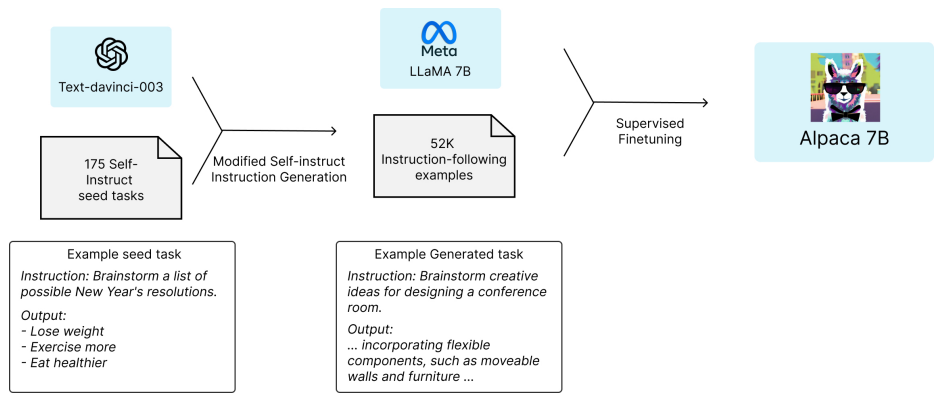
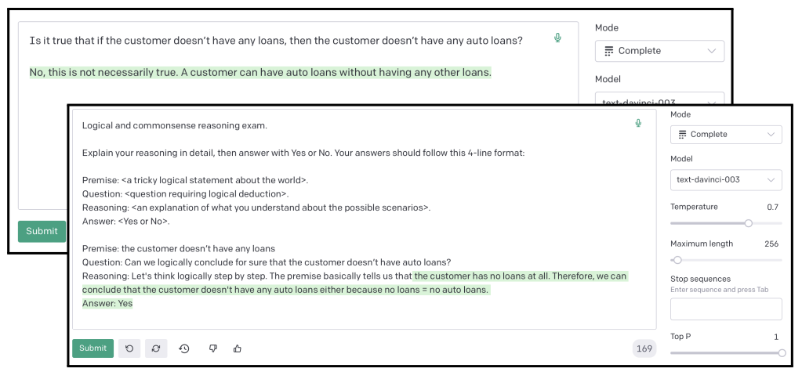

# Stanford XCS224U: Natural Language Understanding
O processamento de linguagem natural (NLP) ou linguística computacional é uma das tecnologias mais importantes da era da informação. As aplicações da NLP estão por toda parte porque as pessoas comunicam quase tudo por meio de uma linguagem: pesquisa na web, publicidade, e-mails, atendimento ao cliente, tradução de idiomas, agentes virtuais, relatórios médicos, política, etc. Na última década, as abordagens de aprendizagem profunda (ou redes neurais) obtiveram desempenho muito alto em muitas tarefas diferentes de NLP, usando modelos neurais únicos de ponta a ponta que não exigem engenharia tradicional de recursos específicos para tarefas. Neste curso, os alunos obterão uma introdução completa às pesquisas de ponta em Deep Learning para NLP. Através de palestras, trabalhos e um projeto final, os alunos aprenderão as habilidades necessárias para projetar, implementar e compreender seus próprios modelos de redes neurais, utilizando o framework [Pytorch](https://pytorch.org/).

O XCS224u tem o curso CS224n como prerequisito. [Background Materials](https://web.stanford.edu/class/cs224u/background.html)

Acesse o cronograma, materiais, recuros e programa do curso [aqui](https://web.stanford.edu/class/cs224u/index.html), e [aqui](https://web.stanford.edu/class/cs224u/background.html)

Playlist com as aulas no [youtube](https://www.youtube.com/playlist?list=PLoROMvodv4rOwvldxftJTmoR3kRcWkJBp)

# Summary
1. [**Intro and Evolution of NLP**](#1-intro-and-evolution-of-nlp)
2. [**Natural Language Understanding**](#2-natural-language-understanding)
   - 2.1. [Contextual Word Representation](#21-contextual-word-representation)
   - 2.2. [Transformer](#22-transformer)
   - 2.3. [Positional Encoding](#23-positional-encoding)
   - 2.4. [GPT (Generative Pre-trained Transformer)](#24-gpt-generative-pre-trained-transformer)
   - 2.5. [BERT (Bidirectional Encoder Representations from Transformers)](#25-bert-bidirectional-encoder-representations-from-transformers)
   - 2.6. [RoBERTa](#26-roberta)
   - 2.7. [ELECTRA](#27-electra)
   - 2.8. [Seq2seq Architectures](#28-seq2seq-architectures)
   - 2.9. [Distillation](#29-distillation)
3. [**Information Retrieval**](#3-information-retrieval)
   - 3.1. [Classical Information Retrieval](#31-classical-information-retrieval)
   - 3.2. [IR Metrics](#32-ir-metrics)
   - 3.3. [Neural IR](#33-neural-ir)
4. [**In-context Learning**](#4-in-context-learning)
   - 4.1. [Core Concepts](#41-core-concepts)
   - 4.2. [Current Movement](#42-current-movement)
   - 4.3. [Techniques and Suggested Methods](#43-techniques-and-suggested-methods)
5. [**Behavioral Evaluation of NLU Models**](#5-behavioral-evaluation-of-nlu-models)
   - 5.1. [Analytical Considerations](#51-analytical-considerations)
   - 5.2. [Compositionality](#52-compositionality)
   - 5.3. [COGS and ReCOGS](#53-cogs-and-recogs)
   - 5.4. [Adversarial Testing](#54-adversarial-testing)
   - 5.5. [Adversarial NLI](#55-adversarial-nli)
   - 5.6. [Dynasent](#56-dynasent)
6. [**Analysis Methods**](#6-analysis-methods)
   - 6.1. [Probing](#61-probing)
   - 6.2. [Feature Attribution](#62-feature-attribution)
   - 6.3. [Causal Abstraction & Interchange Intervention Training (IIT)](#63-causal-abstraction--interchange-intervention-training-iit)
   - 6.4. [Distributed Alignment Search (DAS)](#64-distributed-alignment-search-das)
7. [**Methods and Metrics**](#7-methods-and-metrics)
   - 7.1. [Classifier Metrics](#71-classifier-metrics)
   - 7.2. [Generation Metrics](#72-generation-metrics)
   - 7.3. [Datasets](#73-datasets)
   - 7.4. [Data Organization](#74-data-organization)
   - 7.5. [Model Evaluation](#75-model-evaluation)
8. [**Fantastic Language Models and How to Build Them**](#8-fantastic-language-models-and-how-to-build-them)

## 1. Intro and Evolution of NLP
## 2. Natural Language Understanding
### 2.1. Contextual Word Representation
#### Static Vector Representation of Words
##### 1. Feature-based (sparse):
   - **Explicação:** Este método baseia-se em representar palavras como vetores de características, onde cada característica representa uma propriedade específica da palavra. Cada palavra é associada a um vetor de dimensões discretas, onde apenas algumas dessas dimensões (ou características) são ativadas, tornando a representação esparsa.
   - **Exemplo:** Em um contexto de processamento de linguagem natural (NLP), uma palavra poderia ser representada por um vetor de características, onde cada dimensão representa a presença ou ausência de uma característica específica.

##### 2. Count-based methods (sparse):
   - **Explicação:** Estes métodos baseiam-se na contagem de ocorrências de palavras em documentos. A ideia é construir uma matriz que representa a frequência com que cada palavra ocorre em relação a outras palavras.
   - **Exemplos:**
      - **Point-wise Mutual Information (PMI):** Mede a associação entre duas palavras, levando em consideração sua co-ocorrência.
      - **TF-IDF (Term Frequency-Inverse Document Frequency):** Atribui pesos às palavras com base em sua frequência em um documento específico em relação à frequência em todos os documentos.

##### 3. Classical dimensionality reduction (dense):
   - **Explicação:** Estes métodos buscam reduzir a dimensionalidade dos dados, preservando as características mais importantes. Isso é feito através de técnicas como a Análise de Componentes Principais (PCA), Singular Value Decomposition (SVD), Latent Semantic Analysis (LSA) e Latent Dirichlet Allocation (LDA).
   - **Exemplos:**
      - **PCA (Principal Component Analysis):** Reduz a dimensionalidade dos dados, mantendo as direções principais de variabilidade.
      - **SVD (Singular Value Decomposition):** Decomposição de uma matriz em três matrizes, permitindo redução de dimensionalidade.
      - **LDA (Latent Dirichlet Allocation):** Modelagem estatística que atribui tópicos a documentos e palavras a tópicos.

##### 4. Learned dimensionality (dense):
   - **Explicação:** Esses métodos envolvem a aprendizagem de representações densas de palavras, onde cada palavra é representada por um vetor contínuo de números reais.
   - **Exemplos:**
      - **Autoencoders:** Redes neurais que tentam reconstruir a entrada, aprendendo representações latentes no processo.
      - **Word2Vec:** A técnica que aprende representações distribuídas de palavras usando redes neurais.
      - **GloVe (Global Vectors for Word Representation):** Uma técnica que utiliza estatísticas globais de co-ocorrência para aprender representações de palavras.

Esses métodos descrevem diferentes abordagens para representar palavras como vetores, seja através de características esparsas ou de representações densas, sendo aplicados em diversas tarefas de processamento de linguagem natural.

#### Word representations and Context
As representações estáticas possuem o __lack__ de entendimento contextual, já que palavras podem ter significados semânticos diferentes em diferentes contextos.

Quando falamos de representações estáticas de palavras, referimo-nos a técnicas que atribuem a uma palavra um único vetor, independente do contexto em que ela aparece. Isso pode ser problemático porque muitas palavras têm significados polissêmicos, ou seja, podem ter interpretações diferentes dependendo do contexto em que são usadas.

Por exemplo, a palavra "banco" pode se referir a um banco de parque ou a uma instituição financeira. Se utilizarmos uma representação estática, teríamos um único vetor para "banco", ignorando a variação de significado.

A falta de consideração do contexto pode levar a uma perda de nuances semânticas e prejudicar o desempenho em tarefas que exigem compreensão contextual, como análise de sentimentos, tradução automática ou até mesmo resolução de ambiguidades.

Para superar essa limitação, muitas abordagens mais recentes no campo de Processamento de Linguagem Natural (NLP) se concentraram em representações de palavras contextualizadas. Modelos como o BERT (Bidirectional Encoder Representations from Transformers) e o GPT (Generative Pre-trained Transformer) utilizam arquiteturas de transformers para capturar o contexto em que cada palavra aparece, gerando representações mais ricas e sensíveis ao contexto. Isso permite que os modelos compreendam melhor as nuances semânticas e melhorem o desempenho em uma variedade de tarefas linguísticas.

##### Model structure and linguistic structure

A estrutura linguística de frases e a estrutura de modelos referem-se a dois conceitos diferentes.

##### Estrutura Linguística de Frases:
##### Estrutura Básica:
1. **Sujeito:** Geralmente, a entidade que realiza ou é afetada pela ação na frase.
   - Exemplo: "O gato"
2. **Verbo:** A ação ou estado que a frase expressa.
   - Exemplo: "corre"
3. **Objeto:** A entidade ou coisa que recebe a ação.
   - Exemplo: "no jardim."

##### Estrutura de Exemplo:
"O gato corre no jardim."

##### Estrutura de Modelos (como em Modelos de Linguagem):

##### Estrutura de Rede Neural (Exemplo com BERT):
1. **Camada de Entrada:** Recebe a sequência de tokens (palavras ou subpalavras).
2. **Camadas Intermediárias:** Processam a informação, capturando relações semânticas e contextuais.
3. **Camada de Saída:** Gera as representações contextualizadas ou realiza tarefas específicas, como classificação de texto.

##### Estrutura de Exemplo:
- **Entrada:** "O gato corre no jardim."
- **Processamento:** (Camadas intermediárias processam informações contextuais)
- **Saída:** Representações contextuais ou resposta para uma tarefa específica.

##### Comparação:
1. **Natureza:**
   - **Estrutura Linguística de Frases:** Descreve como as palavras e componentes de uma frase se organizam para formar significado.
   - **Estrutura de Modelos:** Refere-se à arquitetura e organização de uma rede neural ou modelo de linguagem.

2. **Flexibilidade e Contexto:**
   - **Estrutura Linguística de Frases:** A estrutura é estática e não leva em consideração o contexto mais amplo.
   - **Estrutura de Modelos:** Captura informações contextuais, permitindo uma compreensão mais dinâmica e adaptativa.

3. **Aplicação:**
   - **Estrutura Linguística de Frases:** Aplica-se à análise gramatical e semântica de frases na língua natural.
   - **Estrutura de Modelos:** Aplica-se a modelos de linguagem, que podem realizar várias tarefas, como tradução automática, geração de texto e compreensão de linguagem natural.

4. **Exemplos:**
   - **Estrutura Linguística de Frases:** "O gato corre no jardim."
   - **Estrutura de Modelos:** Entrada e saída de um modelo de linguagem como BERT.

Em resumo, a estrutura linguística de frases lida com a organização de palavras para formar uma unidade significativa, enquanto a estrutura de modelos refere-se à arquitetura e organização de redes neurais ou modelos de linguagem para processar e entender a linguagem natural de maneira mais dinâmica e contextual.

#### 1. GloVe (Global Vectors for Word Representation):
##### Estrutura:
- **Tipo:** Modelo de aprendizado não supervisionado para representações de palavras.
- **Arquitetura:** Não é uma rede neural, mas uma técnica de vetorização de palavras baseada em estatísticas globais de co-ocorrência.
- **Treinamento:** Utiliza uma matriz de co-ocorrência e técnicas de fatoração para aprender representações distribuídas de palavras.

#### 2. RNN (Redes Neurais Recorrentes):
##### Estrutura:
- **Tipo:** Modelo de aprendizado supervisionado, usado principalmente para sequências.
- **Arquitetura:** Possui células recorrentes que permitem a informação ser persistente ao longo do tempo. Cada unidade recebe uma entrada e a informação da unidade anterior.
- **Treinamento:** Usa backpropagation através do tempo (BPTT) para ajustar os pesos durante o treinamento.

#### 3. Tree Structure Networks RNN:
##### Estrutura:
- **Tipo:** Modelo de aprendizado supervisionado, projetado para processar estruturas de árvores.
- **Arquitetura:** Utiliza estruturas de árvore para modelar relações hierárquicas entre elementos de uma sequência.
- **Treinamento:** Semelhante a uma RNN tradicional, mas com considerações especiais para a estrutura de árvore.

#### 4. Bidirectional RNN (RNN Bidirecional):
##### Estrutura:
- **Tipo:** Extensão da RNN padrão.
- **Arquitetura:** Possui duas camadas de células recorrentes, uma processando a sequência da esquerda para a direita e a outra da direita para a esquerda.
- **Vantagem:** Captura informações contextuais de ambos os lados da sequência, melhorando a compreensão contextual.

Essas estruturas representam diferentes abordagens para lidar com dados sequenciais, como texto. O GloVe é uma técnica baseada em estatísticas, enquanto RNN, Tree Structure Networks RNN e Bidirectional RNN são modelos de aprendizado de máquina que incorporam arquiteturas específicas para lidar com a natureza sequencial ou hierárquica dos dados linguísticos. Cada um tem suas aplicações específicas em tarefas de processamento de linguagem natural (NLP) e pode ser escolhido com base nas características do problema em questão.

#### Attention
O mecanismo de atenção é uma técnica fundamental em modelos de aprendizado de máquina, especialmente em tarefas de processamento de linguagem natural (NLP), onde é crucial considerar diferentes partes de uma sequência de entrada de maneira ponderada. O mecanismo de atenção permite que o modelo atribua diferentes pesos a diferentes partes da entrada, destacando as informações mais relevantes para a tarefa em questão.

##### Mecanismo de Atenção em NLP:
1. **Entrada Sequencial:**
   - Suponha que temos uma sequência de palavras ou vetores de entrada, como uma frase em um problema de NLP.

2. **Representação de Consulta (Query):**
   - Uma representação da "consulta" é criada. Pode ser um vetor associado a uma palavra ou a uma representação mais abstrata do contexto.

3. **Pontuação de Atenção (Attention Score):**
   - Calcula-se uma pontuação de atenção para cada elemento da sequência em relação à consulta. Essa pontuação reflete a importância relativa de cada elemento.
   - A pontuação de atenção é geralmente calculada usando funções de similaridade, como o produto escalar ou uma função de similaridade mais complexa.

4. **Pesos Normalizados:**
   - As pontuações de atenção são normalizadas usando uma função softmax para obter pesos que somam 1. Esses pesos indicam a importância relativa de cada elemento na sequência.

5. **Atenção Ponderada:**
   - Os elementos da sequência são ponderados pelos pesos obtidos. Isso cria uma representação ponderada que destaca partes específicas da entrada, com base na consulta.

##### Exemplo Simples:

Considere a frase: "O gato está dormindo no sofá."
- **Consulta:** Pode ser uma representação contextual, como um vetor que representa o significado de uma palavra específica.
- **Pontuação de Atenção:** Calcula a similaridade entre a consulta e cada palavra da frase.
- **Pesos Normalizados:** Aplica a função softmax nas pontuações para obter pesos normalizados.
- **Atenção Ponderada:** Combina as palavras ponderadas pela atenção para obter uma representação contextualizada.

##### Aplicações:
- **Tradução Automática:** Destacar palavras relevantes em uma frase de origem para a tradução.
- **Sumarização de Texto:** Identificar partes importantes de um texto para criar uma sumarização concisa.
- **Processamento de Perguntas e Respostas:** Focar em partes relevantes do contexto para gerar respostas.

Modelos como o Transformer, que introduziu a atenção multi-cabeça, foram revolucionários em NLP, proporcionando uma capacidade aprimorada de lidar com sequências de maneira mais sofisticada.

#### Subword Modeling in ELMo
A modelagem de subpalavras no ELMo (Embeddings from Language Models) é uma abordagem que utiliza representações contextuais para palavras, levando em consideração subpalavras ou morfemas, em vez de considerar as palavras como unidades inteiras. Essa técnica visa capturar a riqueza e a flexibilidade da linguagem ao lidar com a variação morfológica e a composição de palavras.

A modelagem de subpalavras no ELMo é alcançada por meio de uma arquitetura de rede neural profunda. Aqui está uma explicação mais detalhada:

##### Estrutura Geral do ELMo:

1. **Rede Neural Bidirecional (Bi-LSTM):**
   - Utiliza uma arquitetura de LSTM bidirecional para processar a sequência de entrada.
   - A LSTM bidirecional permite que a rede capture informações contextuais de ambas as direções, à esquerda e à direita da palavra.

2. **Camadas de Projeção Linear:**
   - Após a camada Bi-LSTM, cada camada oculta é projetada linearmente para reduzir a dimensionalidade e extrair representações mais ricas.

3. **Composição de Camadas:**
   - A representação de cada palavra é composta por diferentes camadas da rede. Cada camada captura diferentes níveis de complexidade e contexto.

4. **Combinação Ponderada de Representações:**
   - As representações de cada camada são combinadas ponderadamente para formar a representação final da palavra. Essa combinação é feita usando pesos aprendidos durante o treinamento.

##### Modelagem de Subpalavras:

- **Subpalavras como Unidades:**
  - Ao contrário de abordagens que tratam palavras como unidades discretas, o ELMo considera as subpalavras ou morfemas como unidades fundamentais.
  - Isso permite que o modelo capture informações sobre a morfologia e a composição das palavras.

- **Embeddings Contextuais:**
  - As representações de subpalavras são contextuais, ou seja, dependem do contexto em que a subpalavra aparece na sequência.
  - Essa contextualização é fundamental para lidar com a polissemia e a composição de palavras em diferentes contextos.

##### Vantagens da Modelagem de Subpalavras no ELMo:

- **Flexibilidade Morfológica:** Permite ao modelo lidar com diferentes formas morfológicas de uma palavra.
- **Composicionalidade:** Captura a composição semântica de palavras complexas ou raras.
- **Polissemia:** Lida melhor com palavras que têm significados variados em contextos diferentes.

A modelagem de subpalavras no ELMo contribui para a criação de embeddings mais ricos e contextuais, resultando em representações mais sofisticadas para palavras em tarefas de processamento de linguagem natural.

#### Fine-tuning
O fine-tuning em Processamento de Linguagem Natural (NLP) é um processo em que um modelo de linguagem pré-treinado, geralmente treinado em uma tarefa de linguagem geral, é ajustado para realizar uma tarefa específica relacionada. Isso é particularmente útil quando se dispõe de dados limitados para a tarefa específica, pois o modelo pré-treinado já adquiriu conhecimento linguístico geral de um conjunto diversificado e extenso de dados.

##### Processo de Fine-Tuning em NLP:

1. **Escolha do Modelo Pré-Treinado:**
   - Seleção de um modelo pré-treinado bem estabelecido, treinado em grandes quantidades de dados em uma tarefa geral de NLP. Exemplos incluem modelos como BERT, GPT, ELMo, entre outros.

2. **Congelamento e Ajuste de Camadas:**
   - Congelamento das camadas iniciais do modelo pré-treinado, que capturam conhecimentos linguísticos gerais, para preservar essas informações.
   - Ajuste das camadas finais, mais próximas da saída, para a nova tarefa específica.

3. **Adição de Camadas Específicas:**
   - Adição de camadas específicas para a nova tarefa. Por exemplo, na classificação de sentimentos, pode-se adicionar uma camada de classificação no topo do modelo.

4. **Ajuste da Taxa de Aprendizado:**
   - Redução da taxa de aprendizado para as camadas ajustadas durante o fine-tuning. Isso ajuda a realizar ajustes mais graduais e evitar grandes mudanças nas representações já aprendidas.

5. **Treinamento na Tarefa Específica:**
   - Treinamento do modelo no conjunto de dados específico da nova tarefa, utilizando a combinação de camadas congeladas e camadas ajustadas.

6. **Ajustes no Conjunto de Dados:**
   - É possível ajustar o conjunto de dados da nova tarefa, adicionando ou removendo exemplos relevantes para aprimorar o desempenho do fine-tuning.

##### Exemplos de Tarefas em NLP que Usam Fine-Tuning:

1. **Classificação de Sentimentos:**
   - Fine-tuning de modelos para classificar se um texto expressa um sentimento positivo, negativo ou neutro.

2. **Identificação de Entidades Nomeadas (NER):**
   - Adaptação de modelos para reconhecer entidades específicas, como nomes de pessoas, organizações ou locais, em textos.

3. **Preenchimento de Lacunas (Cloze Test):**
   - Ajuste de modelos para preencher lacunas em frases ou parágrafos, onde uma palavra ou trecho é removido.

4. **Tradução Automática:**
   - Fine-tuning de modelos para tarefas de tradução automática, adaptando modelos de linguagem para pares de idiomas específicos.

O fine-tuning em NLP é uma estratégia poderosa para adaptar modelos pré-treinados a tarefas específicas de linguagem, permitindo uma utilização mais eficiente de recursos computacionais e dados.

### 2.2. Transformer
A arquitetura dos modelos Transformers, introduzida por Vaswani et al. em 2017, é uma arquitetura de aprendizado de máquina que se tornou amplamente utilizada em tarefas de Processamento de Linguagem Natural (NLP) e além. A característica distintiva dos modelos Transformers é a atenção, que permite que o modelo atenda simultaneamente a todas as posições de entrada em uma sequência, em vez de depender de uma abordagem sequencial ou recorrente.

1. **Encoder-Decoder Architecture:** Muitos modelos Transformer consistem em uma arquitetura de codificador-decodificador. No caso de tarefas de tradução, por exemplo, o codificador processa a sequência de entrada na língua de origem, e o decodificador gera a sequência de saída na língua de destino.
2. **Attention Mechanism:** O mecanismo de atenção é central para os Transformers. Ele permite que o modelo "preste atenção" a diferentes partes da entrada ao calcular uma pontuação de atenção para cada posição. Isso é feito por meio de três vetores: consulta (Q), chave (K) e valor (V). A atenção é calculada como uma soma ponderada dos valores, onde os pesos são determinados pela compatibilidade entre a consulta e a chave. **Exemplo:** Considere a frase "The cat sat on the mat." O mecanismo de atenção permite que o modelo dê mais peso a diferentes palavras dependendo do contexto. Por exemplo, ao traduzir para outra língua, o modelo pode dar mais atenção a "cat" ao gerar a palavra correspondente na língua de destino.
3. **Multi-Head Attention:** Para melhorar a representação, os modelos Transformers usam atenção multi-cabeça, onde várias cabeças de atenção são calculadas independentemente e, em seguida, concatenadas e linearmente transformadas. Isso permite que o modelo aprenda diferentes representações ponderadas. **Exemplo:** Suponha que estamos analisando uma frase e queremos entender tanto os sujeitos quanto os objetos. Cada cabeça de atenção pode se concentrar em diferentes partes da frase, como sujeitos ou objetos específicos.
4. **Positional Encoding:** Uma desvantagem dos modelos Transformers é que eles não têm uma noção intrínseca de ordem ou posição nas sequências. Para contornar isso, os modelos incorporam informações de posição através da adição de codificações posicionais às embeddings de entrada. **Exemplo:** Considere as frases "I love transformers" e "Transformers love me." As palavras têm significados diferentes dependendo de sua posição nas frases. As codificações posicionais ajudam o modelo a capturar essas diferenças.
5. **Feedforward Neural Networks:** Após a camada de atenção, cada posição passa por uma rede neural feedforward, adicionando uma camada de não-linearidade. Isso ajuda o modelo a aprender representações não lineares mais complexas, capturando relações mais abstratas entre as palavras.
6. **Layer Normalization and Residual Connections:** Cada subcamada (atualmente, subcamadas são atenção e feedforward) é seguida por uma camada de normalização e uma conexão residual. Isso ajuda na estabilidade do treinamento e facilita o fluxo de gradientes. **Exemplo:** A normalização de camada e as conexões residuais são usadas para melhorar a estabilidade do treinamento e facilitar o fluxo de gradientes. Isso é particularmente útil em modelos profundos como os Transformers.
7. **Self-Attention:** Em muitos casos, como no BERT, os modelos Transformers usam autoatenção, onde a entrada é considerada para calcular as atenções em si mesma. Isso permite que o modelo capture dependências de longo alcance. **Exemplo:** Ao processar uma sequência de palavras, o mecanismo de autoatenção permite que cada palavra considere todas as outras palavras em relação a si mesma. Isso é valioso para entender dependências de longo alcance.
   
### 2.3. Positional Encoding
O positional encoding (codificação posicional) é uma técnica usada em modelos de linguagem, especialmente em arquiteturas como o Transformer, para incorporar informações sobre a posição relativa das palavras em uma sequência. Essa técnica é necessária porque modelos de linguagem, como redes neurais, por si só, não têm uma noção intrínseca de ordem ou posição nas sequências de entrada.

Nos modelos que utilizam codificação posicional, é adicionado um vetor posicional a cada vetor de entrada, representando a posição relativa da palavra na sequência. Dessa forma, a rede neural é capacitada para considerar a posição das palavras, algo essencial em tarefas onde a ordem das palavras é significativa, como em tradução de texto ou análise de sentimento em sequências.

### Formulação Básica do Positional Encoding:

Seja \( PE(\text{{pos}}, 2i) \) o \( 2i \)-ésimo componente do vetor de codificação posicional na posição \( \text{{pos}} \), e \( PE(\text{{pos}}, 2i + 1) \) o \( (2i + 1) \)-ésimo componente. A fórmula básica do positional encoding é geralmente definida como:

$$ 
\[
PE(\text{{pos}}, 2i) = \sin\left(\frac{{\text{{pos}}}}{{10000^{(2i/d)}}}\right)
\]

\[
PE(\text{{pos}}, 2i + 1) = \cos\left(\frac{{\text{{pos}}}}{{10000^{(2i/d)}}}\right)
\]

$$

onde:
- \( \text{{pos}} \) é a posição da palavra na sequência.
- \( i \) é a dimensão do vetor de codificação posicional.
- \( d \) é a dimensão total do vetor de entrada.


### Propriedades Importantes:

1. **Ponderação por Dimensão:**
   - A ponderação na fórmula garante que diferentes dimensões do vetor de codificação posicional capturam padrões em diferentes escalas de posição.

2. **Sinusoides Alternadas:**
   - A escolha de funções senoidais e cossenoidais alterna entre as dimensões para que elas capturem padrões diferentes e evitem a perda de informação.

3. **Adição ao Vetor de Entrada:**
   - O positional encoding é somado ao vetor de entrada original, permitindo que a informação de posição seja incorporada à representação da palavra.

O positional encoding é uma abordagem eficaz para lidar com a informação de posição em modelos que não possuem uma compreensão intrínseca da ordem nas sequências, contribuindo para o desempenho em tarefas que requerem consideração da posição relativa das palavras.

### 2.4. GPT (Generative Pre-trained Transformer)
O GPT (Generative Pre-trained Transformer) é uma arquitetura de modelo de linguagem baseada em transformers e é conhecida por ser uma das mais poderosas para tarefas de processamento de linguagem natural. Aqui estão os principais componentes do GPT:

1. **Transformers:** O GPT é construído com base na arquitetura de transformers, que consiste em um codificador e um decodificador. Cada bloco transformer possui mecanismos de autoatenção (self-attention) que permitem ao modelo capturar relações de longo alcance e contextos complexos.
2. **Pré-treinamento Não Supervisionado:** O GPT é pré-treinado em uma tarefa não supervisionada de predição da próxima palavra em grandes corpora de texto. Durante esse pré-treinamento, o modelo aprende representações de palavras e contextos sem uma tarefa de supervisão específica.
3. **Atenção Autoregressiva:** Durante a geração de texto, o GPT utiliza uma abordagem autoregressiva, onde cada palavra é gerada sequencialmente com base nas palavras anteriores. Isso é feito usando amostragem estocástica ou greedy decoding.
4. **Camadas Empilhadas:** O GPT consiste em várias camadas empilhadas de blocos transformer. Essas camadas permitem ao modelo aprender representações hierárquicas e complexas de texto.
5. **Embeddings Posicionais:** Para levar em conta a ordem das palavras em uma sequência, o GPT utiliza embeddings posicionais. Esses embeddings são adicionados às representações de palavras para codificar informações sobre a posição relativa de cada palavra na sequência.
6. **Mecanismo de Máscara de Atenção Casual (Masked Self-Attention):** Durante o pré-treinamento, o GPT utiliza um mecanismo de máscara de atenção casual para garantir que cada palavra possa atentar apenas às palavras anteriores, impedindo assim a influência de palavras futuras na predição.
7. **Normalização por Camada (Layer Normalization):** Cada camada do GPT inclui normalização por camada para estabilizar e acelerar o treinamento.
8. **Função de Ativação GELU (Gaussian Error Linear Unit):** A função de ativação GELU é comumente utilizada nas camadas ocultas do GPT, proporcionando um comportamento não linear para a transformação das representações.
9. **Cabeças de Atenção Múltipla (Multi-Head Attention):** O mecanismo de atenção do GPT usa cabeçotes de atenção múltiplos, permitindo que o modelo atenda a diferentes partes do contexto simultaneamente.
10. **Técnica de Tokenização Subword:** Para lidar com um grande vocabulário, o GPT utiliza uma técnica de tokenização subword, que divide palavras em partes menores para lidar com palavras raras e aumentar a eficiência do modelo.

Esses componentes combinados tornam o GPT um modelo altamente eficaz para diversas tarefas de processamento de linguagem natural, desde geração de texto até tarefas específicas de classificação e tradução.

### 2.5. BERT (Bidirectional Encoder Representations from Transformers)
O BERT (Bidirectional Encoder Representations from Transformers) é um modelo de linguagem pré-treinado baseado na arquitetura Transformer. Aqui estão os componentes essenciais do BERT:

1. **Arquitetura Transformer:** BERT utiliza a arquitetura Transformer, composta por um codificador empregado em uma configuração bidirecional. Isso significa que o modelo leva em consideração as palavras anteriores e posteriores para cada palavra em uma frase durante o treinamento.
2. **Camadas de Ativação e Normalização:** BERT incorpora camadas de ativação (como ReLU) e normalização de camada após as operações de atenção e redes neurais feedforward. Essas camadas contribuem para a estabilidade do treinamento e facilitam o fluxo de gradientes.
3. **Multi-Head Self-Attention:** O mecanismo de autoatenção é aplicado em várias cabeças (multi-head attention), permitindo que o modelo capture diferentes aspectos de dependências em uma frase de maneira simultânea. Isso ajuda BERT a entender contextos complexos e relações entre palavras.
4. **Embeddings Posicionais:** Dado que a arquitetura Transformer não leva em conta a ordem das palavras em uma frase, BERT incorpora informações de posição através de embeddings posicionais. Isso permite que o modelo diferencie entre palavras que ocorrem em diferentes posições dentro de uma sequência.
5. **Camada de Token [CLS]:** BERT adiciona um token especial [CLS] (CLS token) no início de cada sequência de entrada. O vetor de representação associado ao token [CLS] é usado como uma representação agregada da frase inteira para tarefas de classificação.
6. **Pré-treinamento com Masked Language Model (MLM):** Durante a fase de pré-treinamento, BERT treina um modelo de linguagem de forma bidirecional. Uma parte das palavras em cada sequência de entrada é mascarada, e o modelo é treinado para prever essas palavras mascaradas com base no contexto das palavras circundantes.
7. **Pré-treinamento de Palavras Inteiras (Whole Word Masking):** BERT usa uma abordagem de "Whole Word Masking" durante o pré-treinamento, na qual palavras inteiras são mascaradas de uma vez. Isso ajuda o modelo a entender o contexto e a relação semântica entre palavras completas.
8. **Fine-Tuning para Tarefas Específicas:** Após o pré-treinamento, BERT pode ser afinado para tarefas específicas, como classificação de sentimentos, perguntas e respostas, ou NER (Reconhecimento de Entidade Nomeada), utilizando camadas adicionais e ajustando parâmetros para a tarefa específica.

Esses componentes tornam o BERT uma arquitetura poderosa e versátil para uma variedade de tarefas de Processamento de Linguagem Natural (NLP), permitindo que o modelo compreenda contextos complexos e relações semânticas em sequências de texto.

### 2.6. RoBERTa
RoBERTa (Robustly optimized BERT approach with pre-training Larger Amount of data) é uma variação do modelo BERT projetada para otimizar o desempenho e a eficiência do treinamento. Aqui estão os componentes centrais do ROBERTA:

1. **Arquitetura Baseada em Transformer:** ROBERTA mantém a arquitetura baseada em Transformer, herdada do BERT. A arquitetura é composta por camadas de autoatenção, camadas de feedforward, normalização de camada e conexões residuais.
2. **Treinamento Escalonado e Batch Size Dinâmico:** ROBERTA utiliza uma abordagem de treinamento escalonado (layer-wise training) e ajusta o tamanho do lote dinamicamente durante o treinamento. Isso permite que camadas mais profundas se beneficiem de tamanhos de lote maiores, o que melhora o desempenho do modelo.
3. **Remoção da Pré-treinamento de Sentença (NSP):** ROBERTA remove a tarefa de pré-treinamento de sentença (Next Sentence Prediction - NSP) usada no BERT. Em vez disso, ele pré-treina o modelo apenas com tarefas de preenchimento de máscara (Masked Language Model - MLM) e utiliza um conjunto de dados mais extenso.
4. **Tokenização Dinâmica e Aprendizado Contínuo:** ROBERTA incorpora uma abordagem de tokenização dinâmica, o que significa que o tamanho do vocabulário pode ser expandido dinamicamente durante o treinamento. Isso é especialmente útil para lidar com grandes quantidades de dados.
5. **Aumento do Tamanho do Modelo e Treinamento com Mais Dados:** ROBERTA aumenta o tamanho do modelo em comparação com o BERT padrão e é treinado com uma quantidade significativamente maior de dados. Isso ajuda a capturar uma representação mais rica e robusta das linguagens.
6. **Atenção Contínua em Segmentos (Causal Language Modeling):** Durante o treinamento, ROBERTA introduz a atenção contínua em segmentos para lidar com tokens de segmentos em um fluxo contínuo, melhorando a capacidade do modelo de entender e representar contextos complexos.
7. **Utilização de Stop Words no Pré-treinamento:** ROBERTA faz uso de palavras comuns (stop words) no pré-treinamento, o que pode ajudar a melhorar a capacidade do modelo de compreender e generalizar.
8. **Redução de Memória e Processamento Eficiente:** ROBERTA utiliza estratégias eficientes para redução de memória, como compartilhamento de parâmetros e compressão de representações intermediárias, tornando-o mais escalável e eficiente em termos de recursos computacionais.

Esses componentes fazem do ROBERTA uma extensão e otimização do BERT, resultando em um modelo mais robusto e eficiente para tarefas de Processamento de Linguagem Natural.

### 2.7. ELECTRA
O ELECTRA (Efficiently Learning an Encoder that Classifies Token Replacements Accurately) é um modelo de linguagem pré-treinado que se destaca por sua eficiência de treinamento e bom desempenho em tarefas downstream*. Aqui estão os principais componentes do ELECTRA:

1. **Generador de Tokens Masked (Geração de Token Mascaramento):**  Diferentemente do BERT, que usa uma abordagem de preenchimento de máscara (MLM) para mascarar aleatoriamente palavras em uma sequência, o ELECTRA usa um gerador de tokens mascarados. Este gerador substitui aleatoriamente palavras reais por [MASK] e treina o modelo para reconhecer essas substituições.
2. **Discriminador de Tokens Substituídos:**  O ELECTRA introduz um discriminador que é treinado para distinguir tokens reais de tokens gerados pelo gerador de tokens mascarados. Esse componente é crucial para a abordagem de treinamento do ELECTRA.
3. **Tarefas de Pré-treinamento:**  O modelo é pré-treinado em duas tarefas simultâneas: a tarefa de reconhecimento de tokens mascarados (MLM-like) e a tarefa de discriminação adversarial entre tokens reais e tokens gerados.
4. **Substituição de Tokens por [MASK]:**  No ELECTRA, uma porcentagem significativa dos tokens é substituída por [MASK] durante o pré-treinamento, em comparação com a pequena fração de tokens mascarados no BERT. Isso cria um sinal de treinamento mais forte para o modelo.
5. **Treinamento Adversarial:**  O treinamento adversarial entre o gerador e o discriminador é uma parte central do ELECTRA. O gerador tenta gerar tokens mascarados que se assemelham a tokens reais, enquanto o discriminador tenta distinguir entre tokens reais e gerados.
6. **Estratégia de Substituição Dinâmica:** O ELECTRA utiliza uma estratégia de substituição dinâmica, onde alguns tokens são substituídos por [MASK], alguns permanecem inalterados e outros são substituídos por palavras reais. Essa abordagem permite um treinamento mais eficiente.
7. **Aproveitamento de Modelos de Linguagem Pré-existentes:** O ELECTRA pode se beneficiar de modelos de linguagem pré-existentes, como o BERT, para inicialização de parâmetros antes do treinamento adversarial.
8. **Desempenho Eficiente em Tarefas Downstream:** Devido à sua abordagem de treinamento eficiente e ao uso de uma quantidade significativamente menor de parâmetros em comparação com modelos tradicionais, o ELECTRA demonstrou bom desempenho em tarefas downstream com menos recursos computacionais."Tarefas downstream" referem-se a tarefas específicas de Processamento de Linguagem Natural (PLN) que são resolvidas utilizando modelos de linguagem pré-treinados. Em um contexto de modelos de linguagem pré-treinados, o termo "downstream" refere-se ao movimento de uma tarefa mais geral (pré-treinamento) para tarefas mais específicas e aplicadas (tarefas downstream). Ex: 
 - Classificação de Sentimento, Perguntas e Respostas (QA), Named Entity Recognition (NER), Tradução Automátic Geração de Texto, Sumarização de Texto, Análise de Sentimento.

Em resumo, o ELECTRA se destaca pela sua eficiência de treinamento, aproveitando um gerador de tokens mascarados e um discriminador adversarial para pré-treinamento. Essa abordagem adversarial resulta em representações mais ricas e eficazes para várias tarefas de Processamento de Linguagem Natural (NLP).

### 2.8. Seq2seq Architectures
Os modelos sequência para sequência, também conhecidos como seq2seq, são uma classe de modelos de aprendizado de máquina que são usados para tarefas onde a entrada e a saída são sequências de dados. Eles são comumente usados em tarefas de Processamento de Linguagem Natural (PNL) e tradução automática. Aqui está uma explicação geral, uma descrição do funcionamento e exemplos de modelos seq2seq:

1. **Entrada e Saída Sequenciais:** Os modelos seq2seq são projetados para lidar com entradas e saídas que são sequências, como frases em linguagem natural.
2. **Arquitetura Encoder-Decoder:** Geralmente, os modelos seq2seq consistem em duas partes principais: um encoder (codificador) e um decoder (decodificador). O encoder processa a entrada sequencial e produz um vetor de contexto. O decoder usa esse vetor de contexto para gerar a saída sequencial.
3. **Representação Vetorial:** Durante o treinamento, o modelo aprende representações vetoriais que capturam a semântica da sequência de entrada.

#### Funcionamento:
1. **Encoder:** A sequência de entrada é alimentada ao encoder, que converte cada elemento da sequência em uma representação vetorial.
2. **Vetor de Contexto:** O encoder produz um vetor de contexto que captura as informações relevantes da sequência de entrada.
3. **Decoder:** O vetor de contexto é usado como entrada para o decoder, que gera a sequência de saída um elemento de cada vez.
4. **Treinamento com Teacher Forcing:** Durante o treinamento, o modelo é alimentado com pares de sequências de entrada e saída conhecidas. O decoder é incentivado a gerar a sequência de saída correta em cada etapa.
5. **Inferência:** Durante a inferência, o modelo é alimentado com uma sequência de entrada e usa o decoder para gerar a sequência de saída.
6. **Exemplos de Modelos Seq2Seq:** Tradução Automática, Geração de Resumo, Diálogos (QA), Geração de Código, Correção de Texto

### T5
O T5 (Text-to-Text Transfer Transformer) é um modelo de linguagem proposto pelo Google Research que segue a abordagem "text-to-text", tratando todas as tarefas de processamento de linguagem natural (PNL) como problemas de conversão de texto para texto. Aqui estão os principais componentes do T5:

1. **Arquitetura Transformer:** O T5 utiliza a arquitetura Transformer, que é baseada em mecanismos de atenção para capturar relações de longo alcance em sequências.
2. **Encoder-Decoder Framework:** Assim como muitos modelos seq2seq, o T5 possui uma estrutura de codificador-decodificador (encoder-decoder). O codificador processa a entrada e gera uma representação contextual, enquanto o decodificador usa essa representação para gerar a saída.
3. **Text-to-Text Paradigm:** A característica distintiva do T5 é a abordagem "text-to-text", onde todas as tarefas são formuladas como problemas de conversão de texto para texto. Isso inclui tarefas de classificação, geração, tradução, entre outras.
4. **Tokenização Universal:** O T5 utiliza uma tokenização universal, tratando todas as tarefas como tarefas de geração de texto. Cada entrada é prefixada com um rótulo que indica a tarefa específica. 
5. **Pesos Compartilhados:** O T5 compartilha pesos entre o codificador e o decodificador. Isso contribui para um treinamento eficiente e uma representação mais coerente.
6. **Treinamento Multi-Tarefa:** O modelo é treinado simultaneamente em várias tarefas usando um único modelo. Isso permite que o T5 generalize melhor em uma ampla variedade de tarefas de PNL.
7. **Transfer Learning:** O T5 é pré-treinado em grandes conjuntos de dados e, em seguida, ajustado finamente para tarefas específicas. Isso segue a abordagem de transfer learning, onde o conhecimento aprendido em uma tarefa é transferido para melhorar o desempenho em outras tarefas.

#### Exemplo de Uso do T5:

Suponha que temos uma tarefa de tradução de inglês para francês. A entrada seria algo como "translate English to French: 'The cat is on the mat'" e a saída esperada seria a tradução correspondente para o francês.

1. **Entrada:** "translate English to French: 'The cat is on the mat'"
2. **Saída Esperada:** "Le chat est sur le tapis"

Neste exemplo, a tarefa específica (tradução) é indicada pelo rótulo na entrada, e o modelo é treinado para gerar a saída desejada.

O T5 é conhecido por sua versatilidade e desempenho sólido em uma variedade de tarefas, tornando-o uma escolha popular para abordagens text-to-text em PNL.

### BART
O BART (Bidirectional and Auto-Regressive Transformers) é um modelo de linguagem proposto pela Facebook AI Research (FAIR) que utiliza a arquitetura Transformer. Ele foi projetado para realizar tarefas de geração de sequência e compressão de texto. Aqui estão os principais componentes do BART:

1. **Arquitetura Transformer:** O BART utiliza a arquitetura Transformer, que é composta por camadas de autoatentividade para processar informações de entrada.
2. **Encoder-Decoder Framework:** O BART segue uma estrutura de codificador-decodificador (encoder-decoder), onde o codificador processa a entrada e gera uma representação contextual, e o decodificador usa essa representação para gerar a saída.
3. **Tokenização:** Assim como outros modelos de linguagem, o BART faz uso de uma estratégia de tokenização para dividir o texto em unidades discretas, como palavras ou subpalavras.
4. **BART como Modelo Denoising:** O treinamento do BART é formulado como um problema de denoising autoencoder. Ele é treinado para reconstruir a sequência original a partir de uma versão corrompida da sequência, onde partes aleatórias foram mascaradas ou removidas.
5. **Masked Language Model (MLM):** Durante o treinamento, o BART utiliza uma versão modificada da tarefa de preenchimento de máscara (MLM), onde uma parte da sequência é mascarada e o modelo é treinado para prever essas partes mascaradas.
6. **Inversão de Sequência no Codificador:** Uma característica única do BART é a inversão da sequência no codificador. Isso significa que a ordem das palavras na entrada é invertida antes de ser passada para o codificador.
7. **Fine-Tuning para Tarefas Específicas:** Após o pré-treinamento, o BART pode ser ajustado finamente (fine-tuned) para tarefas específicas, como resumo de texto, tradução automática, entre outras.
8. **Geração de Sequências de Saída:** Durante a geração de sequências de saída, o BART é usado para produzir uma sequência de palavras ou subpalavras que representa a resposta desejada.

### Exemplo de Uso do BART:

Suponha que temos a seguinte tarefa de resumo de texto:

1. **Entrada:** "O BART é um modelo de linguagem baseado na arquitetura Transformer. Ele é projetado para realizar tarefas de geração de sequência e compressão de texto."
2. **Saída Esperada:** "O BART, baseado na arquitetura Transformer, é especializado em geração de sequência e compressão de texto."

Neste exemplo, o BART seria treinado para gerar automaticamente o resumo da entrada.

O BART é conhecido por sua eficácia em tarefas de geração de sequência e resumo de texto, e seu treinamento denoising autoencoder contribui para a capacidade do modelo de compreender e gerar sequências coesas.

### Benchmarks entre os modelos

### 2.9. Distillation
A destilação, no contexto de modelos de aprendizado de máquina, refere-se a uma técnica na qual o conhecimento de um modelo maior e mais complexo é transferido para um modelo menor e mais simples. Esse processo é muitas vezes chamado de "destilação do conhecimento" ou "aprendizado por destilação". O principal objetivo é transferir o conhecimento adquirido por um modelo mais complexo para um modelo mais leve, mantendo ou melhorando o desempenho do modelo menor.

#### Principais Componentes do Processo de Destilação:
1. **Modelo Professor (Complexo):** Um modelo maior e mais complexo (professor) é treinado em uma tarefa específica. Esse modelo geralmente tem uma capacidade de representação mais rica e é capaz de aprender padrões complexos nos dados.
2. **Modelo Aluno (Simplificado):** Um modelo menor e mais simples (aluno) é criado para realizar a mesma tarefa. Este modelo é mais leve em termos de parâmetros e complexidade.
3. **Transferência de Conhecimento:** O conhecimento do modelo professor é transferido para o modelo aluno. Isso geralmente é feito ajustando o modelo aluno para imitar as previsões do modelo professor.
4. **Regularização:** Técnicas de regularização são frequentemente aplicadas para evitar que o modelo aluno se ajuste excessivamente aos dados de treinamento. Isso pode incluir penalidades em divergências entre as distribuições de probabilidade das previsões do professor e do aluno.

#### Benefícios da Destilação:
1. **Redução de Recursos:** Modelos menores resultantes da destilação geralmente têm menos parâmetros, ocupam menos espaço em memória e são mais rápidos para inferência.
2. **Generalização Melhorada:** A destilação pode ajudar o modelo menor a generalizar melhor em relação a dados não vistos, incorporando o conhecimento aprendido pelo modelo professor.
3. **Transferência de Tarefas:** Os modelos destilados podem ser mais eficientes em transferir conhecimento para tarefas relacionadas ou domínios semelhantes.

#### Performace
A performance de modelos destilados pode ser avaliada em relação a diferentes métricas e considerações, dependendo do contexto específico da aplicação. Aqui estão algumas considerações gerais sobre a performance de modelos destilados:

1. **Eficiência e Inferência Rápida:** Um dos principais objetivos ao destilar conhecimento é criar modelos mais leves e eficientes, especialmente em termos de inferência. Modelos destilados geralmente apresentam tempos de inferência mais rápidos em comparação com modelos mais complexos, tornando-os adequados para implantação em dispositivos com recursos limitados.
2. **Redução de Parâmetros:** Modelos destilados geralmente têm um número menor de parâmetros em comparação com seus modelos professores mais complexos. Isso pode resultar em menor uso de memória, tornando-os mais escaláveis e eficientes em termos de recursos.
3. **Transferência de Tarefas e Generalização:** A performance de modelos destilados muitas vezes é avaliada em tarefas específicas para as quais foram treinados, mas também pode ser interessante avaliar sua capacidade de generalização. Modelos destilados são projetados para transferir conhecimento para tarefas relacionadas, portanto, avaliar sua performance em uma gama mais ampla de tarefas é relevante.
4. **Conservação de Conhecimento:** A performance é frequentemente avaliada em termos da capacidade do modelo aluno em conservar o conhecimento do modelo professor. Isso pode ser medido usando métricas de desempenho específicas para a tarefa em questão.
5. **Robustez e Regularização:** Modelos destilados são muitas vezes treinados com técnicas de regularização para evitar ajuste excessivo aos dados de treinamento. Avaliar a robustez do modelo destilado em relação a dados não vistos ou condições adversas pode ser crucial.
6. **Comparação com Modelos Base:** A performance de modelos destilados é frequentemente comparada com modelos base que não passaram pelo processo de destilação. Isso ajuda a entender os benefícios e possíveis compensações introduzidos pela destilação.
7. **Avaliação de Tarefas Específicas:** A performance real de modelos destilados é fortemente dependente da tarefa específica para a qual foram treinados. Portanto, métricas relevantes para a tarefa, como acurácia, precisão, recall, F1-score, BLEU score (em tradução automática), entre outras, são utilizadas.

Em resumo, a avaliação da performance de modelos destilados é multifacetada e depende das metas específicas da aplicação. Ela não se limita apenas ao desempenho em tarefas individuais, mas também considera fatores como eficiência computacional, generalização e conservação de conhecimento do modelo professor.

#### Current trends
1. As arquiteturas autorregressivas parecem ter assumido o controle, possivelmente apenas porque o campo está focado na geração.
2. Os modelos bidirecionais ainda podem ter vantagem quando se trata de representação. A representação de sentença de modelos bidirecionais como o BERT e como elas se relacionam é superior, eles ainda têm vantagem sobre modelos como GPT.
3. Seq2seq ainda é uma escolha dominante para tarefas com essa estrutura. Eles têm uma vantagem em termos de viés arquitetônico que os ajuda a compreender a tarefa por si próprios.
4. As pessoas ainda estão obcecadas com o crescimento exponencial do número de parâmetros de modelos, mas estamos vendo um movimento contrário em direção a modelos "menores" (parâmetros ainda 10B)

## 3. Information Retrieval
Em Information Retrieval (Recuperação de Informações), "knowledge-intensive tasks" (tarefas intensivas em conhecimento) referem-se a atividades que requerem um entendimento mais profundo e contextual das informações do que simples processamento de texto bruto. Essas tarefas frequentemente envolvem a aplicação de conhecimento prévio, semântica e compreensão mais avançada das relações entre conceitos. 

1. **Question Answering (QA - Resposta a Perguntas):** Esta tarefa envolve o desenvolvimento de modelos capazes de responder a perguntas formuladas em linguagem natural. O objetivo é compreender a pergunta e fornecer uma resposta precisa. **Exemplo:** Pergunta: "Quem foi o primeiro presidente dos Estados Unidos?" Resposta: "George Washington."
2. **Claim Verification (Verificação de Afirmativas):** Nesta tarefa, o objetivo é verificar a veracidade de alegações ou afirmações feitas em documentos. Os modelos devem avaliar se uma afirmação é verdadeira, falsa ou não verificável. **Exemplo:** Afirmativa: "O aquecimento global é causado principalmente pela atividade humana." Verificação: verdadeiro.
3. **Commonsense Reasoning (Raciocínio de Senso Comum):** Envolve a capacidade de raciocinar sobre situações cotidianas usando conhecimento de senso comum. Os modelos precisam inferir conclusões lógicas a partir de informações implícitas. **Exemplo:** Pergunta: "O que acontece quando alguém joga um objeto para cima?" Resposta: "Ele eventualmente cai de volta devido à gravidade."
4. **Long-form Reading Comprehension (Compreensão de Leitura em Longo Formato):** Similar à leitura de curto formato, mas com documentos mais extensos. Os modelos precisam extrair informações relevantes de textos mais longos. **Exemplo:** Compreender um artigo acadêmico extenso sobre um tópico específico.
5. **Information-Seeking Dialogue (Diálogo em Busca de Informações):** Esta tarefa envolve a interação em linguagem natural para buscar informações específicas. Os modelos devem entender as consultas do usuário e fornecer respostas relevantes. **Exemplo:** Um usuário pergunta: "Quais são os benefícios para a saúde do consumo de chá verde?" O modelo fornece informações sobre os benefícios do chá verde.
6. **Summarization (Sumarização):** Envolve condensar informações extensas em um formato mais conciso, mantendo as ideias principais. Pode ser abstrativo (gerando novas frases) ou extrativo (selecionando frases existentes). **Exemplo:** Resumir um artigo de notícias em alguns parágrafos.
7. **Natural Language Inference (Inferência de Linguagem Natural):** Nesta tarefa, os modelos precisam inferir relações lógicas entre pares de sentenças, determinando se uma sentença é uma implicação, contradição ou neutral em relação à outra. **Exemplo:** Dadas duas sentenças - "O céu é azul" e "Está chovendo" - determinar a relação (por exemplo, contraditório).

Essas tarefas representam desafios significativos em processamento de linguagem natural, e avanços nelas contribuem para a melhoria de sistemas de recuperação de informação.

### 3.1. Classical Information Retrieval
A Recuperação Clássica de Informações (IR) refere-se aos métodos tradicionais e abordagens utilizados para encontrar informações relevantes a partir de grandes conjuntos de dados, geralmente textuais. Essa disciplina é fundamental em sistemas que buscam organizar, armazenar e recuperar informações de maneira eficiente. Aqui estão alguns dos principais conceitos e componentes da Recuperação Clássica de Informações:

1. **Modelo Booleano:**
   - *Descrição:* Baseado na lógica booleana, este modelo trata a informação como sendo representada por conjuntos de termos e utiliza operadores lógicos (AND, OR, NOT) para expressar relações entre esses termos.
   - *Exemplo:* Busca por "informação AND retrieval" para encontrar documentos que contenham ambas as palavras.

2. **Modelo Vetorial:**
   - *Descrição:* Representa documentos e consultas como vetores em espaços multidimensionais. A similaridade entre vetores é usada para classificar a relevância dos documentos em relação à consulta.
   - *Exemplo:* O algoritmo de similaridade cosseno mede a similaridade entre a consulta e um documento.

3. **TF-IDF (Term Frequency-Inverse Document Frequency):**
   - *Descrição:* Uma técnica que avalia a importância de uma palavra em um documento em relação ao seu uso em toda a coleção de documentos. Termos raros e específicos geralmente recebem maior peso.
   - *Exemplo:* Palavras frequentes em um documento, mas raras na coleção, têm pontuações TF-IDF mais altas.

4. **Modelo Probabilístico:**
   - *Descrição:* Utiliza conceitos probabilísticos para calcular a relevância de um documento em relação a uma consulta. O modelo considera a probabilidade de um documento ser relevante ou não dada a consulta.
   - *Exemplo:* O modelo BM25 é um exemplo de modelo probabilístico comumente utilizado.

5. **Recuperação Booleana:**
   - *Descrição:* Método que lida com consultas expressas usando operadores booleanos, onde os resultados são conjuntos de documentos que satisfaçam as condições da consulta.
   - *Exemplo:* Consulta booleana "information AND retrieval" retorna documentos que contenham ambas as palavras.

6. **Índice Invertido:**
   - *Descrição:* Uma estrutura de dados que armazena informações sobre a ocorrência de termos em documentos. Facilita a rápida identificação de documentos relevantes para uma consulta.
   - *Exemplo:* Um índice invertido pode indicar quais documentos contêm a palavra-chave "informação".

7. **Medidas de Avaliação:**
   - *Descrição:* Métodos para avaliar o desempenho dos sistemas de recuperação, incluindo métricas como precisão, revocação e F1-score.
   - *Exemplo:* A precisão mede a proporção de documentos recuperados que são relevantes.

A Recuperação Clássica de Informações estabeleceu os fundamentos para muitos dos desenvolvimentos modernos em motores de busca e sistemas de processamento de linguagem natural, oferecendo uma base sólida para a organização e busca eficiente de informações.

### 3.2. IR Metrics
### 3.3. Neural IR
A Recuperação de Informações Neural refere-se à aplicação de técnicas de redes neurais no contexto da recuperação de informações. Essa abordagem tem ganhado destaque devido à capacidade das redes neurais de aprender representações complexas e contextuais a partir de dados brutos. Aqui estão alguns conceitos e componentes-chave da Recuperação de Informações Neural:

1. **Embedding de Consulta e Documento:**
   - *Descrição:* Representação vetorial densa de consultas e documentos usando técnicas de embedding. Essas representações aprendidas capturam semântica e relações semânticas entre termos.
   - *Exemplo:* Utilização de embeddings de palavras ou subpalavras para representar consultas e documentos.

2. **Modelos de Atenção:**
   - *Descrição:* Modelos que atribuem pesos diferentes a partes específicas da entrada, permitindo que a rede preste mais atenção a certos elementos. São valiosos para lidar com partes importantes de documentos longos.
   - *Exemplo:* O Transformer, um tipo de arquitetura que utiliza mecanismos de atenção, é frequentemente empregado em Recuperação de Informações Neural.

3. **Redes Siamesas:**
   - *Descrição:* Arquiteturas que compartilham parâmetros entre duas redes idênticas. Podem ser usadas para aprender a similaridade entre pares de consultas e documentos.
   - *Exemplo:* Uma rede siamesa pode aprender a medir a similaridade entre a consulta e o documento.

4. **Aprendizado por Transferência:**
   - *Descrição:* Utilização de modelos pré-treinados em grandes conjuntos de dados para tarefas específicas, seguido por ajustes finos em conjuntos de dados menores e mais específicos.
   - *Exemplo:* Um modelo pré-treinado em grandes corpora pode ser ajustado para tarefas específicas de recuperação de informações.

5. **Recuperação de Passagens (Passage Retrieval):**
   - *Descrição:* Em vez de recuperar documentos inteiros, esse enfoque visa identificar passagens relevantes dentro de documentos. Reduz o espaço de busca e foca na informação mais pertinente.
   - *Exemplo:* Recuperação de passagens relevantes em artigos científicos para uma determinada consulta.

6. **Redes Recorrentes e LSTM (Long Short-Term Memory):**
   - *Descrição:* Arquiteturas que mantêm uma memória de longo prazo, permitindo a captura de dependências temporais em dados sequenciais, como texto.
   - *Exemplo:* Uma LSTM pode ser usada para modelar a dependência de palavras em uma sequência de consulta.

7. **Avaliação por Embeddings:**
   - *Descrição:* Medidas de avaliação específicas para avaliar a qualidade dos embeddings gerados pelos modelos, como MAP (Mean Average Precision) e NDCG (Normalized Discounted Cumulative Gain).
   - *Exemplo:* Medir a precisão média da ordem de documentos recuperados pela relevância.
8. **Dense Passage Retriever (DPR):**
   - Descrição: O DPR é uma técnica específica de recuperação de passagens que utiliza uma abordagem densa para representar e recuperar passagens relevantes. Em vez de depender apenas de embeddings de palavras ou subpalavras, o DPR emprega embeddings densos para representar
   passagens inteiras, tornando-o eficiente para a recuperação de informações em grandes conjuntos de dados. É escalável mas limitado nas interações entre consulta (query) e documentos
   - Exemplo: Utilizando embeddings densos para representar passagens em artigos científicos, facilitando a recuperação eficiente de passagens relevantes para uma consulta.

9. **Cross-Encoders:**
   - Descrição: Os Cross-Encoders são arquiteturas que processam simultaneamente a consulta e o documento em uma única etapa, permitindo que a rede capture interações complexas entre ambos. Isso é diferente dos modelos que primeiro geram embeddings separados para a consulta e o documento e, em seguida, calculam a similaridade. Isso pode ser feito a partir do fine tuning do BERT, que acaba causando falta de escalabildiade.
   - Exemplo: Um Cross-Encoder processa simultaneamente uma consulta e um documento, gerando uma pontuação de similaridade diretamente.   

10. ColBERT (Contextualized Late Interaction over BERT):
   - ColBERT é um modelo projetado para a recuperação eficiente de documentos em grandes coleções, aproveitando a eficácia do BERT (Bidirectional Encoder Representations from Transformers) para representações contextuais. Ele introduz uma estratégia de interação tardia, onde a interação entre a consulta e o documento é realizada em um estágio posterior, permitindo uma recuperação mais rápida. A inclusão do ColBERT destaca outra inovação notável na Recuperação de Informações Neurais, mostrando como as estratégias de interação e a utilização eficiente de modelos pré-treinados como o BERT podem contribuir para sistemas mais eficazes em ambientes de recuperação de informações.   
   - Representações Contextuais: Utiliza embeddings contextuais do BERT para capturar melhor o significado em contexto de consultas e documentos.
   - Interação Tardia: Diferentemente de outros modelos, adia a interação entre consulta e documento, economizando recursos computacionais durante a fase de recuperação inicial.
   - Estrutura Eficiente: Projetado para escalabilidade, permitindo uma recuperação eficaz em grandes conjuntos de dados.
   - Exemplo: ColBERT pode ser aplicado em motores de busca para recuperar rapidamente documentos relevantes em grandes coleções, utilizando embeddings contextuais para melhorar a compreensão do significado em contexto.

A Recuperação de Informações Neural busca superar as limitações dos métodos clássicos, permitindo uma representação mais rica e adaptativa das informações, especialmente em ambientes de grande escala e complexidade. Essas abordagens têm sido aplicadas com sucesso em sistemas modernos de motores de busca e recomendação.

## 4. In-context Learning
"Retrieval-augmented in-context learning" (Aprendizado em Contexto com Recuperação Aprimorada) refere-se a uma abordagem em aprendizado de máquina onde o processo de aprendizado é enriquecido ao incorporar mecanismos de recuperação de informações durante a fase de treinamento do modelo. Essa técnica visa melhorar a capacidade do modelo de compreender e utilizar informações relevantes do contexto, muitas vezes provenientes de grandes conjuntos de dados externos.

1. **Aprendizado em Contexto:**
   - *Descrição:* Refere-se ao treinamento de modelos em ambientes nos quais o contexto é crucial para a compreensão e geração de respostas. Esses modelos geralmente são projetados para tarefas que exigem compreensão de linguagem natural em contextos específicos.

2. **Recuperação Aprimorada:**
   - *Descrição:* Envolve a incorporação de mecanismos de recuperação de informações durante o treinamento do modelo. Isso pode incluir o acesso a grandes bases de dados externas para recuperar informações relevantes durante o processo de aprendizado.

3. **Retrieval-augmented Embeddings:**
   - *Descrição:* Os embeddings (representações vetoriais) usados pelo modelo são aprimorados por meio de informações recuperadas durante o treinamento. Isso permite que o modelo tenha acesso a conhecimentos externos e contextos mais amplos.

4. **Interação com Dados Externos:**
   - *Descrição:* Durante o treinamento, o modelo é capaz de interagir com conjuntos de dados externos, recuperando informações relevantes para aprimorar seu entendimento do contexto em que está operando.

5. **Melhoria da Generalização:**
   - *Descrição:* Espera-se que a incorporação de informações recuperadas durante o treinamento melhore a capacidade do modelo de generalizar para diferentes contextos e condições não vistas durante o treinamento.

6. **Aplicações em Processamento de Linguagem Natural (NLP) e Diálogo:**
   - *Descrição:* Essa abordagem é frequentemente aplicada em tarefas de NLP e diálogo, onde a compreensão do contexto é crucial. Modelos treinados dessa maneira podem ter um desempenho aprimorado em entender e gerar respostas relevantes.

Em resumo, o "retrieval-augmented in-context learning" é uma estratégia que visa fortalecer modelos de aprendizado de máquina, permitindo que eles incorporem informações relevantes de contextos mais amplos durante o processo de treinamento. Isso é particularmente útil em tarefas que exigem uma compreensão profunda do contexto para fornecer respostas precisas e relevantes.

**Origens:***
- **ChomskyBot:** O termo "ChomskyBot" refere-se à influência da teoria linguística de Noam Chomsky nas origens do aprendizado "in context". Chomsky introduziu a ideia de que a compreensão da linguagem envolve uma gramática inata, e isso influenciou pesquisas na criação de modelos que consideram o contexto linguístico ao aprender e compreender informações.

- **n-gram LMs (Modelos de Linguagem n-gram):** Modelos de linguagem n-gram são fundamentais para o entendimento de sequências de palavras. A origem do aprendizado "in context" inclui o desenvolvimento e aprimoramento de modelos n-gram, que consideram a probabilidade de uma palavra dada a sequência anterior de n-1 palavras. Embora simples, esses modelos introduziram a ideia de levar em conta o contexto local para a compreensão da linguagem.

- **decaNLP:**  O decaNLP é um benchmark multitarfa em processamento de linguagem natural que inclui uma variedade de tarefas, como tradução automática, resolução de coreferência, e muitas outras. O desenvolvimento do decaNLP influenciou a pesquisa em modelos que podem realizar várias tarefas em contextos diversos, promovendo a ideia de aprendizado "in context" para lidar com a complexidade do processamento de linguagem natural.

- **Tentativas de Prompt-based Experiments com GPT (Radford et al. 2019):**  O trabalho de Radford et al. em 2019, referenciado aqui, faz parte das origens do aprendizado "in context". As tentativas de experimentos baseados em prompt com o GPT (Generative Pre-trained Transformer) envolvem o uso de modelos de linguagem pré-treinados, como GPT, para responder a perguntas ou completar prompts. Isso destaca a busca por modelos que possam entender e responder a consultas específicas em contextos variados.

O aprendizado "in context" tem raízes em teorias linguísticas, modelos de linguagem tradicionais, benchmarks multitarfa e experimentos com modelos pré-treinados. Essas origens refletem a evolução contínua da pesquisa em processamento de linguagem natural em direção à compreensão mais profunda e contextual da linguagem.

### 4.1. Core Concepts
- **In-context learning**: É um método de "prompt engineering" em que a task é demonstrada e inputada junto do prompt. Um modelo de linguagem congelado (frozen) que performa uma tarefa apenas condicionando um __prompt__. Sendo congelado, não existem atualização dos gradientes, e o unico aprendizado se dá pelo input textual, que põe o modelo em um estado temporário. Refere-se a abordagens de aprendizado de máquina que consideram e utilizam informações contextuais ao realizar tarefas específicas. Em contextos de processamento de linguagem natural, isso implica compreender o significado das palavras ou frases em relação ao contexto mais amplo em que estão inseridas. Contexto é a informação circundante que afeta a interpretação de uma palavra, frase ou documento. O contexto pode ser local (próximo imediatamente) ou global (abrangendo um conjunto maior de informações).

- **Few-shot in-context learning**: O prompt inclui exemplos do comportamento esperado, e nenhum exemplo do comportamento esperado visto no treinamento.

- **Zero-shot in-context learning**: O prompt não inclui exemplos do comportamento esperado, e nenhum exemplo do comportamento esperado visto no treinamento

- **Autoregressive Training with Teacher Forcing**: O treinamento autoregressivo com forçamento de professor (autoregressive training with teacher forcing) é uma técnica usada no treinamento de modelos de sequência, especialmente em modelos gerativos de linguagem, como os baseados em arquiteturas de Transformers.

1. **Treinamento Autoregressivo:** No contexto de modelos de linguagem, **um modelo é considerado autoregressivo quando a previsão de cada elemento em uma sequência depende dos elementos anteriores da sequência**. Em outras palavras, o modelo gera um elemento por vez, levando em consideração os elementos já gerados.

2. **Forçamento de Professor (Teacher Forcing):** O forçamento de professor é uma técnica durante o treinamento em que, ao ensinar um modelo a gerar sequências, você força o modelo a usar como entrada os elementos verdadeiros (ou seja, corretos) da sequência durante o treinamento, em vez de usar as previsões geradas pelo próprio modelo. Isso é frequentemente utilizado em modelos autoregressivos para acelerar o treinamento e melhorar a estabilidade inicial do modelo.

Portanto, no "treinamento autoregressivo com forçamento de professor", o modelo é treinado para gerar sequências elemento por elemento, onde cada elemento é condicional aos elementos anteriores, e durante o treinamento, a sequência verdadeira (fornecida pelo "professor") é usada como entrada para o modelo. Essa abordagem ajuda a acelerar a convergência do modelo durante o treinamento, permitindo que ele aprenda mais rapidamente a estrutura e a distribuição dos dados sequenciais. No entanto, durante a geração real (quando o modelo é usado para criar sequências), o forçamento de professor não é utilizado, e o modelo gera cada elemento com base nas previsões anteriores.

- **Generation**: Os modelos de linguagem congelados (frozen language models) são modelos pré-treinados que tiveram seus parâmetros fixados e não estão mais sendo atualizados durante o treinamento adicional. Quando se fala em "gerar novos dados" com esses modelos, geralmente está se referindo à capacidade desses modelos de gerar sequências de texto com base no conhecimento que adquiriram durante o treinamento prévio.

A geração de novos dados por modelos de linguagem congelados ocorre por meio de amostragem ou feixe de busca (beam search):

1. **Amostragem (Sampling):** Nesse método, o modelo gera cada palavra ou token da sequência de forma estocástica, ou seja, de maneira probabilística. Cada token é amostrado de acordo com as probabilidades preditas pelo modelo. Isso permite uma certa dose de aleatoriedade na geração, resultando em diferentes possíveis continuations para uma dada entrada.

2. **Feixe de Busca (Beam Search):** No método de feixe de busca, o modelo gera várias sequências simultaneamente e mantém um conjunto de "feixes" (beams) das sequências mais prováveis. Em cada passo, o modelo avalia as probabilidades das palavras seguintes para cada feixe, selecionando as melhores opções. Isso ajuda a produzir sequências mais coerentes e fluentes, uma vez que considera uma busca mais ampla no espaço de possíveis continuations.

É importante notar que, embora os modelos de linguagem congelados possam gerar novas sequências de texto, a qualidade e a relevância dessas sequências dependerão da qualidade do treinamento prévio do modelo. Além disso, a aleatoriedade introduzida pela amostragem ou as escolhas determinísticas do feixe de busca podem resultar em variações nas sequências geradas a cada vez que o modelo é usado para geração.

### 4.2. Current Movement
#### Dataset used for self-supervision
1. OpenBookCorpus (Bandy and Vincent 2021): https://huggingface.co/datasets/bookcorpusopen
2. The Pile (Gao et al. 2020): https://pile.eleuther.ai
3. Big Science Data (Laurençon et al. 2022): https://huggingface.co/bigscience-data
4. Wikipedia processing: https://github.com/attardi/wikiextractor
5. Pushshift Reddit Data (Baumgartner et al. 2020): https://files.pushshift.io/reddit/
6. Colossal Clean Crawled Corpus (C4; Dodge et al. 2021): https://github.com/allenai/allennlp/discussions/5056

#### Dataset used for instruction fine-tuning
- Não sabemos muito sobre o que os laboratórios industriais
estão fazendo aqui.
- Podemos inferir que eles estão pagando muitas pessoas para
gerar dados de instrução.
- Também podemos inferir que eles estão usando seus próprios
modelos para gerar exemplos e julgar
entre exemplos.
- O Stanford Human Preferences Dataset (SHP) (SHP) é um
recurso para ajuste de instrução naturalista (naturalistic fine-tuning): https://huggingface.co/datasets/stanfordnlp/SHP

#### Self-instruct


Self-istruct (learning) é uma técnica para melhorar a performace do modelo utilizando modelos. Nesse caso, criando mais tasks para fazer o instruct fine tuning. Nesse pipeline exemplo, um conjunto de tasks escrita por humanos é armazenada num pool, em que no primeiro passo, o modelo de linguagem cria novas instruções via in-context learning, no passo seguinte a nova instrução é inputada novamente no modelo de linguagem, com um novo prompt, para decidir se a instrução é uma tarefa de classificação ou não. Esse novo par de input/output é usado para o aprendizado supervisionado seguinte. 


Essa abordagem foi utilizada no modelo Alpaca, possibilitando a especialização do modelo, num tamanho consideravelmente menor e mantendo a performace comparando com os modelos anteriores.



### 4.3. Techniques and Suggested Methods
#### Demonstrations
Demonstration é uma técnica de in-context learning em que se cria recursivamente contexto, pergunta e resposta para se ter respostas corretas.


#### Choosing demonstrations
- Podem ser escolhidos aleatoriamente a partir dos dados disponíveis.
- Escolhidos com base no relacionamento com o exemplo alvo.
  - Geração: Recuperada com base na similaridade com a entrada alvo.
  - Classificação: Escolhido para ajudar o modelo a determinar implicitamente o tipo de entrada de destino.
- Filtrando para aqueles que atendem a critérios específicos:
  - Geração: A evidência contém a saída.
  - Geração: O LM prevê a saída correta.
  - Classificação: Todos os rótulos representados.
- Amostrado e reescrito pelo LM:
  - Sintetize múltiplas demonstrações iniciais em demonstrações individuais.
  - Altere o estilo ou a formatação para corresponder ao alvo.

**Seu prompt pode deve conter substrings que foram geradas por um prompt diferente do seu LM.**

#### Chain of Thought
Chain of Thought é uma técnica que explica explicitamente o passo a passo do **raciocínio** para responder coisas complexas.


#### Generic step-by-step with instruction
É parecido com Chain of Thought, mas aqui, o modelo é instruído a seguir um passo a passo para chegar a uma resposta.



### Self-Consistency
Self-Consistency lembra random forest, no sentido de que são gerados um conjunto de respostas seguindo um raciocínio (ex. chain of tought), e em seguida os caminhos de raciocínio (reasoning paths) são "marginalizados", agregando e selecionando a resposta mais frequente.

 

#### Self-Ask
Através de demonstrações, direcionar o modelo decompor o raciocínio em partes menores em um conjunto de diferentes perguntas para buscar a resposta. Assim, chegando iterativamente na resposta.

 

## 5. Behavioral Evaluation of NLU Models
- Este tópico fornece uma visão geral da avaliação comportamental de modelos de compreensão de linguagem natural (NLU). Essa abordagem de avaliação visa examinar o desempenho (comportamento) dos modelos em tarefas específicas relacionadas à compreensão e interpretação de linguagem natural.
- Essa abordagem comportamental foca no output dado certo input, se produziu o resultado esperado ou não.

- Standard evaluations
  - Crie um conjunto de dados a partir de um único processo (mesmo dataset para treino e teste).
  - Divida o conjunto de dados em conjuntos separados de treinamento e teste e reserve o conjunto de teste.
  - Desenvolva um sistema no trem.
  - Somente após a conclusão de todo o desenvolvimento, avalie o sistema com base na precisão do conjunto de testes.
  - Relate os resultados como fornecendo uma estimativa da capacidade de generalização do sistema.

- Adversarial Evaluation
  - Crie um conjunto de dados da maneira que desejar.
  - Desenvolva e avalie o sistema usando esse conjunto de dados, de acordo com os protocolos que você escolher.
  - Desenvolva um novo conjunto de dados de teste com exemplos que você suspeita ou sabe que serão desafiadores, considerando seu sistema e o conjunto de dados original.
  - Somente após a conclusão de todo o desenvolvimento do sistema, avalie o sistema com base na precisão do novo conjunto de dados de teste.
  - Relate os resultados como fornecendo uma estimativa da capacidade de generalização do sistema.

- Winograd sentences
As "Winograd Schemas" são uma forma de teste projetada para avaliar a compreensão semântica e o raciocínio lógico dos sistemas de processamento de linguagem natural (PLN), especialmente em relação à resolução de ambiguidades pronominais. Esses testes foram propostos por Terry Winograd em 1972 como uma maneira de avaliar a compreensão de máquinas em relação a questões de ambiguidade e raciocínio sobre o significado de pronomes em contextos específicos.

Cada "schema" consiste em uma sentença curta que envolve uma ambiguidade pronominal. Aqui está um exemplo clássico de Winograd Schema:

  - The trophy doesn’t fit into the brown suitcase because
it’s too small. What is too small? The suitcase / The trophy
  - The trophy doesn’t fit into the brown suitcase because it’s too large. What is too large? The suitcase / The trophy
  - The council refused the demonstrators a permit because they feared violence. Who feared violence? The council / The demonstrators
  - The council refused the demonstrators a permit because they advocated violence. Who advocated violence? The council / The demonstrators
  - O troféu não cabe na mala marrom porque
é muito pequeno. O que é muito pequeno? A mala / O troféu
  - O troféu não cabe na mala marrom porque é muito grande. O que é muito grande? A mala / O troféu
  - O conselho recusou autorização aos manifestantes porque temiam violência. Quem temia a violência? O conselho / Os manifestantes
  - O conselho recusou autorização aos manifestantes porque eles defendiam a violência. Quem defendeu a violência? O conselho / Os manifestantes

Esses testes são projetados para serem desafiadores para os sistemas de PLN, pois exigem um entendimento mais profundo do significado das palavras e da estrutura da sentença. Avaliar corretamente esses casos requer algum nível de raciocínio semântico e conhecimento contextual.

Os "Winograd Schemas" têm sido usados como uma métrica de avaliação em pesquisas que visam medir a capacidade de máquinas em compreender contextos, fazer inferências e resolver ambiguidades. Eles são particularmente relevantes para destacar as limitações dos sistemas de PLN em situações em que o conhecimento contextual e o raciocínio lógico são essenciais para uma compreensão correta.

- Levesque’s (2013) adversarial framing
  - Poderia um crocodilo correr uma corrida de obstáculos? “A intenção aqui é clara. A questão pode ser respondida pensando bem: um crocodilo tem pernas curtas; as sebes numa corrida de obstáculos seriam demasiado altas para o crocodilo saltar; então não, um crocodilo não pode correr com obstáculos.”
  - Frustrar truques baratos: “Podemos encontrar questões em que truques baratos como este não serão suficientes para produzir o comportamento desejado? Infelizmente, isso não tem uma resposta fácil. O melhor que podemos fazer, talvez, é elaborar cuidadosamente um conjunto de questões de múltipla escolha e depois estudar os tipos de programas de computador que possam ser capazes de respondê-las.”
  
### 5.1. Analytical Considerations
- Aborda considerações analíticas relevantes para avaliações comportamentais de modelos NLU. Isso pode incluir a escolha de métricas, a seleção de conjuntos de dados apropriados e a formulação de estratégias para compreender a eficácia dos modelos em contextos específicos.

- Limits of behavorial testing:
Os limites dos testes adversariais em avaliações comportamentais de modelos de linguagem incluem:
  - Dificuldade em gerar amostras realistas: é desafiador criar um conjunto de dados que seja semanticamente válido e sintaticamente correto, mas também suficientemente enganoso para induzir o modelo a cometer erros. Isso pode resultar em amostras artificiais ou irrelevantes que não refletem situações do mundo real.
  - Falta de contexto: muitas vezes, as interações humanas envolvem contexto complexo e dinâmico que é difícil de ser capturado por meio de testes adversariais automatizados. Isto pode levar a uma subestimação da capacidade do modelo em entender e processar informação em diferentes cenários.
  - Limitações na diversidade das tarefas: atualmente, existem poucas tarefas bem-definidas e amplamente aceitas para avaliar modelos de linguagem. Como resultado, os testes adversariais geralmente se concentram em um pequeno número dessas tarefas, o que pode limitar sua abrangência e generalização.
  - Escalabilidade: à medida que os modelos de linguagem aumentam de tamanho e sofisticação, torna-se cada vez mais computacionalmente inviável executar testes adversariais detalhados sobre todos os aspectos do modelo. Além disso, é possível que alguns métodos de teste simplesmente não escalonem para modelos muito grandes.
  - Interpretação dos resultados: é frequentemente difícil interpretar os resultados dos testes adversariais devido à falta de comparação com outros modelos ou métricas estabelecidas. Isto pode levar a conclusões equivocadas sobre as verdadeiras habilidades e deficiências dos modelos de linguagem.
  - Desequilíbrio entre risco e recompensa: ao longo do desenvolvimento de modelos de linguagem, existe um potencial de uso indevido ou malicioso deles. Testes adversariais podem exacerbar esses riscos ao revelar vulnerabilidades exploráveis no sistema, mas pouca pesquisa tem sido dedicada a mitigar esse problema.
  - Ausência de padronização: há pouca padronização nas metodologias usadas para testes adversariais em avaliações comportamentais de modelos de linguagem, o que dificulta a comparação direta dos resultados obtidos por diferentes equipes de pesquisadores.

- Metrics
 Existem vários limites associados à utilização de métricas baseadas em acurácia em avaliações comportamentais de modelos de linguagem: 
  - Ignora significado e contexto: métricas baseadas em precisão e recall normalmente consideram apenas correspondências exatas entre previsões e respostas corretas, ignorando assim nuances de significado e contexto. Essa abordagem pode levar a uma visão estreita e superficial das habilidades de compreensão e geração de linguagem pelos modelos.
  - Sensibilidade insuficiente a erros específicos: métricas baseadas em acurácia podem não distinguir entre diferentes tipos de erro, mesmo quando eles indicam problemas distintos nos modelos. Por exemplo, confundir "gato" com "cachorro" pode ter consequências diferentes de confundir "gato" com "torniquete".
  - Baixa granularidade: métricas simples como precisão e recall fornecem informações agregadas sobre o desempenho do modelo, mas podem ocultar pormenores importantes sobre seu comportamento em diferentes tarefas ou contextos. Isso pode impedir uma análise cuidadosa e diagnóstico adequado dos pontos fracos do modelo.
  - Dependência excessiva de benchmarks: métricas baseadas em acurácia tendem a concentrar-se em benchmarks pré-existentes, o que pode limitar sua utilidade para novas tarefas ou domínios. Adicionalmente, isso pode incentivar a otimização local em detrimento do desenvolvimento de habilidades de linguagem mais generativas e robustas.
  - Inibição da inovação: foco excessivo em métricas quantitativas pode desencorajar investigação em áreas menos mensuráveis, mas igualmente importantes, como ética, responsabilidade social e inclusividade nos sistemas de linguagem artificial.
  - Avaliação unidimensional: métricas baseadas em acurácia geralmente oferecem uma única dimensão para avaliar o desempenho do modelo, o que pode ser insuficiente para capturar a riqueza e complexidade da linguagem humana. Isso pode resultar em uma subestimação ou overestimation da capacidade do modelo em diferentes aspectos da comunicação natural.
  - Impacto negativo no design de experimentos: métricas simplistas podem conduzir a experiimentos mal projetados, onde as questões são formuladas de maneira a maximizar a pontuação do modelo em vez de avaliar seus verdadeiros limites e capacidades. Em última instância, isso pode levar a conclusões equívocas sobre as habilidades e deficiências dos modelos de linguagem.

- Inoculation by fine-tuning
A técnica de "Inoculation by Fine-Tuning" refere-se a uma abordagem em aprendizado de máquina, especialmente em processamento de linguagem natural (PLN), para melhorar a robustez dos modelos diante de fraquezas específicas identificadas em conjuntos de dados ou em modelos pré-treinados. Essa abordagem envolve a introdução controlada de exemplos "inoculativos" durante a fase de ajuste fino (fine-tuning) para fortalecer o modelo contra deficiências conhecidas.


Aqui estão alguns aspectos chave dessa técnica:

1. **Identificação de Fraquezas:** Antes do processo de "Inoculation by Fine-Tuning", é necessário identificar fraquezas específicas nos dados de treinamento ou no modelo. Isso pode incluir problemas como viés, falta de diversidade, ou sensibilidade a determinados tipos de exemplos.

2. **Inoculação Controlada:** Durante a fase de ajuste fino do modelo, exemplos específicos são adicionados deliberadamente ao conjunto de treinamento para "inocular" ou fortalecer o modelo contra as fraquezas identificadas. Esses exemplos são escolhidos para desafiar o modelo de maneira que aborde as limitações conhecidas.

3. **Ampliação da Diversidade:** A inoculação pode envolver a inclusão de exemplos que abordem a diversidade, tornando o modelo mais robusto a diferentes contextos e perspectivas. Isso ajuda a mitigar o risco de overfitting a características específicas do conjunto de treinamento original.

4. **Aprimoramento da Generalização:** A ideia fundamental é que a introdução controlada de exemplos desafiadores durante o ajuste fino pode levar a um modelo mais robusto, capaz de generalizar melhor para situações diversas, mesmo aquelas que podem não ter sido bem representadas no conjunto de dados original.

5. **Detecção de Fraquezas:** Além de fortalecer o modelo, essa abordagem também pode ser usada para identificar fraquezas residuais. Monitorando o desempenho do modelo em exemplos inoculativos, os desenvolvedores podem avaliar se as fraquezas estão sendo efetivamente abordadas ou se novas fraquezas são descobertas.

Essa técnica é particularmente relevante em situações em que a robustez do modelo é uma preocupação e onde se deseja mitigar potenciais vieses, falhas ou limitações do conjunto de dados ou do modelo. A "Inoculation by Fine-Tuning" destaca a importância de um ajuste fino estratégico para fortalecer modelos e melhorar seu desempenho em cenários mais desafiadores.

### 5.2. Compositionality
Explora o conceito de composicionalidade na avaliação de modelos NLU. A composicionalidade refere-se à capacidade de um modelo entender e compor significados complexos a partir de partes menores. Esse tópico analisa como os modelos se saem em tarefas que exigem compreensão e manipulação de significados compostos.

- **Definição:** A composicionalidade é um princípio fundamental em linguística e processamento de linguagem natural. Refere-se à ideia de que o significado de uma expressão complexa é determinado pela combinação e interação dos significados de suas partes constituintes. Em outras palavras, o significado de uma frase ou expressão é construído a partir dos significados de suas palavras e das relações sintáticas entre elas.

- **Exemplo:** Considere a frase "O gato está no telhado". A composicionalidade sugere que o significado da frase é construído a partir do significado de cada palavra individual ("gato", "telhado", "no", "está") e das relações sintáticas entre elas.

- **Importância:** A composicionalidade é crucial para a compreensão de linguagem natural e é um princípio subjacente em muitos modelos de processamento de linguagem natural. Modelos que capturam efetivamente a composicionalidade são capazes de generalizar para novas expressões e estruturas, pois entendem como as partes se combinam para formar significados mais complexos.

**Systematicity:**

- **Definição:** A systematicity refere-se à capacidade de um sistema cognitivo, como o cérebro humano ou modelos de linguagem, de exibir padrões sistemáticos e consistentes em sua representação e processamento de informações. Em termos de linguagem, isso implica que se um sistema compreende ou gera uma expressão em um contexto, ele deve ser capaz de fazer o mesmo em contextos semanticamente semelhantes.

- **Exemplo:** Se um modelo de linguagem compreende a relação entre "cão" e "latindo" em um contexto, espera-se que ele também compreenda a relação entre "gato" e "miando" em um contexto semelhante.

- **Importância:** A systematicity é uma propriedade desejável em modelos de linguagem, pois reflete a capacidade de generalizar padrões aprendidos para novas situações semelhantes. Modelos que exibem systematicity são mais robustos e capazes de lidar com variações semânticas e estruturais na linguagem natural.

Tanto a composicionalidade quanto a systematicity são conceitos essenciais para o desenvolvimento de modelos de linguagem que possam compreender e gerar textos de maneira mais flexível e generalizada, aproximando-se da capacidade humana de lidar com a complexidade da linguagem natural.

### 5.3. COGS and ReCOGS
- Introduz os conceitos de COGS (Compositional Generalization Score) e ReCOGS (Reverse Compositional Generalization Score). Essas métricas são utilizadas para avaliar a capacidade de modelos NLU em generalizar para composições inversas ou novas composições, medindo a robustez da compreensão composicional.


**COGS (Compositional Generalization Score):**

- **Definição:** O COGS, ou Compositional Generalization Score, é uma métrica usada para avaliar a capacidade de generalização composicional de modelos de linguagem. Ela mede o quão bem um modelo consegue generalizar para novas composições sintáticas ou semânticas que não foram explicitamente vistas durante o treinamento.

- **Metodologia:** Para calcular o COGS, são criadas novas combinações de palavras ou estruturas sintáticas que não fazem parte do conjunto de treinamento. O modelo é então testado nessas novas composições, e o COGS é calculado com base na capacidade do modelo de compreender e gerar corretamente essas novas combinações.

**ReCOGS (Reverse Compositional Generalization Score):**

- **Definição:** O ReCOGS, ou Reverse Compositional Generalization Score, é uma métrica relacionada ao COGS, mas com uma abordagem ligeiramente diferente. Ele avalia a capacidade de generalização em direção oposta, medindo a capacidade de um modelo de entender composições que envolvem inversões sintáticas ou semânticas em comparação com o treinamento original.

- **Metodologia:** Assim como no COGS, novas combinações são criadas, mas o foco no ReCOGS é avaliar se o modelo é capaz de generalizar bem para composições inversas ou "reversas" que não foram vistas durante o treinamento. Isso inclui situações em que a ordem de palavras ou a estrutura sintática é invertida em comparação com as instâncias de treinamento.

Ambas as métricas, COGS e ReCOGS, são projetadas para avaliar a capacidade de modelos de linguagem de generalizar de maneira composicional, proporcionando uma visão mais aprofundada sobre como esses modelos podem lidar com novas combinações de palavras ou estruturas sintáticas não encontradas durante o treinamento. Essas métricas são especialmente relevantes em tarefas que envolvem compreensão de linguagem natural e geração de texto, onde a capacidade de generalizar é crucial para a robustez do modelo.

### 5.4. Adversarial Testing
Explora a prática de realizar testes adversariais para avaliar modelos NLU. Testes adversariais envolvem a criação de exemplos desafiadores que podem expor as vulnerabilidades ou limitações dos modelos, oferecendo uma visão crítica de seu desempenho em situações difíceis.

- **Definição:** O teste adversarial é uma técnica usada para avaliar a robustez de modelos, incluindo modelos de linguagem natural. Envolve a criação de exemplos desafiadores, também conhecidos como exemplos adversariais, projetados para explorar vulnerabilidades ou fraquezas nos modelos.

- **Metodologia:**
  1. **Geração de Exemplos Desafiadores:** Os exemplos adversariais são criados introduzindo pequenas perturbações nos dados de entrada, como alterar palavras, adicionar ruído ou realizar outras modificações sutis.
  
  2. **Avaliação do Comportamento do Modelo:** Os exemplos adversariais são então fornecidos ao modelo para avaliar como ele lida com essas perturbações. A ideia é testar se o modelo mantém o desempenho esperado ou se sua saída é significativamente afetada pelos exemplos desafiadores.

- **Objetivos:**
  - **Expor Fraquezas:** O teste adversarial visa expor fraquezas nos modelos que podem não ser evidentes em avaliações padrão. Isso inclui situações em que o modelo pode falhar ao lidar com entradas inesperadas ou manipuladas.

  - **Avaliar Robustez:** A capacidade de um modelo de lidar com exemplos adversariais é uma medida de sua robustez. Modelos mais robustos são menos propensos a serem enganados ou fornecerem respostas incorretas quando confrontados com entradas desafiadoras.

- **Aplicações:**
  - **Segurança:** O teste adversarial é crucial em domínios onde a segurança é fundamental, como em sistemas de reconhecimento de voz, classificação de imagens, tradução automática e modelos de linguagem natural.

  - **Melhoria Contínua:** Ao identificar as fraquezas dos modelos por meio de testes adversariais, os desenvolvedores podem aprimorar continuamente seus modelos, implementando contramedidas específicas para lidar com exemplos desafiadores.

- **Desafios e Variações:**
  - **Transferência de Ataque:** Em alguns casos, ataques adversariais projetados para um modelo podem ser transferidos para outros modelos, mesmo que não tenham sido treinados com os mesmos dados.

  - **Defesa Adversarial:** Pesquisas também se concentram no desenvolvimento de técnicas de defesa adversarial para tornar os modelos mais resilientes contra exemplos adversariais.

O teste adversarial é uma ferramenta valiosa na avaliação da robustez de modelos de linguagem e em outros domínios da inteligência artificial. Ele desempenha um papel crítico na identificação e mitigação de vulnerabilidades, contribuindo para o desenvolvimento de sistemas mais confiáveis e seguros.

### 5.5. Adversarial NLI
Este subtopico específico concentra-se em adversarial Natural Language Inference (NLI). Examina como os modelos se comportam em cenários desafiadores relacionados à inferência de relações lógicas entre sentenças, destacando as nuances e desafios associados a essa tarefa específica.

- **Definição:** Adversarial NLI refere-se a uma abordagem específica de teste adversarial aplicada à tarefa de Inferência de Linguagem Natural (NLI). A NLI envolve determinar a relação lógica entre duas sentenças, geralmente rotuladas como "hipótese" e "premissa", classificando se a hipótese é verdadeira (entailment), falsa (contradiction) ou neutra (neutral) em relação à premissa.

- **Metodologia:**
  1. **Geração de Exemplos Adversariais NLI:** Exemplos adversariais para a tarefa NLI são criados manipulando sutilmente as premissas e hipóteses, introduzindo mudanças que desafiam o modelo, mas que podem parecer plausíveis para um observador humano.

  2. **Avaliação de Desempenho:** Esses exemplos adversariais são então usados para avaliar o desempenho do modelo NLI. O objetivo é testar se o modelo é capaz de manter uma inferência correta mesmo em situações em que as sentenças são cuidadosamente modificadas para induzir erros.

- **Objetivos:**
  - **Identificar Fraquezas:** Adversarial NLI é projetado para identificar fraquezas em modelos NLI, revelando situações em que os modelos podem falhar em realizar inferências lógicas precisas.

  - **Melhorar a Robustez:** Ao expor os modelos a exemplos adversariais, os desenvolvedores podem aprimorar a robustez dos modelos, ajustando-os para lidar melhor com variações sutis nas formulações das sentenças.

- **Desafios Específicos:**
  - **Preservação do Significado:** Ao criar exemplos adversariais, é importante manter o significado original das sentenças. Modificações excessivas podem prejudicar a interpretabilidade do teste.

  - **Transferência de Ataque:** O teste adversarial NLI também pode abordar a questão da transferência de ataque, onde um modelo treinado em um conjunto de dados específico é vulnerável a ataques adversariais transferidos de outros modelos ou domínios.

- **Aplicações:**
  - **Benchmarks de Avaliação:** Adversarial NLI é utilizado como um método adicional de avaliação de modelos NLI, complementando métricas tradicionais e ajudando a fornecer uma visão mais completa do desempenho do modelo.

  - **Desenvolvimento de Modelos Robustos:** Os insights obtidos por meio de testes adversariais podem orientar o desenvolvimento de modelos de linguagem mais robustos, capazes de lidar com variações na formulação de sentenças.

Adversarial NLI é uma estratégia valiosa para avaliar e aprimorar modelos de inferência de linguagem natural, contribuindo para o desenvolvimento de sistemas mais confiáveis e consistentes em sua capacidade de compreender relações lógicas entre sentenças.

### 5.6. Dynasent
DynaSent é um dataset utilizado para avaliar modelos em tarefas dinâmicas de análise de sentimentos. Este conjunto de dados dinâmico destaca a importância de compreender como os modelos NLU lidam com a mudança de sentimentos ao longo do tempo e contextos diversos. O DynaSent é construído para testar a capacidade dos modelos de compreender e generalizar em cenários onde os sentimentos podem variar, fornecendo uma visão mais realista das capacidades de compreensão de sentimentos dos modelos em situações dinâmicas e em evolução. A dinamicidade do conjunto de dados apresenta desafios únicos, exigindo que os modelos não apenas identifiquem sentimentos, mas também se adaptem a mudanças de tom e contextos específicos ao longo do tempo. Ao focar no DynaSent, os pesquisadores podem entender melhor como os modelos NLU lidam com nuances temporais e variações de sentimentos, contribuindo para uma avaliação mais completa da capacidade desses modelos em contextos de análise de sentimentos.

## 6. Analysis Methods
Descreve uma visão geral dos métodos de análise utilizados na compreensão de linguagem natural (NLU). Estes métodos visam entender e avaliar o funcionamento interno dos modelos de NLU.

Testes comportamentais tem a limitação de que apenas avaliam o output, não as causas que geraram os outputs, a configuração do modelo não é avaliada. Ou seja, com testes comportamentais não temos uma garantia sistemática de que pra cada string inteira o modelo se comportará como planejado. Para suprir esse gap, testes Estruturais como Probing, Feature Attribution, IIT e DAS foram desenvolvidos e são foco de pesquisa. Os testes estruturais são uma forma de olhar dentro da "black box" dos modelos de linguagem.

Os principais métodos de avaliação estrutural de modelos de NLU que serão estudados são Probing, Feature Attibution, IIT e DAS.

Os métodos podem ser agrupados no framework analítico ou Structural Evaluation a seguir. Nele, são representados a capacidade do método de caracterizar as representações (inputs, internas e outputs), garantir afirmações cauais/inferencias causais sobre o modelo, e capacidade de melhoria dos

### 6.1. Probing
O Probing é uma técnica utilizada na avaliação de modelos de Compreensão de Linguagem Natural (NLU) para investigar e entender as capacidades linguísticas subjacentes do modelo. Em termos simples, o Probing envolve a introdução (seleção ou criação) de tarefas de avaliação específicas que sondam aspectos linguísticos particulares para determinar o que o modelo aprendeu durante o treinamento. No contexto do Probing, os pesquisadores selecionam ou criam tarefas específicas para avaliar aspectos linguísticos particulares do modelo de Compreensão de Linguagem Natural (NLU). Esses aspectos linguísticos são avaliados utilizandos um modelo menor (probe) e específico para cada tarefa, de forma supervisionada, para determinar o que está latentemente codificado em suas representações ocultas.

Overview:
1. Core idea: use supervised models (the probes) to determine what is latently encoded in the hidden representations of our target models.
2. Often applied in the context of BERTology – see especially Tenney et al. 2019.
3. A source of valuable insights, but we need to proceed with caution: É A very powerful probe might lead you to see things that aren’t in the target model (but rather in your probe).
4. Probes cannot tell us about whether the information that we identify has any causal relationship with the target model’s behavior.

Probing é uma fonte de insights valiosos, mas precisamos proceder com cautela:
- Uma sondagem muito poderosa pode levar você a ver coisas que não estão no modelo de destino (mas sim na sua sondagem).
- As sondagens não podem nos dizer se as informações que identificamos têm alguma relação causal com o comportamento do modelo alvo.

Receita para probing:
1. Estabeleça uma hipótese sobre um aspecto da estrutura interna do modelo alvo.
2. Escolha uma tarefa supervisionada que seja uma proxy da estrutura interna de interesse.
3. Identifique o local do modelo onde você acredita que a estrutura será codificada. Um conjunto de representações vetoriais interna do modelo.
4. Treine a sonda supervisionada no(s) local(is) escolhido(s)

##### Core Method


O processo é feito de forma instrutiva com um modelo como o BERT, ele é rodado milhares de vezes, a representação vetorial escolhida é coletada para cada rodada e usada pra construir um pequeno connjunto de dados de aprendizagem supervisionada. Então um pequeno modelo linear é fitado na representação interna (representação vetorial), usando os rótulos da task escolhida. O modelo BERT foi utilizado somente como um "motor" (engine) para gerar as representações vetoriais de cada rodada e criar o dataset com as representações e a task como label.

O exemplo acima é uma simplificação para fins didáticos.

#### **Processo do Probing:** (Gerado com chatGPT)
1. **Seleção/criação de Tarefas Específicas:** Os pesquisadores escolhem ou projetam tarefas específicas que abordam características linguísticas particulares que desejam avaliar no modelo de NLU. Essas tarefas podem incluir aspectos sintáticos, semânticos, de entidades nomeadas, ou qualquer outra propriedade linguística de interesse. Cada tarefa tem um objetivo claro e específico que ajuda a sondar o conhecimento ou a capacidade do modelo em relação a essa propriedade linguística. Por exemplo, se a tarefa é sobre entidades nomeadas, o objetivo pode ser identificar se o modelo consegue reconhecer e rotular corretamente entidades em uma frase.

2. **Treinamento do Prober (Sonda):** Introdução de um "prober" ou sonda (modelo treinado separadamente para realizar a tarefa específica), que é um modelo simples e específico para a tarefa de avaliação escolhida. Este modelo é treinado para avaliar a habilidade do modelo principal (o modelo de NLU) na tarefa específica.

3. **Avaliação do Modelo de NLU:** O modelo de NLU é avaliado na tarefa de sondagem usando o prober treinado. Isso ajuda a determinar o quanto o modelo principal possui conhecimento ou habilidade na área específica sondada. Isso fornece insights sobre como o modelo principal lida com a tarefa específica, indicando seu nível de conhecimento ou capacidade na propriedade linguística em questão.

#### **Exemplos de Tarefas Probing:**
1. **Sintaxe:**
   - Tarefa: Prever a estrutura sintática de uma sentença.
   - Exemplo: Dada a sentença "O gato está na caixa", prever a árvore sintática.

2. **Semântica:**
   - Tarefa: Avaliar a compreensão semântica.
   - Exemplo: Dada a pergunta "Qual é a capital da França?", prever a resposta "Paris".

3. **Entidades Nomeadas:**
   - Tarefa: Identificar entidades nomeadas.
   - Exemplo: Dada a frase "Barack Obama nasceu em Honolulu", prever "Barack Obama" como uma entidade nomeada.

4. **Concordância de Gênero:**
   - Tarefa: Avaliar a compreensão de gênero.
   - Exemplo: Dada a frase "O médico falou com a paciente. Ele deu conselhos", prever que "Ele" se refere ao médico.

O Probing é uma ferramenta valiosa na avaliação de modelos de NLU, proporcionando uma visão mais detalhada de suas habilidades linguísticas e contribuindo para a compreensão de como esses modelos processam e representam informações linguísticas.

### 6.2. Feature Attribution
O método de atribuição de características (feature attribution) visa identificar quais partes do texto de entrada contribuem mais para as decisões do modelo. Métodos como Saliency Maps ou LRP (Layer-wise Relevance Propagation) podem ser utilizados para essa análise.

#### Métodos de Feature Attribution
#### Integrated Gradients
**Integrated Gradients** é uma técnica de atribuição de importância que visa explicar as predições de modelos de aprendizado de máquina, mostrando como cada recurso de entrada contribui para a saída do modelo. Esta técnica tem suas raízes na teoria de integração de cálculo, permitindo uma abordagem sistemática para a atribuição de importância ao longo de uma trajetória contínua entre uma linha de base (geralmente uma entrada nula) e a entrada original.

**Princípios e Axiomas dos Integrated Gradients:**

***Sensitivity***
Se duas entradas x e x 0 diferem apenas na dimensão i e levam a previsões diferentes, então o recurso fi tem atribuição diferente de zero.
```
M([1, 0, 1]) = positivo
M([1, 1, 1]) = negativo
```
***Implementation invariance***
Se dois modelos M e M0 têm comportamento de entrada/saída idêntico, então as atribuições para M e M0 são idênticas.

**Processo de Cálculo:**
1. **Definição da Linha de Base:** Começa-se com uma linha de base, que é uma entrada nula ou uma entrada que representa uma condição de referência. Geralmente, todos os recursos da linha de base são definidos como zero.

2. **Criação de Trajetória:** Cria-se uma trajetória suave entre a linha de base e a entrada original. Isso pode ser realizado por meio de uma interpolação linear ou outra técnica que permita seguir uma trajetória contínua.

3. **Cálculo dos Gradientes:** Calculam-se os gradientes da saída do modelo em relação à entrada em vários pontos ao longo da trajetória. Esses gradientes indicam como cada recurso contribui para a variação na saída.

4. **Integração ao Longo da Trajetória:** Integram-se os gradientes ao longo da trajetória utilizando uma técnica de integração, como a regra do trapézio. Isso resulta nas atribuições de importância integradas para cada recurso.

5. **Atribuição de Importância Final:** A atribuição de importância final para cada recurso é obtida subtraindo a importância na linha de base da importância na entrada real.

**Aplicações:**
Os Integrated Gradients são frequentemente utilizados para interpretar modelos de aprendizado profundo em tarefas de NLU, fornecendo uma compreensão mais refinada de como as características de entrada influenciam as decisões do modelo. Eles são aplicados em várias tarefas, incluindo classificação de texto, processamento de linguagem natural e visão computacional.

#### Outros métodos
Saliency Maps:
- Descrição: Saliency maps destacam as regiões mais importantes nas entradas. Em NLU, isso pode ser aplicado a palavras ou tokens específicos para entender quais contribuem mais para a decisão do modelo.
- Exemplo: Para uma classificação de sentimento, uma saliency map poderia mostrar as palavras mais relevantes que influenciam a predição positiva ou negativa.

Gradient-based Methods:
- Descrição: Métodos baseados em gradientes calculam a derivada da saída do modelo em relação às entradas. Isso indica como pequenas mudanças nas entradas afetam a saída.
- Exemplo: Se uma palavra específica em uma frase tem uma grande influência nas previsões, seu gradiente seria significativo.

LIME (Local Interpretable Model-agnostic Explanations):
- Descrição: LIME cria interpretações locais para as previsões do modelo, gerando instâncias próximas da entrada original e treinando um modelo interpretável nessas instâncias.
- Exemplo: Em NLU, LIME pode gerar frases similares à entrada original e destacar as palavras mais importantes para uma decisão específica do modelo.

Exemplo de um modelo de NLU treinado para classificação de sentimento em análises de produto:
- Entrada: "O produto é incrível, superando minhas expectativas!"
- Saída Prevista: Sentimento Positivo

Usando Feature Attribution:
- Saliency Map: Pode destacar as palavras "incrível" e "superando" como influentes para a predição positiva.
- Gradient-based Method: Mostrará como mudanças nessas palavras afetam a predição positiva.
- LIME: Pode gerar uma frase similar sem a palavra "incrível" e ver como isso afeta a previsão.
- Integrated Gradients: Destacará a importância das palavras ao longo da trajetória da entrada original para uma linha de base.

Essas técnicas fornecem interpretações valiosas sobre como o modelo atribui importância às diferentes partes da entrada, contribuindo para uma compreensão mais profunda de seu comportamento em tarefas específicas de NLU.

### 6.3. Causal Abstraction & Interchange Intervention Training (IIT)
#### Causal Abstraction
Receita para abstração causal
1. Estabeleça uma hipótese sobre (um aspecto) da estrutura causal do modelo alvo.
2. Procure um alinhamento entre o modelo causal e o modelo alvo.
3. Realize **intervenções de intercâmbio (interchange interventions)**


Neste método, são feitas intervenções alterando os valores dos neurônios para verificar a relação causal a partir do resultado. A partir das intervenções, podemos validar a hipótese gerada da estrutura causal do modelo. Quando a intervenção não causa nenhum impacto, provamos que aquela região não exerce papel causal no comportamento de entrada e saída do modelo.

Como não podemos verificar todas as possibilidades possíveis de intervenção num cenário real, devido a infinidade de combinações possíveis, é feito em um subconjunto de exemplos. E para metrificar o sucesso das intervenções, é aplicado ***interchgange intervention accuracy (IIA)**.

#### interchgange intervention accuracy (IIA)
1. IIA é a percentagem de intervenções de intercâmbio que conduzem a resultados que correspondem aos do modelo causal no alinhamento escolhido.
2. O IIA é dimensionado em [0, 1], como acontece com uma métrica de precisão normal.
3. O AII pode, na verdade, estar acima do desempenho da tarefa, se as intervenções de intercâmbio colocarem o modelo num estado melhor.
4. O IIA é extremamente sensível ao conjunto de intervenções de intercâmbio realizadas.
5. Preste especial atenção a quantas intervenções de intercâmbio devem alterar o rótulo de resultados, uma vez que fornecem as evidências mais claras.

#### Descobertas da abstração causal
1. Modelos de BERT ajustados têm sucesso em exemplos difíceis e fora de domínio, envolvendo implicação e negação lexical, **porque** são abstraídos por programas simples de monotonicidade (Geiger et al. 2020).
2. Modelos BERT ajustados têm sucesso na tarefa MQNLI **porque** encontram soluções composicionais (Geiger et al. 2021).
3. Os modelos têm sucesso na tarefa MNIST Pointer Value Retrieval (MNIST-PVR; Zhang et al. 2021) **porque** são abstraídos por programas simples como “se o dígito for 6, então o rótulo está no canto inferior esquerdo” (Geiger et al. .2021).
4. BART e T5 utilizam representações coerentes de entidades e situações que evoluem à medida que o discurso se desenrola (Li et al. 2021).
5. Este notebook do curso é uma introdução prática a essas técnicas: ```https://github.com/cgpotts/cs224u/blob/main/iit_equality.ipynb```

### Interchange Intervention Training (IIT)
IIT se baseia na abstração causal com interchange intervention, mas os parametros são atualizados com o sinal do erro do modelo em relação ao resultado da hipótese causal. Os pesos são atualizados para ajustar o output em relação ao resultado da hipótese causal. No subset em que houve a intervenção, é feito uma atualização "dupla", porquê é atualizado em relação ao target exemplo e da fonte (a direita). Primeiro recebe os parâmetros da fonte, depois eles são atualizados de acordo com o erro em relação a estrutura causal da hipótese. No fim, o     modelo é forçado a ter a estrutura causal da hipótese criada.


#### Descobertas de IIT
1. Geiger et al. (2022b) desenvolvem o IIT e usam-no para obter resultados SOTA na tarefa MNIST Pointer Value Retrieval (MNIST-PVR; Zhang et al. 2021) e no benchmark de grounded language understanding ReaSCAN (Wu et al. 2021) .
2. Wu et al. (2022b) complementam os objetivos de destilação padrão (Sanh et al. 2019) com um objetivo IIT e mostram que ele melhora em relação às técnicas de destilação padrão.
3. Huang et al. (2022) usam IIT para induzir representações internas de caracteres em LMs com base na tokenização de subpalavras e mostram que isso ajuda em uma variedade de jogos e tarefas em nível de caractere.
4. Wu et al. (2022a) usam o IIT para criar métodos de nível conceitual para explicar o comportamento do modelo.
5. Nosso caderno do curso cobre IIT, bem como abstração causal: ```https://github.com/cgpotts/cs224u/blob/main/iit_equality.ipynb```

### 6.4. Distributed Alignment Search (DAS)
Introduz o método de busca de alinhamento distribuído (DAS), que pode ser usado para avaliar como os neurônios ou unidades dentro do modelo estão alinhados em relação às diferentes características linguísticas. Isso pode oferecer insights sobre como o modelo representa e processa informações linguísticas.

O Distributed Alignment Search (DAS) supre os gaps dos demais métodos, como:
- Alignment search é caro, devido ao (quase) infinito número de combinações possíveis.
- Causal Abstraction pode falhar em encontrar uma estrutura causal real. O principal insight do DAS é que podemos ter uma estrutura interpretável se simplesmente rotacionarmos algumas representações. **O target do DAS é a rotation matrix**, que aprendemos e que ajuda a encontrar um alinhamento ótimo.
- IIT pode falhar em escolher o melhor alinhamento, por aleatóriedade, escassez de recursos, etc. Dois modelos podem ter predições contrafactuais diferentes, o modelo em que ocorreu a intervenção prever outro valor que não o resultado do modelo origem.

**Distributed Alignment Search (DAS)** é uma técnica de aprendizado de máquina que permite encontrar correspondências entre conceitos do mundo real, chamados de variáveis causais, e representações distribuídas de neurônios em redes neurais.

No DAS, encontramos o alinhamento entre modelos de alto e baixo nível usando descida gradiente em vez de conduzir uma busca de força bruta, e permitimos que neurônios individuais desempenhem múltiplos papéis distintos, analisando representações em representações distribuídas em bases não padronizadas.


A figura acima ilustra um exemplo de Intervenção de Intercâmbio Distribuído durante o treinamento de DAS. Ele mostra uma versão ampliada do processo de treinamento da matriz de rotação. Essencialmente, chamamos passes diretos para todas as entradas e aplicamos uma matriz de rotação que pode ser aprendida na representação que estamos alinhando. Em seguida, fazemos intervenções no espaço rotacionado com o objetivo de alinhar comportamentos contrafactuais previstos pelo nosso modelo causal de alto nível.

Imagine que você tenha uma rede neural treinada para classificar imagens de cães e gatos. Você quer entender como a rede toma suas decisões, mas ela é uma caixa preta. Você não sabe quais neurônios estão envolvidos na decisão e o que eles representam.

DAS pode ajudar você a entender isso. Ele pode encontrar correspondências entre as variáveis causais, como "é um cachorro" e "é um gato", e as representações distribuídas dos neurônios.

Por exemplo, DAS pode encontrar que os neurônios que respondem a características como "patas", "pelo" e "cauda" são importantes para a classificação de cães.

DAS funciona da seguinte forma:
1. A rede neural é dividida em duas camadas: uma camada "alta", que representa as variáveis causais, e uma camada "baixa", que representa as representações distribuídas dos neurônios.
2. DAS aplica uma transformação aos neurônios da camada baixa. Essa transformação é como colocar óculos diferentes nos neurônios para ver se eles "combinam" melhor com as variáveis causais.
3. DAS usa um algoritmo de aprendizado para ajustar a transformação. O objetivo é encontrar uma transformação que maximize a correspondência entre as variáveis causais e as representações distribuídas dos neurônios.

**Exemplo**
- Vamos voltar ao exemplo da rede neural que classifica imagens de cães e gatos.
- A camada alta da rede pode ter duas variáveis causais: "é um cachorro" e "é um gato".
- A camada baixa da rede pode ter 100 neurônios.

DAS pode aplicar a seguinte transformação aos neurônios da camada baixa:

```
x' = Ax
```

onde:
* x é o vetor de entrada do neurônio
* A é uma matriz de transformação (rotação)
* x' é o vetor de saída do neurônio

DAS pode então usar um algoritmo de aprendizado, como a descida do gradiente, para ajustar a matriz A.

Ao ajustar A, DAS pode encontrar uma transformação que maximize a correspondência entre as variáveis causais e as representações distribuídas dos neurônios.

Por exemplo, DAS pode encontrar que a transformação A que maximize a correspondência entre as variáveis causais e as representações distribuídas dos neurônios é a seguinte:

```
A = [1 2 3; 4 5 6]
```

A matriz de rotação desempenha um papel fundamental no DAS. Ela é usada para transformar as representações distribuídas dos neurônios, tornando-as mais alinhadas com as variáveis causais. A matriz de rotação é uma matriz ortogonal, o que significa que sua inversa é sua transposta. Isso significa que a matriz de rotação preserva a distância entre os vetores. Essa transformação rotaciona os neurônios no espaço de representação, de modo que aqueles que são relevantes para uma variável causal específica se tornam mais próximos dessa variável. O objetivo do DAS é encontrar uma matriz de rotação que maximize a correspondência entre as variáveis causais e as representações distribuídas dos neurônios. A matriz de rotação é uma ferramenta poderosa que pode ser usada para explicar como as redes neurais tomam suas decisões.

Com essa transformação, os neurônios que respondem a características como "patas" e "pelo" têm valores mais altos para a variável causal "é um cachorro". Os neurônios que respondem a características como "cauda" e "bigodes" têm valores mais altos para a variável causal "é um gato".

Isso significa que os neurônios que respondem a características típicas de cães são importantes para a classificação de cães. Os neurônios que respondem a características típicas de gatos são importantes para a classificação de gatos.

DAS oferece vários benefícios, incluindo:
* **Explicabilidade:** DAS pode ajudar a entender como as redes neurais tomam suas decisões.
* **Interpretação:** DAS pode ligar os neurônios a conceitos do mundo real, tornando as redes neurais menos "caixas pretas".
* **Melhoria de redes:** O aprendizado com DAS pode ajudar a construir redes neurais mais eficientes e transparentes.

DAS ainda é um método novo e em desenvolvimento. Algumas de suas limitações incluem:
* **Complexidade:** DAS pode ser um método complexo e computacionalmente caro.
* **Precisão:** DAS pode não ser tão preciso quanto outros métodos de explicação de redes neurais.

#### Descobertas  do DAS:
1. Geiger et al. (2023): Os modelos aprendem soluções verdadeiramente hierárquicas para a tarefa de igualdade hierárquica em nosso notebook, mas essas soluções são fáceis de perder com a abstração causal padrão.
2. Geiger et al. (2023): Os modelos aprendem teorias de implicação e negação lexical, mas de uma forma frágil que preserva as identidades dos itens lexicais, em vez de aprender verdadeiramente uma solução geral para a implicação.
3. Wu et al. (2023): Alpaca implementa um algoritmo intuitivo para resolver uma tarefa de raciocínio numérico.

## 7. Methods and Metrics
### 7.1. Classifier Metrics
#### Confusion Matrices
Em NLP, a matriz de confusão é uma ferramenta essencial para avaliar o desempenho de um modelo de classificação. Ela fornece uma visão geral de como o modelo está se saindo em cada classe, identificando áreas onde ele pode melhorar.

A matriz de confusão é uma tabela que mostra o número de previsões corretas e incorretas feitas pelo modelo para cada classe. Ela é geralmente representada como uma tabela quadrada com quatro entradas:

* **Verdadeiro positivo (TP)**: o número de vezes que o modelo previu corretamente que uma instância era da classe positiva.
* **Falso positivo (FP)**: o número de vezes que o modelo previu incorretamente que uma instância era da classe positiva.
* **Verdadeiro negativo (TN)**: o número de vezes que o modelo previu corretamente que uma instância era da classe negativa.
* **Falso negativo (FN)**: o número de vezes que o modelo previu incorretamente que uma instância era da classe negativa.

Por exemplo, suponha que um modelo de classificação de spam seja avaliado em um conjunto de dados com 100 instâncias, das quais 80 são spam e 20 não são spam. Se o modelo prever corretamente que 75 das instâncias de spam são spam e 15 das instâncias não spam não são spam, a matriz de confusão será a seguinte:

```
   |   | Spam | Não Spam |
---|---|---|---|
Spam | 75 | 5 |
Não Spam | 15 | 5 |
```

Neste exemplo, o modelo está se saindo bem, pois previu corretamente 80 das 100 instâncias (75 spam + 5 não spam). No entanto, há espaço para melhorias, pois o modelo previu incorretamente 15 instâncias de spam como não spam (falsos negativos) e 5 instâncias não spam como spam (falsos positivos).

As métricas de desempenho mais comuns que podem ser derivadas da matriz de confusão são a precisão, o recall e o F1-score.

* **Precisão:** a proporção de instâncias que foram classificadas corretamente como positivas, incluindo tanto os verdadeiros positivos quanto os falsos positivos.

```
Precisão = TP / (TP + FP)
```

* **Recall:** a proporção de instâncias positivas que foram classificadas corretamente, incluindo tanto os verdadeiros positivos quanto os falsos negativos.

```
Recall = TP / (TP + FN)
```

* **F1-score:** uma média harmoniosa da precisão e do recall, que leva em consideração a importância de ambos os valores.

```
F1-score = 2 * (Precisão * Recall) / (Precisão + Recall)
```

A precisão é importante quando é importante minimizar o número de falsos positivos, como no caso de um modelo de classificação de spam. O recall é importante quando é importante minimizar o número de falsos negativos, como no caso de um modelo de diagnóstico médico. O F1-score é uma medida equilibrada de precisão e recall.

A matriz de confusão é uma ferramenta valiosa para avaliar o desempenho de um modelo de classificação em NLP. Ela fornece uma visão geral de como o modelo está se saindo em cada classe, identificando áreas onde ele pode melhorar.

#### Accuracy 
Acurácia é uma métrica de avaliação de desempenho muito popular para descobrir a performance de um modelo de machine learning em uma tarefa de classificação. Costuma-se pensar nela como “taxa de acerto” do modelo. Ela é calculada dividindo o número de previsões corretas pelo número total de previsões.

Em NLP, a acurácia é geralmente calculada dividindo o número de verdadeiros positivos (TP) e verdadeiros negativos (TN) pelo número total de instâncias no conjunto de dados de teste.

Por exemplo, suponha que um modelo de classificação de spam seja avaliado em um conjunto de dados com 100 instâncias, das quais 80 são spam e 20 não são spam. Se o modelo prever corretamente que 75 das instâncias de spam são spam e 15 das instâncias não spam não são spam, a acurácia do modelo será de 85%.

```
   |   | Spam | Não Spam |
---|---|---|---|
Spam | 75 | 5 |
Não Spam | 15 | 5 |
```

```
Acurácia = (75 + 5) / 100 = 0.80 = 80%
```

No entanto, é importante observar que a acurácia nem sempre é a métrica mais apropriada para avaliar o desempenho de um modelo de classificação. Em alguns casos, pode ser mais importante minimizar o número de falsos negativos (FN), como no caso de um modelo de diagnóstico médico. Nesses casos, outras métricas, como o recall, podem ser mais adequadas.

Além disso, a acurácia pode ser enganadora em conjuntos de dados com classes desbalanceadas. Por exemplo, se um conjunto de dados de classificação de spam contém 90% de instâncias de não spam, um modelo que apenas prevê que todas as instâncias são não spam terá uma acurácia de 90%, mesmo que seja um modelo muito ruim.

Em geral, a acurácia é uma métrica útil para avaliar o desempenho de um modelo de classificação, mas é importante considerar as limitações da métrica antes de usá-la para tomar decisões.

#### Accuracy and Cross-entropy loss
Tanto a acurácia quanto o cross-entropy loss são métricas utilizadas para avaliar o desempenho de modelos de Machine Learning em tarefas de classificação em NLP. No entanto, elas servem a propósitos diferentes e fornecem insights distintos sobre o comportamento do modelo.

**Acurácia:**

- **O que é:** Representa a proporção de previsões corretas feitas pelo modelo em relação ao total de previsões. 
- **Como é calculada:** (Verdadeiros positivos + Verdadeiros negativos) / Número total de instâncias.
- **Vantagens:** Simples de entender e interpretar. Útil para comparar modelos em cenários simples com classes balanceadas.
- **Desvantagens:** Sensível a classes desbalanceadas. Não penaliza de forma igual erros em classes majoritárias e minoritárias. Não informa sobre a distribuição de probabilidades do modelo.

**Cross-entropy loss:**

- **O que é:** Função de perda que mede a "distância" entre a distribuição de probabilidades prevista pelo modelo e a distribuição de probabilidades real (ground truth) para cada instância.
- **Como é calculada:** -soma(p_i * log(q_i)), onde p_i é a probabilidade do modelo para a classe i e q_i é a probabilidade real da classe i.
- **Vantagens:** Considera a distribuição de probabilidades do modelo. Penaliza com mais intensidade erros em classes minoritárias. Útil para tarefas complexas e classes desbalanceadas.
- **Desvantagens:** Difícil de interpretar diretamente. Não reflete diretamente a "taxa de acerto" do modelo. Pode ser sensível a outliers no conjunto de dados.

**Em resumo:**

- Use a **acurácia** para uma visão geral simples do desempenho em tarefas simples com classes balanceadas.
- Use o **cross-entropy loss** para obter um feedback mais granular sobre a qualidade das previsões, especialmente em tarefas complexas e com classes desbalanceadas.

**Exemplo:**

Imagine um modelo classificando e-mails como spam ou não spam. Um modelo que prevê todos os e-mails como não spam (sem levar em conta o conteúdo) pode ter uma acurácia de 95% se 99% dos e-mails forem não spam. Porém, esse modelo seria ineficaz para detectar e-mails de spam reais. O cross-entropy loss, nesse caso, seria alto, refletindo a divergência entre as previsões do modelo e a realidade.

Ao utilizar ambas as métricas em conjunto, você obtém uma compreensão mais completa do desempenho do seu modelo e pode identificar áreas para melhoria.

#### Precision
## Precisão em NLP: Acertando no Alvo

Em tarefas de classificação em NLP, a precisão (também conhecida como **precisão positiva**) é uma métrica vital para avaliar o quão **acuradas** são as previsões do seu modelo. Imagine-a como um atirador acertando o alvo certo: quanto maior a precisão, mais certeiros seus disparos. Precisão é a proporção de **verdadeiros positivos (TP)** sobre o total de previsões positivas feitas pelo modelo.

```
Precisão = TP / (TP + FP)
```

* **TP (Verdadeiros positivos):** o número de instâncias que o modelo corretamente classificou como pertencentes à classe positiva.
* **FP (Falsos positivos):** o número de instâncias que o modelo erroneamente classificou como pertencentes à classe positiva, mas na verdade não pertencem.

Um valor de precisão de 1.0 significa que todas as previsões positivas do modelo foram corretas, ou seja, o atirador acertou todos os alvos. Por outro lado, um valor de 0.5 indica que apenas metade das previsões positivas foram corretas, o que equivale a acertar apenas metade dos alvos.

A precisão é particularmente relevante em situações onde **classificar incorretamente uma instância como positiva tem alto custo**. Por exemplo:

* Um filtro de spam com baixa precisão pode marcar muitos e-mails legítimos como spam, incomodando os usuários.
* Um sistema de detecção de fraude com baixa precisão pode marcar muitas transações legítimas como fraudulentas, impedindo vendas legítimas.

A precisão pode ser enganosa em conjuntos de dados com **classes desbalanceadas**. Se a classe positiva for muito menor que a classe negativa, um modelo que simplesmente prevê que todas as instâncias pertencem à classe negativa pode ter uma precisão alta, mas ser na verdade ineficaz em detectar a classe minoritária. Em cenários onde **o recall (capacidade de identificar todos os positivos verdadeiros) é mais importante**, a precisão pode não ser a métrica ideal.

A precisão é uma métrica essencial para avaliar a confiabilidade das previsões positivas do seu modelo de NLP. No entanto, é importante considerá-la em conjunto com outras métricas, como o recall e o F1-score, para obter uma avaliação completa do desempenho do modelo.

#### Recall
Em tarefas de classificação em NLP, o **recall**, também conhecido como **sensibilidade**,  é uma métrica que mede a capacidade do seu modelo de **identificar todas as instâncias positivas verdadeiras**. Imagine-o como um caçador de tesouros que não deixa nenhuma joia preciosa para trás. Quanto maior o recall, mais eficiente ele é em encontrar todos os tesouros escondidos. O recall é a proporção de **verdadeiros positivos (TP)** sobre o total de instâncias que realmente pertencem à classe positiva.

```
Recall = TP / (TP + FN)
```

* **TP (Verdadeiros positivos):** o número de instâncias que o modelo corretamente classificou como pertencentes à classe positiva.
* **FN (Falsos negativos):** o número de instâncias que o modelo erroneamente classificou como pertencentes à classe negativa, mas na verdade pertencem à classe positiva (os tesouros perdidos).

Um valor de recall de 1.0 significa que o modelo identificou todos os verdadeiros positivos, ou seja, o caçador encontrou todas as joias. Por outro lado, um valor de 0.5 indica que o modelo perdeu metade dos tesouros, identificando apenas 50% dos verdadeiros positivos.

O recall é particularmente relevante em situações onde **não identificar um verdadeiro positivo tem alto custo**. Por exemplo:

* Um sistema de diagnóstico médico com baixo recall pode falhar em detectar uma doença grave, levando a consequências sérias.
* Um sistema de filtragem de spam com baixo recall pode permitir que muitos e-mails de spam passem despercebidos, inundando a caixa de entrada do usuário.

Assim como a precisão, o recall pode ser enganoso em conjuntos de dados com **classes desbalanceadas**. Se a classe positiva for muito menor que a classe negativa, um modelo que simplesmente prevê que todas as instâncias pertencem à classe majoritária pode ter um recall alto, mas ser na verdade ineficaz em identificar a classe minoritária. Em cenários onde **a precisão (evitar falsos positivos) é mais importante**, o recall pode não ser a métrica ideal.

O recall é uma métrica essencial para avaliar a capacidade do seu modelo de NLP de não deixar nenhum exemplo positivo verdadeiro para trás. No entanto, é importante considerá-lo em conjunto com outras métricas, como a precisão e o F1-score, para obter uma avaliação completa do desempenho do modelo.

#### F Scores
O F1-Score é uma média harmônica ponderada da Precisão e Recall. Isso significa que ele leva em consideração ambas as métricas, dando um peso maior à que estiver pior. Ele age como um mediador justo, evitando que uma métrica ofusque a outra.

```
F1-Score = 2 * (Precisão * Recall) / (Precisão + Recall)
```

Valores próximos a 1.0 indicam um modelo de alto desempenho, que acerta o alvo com frequência e identifica a maioria dos positivos verdadeiros. Valores próximos a 0.0 indicam um modelo de baixo desempenho, que erra a maioria dos disparos e deixa muitos positivos verdadeiros para trás.

A vantagem é que é uma métrica balanceada, considerando tanto Precisão quanto Recall. É útil para comparar modelos em tarefas com classes desbalanceadas, onde as métricas individuais podem ser enganosas e é fácil de interpretar e entender.

Pode não ser a melhor métrica para tarefas onde uma das métricas (Precisão ou Recall) é significativamente mais importante que a outra. Sensível a outliers no conjunto de dados.

Deve ser usado em tarefas de classificação onde o equilíbrio entre Precisão e Recall é importante. Em conjuntos de dados com classes desbalanceadas e quando você deseja uma métrica simples e compreensível para comparar o desempenho de diferentes modelos.

O F1-Score é uma importante ferramenta no arsenal de métricas de classificação em NLP. Ele ajuda a encontrar o equilíbrio entre Precisão e Recall, dando uma visão mais completa do desempenho do seu modelo. No entanto, lembre-se de considerar o contexto da sua tarefa e as particularidades dos seus dados para escolher a métrica mais adequada.

Espero que esta explicação ajude! Lembre-se, no mundo das métricas de NLP, utilizar apenas uma pode cegar você para parte da realidade. Utilize o F1-Score junto a outras métricas para iluminar o caminho certo para o sucesso do seu modelo!

#### Averaging F scores
Macro-averaging: Imagine reunir os exércitos de todas as classes para uma grande batalha. Macro-averaging calcula o F1-Score individual de cada classe (como a precisão e o recall de cada batalhão) e, em seguida, tira a média desses valores. É como se cada classe tivesse o mesmo peso, independentemente do número de instâncias.
- Vantagens: Justo para classes desbalanceadas, onde um exército pequeno não se perde na multidão.
- Desvantagens: Pode mascarar problemas em classes menores, pois o desempenho das classes maiores influencia mais a média.

Weighted averaging: Agora, pense em cada exército sendo recompensado de acordo com seu tamanho. Weighted averaging atribui um peso a cada F1-Score baseado no número de instâncias na classe correspondente. É como se os exércitos maiores tivessem uma voz mais alta na hora de calcular a média do F1-Score geral.
- Vantagens: Enfatiza o desempenho em classes maiores, o que pode ser importante em situações onde classificar mal essas classes tem maior impacto.
- Desvantagens: Pode ser tendencioso para classes maiores, negligenciando o desempenho das classes menores.

Micro-averaging: Esqueça os exércitos separados! Micro-averaging calcula o F1-Score considerando todas as instâncias do conjunto de dados como um único exército. É como se todos os soldados lutassem juntos e seu desempenho coletivo determinasse o F1-Score geral.
- Vantagens: Dá peso igual a todas as instâncias, independentemente da classe, o que pode ser útil para tarefas onde todas as classes são igualmente importantes.
- Desvantagens: Pode ser enganoso em conjuntos de dados com classes desbalanceadas, pois o desempenho da classe majoritária domina o resultado.

#### Precision-Recall Curves
É um gráfico que mostra a precisão em função do recall para diferentes limiares de classificação. Cada ponto na curva representa uma configuração específica do modelo, onde um limiar particular é usado para separar as classes positiva e negativa.

Interpretando Curva Precisão-Recall:
* **Canto superior direito:** Representa a melhor combinação de precisão e recall que o modelo pode alcançar. Quanto mais próximo do canto, melhor o desempenho.
* **Curva inclinada para a direita:** Indica que o modelo sacrifica precisão para aumentar o recall (mais positivos verdadeiros identificados, mas também mais falsos positivos).
* **Curva inclinada para a esquerda:** Indica que o modelo sacrifica recall para aumentar a precisão (menos falsos positivos, mas também menos positivos verdadeiros identificados).
* **Área sob a curva (AUC):** Representa a eficiência geral do modelo em equilibrar precisão e recall. Quanto maior a AUC, melhor o desempenho.

Curva Precisão-Recall tem como vantagens:
* Permite visualizar o trade-off entre precisão e recall para diferentes configurações do modelo.
* Útil para comparar o desempenho de diferentes modelos na mesma tarefa.
* Particularmente útil em tarefas com classes desbalanceadas, onde a precisão e o recall podem ser enganosos individualmente.

As limitações da Curva Precisão-Recall incluem:
* Pode ser difícil de interpretar para iniciantes.
* Sensível a outliers no conjunto de dados.

A Curva Precisão-Recall deve ser usada quando a relação entre precisão e recall é importante e o trade-off precisa ser analisado, em tarefas com classes desbalanceadas e quando se deseja comparar o desempenho de diferentes modelos para uma mesma tarefa.

A Curva Precisão-Recall é uma ferramenta poderosa para entender o comportamento de um modelo de classificação em NLP e escolher a configuração que melhor se adapta às suas necessidades. Lembre-se, não existe uma curva perfeita, e a escolha do ponto ideal depende do contexto da sua tarefa e das prioridades que você estabelece.

### 7.2. Generation Metrics
**Perplexity:**
- *Definição:* Perplexidade é uma medida da qualidade de um modelo de linguagem em prever uma sequência de palavras. Representa o quão surpreendente é uma sequência para o modelo.
- *Fórmula:* \(\text{Perplexity} = 2^{-\frac{1}{N} \sum_{i=1}^{N} \log_2 P(w_i | w_1^{i-1})}\), onde \(N\) é o número de palavras na sequência.
- *Propriedades:* Quanto menor a perplexidade, melhor o modelo. Indica a surpresa média do modelo perante a sequência de palavras.
- *Vantagens:* Simples de calcular e interpretar.
- *Desvantagens:* Sensível ao tamanho do corpus de treinamento.
- *Quando usar:* Útil para avaliar modelos de linguagem, especialmente em tarefas de geração de texto.

**Word-error rate (WER):**
- *Definição:* WER é uma métrica para avaliar a precisão de sistemas de reconhecimento de fala ou transcrição automática.
- *Fórmula:* \(WER = \frac{S + D + I}{N}\), onde \(S\) é o número de substituições, \(D\) é o número de deleções, \(I\) é o número de inserções, e \(N\) é o número total de palavras na referência.
- *Propriedades:* Quanto menor o WER, melhor o desempenho do sistema.
- *Vantagens:* Captura erros em substituições, deleções e inserções.
- *Desvantagens:* Não considera a ordem das palavras.
- *Quando usar:* Adequado para avaliar sistemas de reconhecimento de fala ou transcrição de áudio.

**BLEU scores:**
- *Definição:* BLEU avalia a qualidade de traduções automáticas em relação a referências humanas.
- *Fórmula:* \(BLEU = \text{BP} \times \exp(\sum_{n=1}^{N} \frac{1}{N} \log p_n)\), onde \(BP\) é o fator de penalização de brevidade e \(p_n\) é a precisão de n-gramas.
- *Propriedades:* Quanto maior o BLEU, melhor a qualidade da tradução.
- *Vantagens:* Leva em consideração a precisão dos n-gramas.
- *Desvantagens:* Não considera a semântica ou ordem das palavras.
- *Quando usar:* Aplicável em tarefas de tradução automática, especialmente em comparações entre diferentes sistemas.

**ROUGE:**
- *Definição:* ROUGE avalia a qualidade de resumos automáticos em relação a referências humanas.
- *Fórmula:* Variantes incluem ROUGE-N, ROUGE-L, ROUGE-W, etc.
- *Propriedades:* Quanto maior o ROUGE, melhor a qualidade do resumo.
- *Vantagens:* Leva em consideração a sobreposição de n-gramas.
- *Desvantagens:* Não captura a semântica dos resumos.
- *Quando usar:* Útil para avaliar sistemas de geração automática de resumos.

**METER:**
- *Definição:* METER é uma métrica de avaliação automática de tradução automática que considera aspectos semânticos e sintáticos.
- *Fórmula:* Varia entre as diferentes variantes do METER.
- *Propriedades:* Projetado para abordar deficiências percebidas em outras métricas como o BLEU.
- *Vantagens:* Considera aspectos semânticos e sintáticos.
- *Desvantagens:* Menos amplamente utilizado e estabelecido que métricas como BLEU.
- *Quando usar:* Pode ser considerado em avaliações de tradução automática quando a semântica e a sintaxe são cruciais.

**CIDEr:**
- *Definição:* CIDEr é uma métrica de avaliação automática de geração de descrições de imagens.
- *Fórmula:* \(CIDEr = \frac{1}{M} \sum_{i=1}^{M} \text{CIDEr}_i\), onde \(\text{CIDEr}_i\) é calculado com base em semelhanças de n-gramas.
- *Propriedades:* Visa avaliar a diversidade e a relevância das descrições geradas.
- *Vantagens:* Considera a diversidade e a relevância das descrições.
- *Desvantagens:* Específico para avaliação de geração de descrições de imagens.
- *Quando usar:* Adequado para avaliar modelos de geração automática de descrições de imagens.

**BERTScore:**
- *Definição:* BERTScore avalia a qualidade da correspondência semântica entre duas sentenças usando representações de linguagem BERT.
- *Fórmula:* Combina precisão, recuperação e pontuação F1.
- *Propriedades:* Leva em consideração a semântica das sentenças.
- *Vantagens:* Alinhamento baseado em representações contextualizadas.
- *Desvantagens:* Pode ser computacionalmente intensivo.
- *Quando usar:* Útil quando a correspondência semântica precisa ser avaliada, por exemplo, em avaliações de tradução automática.

**Melhorias em Relação aos Demais:**
- METER: Melhoria em relação ao BLEU, considerando aspectos semânticos e sintáticos.
- CIDEr: Melhoria em relação ao BLEU, considerando diversidade e relevância.
- BERTScore: Melhoria em relação ao BLEU e ROUGE, considerando alinhamento semântico com embeddings BERT.

### 7.3. Datasets
**Funções dos datasets em NLP**:
1. Otimizar modelos
2. Avaliar modelos
3. Comparar modelos
4. Habilitar novos recursos em modelos
5. Medir o progresso em todo o campo
6. Investigação científica

Os benchmarks saturam mais rápido que nunca, logo, precisamos de novos datasets para habilitar novos benchmarks mais adequados para mensurar as capacidades dos modelos. E também, as limitações dos benchmarks são atingidas rapidamente.

**Trade-off sobre tipos de datasets**:
Naturalista: encontrado e com curadoria
- Vantagens: Abundante, Barato e **Genuíno**
- Desvantagens: Não controlado, Limitado (tipo de informação coletada), Intrusivo.

Crowdsourced: desenvolvido em laboratório
- Vantagens: Controlada (voce define a task), Preservação da privacidade, **Expressivo** (mais informativo por ser intencional, os crowdworkers executarão uma task de simples à complexa)
- Desvantagens: Escasso, Caro, Planejado (não-natural)

**Exemplos adversários ou os casos mais comuns?** (Ambos!)
- Standard: Crie um conjunto de dados a partir de um único processo independente de modelo e divida-o em treinamento/desenvolvimento/teste.
- Avaliação adversária: Um conjunto de testes separado é criado de maneiras que você suspeita ou sabe que serão desafiadoras, considerando o seu sistema e/ou os dados do treino (Standard).
- Conjuntos de dados adversários: Conjunto de dados (treinar/desenvolver/teste) guiado por tentativas de enganar um conjunto de modelos.

**Principais lições até agora**
1. Os principais sistemas encontraram frequentemente soluções assistemáticas.
2. O progresso nos conjuntos de desafios parece estar correlacionado com
progresso.
3. Os sistemas atuais ganham força em casos contraditórios sem
degradação nos casos gerais.
4. Exemplos adversários muitas vezes definem a percepção pública

### 7.4. Data Organization
**Treinamento/Desenvolvimento/Teste**
- Comum em grandes conjuntos de dados disponíveis publicamente.
- Pressupõe um conjunto de dados bastante grande.
- Todos nós seguimos o sistema de honra de realizar execuções de conjuntos de testes somente quando o desenvolvimento estiver concluído.
- A parte de teste garante avaliações consistentes, mas incentiva subidas.

**Sem divisões fixas**
- Pequenos conjuntos de dados públicos podem não ter divisões predefinidas.
- Um desafio para a avaliação: para comparações robustas, você realmente precisa executar todos os modelos usando seu regime de avaliação nas suas divisões.
- Para grandes conjuntos de dados, você pode impor divisões e usá-las para todo o projeto:
   - Simplifica sua configuração experimental.
   - Reduz a otimização de hiperparâmetros.
- Para conjuntos de dados pequenos, impor uma divisão pode deixar poucos dados, levando a um desempenho altamente variável.

**Validação cruzada**

Na validação cruzada, pegamos um conjunto de exemplos e os particionamos em duas ou mais divisões de treinamento/teste e, em seguida, calculamos a média dos resultados de alguma forma.

**Trade-offs Validação cruzada (divisões aleatórias)**
- Bom: você pode criar quantos quiser sem ter esse impacto na proporção de exemplos de treinamento e de teste.
- Ruim: não há garantia de que todos os exemplos serão usados o mesmo número de vezes para treinamento e teste.

**Trade-offs de validação cruzada (K-Fold)**
- Bom: cada exemplo aparece em um conjunto de trens exatamente k − 1 vezes e em um conjunto de testes exatamente uma vez.
- Ruim: o tamanho de k determina o tamanho do trem/teste:  
  - 3 vezes: treinar 67%, testar 33%.
  - 10 vezes: treinar 90%, testar 10%.
  
### 7.5. Model Evaluation
**Visão geral**
- Linhas de base
- Otimização de hiperparâmetros
- Comparação de classificador
- Avaliação de modelos sem convergência
- O papel da inicialização aleatória de parâmetros

Linhas de base
- Os números da avaliação nunca podem ser entendidos adequadamente de forma isolada:
1. Seu sistema obtém 0,95 F1! Sua tarefa é muito fácil?
2. Seu sistema obtém 0,60 F1. Mas o que os humanos ganham?

As linhas de base são cruciais para experimentos fortes
- A definição de linhas de base não deve ser uma reflexão tardia, mas sim central
de como você define suas hipóteses gerais.
- As linhas de base são essenciais para construir um caso persuasivo.
- Eles também podem ser usados para iluminar aspectos específicos do problema
e virtudes específicas do sistema proposto.

Linhas de base aleatórias
Quase sempre é útil incluir linhas de base aleatórias. aprender:
- Classificador Dummy
   - estratificado
   - uniforme
   - mais frequente
- DummyRegressor
   - media
   - mediana

**Linhas de base específicas da tarefa**

Vale a pena considerar se o seu problema sugere uma linha de base que revelará algo sobre o problema ou a forma como ele é modelado.

Dois exemplos recentes da NLU:
- NLI: linhas de base apenas para hipóteses.
- A tarefa Story Cloze: Distinguir entre um final coerente e incoerente para uma história. Sistemas que olham apenas para as opções finais podem funcionar muito bem (Schwartz et al. 2017).

**Otimização de hiperparâmetros**
Discutido em nossa unidade sobre análise de sentimento. Justificativas:
- Obtenção da melhor versão do seu modelo.
- Realização de comparações justas entre modelos.
- Compreender a estabilidade da sua arquitetura.

**Todos os ajustes de hiperparâmetros devem ser feitos somente em dados de treinamento e desenvolvimento.**

A configuração ideal de otimização de hiperparâmetros
1. Para cada hiperparâmetro, identifique um grande conjunto de valores para ele.
2. Crie uma lista de todas as combinações de todos os valores dos hiperparâmetros. Este será o produto cruzado de todos os valores para todos os recursos identificados na etapa 1.
3. Para cada uma das configurações, faça a validação cruzada com os dados de treinamento disponíveis.
4. Escolha as configurações com melhor desempenho na etapa 3, treine todos os dados de treinamento usando essas configurações e, em seguida, avalie esse modelo no conjunto de teste.

**Um exemplo**
1. O parâmetro h1 possui 5 valores.
2. O parâmetro h2 possui 10 valores.
3. Configurações totais: 5 · 10 = 50.
4. Adicione h3 com 2 valores.
5. Configurações totais: 5 · 10 · 2 = 100.
6. Validação cruzada de 5 vezes para selecionar parâmetros ideais: 500 execuções

**Considerações práticas**
O que foi dito acima é insustentável como um conjunto de leis para a comunidade científica. Se a adotássemos, modelos complexos treinados em grandes conjuntos de dados acabariam sendo desfavorecidos e apenas os muito ricos poderiam participar.

Rajkomar et al. (2018): “o desempenho de todas as redes neurais acima foi [sic] ajustado automaticamente usando o Google Vizier [35] com um total de> 201.000 horas de GPU”

**Compromissos razoáveis**

Passos pragmáticos que você pode tomar para aliviar esse problema, em ordem decrescente de
atratividade:
1. A amostragem aleatória e a amostragem guiada permitem explorar um grande espaço com um orçamento fixo de execuções.
2. Pesquise com base em algumas épocas de treinamento. (Poderia ser reforçado com curvas de aprendizagem curtas para diferentes ambientes.)
3. Pesquise com base em subconjuntos de dados. (No entanto, alguns parâmetros dependerão muito do tamanho do conjunto de dados, portanto isso pode ser arriscado.)
4. Por meio de pesquisa heurística, determine quais hiperparâmetros são menos importantes e defina-os manualmente. (Justifique isso no artigo!)
5. Encontre hiperparâmetros ideais por meio de uma única divisão e use-os para todas as divisões subsequentes. Justificado se as divisões forem semelhantes.
6. Adote as escolhas dos outros. Os céticos reclamarão que essas descobertas não se traduzem em seus novos conjuntos de dados, mas podem ser a única opção.

**Ferramentas para pesquisa de hiperparâmetros**
- de sklearn.model_selection importar GridSearchCV, RandomizedSearchCV, HalvingGridSearchCV
- O scikit-optimize oferece uma variedade de métodos para pesquisa guiada através da grade de hiperparâmetros.

**Comparação de classificador**

Suponha que você avaliou dois modelos de classificador. Seu desempenho provavelmente é diferente até certo ponto. O que pode ser feito para estabelecer se estes modelos são diferentes em algum sentido significativo?
- Diferenças práticas
- Intervalos de confiança
- Teste de postos sinalizados de Wilcoxon
- Teste de McNemar

**Avaliando modelos sem convergência**
- Ao trabalhar com modelos lineares, raramente surgem problemas de convergência.
- Com redes neurais, a convergência ocupa o centro das atenções:
   - Os modelos raramente convergem.
   - Pois eles convergem em taxas diferentes entre as execuções.
   - O seu desempenho nos dados de teste depende muitas vezes fortemente destas diferenças.
- Às vezes, um modelo com um erro final baixo acaba sendo ótimo, e às vezes é pior do que aquele que terminou com um erro maior. Quem sabe?!

**Testes incrementais de conjunto de desenvolvimento**
1. Para lidar com essa incerteza: colete regularmente informações sobre o desempenho do conjunto de desenvolvedores como parte do treinamento.
2. Por exemplo, a cada 100 iterações, pode-se fazer previsões no conjunto de desenvolvimento e armazenar esse vetor de previsões.
3. Todos os modelos PyTorch para este curso possuem um early_stopping com vários parâmetros controláveis.

**Curvas de aprendizado com intervalos de confiança**


A adição de intervalos de confiança (IC) à learning curve fornece uma maneira de quantificar a incerteza associada ao desempenho do modelo em diferentes pontos do treinamento. Isso é particularmente útil ao lidar com conjuntos de dados limitados ou quando se deseja entender a estabilidade estatística do desempenho do modelo. 

1. **Erro Médio e Intervalo de Confiança:**
   - A learning curve com intervalos de confiança normalmente exibe a média do erro (ou outra métrica de desempenho) juntamente com um intervalo de confiança ao redor dessa média.
   - O intervalo de confiança fornece uma estimativa da variabilidade ou incerteza associada à métrica de desempenho em um determinado ponto.

2. **Variação Estatística:**
   - Se o intervalo de confiança é estreito, isso sugere uma variação estatística menor e maior confiança nos valores médios exibidos.
   - Um intervalo de confiança mais amplo indica maior incerteza estatística e maior variação nas medições.

3. **Convergência Estável:**
   - Se a learning curve mostra que a média do erro converge para um valor estável e o intervalo de confiança diminui, isso sugere que o modelo está se estabilizando em um desempenho consistente.

4. **Identificação de Problemas:**
   - Um intervalo de confiança que aumenta repentinamente pode indicar problemas, como instabilidade no treinamento ou sensibilidade excessiva a variações nos dados.
   - Variações súbitas podem indicar overfitting ou underfitting em certas fases do treinamento.

5. **Avaliação da Significância:**
   - Os intervalos de confiança permitem avaliar a significância estatística de diferenças entre pontos da learning curve.
   - Se os intervalos de confiança não se sobrepõem entre duas configurações diferentes do modelo, isso pode indicar uma diferença estatisticamente significativa.

6. **Tomada de Decisões Informada:**
   - Ao tomar decisões sobre ajustes de hiperparâmetros, parar o treinamento ou escolher modelos, considere não apenas a média do desempenho, mas também o intervalo de confiança associado.
   - Evite tomar decisões com base apenas em pequenas variações que podem ser devidas a flutuações aleatórias.

7. **Compreensão da Estabilidade do Modelo:**
   - Intervalos de confiança mais amplos em pontos específicos da learning curve podem indicar que o modelo é menos estável nesses estágios do treinamento.
   - Modelos mais estáveis são geralmente preferíveis, especialmente em situações em que a confiabilidade é crítica.

8. **Tamanho da Amostra:**
   - O tamanho da amostra pode afetar a largura dos intervalos de confiança. Em geral, quanto maior a amostra, menor a incerteza associada à média.

A interpretação de uma learning curve com intervalos de confiança é uma combinação de análise estatística e conhecimento do problema específico. Esses intervalos proporcionam uma visão mais completa da variabilidade no desempenho do modelo e ajudam a tomar decisões mais informadas durante o treinamento e avaliação do modelo.

**A função da inicialização aleatória de parâmetros**
1. A maioria dos modelos de aprendizagem profunda tem seus parâmetros inicializados aleatoriamente
2. Claramente significativo para problemas de otimização não convexos. Modelos mais simples também podem ser afetados.
3. Reimers e Gurevych (2017):
   - Diferentes inicializações para modelos de sequência neural podem levar a diferenças estatisticamente significativas.
   - Vários sistemas recentes são indistinguíveis em termos de desempenho bruto, uma vez tida em conta esta fonte de variação.
4. Relacionado: falha catastrófica como resultado de uma inicialização infeliz.
5. Em Assessment_methods.ipynb: Uma rede feedforward no problema XOR é bem-sucedida 8 de 10 vezes.

# Fim

